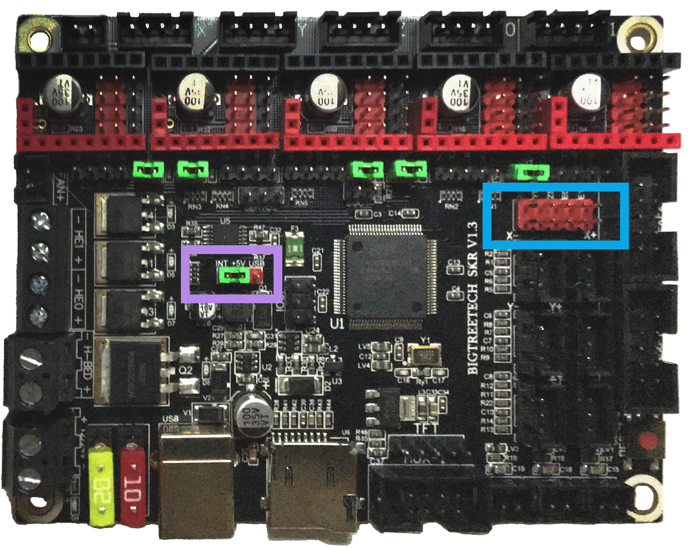
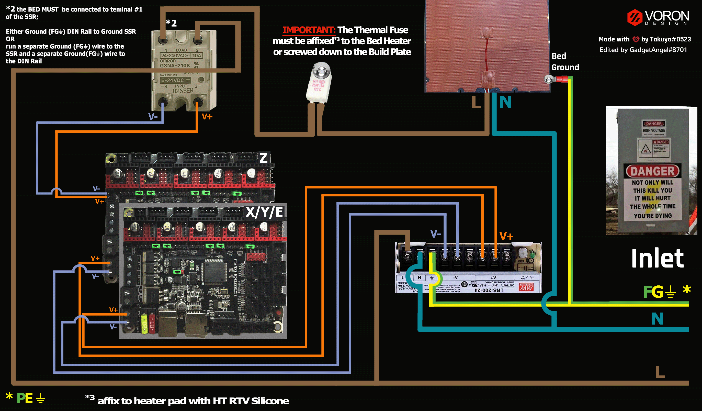

# Voron V2 - SKR V1.3 (TMC2208, TMC2209, TMC2225, TMC2226) Wiring

## Initial Removal of Jumpers

Remove **all YELLOW** on-board jumpers, located at the positions shown below:

######  {#SKR_V13_PREP-Removal_UART1}

## Initial Preparation - Set Jumpers

* Set the on-board jumpers, located at the positions as shown by the **GREEN** jumpers in the diagram below:

######  {#SKR_V13_in_UART_mode_for_Prep_150_v2}

* If you want to open the above picture, in a new tab of your web browser, then [click here](./images/SKR_V1.3_in_UART_mode_PREP_150.png){:target="_blank" rel="noopener"}

## Voltage Selection Header and Other Headers

* **Set the USB-PWR jumper to the INT position (as shown in the PURPLE box)** to avoid the interaction between the USB 5V of Raspberry Pi and the DC-DC 5V of the motherboard.

* Ensure **all of "DIAG Jumpers" or "ST Jumper Block" (shown in the BLUE box) are removed** to avoid the influence of TMC2209 DIAG on the endstop.

__IMPORTANT:__ **Double check all the** __GREEN__ **jumpers are set appropriately, especially the jumpers called out by the _COLORED BOXES_, BEFORE the power supply is connected.**

######  {#SKR_V1.3_in_UART_voltageselect_v1}

* If you want to open the above picture, in a new tab of your web browser, then [click here](./images/SKR_V1.3_in_UART_voltageselect.png){:target="_blank" rel="noopener"}

## Stepper Motor Drivers
* Inspect the stepper motor drivers for left over rosin, and clean with IPA, if needed
* Install heat sinks on all stepper motor drivers

## MCU X/Y/E, Hot End

* - [ ] Place stepper drivers for X in positions X (driver socket)
* - [ ] Place stepper drivers for Y in positions Y (driver socket)
* - [ ] Place stepper drivers for E in positions E0 (driver socket)
* - [ ] Plug in stepper motors for X in positions X (motor connector)
* - [ ] Plug in stepper motors for Y in positions Y (motor connector)
* - [ ] Plug in stepper motors for E in positions E0 (motor connector)
* - [ ] Plug Hot End thermistor to thermistor TH0 (P0.24)
* - [ ] Plug Hot End heater in to HE0 (P2.7)
* - [ ] Plug Hot End Fan in to HE1 (P2.4)
* - [ ] Plug Part Cooling Fan in to Fan (P2.3)
* - [ ] Connect X end stop to X+ connector (P1.28)
* - [ ] Connect Y end stop to Y+ connector (P1.26)
* - [ ] Wire 24V and 0V from DC power supply to Power/DCIN
* - [ ] Connect USB Cable to your SKR V1.3,&nbsp;**but do not connect it yet to your Raspberry Pi**

### MCU X/Y/E, Hot End Wiring Diagram

######  {#Voron2_Wiring_Diagram_BTT_SKRV13_XYE_in_UART_mode}

* If you want to open the above diagram, in a new tab of your web browser, and have the ability to zoom and download the diagram in JPG format then [click here](./images/Voron2.4r2_Wiring_Diagram_BTT_SKRV1.3_XYE_in_UART_mode_150.jpg){:target="_blank" rel="noopener"}

## MCU Z, Bed, Exhaust Fan

* - [ ] Place stepper drivers for Z0 into positions X
* - [ ] Place stepper drivers for Z1 into positions Y
* - [ ] Place stepper drivers for Z2 into positions Z
* - [ ] Place stepper drivers for Z3 into positions E0
* - [ ] Plug in stepper motors for Z0 into positions X
* - [ ] Plug in stepper motors for Z1 into positions Y
* - [ ] Plug in stepper motors for Z2 into positions Z
* - [ ] Plug in stepper motors for Z3 into positions E0
* - [ ] Plug Bed Thermistor in to TB (P0.23)
* - [ ] Plug in Exhaust Fan in to HE0 (P2.7)
* - [ ] Plug in Controller Fans in to HE1 (P2.4)
* - [ ] Plug SSR Control for Heated Bed in to Fan (P2.3)
* - [ ] Plug Z Endstop Switch into Z- (P1.25)
* - [ ] Plug Probe Signal (with&nbsp;**BAT85 diode**) in to Z+ (P1.24)
* - [ ] Plug Probe GND and Probe Voltage in to "DC OUT" connector next to X motor connector
* - [ ] Wire 24V and 0V from DC power supply to Power/DCIN
* - [ ] Connect USB Cable to your SKR V1.3,&nbsp;**but do not connect it yet to your Raspberry Pi**

BAT85
: a Schottky barrier diode. BAT85 is needed to protect the SKR board (MCU board) from being fried.  An Inductive Probe device (Omron TL-Q5MC2; Omron TL-Q5MC2-Z or Panasonic GX-HL15BI-P) communicates at a much higher voltage level (10V - 30V) then the MCU board.  The BAT85 is used to protect the input signal PIN of the MCU board; without the BAT85 the MCU board will be damaged.  If two BAT85s are used in series, the circuit will protect the MCU board and still allow the inductive probe to function properly. [For more information, click here](./index#bat85-diode){:target="_blank" rel="noopener"}

### MCU Z, Bed, Exhaust Fan Wiring Diagram

######  {#Voron2_Wiring_Diagram_BTT_SKRV13_Z_in_UART_mode}

* If you want to open the above diagram, in a new tab of your web browser, and have the ability to zoom and download the diagram in JPG format then [click here](./images/Voron2.4r2_Wiring_Diagram_BTT_SKRV1.3_Z_in_UART_mode_150.jpg){:target="_blank" rel="noopener"}

## Please Ensure the Heat Sinks are Installed Before Use

Note on the Orientation of the Stepper Motor Driver's Heat Sinks
: Place the heat sinks for the stepper motor drivers so that the orientation of the fins on the heat sinks are parallel to the air flow from the controller fans once the MCU board is installed on the DIN rail. Ensure the heat sinks are **not touching** the solder joints located on the top of the step stick. Please note, that your placement of heat sinks may be different from the orientation shown below.

### MCU X/Y/E, Hot End with Heat Sinks Installed

######  {#SKR_V13_UART_Heatsinks1}

### MCU Z, Bed, Exhaust Fan with Heat Sinks Installed

######  {#SKR_V13_UART_Heatsinks2}

## Raspberry Pi

### Power
* The BTT SKR V1.3 board is **NOT capable of providing 5V power** to run your Raspberry Pi.

## Setting up UART Communications with the Raspberry Pi

* see [the SKR V1.3 Raspberry Pi Section](./skrv13_RaspberryPi#raspberry-pi){:target="_blank" rel="noopener"}

## SSR Wiring

* Wire colors will vary depending on your locale.

######  {#btt-SKRV13inUART-ssr-wiring}

* If you want to open the above diagram, in a new tab of your web browser, and have the ability to zoom and download the diagram in PNG format then [click here](./images/btt-SKRV1.3inUART-ssr-wiring.png){:target="_blank" rel="noopener"}

## The Klipper Configuration file for SKR V1.3 board

The Klipper Configuration file from VoronDesign/Voron-2 GitHub Repo for SKR V1.3 board is [located here](https://raw.githubusercontent.com/VoronDesign/Voron-2/Voron2.4/firmware/klipper_configurations/SKR_1.3/Voron2_SKR_13_Config.cfg){:target="_blank" rel="noopener"};

## URL Resources Links for the SKR V1.3 (PIN Diagrams and Repo)

* see [The SKR V1.3 Resource Section](./skrv13_Resources#color-pin-diagram-for-skr-v13){:target="_blank" rel="noopener"}

## Advanced Setup - Resource Link for SPI setup (TMC2100, TMC2130, TMC5160, TMC5161, TMC5160HV, TMC5160_PRO)

* see [The SKR V1.3 SPI Setup Section](../../community/electronics/GadgetAngel/v2_skr13_wiring#voron-v2---btt-skr-v13-wiring-for-both-spi-and-uart-modes){:target="_blank" rel="noopener"}

## After I have Wired up the MCU Board, What Comes Next?

1. Once the MCU board is wired up and wire management has been performed, the next step is to install Mainsail/Fluidd or Octoprint, please see [The Build ═► Software Installation](../../build/software/index#software-installation){:target="_blank" rel="noopener"}

2. Once Mainsail/Fluidd or Octoprint has been installed, the next step is to **compile and install** the Klipper Firmware, please see [The Build ═► Software Installation -> Firmware Flashing(Header) -> SKR 1.3](../../build/software/skr13_klipper#skr-1314-klipper-firmware){:target="_blank" rel="noopener"}

3. Once the MCU board has the Klipper Firmware Installed, the next step is to **create/edit** the Klipper Config file (Voron2_SKR_13_Config.cfg rename it to printer.cfg) to ensure your Voron build matches your Klipper Config file, please see [the file located here; Select "V2 SKR 1.3"](../../build/software/configuration#initial-voron-printer-configuration){:target="_blank" rel="noopener"};

    * Please use the Color PIN Diagrams, [displayed here](./skrv13_Resources#color-pin-diagram-for-skr-v13){:target="_blank" rel="noopener"}, as a source of information;

    * Please consult [The Build ═► Software Configuration](../../build/software/configuration#software-configuration){:target="_blank" rel="noopener"} on how to edit the Klipper Config file.

4. After **creating/editing** the Klipper Config file (Voron2_SKR_13_Config.cfg renamed to printer.cfg), the next step is to check all the Motors and the mechanics of the Voron printer, please see [The Build ═► Initial Startup Checks](../../build/startup/index#initial-startup-checks){:target="_blank" rel="noopener"}

