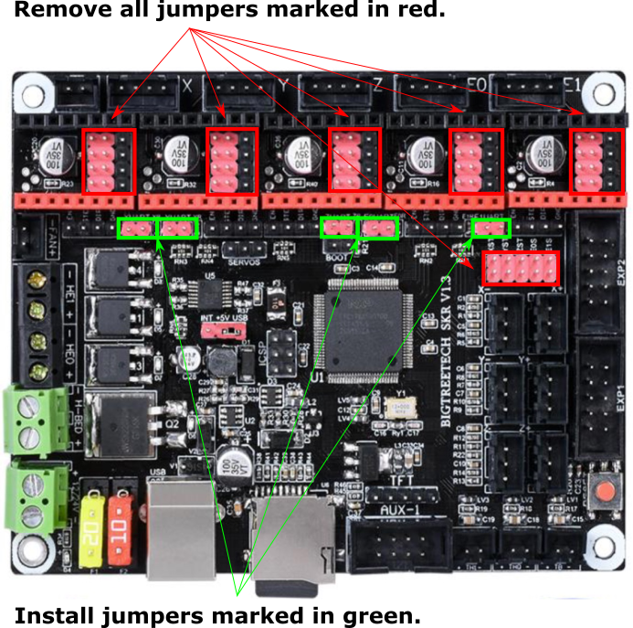
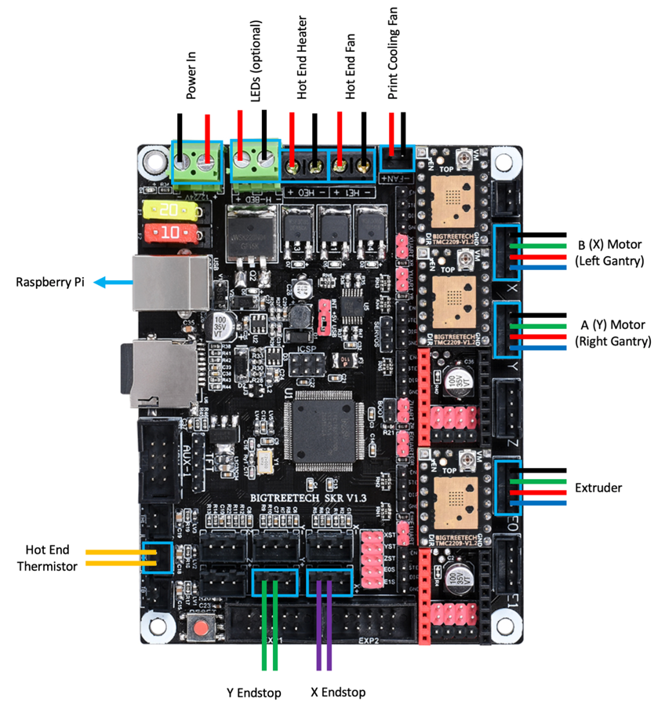
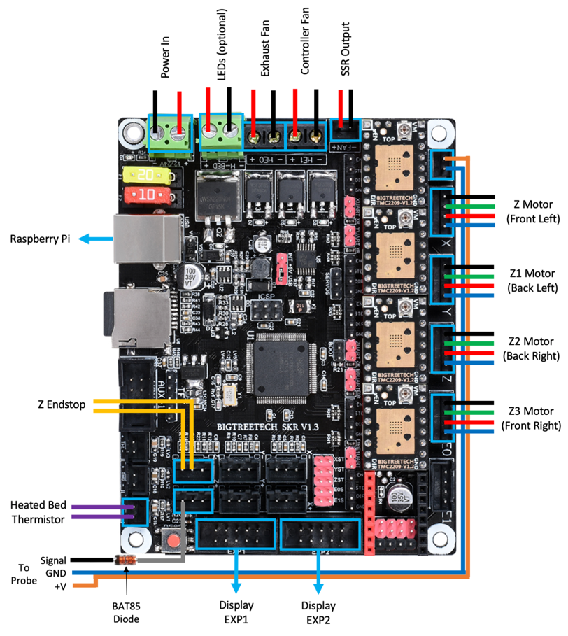
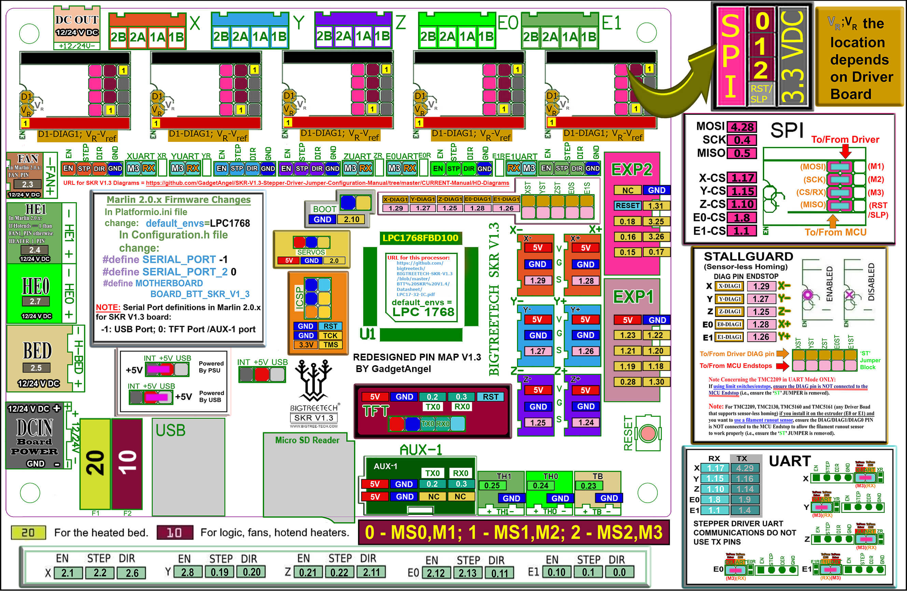

# Voron V2 - SKR 1.3 Wiring

## Initial Preparation

* Reconfigure the on-board jumpers as shown.

## MCU X/Y/E, Hot End

* Place stepper drivers for X, Y, and E in positions X, Y, and E0
* Plug in stepper motors for X, Y, and E in positions X, Y, and E0
* Plug Hot End thermistor to thermistor TH0 (P0.24)
* Plug Hot End heater in to HE0 (P2.7)
* Plug Hot End Fan in to HE1 (P2.4)
* Plug Part Cooling Fan in to Fan (P2.3)
* Connect X end stop to +X connector (P1.28)
* Connect Y end stop to +Y connector (P1.26)
* Wire 24V and 0V from DC power supply to Power In
* Connect USB Cable to your SKR 1.3, but do not connect it yet to your Raspberry Pi

## MCU Z, Bed, Exhaust Fan

* Place stepper drivers for Z0, Z1, Z2, and Z3 into positions X, Y, Z, and E0
* Plug in stepper motors for Z0, Z1, Z2, and Z3 into positions X, Y, Z, and E0
* Plug Bed Heater Temp in to TB (P0.23)
* Plug in Exhaust Fan in to HE0 (P2.7)
* Plug in Controller Fan in to HE1 (P2.4)
* Plug SSR Control for Heated Bed in to Fan (P2.3)
* Plug Z Endstop Switch into -Z (P1.25)
* Plug Probe GND and Signal (with BAT85 diode) in to +Z (P1.24
* Plug display wires in to EXP1 and EXP2
* Wire 24V and 0V from DC power supply to Power In
* Connect USB Cable to your SKR 1.3, but do not connect it yet to your Raspberry Pi

## SKR 1.3 Pinout

For reference, here is the pinout of the SKR 1.3

