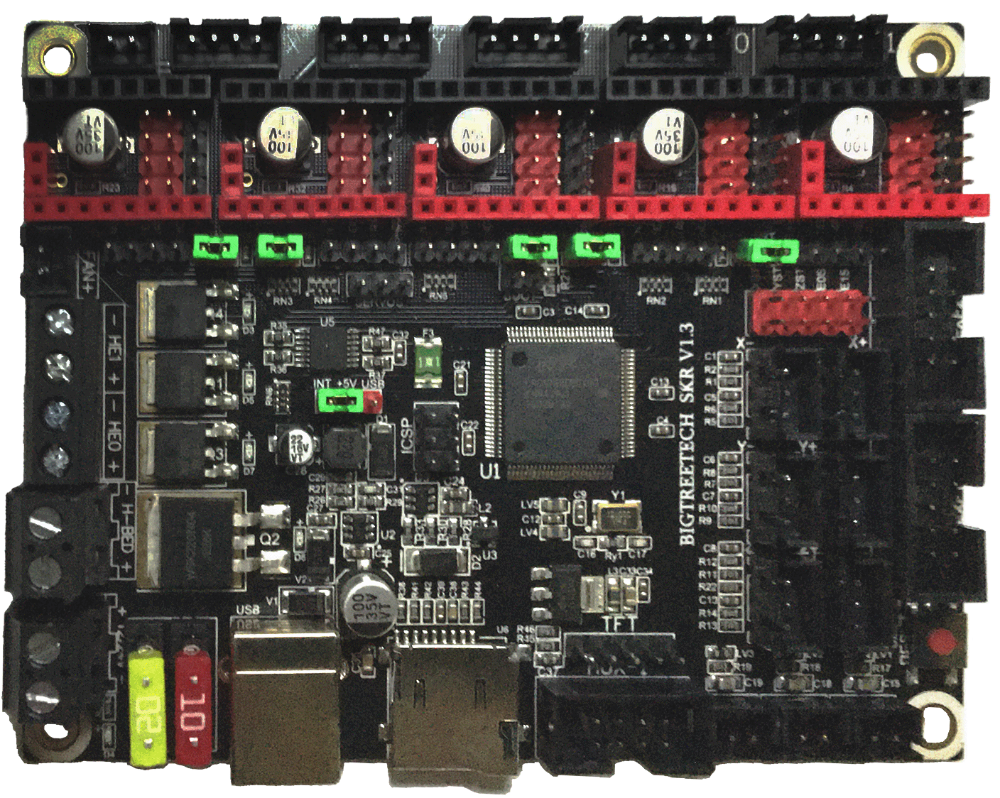

# Voron V2 - SKR V1.3 in UART Mode (TMC2208, TMC2209, TMC2225, TMC2226)

## Initial Removal of Jumpers

Remove **all YELLOW** on-board jumpers, located at the positions shown below:

######  {#SKR_V13_PREP-Removal_UART1}

## Initial Preparation for UART Mode - Set Jumpers

* Set the on-board jumpers, located at the positions as shown by the **GREEN** jumpers in the diagram below:

######  {#SKR_V13_in_UART_mode_for_Prep_150}

## Stepper Motor Drivers
* Inspect the stepper motor drivers for left over rosin, and clean with IPA, if needed
* Install heat sinks on all stepper motor drivers

## MCU X/Y/E, Hot End in UART Mode

* Place stepper drivers for X, Y, and E0 in positions X, Y, and E0
* Plug in stepper motors for X, Y, and E0 in positions X, Y, and E0
* Plug Hot End thermistor to thermistor TH0 (P0.24)
* Plug Hot End heater in to HE0 (P2.7)
* Plug Hot End Fan in to HE1 (P2.4)
* Plug Part Cooling Fan in to Fan (P2.3)
* Connect X end stop to X+ connector (P1.28)
* Connect Y end stop to Y+ connector (P1.26)
* Wire 24V and 0V from DC power supply to Power/DCIN
* Connect USB Cable to your SKR V1.3, **but do not connect it yet to your Raspberry Pi**

### MCU X/Y/E, Hot End in UART Mode Wiring Diagram

######  {#Voron2_Wiring_Diagram_BTT_SKRV13_XYE_in_UART_mode}

* If you want to open the above diagram, in a new tab of your web browser, and have the ability to zoom and download the diagram in JPG format then [click here](./images/Voron2.4r2_Wiring_Diagram_BTT_SKRV1.3_XYE_in_UART_mode_150.jpg){:target="_blank" rel="noopener"}

## MCU Z, Bed, Exhaust Fan in UART Mode

* Place stepper drivers for Z0, Z1, Z2, and Z3 into positions X, Y, Z, and E0
* Plug in stepper motors for Z0, Z1, Z2, and Z3 into positions X, Y, Z, and E0
* Plug Bed Thermistor in to TB (P0.23)
* Plug in Exhaust Fan in to HE0 (P2.7)
* Plug in Controller Fans in to HE1 (P2.4)
* Plug SSR Control for Heated Bed in to Fan (P2.3)
* Plug Z Endstop Switch into Z- (P1.25)
* Plug Probe Signal (with BAT85 diode) in to Z+ (P1.24)
* Plug Probe GND and Probe Voltage in to "DC OUT" connector next to X motor connector
* Plug display wires in to EXP1 and EXP2
* Wire 24V and 0V from DC power supply to Power/DCIN
* Connect USB Cable to your SKR 1.3, **but do not connect it yet to your Raspberry Pi**

### MCU Z, Bed, Exhaust Fan in UART Mode Wiring Diagram

######  {#Voron2_Wiring_Diagram_BTT_SKRV13_Z_in_UART_mode}

* If you want to open the above diagram, in a new tab of your web browser, and have the ability to zoom and download the diagram in JPG format then [click here](./images/Voron2.4r2_Wiring_Diagram_BTT_SKRV1.3_Z_in_UART_mode_150.jpg){:target="_blank" rel="noopener"}

[Go Back to the Table of Contents](v2_skr13_wiring#table-of-contents)

## Please Ensure the Heat Sinks are Installed Before Use

### MCU X/Y/E, Hot End with Heat Sinks Installed

######  {#SKR_V13_UART_Heatsinks1}

### MCU Z, Bed, Exhaust Fan with Heat Sinks Installed

######  {#SKR_V13_UART_Heatsinks2}

## SSR Wiring (Board Shown is in UART mode)

* Wire colors will vary depending on your locale.

######  {#btt-SKRV13inUART-ssr-wiring}

* If you want to open the above diagram, in a new tab of your web browser, and have the ability to zoom and download the diagram in JPG format then [click here](./images/btt-SKRV1.3inUART-ssr-wiring.png){:target="_blank" rel="noopener"}

[Go Back to the Table of Contents](v2_skr13_wiring#table-of-contents)

## mini 12864 Display

* See [the mini12864 guide](./mini12864_klipper_guide#mini12864-klipper-guide){:target="_blank" rel="noopener"}

## URL Resources Links for the SKR V1.3 (Klipper Configuration file, PIN Diagrams and Repo)

* see [The SKR V1.3 Resource Section](skr_v13_Resources#the-klipper-configuration-file-for-skr-V13-board)