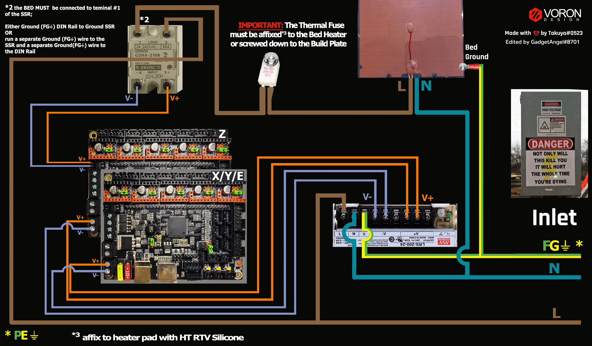

# Voron V2 - SKR V1.4/V1.4Turbo in UART Mode (TMC2208, TMC2209, TMC2225, TMC2226)

## Initial Preparation Needed for TMC2209 and TMC2226 UART Stepper Motor Drivers

* __IMPORTANT:__  The V2 printer does not use sensorless homing.  **If using the TMC2209 or TMC2226 stepper motor drivers with the SKR V1.4/SKR V1.4Turbo, there are three methods to disable sensorless homing.**

1. Cut off the DIAG pin from the TMC2209 or TMC2226.
2. Use stackable header pins to ensure the DIAG pin does not make an electrical connection to the SKR board.
3. Desolder the DIAG pin from the stepper motor driver step stick.

### Disable Sensorless Homing - Method #1 - Cut Off the DIAG pin:

* **Use a small pair of wire cutters and remove the pin marked in purple (DIAG PIN) from the TMC2209 or TMC2226 stepper motor driver step stick**

######  {#tmc2209-pin-removal_uart_2skr}

### Disable Sensorless Homing - Method #2 - Use Stackable Header pins:

* By not adding the stackable header pin on the DIAG PIN location, the DIAG PIN will not make an electrical connection to the board. The added benefit with stackable header pins is the driver socket will also have more room for air flow to help with dissipation of heat. See the diagram below:

######  {#disable_sensor-less_homing_uart_2skr}

* Here is the URL from the above diagram.  You can purchase the [Stackable Header PINS from Amazon](https://www.amazon.com/Glarks-Connector-Assortment-Stackable-Breakaway/dp/B07CWSXY7P){:target="_blank" rel="noopener"}.

### Disable Sensorless Homing - Method #3 - Desolder the DIAG pin:

*  **Desolder the pin, marked in purple (DIAG PIN), from the TMC2209 or TMC2226 stepper motor driver step stick** at the location shown [here](#tmc2209-pin-removal_uart_2skr)

* If you need help with desoldering, please [consult this guide](https://www.instructables.com/The-Ultimate-Guide-to-Desoldering/){:target="_blank" rel="noopener"}

### Further Reading

* [Further information about the TMC2209/TMC2226 DIAG PIN problem](https://github.com/bigtreetech/BIGTREETECH-Stepper-Motor-Driver/blob/master/TMC2209/V1.2/TMC2209%20problems%20solving.pdf){:target="_blank" rel="noopener"}.  The TMC2226 stepper motor driver's DIAG pin is also used for "output only". Therefore, it will have the same issue as the TMC2209.  Please see [page 9 in the TMC2226 datasheet](https://www.trinamic.com/fileadmin/assets/Products/ICs_Documents/TMC2226_Datasheet_V106.pdf#page=9){:target="_blank" rel="noopener"}

## Other Considerations when using TMC2209, or TMC2226 (TMCxxxx drivers with StallGuard)

* __IMPORTANT:__  If you are using a TMC2209 or TMC2226 stepper motor driver for the **extruder motor and you want to use a filament run out sensor**, please do one of the following:

1.  Either cut off the DIAG pin for the **stepper motor driver step stick** in the **extruder** driver socket (E0 or E1 on the SKR board); [The location of the DIAG pin](#tmc2209-pin-removal_uart_2skr) or

2.  Use stackable header pins and ensure the **DIAG pin does not get plugged into the SKR board's** extruder driver socket location (E0 or E1 on the SKR board); [The location of the DIAG pin](#disable_sensor-less_homing_uart_2skr) or

3. Desolder the DIAG pin from the extruder driver step stick [The location of the DIAG pin](#tmc2209-pin-removal_uart_2skr);

**The DIAG PIN must be disconnected from the SKR board on the extruder driver step stick for the filament run out sensor to work properly**, if you are using a TMC2209 or TMC2226.

## Initial Removal of Jumpers for UART Mode

Remove **all YELLOW** on-board jumpers, located at the positions shown below:

######  {#v2_skrv14_PREP-removal_uart}

## Initial Preparation for UART Mode - Set Jumpers

* Set the on-board jumpers, located at the positions as shown by the **GREEN** jumpers in the diagram below:

######  {#v2_skr14T_UART_PREP_1}

### Voltage Selection Headers

* **Set the USB-PWR jumper to the VDD position (as shown in the PURPLE box)** to avoid the interaction between the USB 5V of Raspberry Pi and the DC-DC 5V of the motherboard.

* The NPWR jumper setting will decide the source of the board's NeoPixel connector's +V PIN.  The NeoPixel connector can be sourced from the board itself or from an external DCDC bridge module.  One can purchase an external DCDC bridge module (sold separately) to power 5V NeoPixel LEDs.  This bridge module is called the "DCDC Mode V1.0" board. Since the Voron printer does not require the extra DCDC bridge module, **set the NPWR jumper to indicate that the DCDC bridge module is not attached to the board, as shown in the ORANGE box on the diagram below.**

######  {#v2_skr14T_UART_voltageselect}

## Stepper Motor Drivers
* Inspect the stepper motor drivers for left over rosin, and clean with IPA, if needed
* Install heat sinks on all stepper motor drivers

## MCU X/Y/E, Hot End in UART Mode

* - [ ] Connect 24V and GND (V+ and V-) from the PSU to Power In
* - [ ] Connect stepper driver for the B Motor (gantry left) into position X driver socket
* - [ ] Plug in stepper motor for the B Motor (gantry left) into position X motor connector
* - [ ] Connect stepper driver for the A Motor (gantry right) into position Y driver socket
* - [ ] Plug in stepper motor for the A Motor (gantry right) into position Y motor connector
* - [ ] Connect stepper driver for the extruder motor into position E0 driver socket
* - [ ] Plug in stepper motor for the extruder motor into position E0 motor connector
* - [ ] Connect the hot end heater to HE0 (P2.7)
* - [ ] Connect the part cooling fan to FAN0 (P2.3)
* - [ ] Connect the hot end fan to HE1 (P2.4)
* - [ ] Connect the hot end thermistor to TH0 (P0.24)
* - [ ] Connect the X endstop to X-STOP (P1.29)
* - [ ] Connect the Y endstop to Y-STOP (P1.28)
* - [ ] Connect USB Cable to your SKR 1.4/1.4Turbo, **but do not connect it yet to your Raspberry Pi**

### MCU X/Y/E, Hot End in UART Mode Wiring Diagram

######  {#v2tri_Wiring_Diagram_skrv14T_XYE_UART}

* If you want to open the above diagram, in a new tab of your web browser, and have the ability to zoom and download the diagram in JPG format then [click here](./images/v2tri_Wiring_Diagram_skrv14T_XYE_UART.jpg){:target="_blank" rel="noopener"}

## MCU Z, Bed, Exhaust Fan in UART Mode

* - [ ] Connect 24V and GND (V+ and V-) from the PSU to Power In
* - [ ] Connect stepper driver for the Z into positions X driver socket
* - [ ] Plug in stepper motor for the Z into positions X motor connector
* - [ ] Connect stepper driver for the Z1 into positions Y driver socket
* - [ ] Plug in stepper motor for the Z1 into positions Y motor connector
* - [ ] Connect stepper driver for the Z2 into positions Z driver socket
* - [ ] Plug in stepper motor for the Z2 into positions Z_1 motor connector
* - [ ] Connect stepper driver for the Z3 into positions E0 driver socket
* - [ ] Plug in stepper motor for the Z3 into positions E0 motor connector
* - [ ] Connect the bed SSR (DC Control Side) to FAN0 (P2.3)
* - [ ] Connect the controller fans to HE1 (P2.4)
* - [ ] Connect the chamber exhaust fan to HE0 (P2.7)
* - [ ] Connect the heated bed thermistor to TB (P0.25)
* - [ ] Connect the Z endstop to Z-STOP (P1.27)
* - [ ] Connect the Probe Signal (with **BAT85** diode) to PROBE connector (P0.10)
* - [ ] Connect the Probe PWR and GND to FAN2
* - [ ] Plug display wires in to EXP1 and EXP2
* - [ ] Connect USB Cable to your SKR 1.4/1.4Turbo, **but do not connect it yet to your Raspberry Pi**

BAT85
: a Schottky barrier diode. BAT85 is needed to protect the SKR board (MCU board) from being fried.  An Inductive Probe device (Omron TL-Q5MC2; Omron TL-Q5MC2-Z or Panasonic GX-HL15BI-P) communicates at a much higher voltage level (10V - 30V) then the MCU board.  The BAT85 is used to protect the input signal PIN of the MCU board; without the BAT85 the MCU board will be damaged.  If two BAT85s are used in series, the circuit will protect the MCU board and still allow the inductive probe to function properly. [For more information, click here](https://docs.vorondesign.com/build/electrical/#bat85-diode){:target="_blank" rel="noopener"}

### MCU Z, Bed, Exhaust Fan in UART Mode Wiring Diagram

######  {#v2_Wiring_Diagram_skrv14T_Z_UART}

* If you want to open the above diagram, in a new tab of your web browser, and have the ability to zoom and download the diagram in JPG format then [click here](./images/v2_Wiring_Diagram_skrv14T_Z_UART.jpg){:target="_blank" rel="noopener"}

[Go Back to the Table of Contents](./v2_skr14_wiring#table-of-contents)

## Please Ensure the Heat Sinks are Installed Before Use

Note on the Orientation of the Stepper Motor Driver's Heat Sinks
: Place the heat sinks for the stepper motor drivers so that the orientation of the fins on the heat sinks are parallel to the flow of air from the controller fans once the MCU board is installed on the DIN rail. Ensure the heat sinks are **not touching** the solder joints located on the top of the step stick. Please note, that your placement of heat sinks may be different from the orientation shown below.

### MCU X/Y/E, Hot End with Heat Sinks Installed

######  {#v2_skr14T_XYE_UART_heatsinks1}

### MCU Z, Bed, Exhaust Fan with Heat Sinks Installed

######  {#v2_skr14T_Z_UART_heatsinks2}

## Raspberry Pi

### Power
* The BTT SKR V1.4/V1.4Turbo board is **NOT capable of providing 5V power** to run your Raspberry Pi.

## Setting up UART Communications with the Raspberry Pi

* see [the SKR V1.4/V1.4Turbo Raspberry Pi Section](./skrv14_RaspberryPi#raspberry-pi){:target="_blank" rel="noopener"}

## SSR Wiring (Board Shown is in UART mode)

* Wire colors will vary depending on your locale.

######  {#two_skrv1.4inUART-ssr-wiring_uart}

* If you want to open the above diagram, in a new tab of your web browser, and have the ability to zoom and download the diagram in PNG format then [click here](./images/two_skrv1.4inUART-ssr-wiring.png){:target="_blank" rel="noopener"}

[Go Back to the Table of Contents](./v2_skr14_wiring#table-of-contents)

### The Klipper Configuration file for SKR V1.4/V1.4Turbo board

The Klipper Configuration file from VoronDesign/Voron-2 GitHub Repo for SKR V1.4/V1.4Turbo board is [located here](https://raw.githubusercontent.com/VoronDesign/Voron-2/Voron2.4/firmware/klipper_configurations/SKR_1.4/Voron2_SKR_14_Config.cfg){:target="_blank" rel="noopener"};

[Go Back to the Table of Contents](./v2_skr14_wiring#table-of-contents)

## URL Resources Links for the SKR V1.4/V1.4Turbo (PIN Diagrams and Repo)

* see [The SKR V1.4/V1.4Turbo Resource Section](./skrv14_Resources#color-pin-diagram-for-skr-v14v14turbo){:target="_blank" rel="noopener"}

## After I have Wired up the MCU Board, What Comes Next?

1. Once the MCU board is wired up and wire management has been performed, the next step is to install Mainsail/Fluidd or Octoprint, please see [The Build ═► Software Installation](../../build/software/index#software-installation){:target="_blank" rel="noopener"}

2. Once Mainsail/Fluidd or Octoprint has been installed, the next step is to **compile and install** the Klipper Firmware, please see [The Build ═► Software Installation -> Firmware Flashing(Header) -> SKR 1.4](../../build/software/skr13_klipper#skr-1314-klipper-firmware){:target="_blank" rel="noopener"}

3. Once the MCU board has the Klipper Firmware Installed, the next step is to **create/edit** the Klipper Config file (Voron2_SKR_14_Config.cfg rename it to printer.cfg) to ensure your Voron build matches your Klipper Config file, please see [the file located here; Select "V2 SKR 1.4"](../../build/software/configuration#initial-voron-printer-configuration){:target="_blank" rel="noopener"};

    * Please use the Color PIN Diagrams, [displayed here](./skrv14_Resources#color-pin-diagram-for-skr-v14v14turbo){:target="_blank" rel="noopener"}, as a source of information;

    * Please consult [The Build ═► Software Configuration](../../build/software/configuration#software-configuration){:target="_blank" rel="noopener"} on how to edit the Klipper Config file.

4. After **creating/editing** the Klipper Config file (Voron2_SKR_14_Config.cfg renamed to printer.cfg), the next step is to check all the Motors and the mechanics of the Voron printer, please see [The Build ═► Initial Startup Checks](../../build/startup/index#initial-startup-checks){:target="_blank" rel="noopener"}

[Go Back to the Table of Contents](./v2_skr14_wiring#table-of-contents)