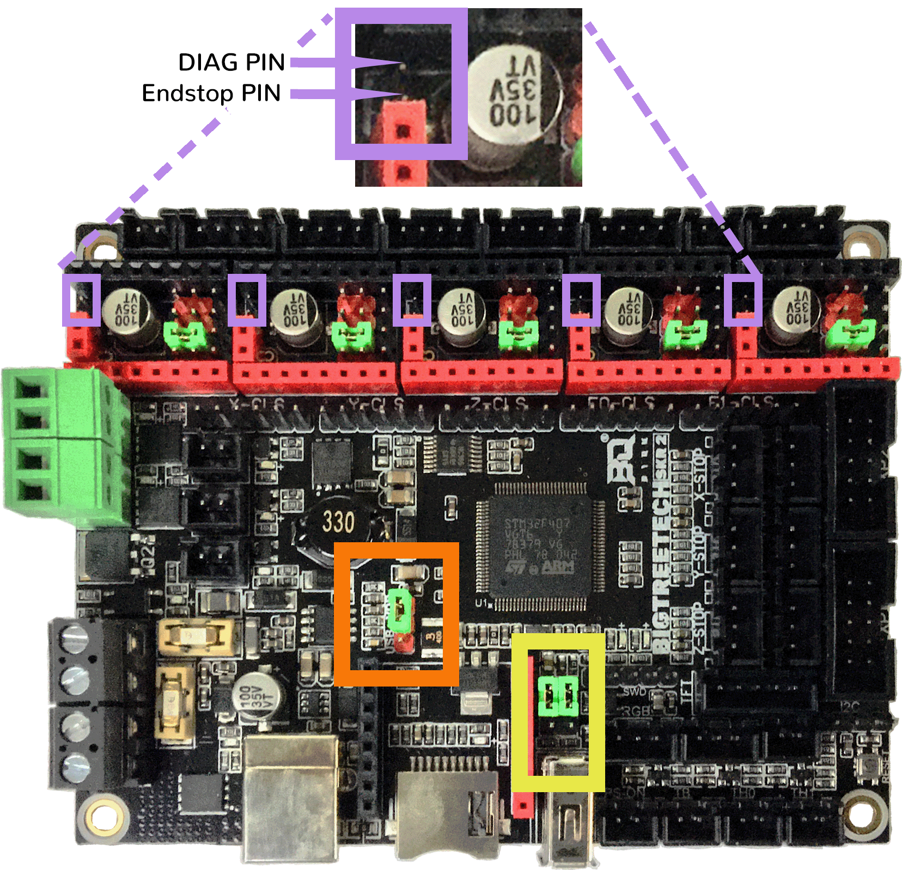
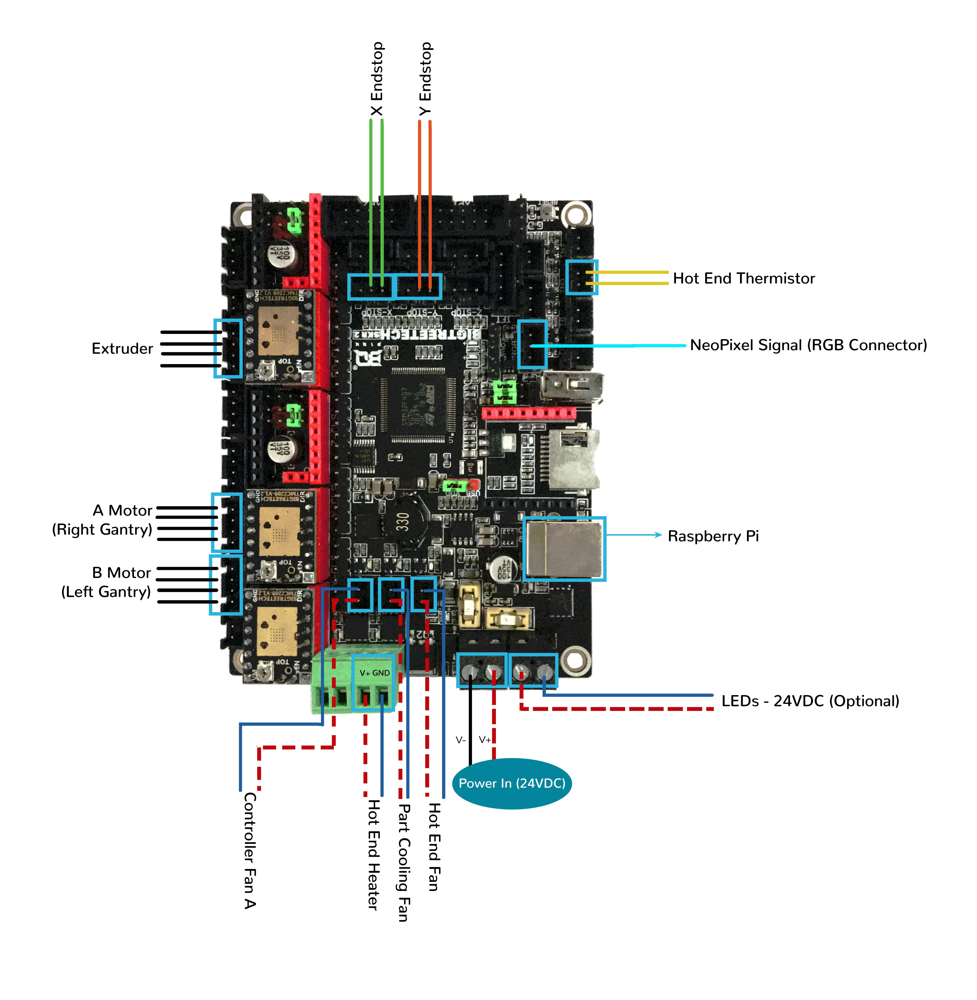
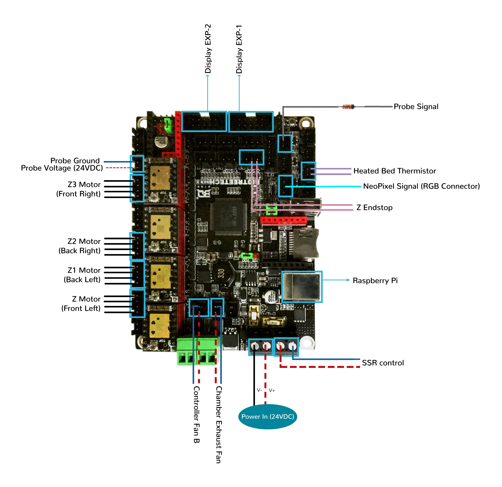
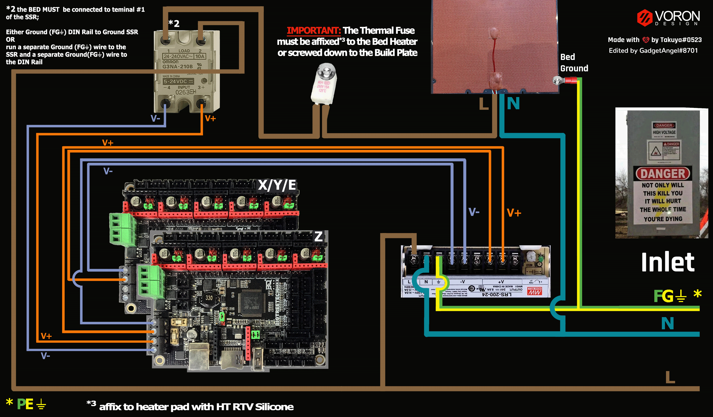

# Voron V2 - SKR 2: TMC2208, TMC2209, TMC2225, or TMC2226

## Initial Removal of Jumpers

Remove **all YELLOW** on-board jumpers, located at the positions shown below:

######  {#SKR2_in_PREP-removal_v2}

## Initial Preparation for UART Mode - Set Jumpers

* Set the on-board jumpers, located at the positions as shown by the **GREEN** jumpers in the diagram below:

######  {#SKR2_in_UART_PREP_v2}

* If you want to open the above picture, in a new tab of your web browser, then [click here](./images/SKR2_in_UART_PREP.png){:target="_blank" rel="noopener"}

## Voltage Selection Headers and Other Headers

* Ensure **all of "DIAG Jumpers" (shown in the PURPLE box) are removed** to avoid the influence of TMC2209 DIAG on the endstops.

* **Set the USB-PWR jumper to the VDD position (as shown in the ORANGE box)** to avoid the interaction between the USB 5V of Raspberry Pi and the DC-DC 5V of the motherboard.

* In the diagram below, ensure that the "WIFI/UDISK Select" Jumpers (as shown in the **YELLOW box**) are set for WIFI to ensure the UDISK port is not connected (both jumpers have an empty pin beneath them).

######  {#SKR2_in_UART_voltageselect_v2}

* If you want to open the above picture, in a new tab of your web browser, then [click here](./images/SKR2_in_UART_voltageselect.png){:target="_blank" rel="noopener"}

## Stepper Motor Drivers
* Inspect the stepper motor drivers for left over rosin, and clean with IPA, if needed
* Install heat sinks on all stepper motor drivers

## MCU X/Y/E, Hot End in UART Mode

* - [ ] Connect 24V and GND (V+ and V-) from the PSU to Power In
* - [ ] Connect stepper driver for the B Motor (gantry left) into position X-M (driver socket)
* - [ ] Plug in stepper motor for the B Motor (gantry left) into position XM (motor connector)
* - [ ] Connect stepper driver for the A Motor (gantry right) into position Y-M (driver socket)
* - [ ] Plug in stepper motor for the A Motor (gantry right) into position YM (motor connector)
* - [ ] Connect stepper driver for the extruder motor into position E0-M (driver socket)
* - [ ] Plug in stepper motor for the extruder motor into position E0M (motor connector)
* - [ ] Connect the hot end heater to HE0 (PB3)
* - [ ] Connect the part cooling fan to FAN1 (PB6)
* - [ ] Connect the hot end fan to FAN0 (PB7)
* - [ ] Connect the controller fan A to FAN2 (PB5)
* - [ ] Connect the hot end thermistor to TH0 (PA2)
* - [ ] Connect the X endstop to X-STOP (PC1)
* - [ ] Connect the Y endstop to Y-STOP (PC3)
* - [ ] Connect USB Cable to your SKR 2,&nbsp; **but do not connect it yet to your Raspberry Pi**

### MCU X/Y/E, Hot End in UART Mode Wiring Diagram

######  {#V2tri_Wiring_Diagram_BTT_SKR2_XYE_UART_v2}

* If you want to open the above diagram, in a new tab of your web browser, and have the ability to zoom and download the diagram in JPG format then [click here](./images/V2tri_Wiring_Diagram_BTT_SKR2_XYE_UART.jpg){:target="_blank" rel="noopener"}

## MCU Z, Bed, Exhaust Fan in UART Mode

* - [ ] Connect 24V and GND (V+ and V-) from the PSU to Power In
* - [ ] Connect stepper driver for the Z into positions X-M (driver socket)
* - [ ] Plug in stepper motor for the Z into positions XM (motor connector)
* - [ ] Connect stepper driver for the Z1 into positions Y-M (driver socket)
* - [ ] Plug in stepper motor for the Z1 into positions YM (motor connector)
* - [ ] Connect stepper driver for the Z2 into positions Z-M (driver socket)
* - [ ] Plug in stepper motor for the Z2 into positions ZMA (motor connector)
* - [ ] Connect stepper driver for the Z3 into positions E0-M (driver socket)
* - [ ] Plug in stepper motor for the Z3 into positions E0M (motor connector)
* - [ ] Connect the bed SSR (DC Control Side) to HBED (PD7)
* - [ ] Connect the controller fan B to FAN2 (PB5)
* - [ ] Connect the chamber exhaust fan to FAN1 (PB6)
* - [ ] Connect the heated bed thermistor to TB (PA1)
* - [ ] Connect the Z endstop to Z-STOP (PC0)
* - [ ] Connect the Probe Signal (with&nbsp;**BAT85 diode**) to PROBE connector (PE4)
* - [ ] Connect the Probe PWR and GND to FAN3
* - [ ] Connect USB Cable to your SKR 2,&nbsp; **but do not connect it yet to your Raspberry Pi**

BAT85
: a Schottky barrier diode. BAT85 is needed to protect the board (MCU board) from being fried.  An inductive probe device (Omron TL-Q5MC2; Omron TL-Q5MC2-Z or Panasonic GX-HL15BI-P) communicates at a much higher voltage level (10V - 30V) then the MCU board.  The BAT85 is used to protect the input signal PIN of the MCU board; without the BAT85 the MCU board will be damaged.  If two BAT85s are used in series, the circuit will protect the MCU board and still allow the inductive probe to function properly. [For more information, click here](./index#bat85-diode){:target="_blank" rel="noopener"}

### MCU Z, Bed, Exhaust Fan in UART Mode Wiring Diagram

######  {#V2_Wiring_Diagram_BTT_SKR2_Z_UART_v2}

* If you want to open the above diagram, in a new tab of your web browser, and have the ability to zoom and download the diagram in JPG format then [click here](./images/V2_Wiring_Diagram_BTT_SKR2_Z_UART.jpg){:target="_blank" rel="noopener"}

## Please Ensure the Heat Sinks are Installed Before Use

Note on the Orientation of the Stepper Motor Driver's Heat Sinks
: Place the heat sinks for the stepper motor drivers so that the orientation of the fins on the heat sinks are parallel to the air flow from the controller fans once the MCU board is installed on the DIN rail. Ensure the heat sinks are **not touching** the solder joints located on the top of the step stick. Please note, that your placement of heat sinks may be different from the orientation shown below.

### MCU X/Y/E, Hot End with Heat Sinks Installed

######  {#v2tri_SKR2_UART_heatsinks1_v2}

### MCU Z, Bed, Exhaust Fan with Heat Sinks Installed

######  {#v2_SKR2_UART_heatsinks2_v2}

## Raspberry Pi

### Power
* The BTT SKR 2 board is **NOT capable of providing 5V power** to run your Raspberry Pi.

## Setting up UART Communications with the Raspberry Pi

* see [the SKR 2 Raspberry Pi Section](./skr2_RaspberryPi#raspberry-pi){:target="_blank" rel="noopener"}

## SSR Wiring (Boards Shown is in UART mode)

* Wire colors will vary depending on your locale.

######  {#SKR2inUART-ssr-wiring_v2}

* If you want to open the above diagram, in a new tab of your web browser, and have the ability to zoom and download the diagram in PNG format then [click here](./images/SKR2inUART-ssr-wiring.png){:target="_blank" rel="noopener"}

### The Klipper Configuration file for SKR 2 board

The Klipper Configuration file from VoronDesign/VoronUsers TechnoPhreak's GitHub Repo for SKR 2 board is [located here](https://raw.githubusercontent.com/VoronDesign/VoronUsers/master/firmware_configurations/klipper/TechnoPhreak/BTT_SKR_v2/printer.cfg){:target="_blank" rel="noopener"};

## URL Resources Links for the SKR 2 (PIN Diagrams and Repo)

* see [The SKR 2 Resource Section](./skr2_Resources#color-pin-diagram-for-skr-2){:target="_blank" rel="noopener"}

## After I have Wired up the MCU Board, What Comes Next?

1. Once the MCU board is wired up and wire management has been performed, the next step is to install Mainsail/Fluidd or Octoprint, please see [The Build ═► Software Installation](../../build/software/index#software-installation){:target="_blank" rel="noopener"}

2. Once Mainsail/Fluidd or Octoprint has been installed, the next step is to **compile and install** the Klipper Firmware, please use the [Color Pin Diagram displayed here, look for "Klipper Building Options"](./skr2_Resources#color-pin-diagram-for-skr-2){:target="_blank" rel="noopener"}; an alternative source of information on "how to build and install the Klipper firmware for the SKR 2" is at [TechnoPhreak's README file](https://github.com/VoronDesign/VoronUsers/tree/master/firmware_configurations/klipper/TechnoPhreak/BTT_SKR_v2#compiler-instructions){:target="_blank" rel="noopener"}

3. Once the MCU board has the Klipper Firmware Installed, the next step is to **create/edit** the Klipper Config file (TechnoPhreak's printer.cfg file is already named printer.cfg) to ensure your Voron build matches your Klipper Config file, please see [the file located here](https://raw.githubusercontent.com/VoronDesign/VoronUsers/master/firmware_configurations/klipper/TechnoPhreak/BTT_SKR_v2/printer.cfg){:target="_blank" rel="noopener"};

    * Please use the Color PIN Diagrams, [displayed here](./skr2_Resources#color-pin-diagram-for-skr-2){:target="_blank" rel="noopener"}, as a source of information;

    * Please consult [The Build ═► Software Configuration](../../build/software/configuration#software-configuration){:target="_blank" rel="noopener"} on how to edit the Klipper Config file.

4. After **creating/editing** the Klipper Config file (printer.cfg), the next step is to check all the Motors and the mechanics of the Voron printer, please see [The Build ═► Initial Startup Checks](../../build/startup/index#initial-startup-checks){:target="_blank" rel="noopener"}