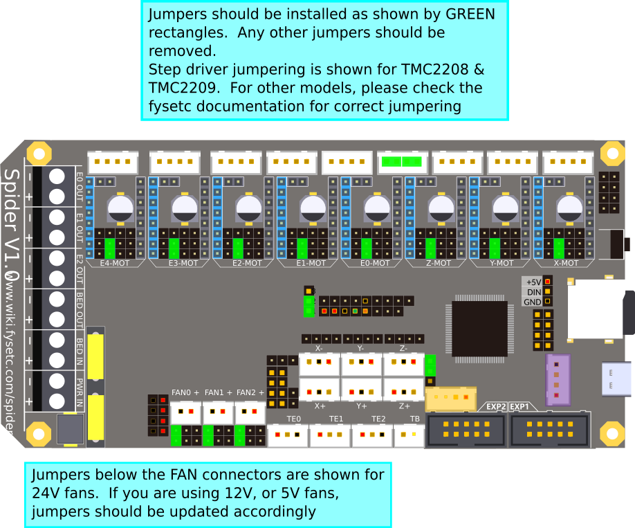
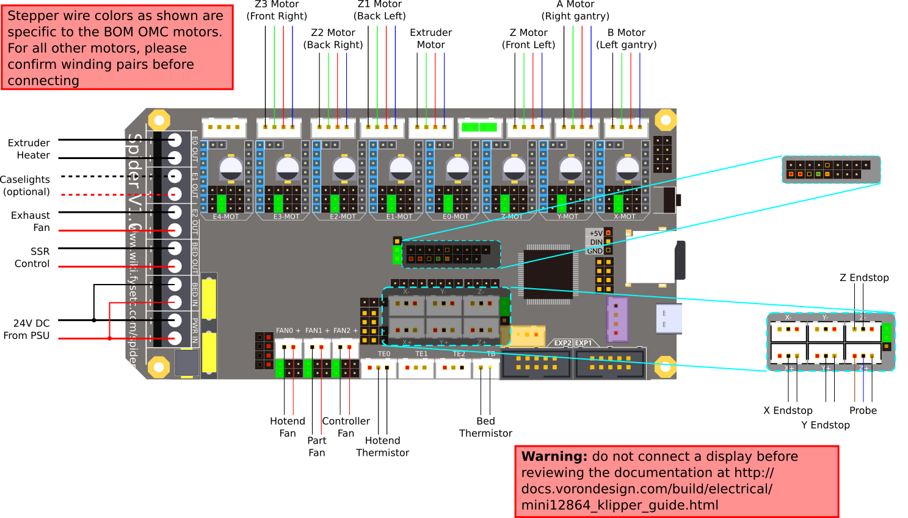
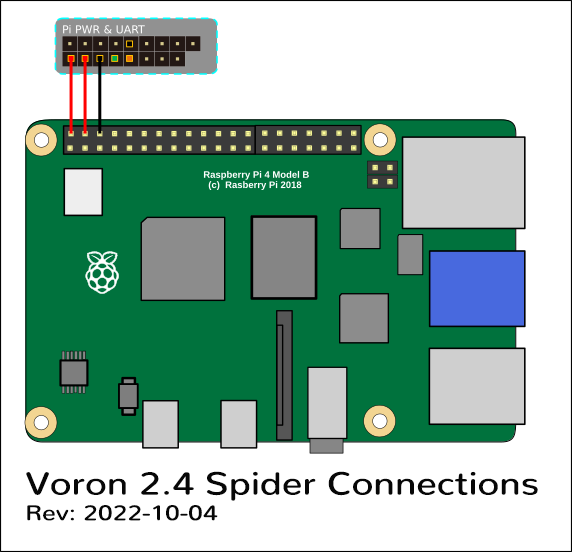

# Voron V2 - Fysetc Spider v1.1 Wiring

## Initial Preparation

Set jumpers as shown:

## Stepper Drivers

* If using Fysetc drivers, inspect for left over rosin, and clean with IPA if need
* Install step drivers in all slots except E4
* Install heat sinks on all step drivers
* **NOTE: if the board has been powered, ensure that motor power caps are fully drained before inserting stepper drivers:**  
  Temporarily connect a 100K resistor between VMOT+ and VMOT- to safely drain the capacitors*  
  (See [Fysetc Spider 3.3v issue](https://github.com/FYSETC/FYSETC-SPIDER/blob/main/Spider%203.3v%20issue.md))

## Wiring

* Connect 24V Power from the PSU to PWR IN and BED IN
* Connect the B Motor (gantry left) to X-mot
* Connect the A Motor (gantry right) to Y-Mot
* Connect the Z, Z1, Z2, and Z3 Motors to Z-MOT, E1-MOT, E2-MOT and E3-MOT
* Connect the extruder motor to E0-MOT
* Connect the hot end heater to E0 OUT
* Connect the chamber exhaust fan to  E2 OUT
* Connect the bed SSR (DC Control Side) to BED OUT
* Connect the hot end fan to FAN0
* Connect the part cooling fan to FAN1
* Connect the controller fans to FAN2
* Connect the hot end thermistor to TE0
* Connect the bed thermistor to TB
* Connect the X endstop to X+
* Connect the Y endstop to Y+
* Connect the probe to Z+
* Connect the Z endstop to Z-

If you're using a mini12864 display, connect to EXP1 & EXP2, only after completing the steps outlined in [the mini12864 display](#mini-12864-display) section.

## Raspberry Pi

### Power

* The spider is capable of providing 5V power to run your Raspberry pi. To take advantage of this feature, connect the wires shown below, from the pi header of the spider, to the GPIO header of the pi.
* Use at least 24awg wire for this connection.  It may be tempting to use the common "dupont" jumpers found in many electronics kits, however these jumpers typically use very small gauge wire, and will not carry enough current to run the pi.

### Control

* Voron Design recommends using USB to control the Spider, which simply requires connecting a USB-A to USB-C cable between the Spider and Pi. 
* The option does also exist to use a UART connection from the Pi header, in place of the USB.  If you prefer this option, please see the [fysetc](https://github.com/FYSETC/FYSETC-SPIDER/blob/main/firmware/Klipper/Connect%20RPI%20uart.md) documentation

## mini 12864 display

* *spider Rev 1.0 only*: the EXP1 & EXP2 header labels are swapped. Connect  EXP1 (display) to EXP2(spider), and EXP2 (display) to EXP1 (spider).  On the Spider 1.1 or later: connect EXP1->EXP1, and EXP2->EXP2
* *Fysetc mini12864 only*:  components R1 and R4 must be removed from the board before connecting to the Spider.  Note: new displays are shipping with this step already complete, but this should be verified before connecting
* *BTT mini12864 only* remove components R1, and C6, and rotate the connectors 180 degrees
* See [the mini12864 guide](./mini12864_klipper_guide.md)

## Other

* Full pinout and other Fysetc documentation can be found on the [Fysetc Spider GitHub](https://github.com/FYSETC/FYSETC-SPIDER)
