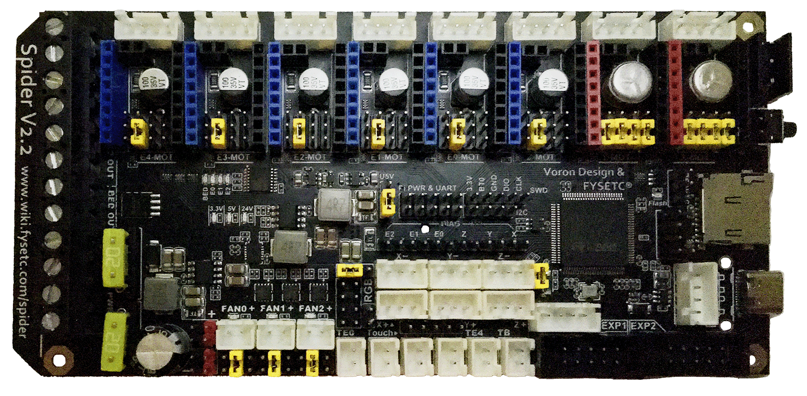
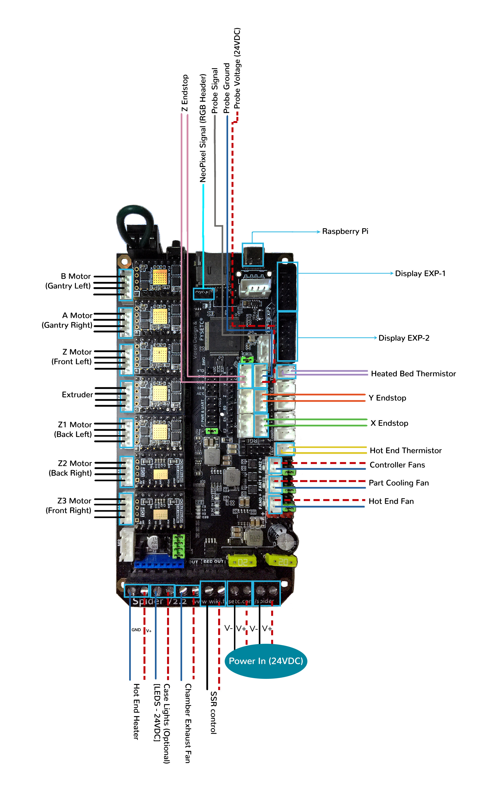
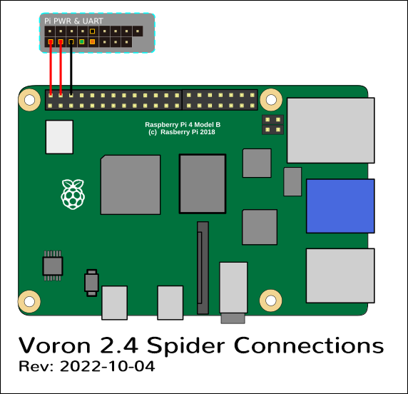

# Voron V2 - Fysetc Spider V2.2 Wiring in SPI Mode

## Initial Removal of Jumpers

Remove **all** the YELLOW on-board jumpers, located at the positions as shown below.

## Initial Preparation - Set Jumpers

* Set the on-board jumpers, located at the positions as shown by the GREEN jumpers in the below diagram:

### FAN Voltage Selection

* In the diagram below, the BLUE boxes indicate the headers with GREEN jumpers or a WIRE jumper which are set for 24VDC.

* In the diagram below, the RED box indicates the RGB Block header's Jumper is not present, but this header can be used to run fans. Other headers that can be used with fans (as shown by a BLUE box) have their Fan Voltage Selections headers which are located below the FAN0, FAN1 and FAN2 connectors.

* In the diagram below, the BLUE box to the right of Z- connector, is the header for setting the PROBE voltage. The jumper sets the PROBE voltage for 24VDC.  If a PROBE voltage of 5V is desired, this jumper needs to be changed.

* IMPORTANT: **If fans that use 5VDC or 12VDC are used, please take** NOTE **of these fan voltage selection headers and set the fan voltage selection header's jumpers to the appropriate position so that the correct fan voltage will be produced to run the 5VDC or 12VC fan.  If the fan voltage selection jumper is set for 24VDC and a 5VDC/12VDC fan is connected to it, the Fysetc Spider board will be damaged.** 

* In the diagram below the **wire jumper**, located in upper right-hand corner of the board, is set so that the X-MOT and Y-MOT stepper motor driver voltage will be 24VDC.  If X-MOT and Y-MOT stepper motor drivers at 48VDC are used, the wire jumper will need to be placed between the 48V pin and the GND pin of this connector.  If the stepper motor voltage is set for 48VDC and the actual stepper motor driver can not run at 48VDC, the Fysetc Spider board and the stepper motor driver will be damaged.

* IMPORTANT: **Double check all the** GREEN **jumpers and the WIRE jumper, before the power supply is connected, to ensure these jumpers and wire jumper are set appropriately.**

### FAN Voltage Selection Diagram
 

## Stepper Drivers
* If using Fysetc drivers, inspect for left over rosin, and clean with IPA if need
* Install step drivers in all slots except E4
* Install heat sinks on all step drivers
* _**NOTE: if the board has been powered, ensure that motor power caps are fully drained before inserting stepper drivers: Temporarily connect a 100K resistor between VMOT+ and VMOT- to safely drain the capacitors**_ See [Fysetc Spider 3.3v issue](https://github.com/FYSETC/FYSETC-SPIDER/blob/main/Spider%203.3v%20issue.md)

## MCU Wiring for SPI Mode

* Connect 24V Power from the PSU to PWR IN AND BED_POWER/DCIN
* Connect stepper driver for the B Motor (gantry left) into position X-MOT
* Plug in stepper motor for the B Motor (gantry left) into position M1
* Connect stepper driver for the A Motor (gantry right) into position Y-MOT
* Plug in stepper motor for the A Motor (gantry right) into position M2
* Connect stepper drivers for the Z, Z1, Z2, and Z3 into positions Z-MOT, E1-MOT, E2-MOT and E3-MOT
* Plug in stepper motors for the Z, Z1, Z2, and Z3 into positions M3, M5, M6 and M7
* Connect stepper driver for the extruder motor into position E0-MOT
* Plug in stepper motor for the extruder motor into position M4
* Plug in stepper motor for the extruder motor into position M4
* Connect the hot end heater to E0 OUT (PB15)
* Connect the chamber exhaust fan to E2 OUT (PB3)
* Connect the bed SSR (DC Control Side) to BED OUT (PB4)
* Connect the hot end fan to FAN0 (PA13)
* Connect the part cooling fan to FAN1 (PA14)
* Connect the controller fans to FAN2 (PB2)
* Connect the hot end thermistor to TE0 (PC0)
* Connect the bed thermistor to TB (PB0)
* Connect the X endstop to X+ (PA1)
* Connect the Y endstop to Y+ (PA2)
* Connect the PROBE to Z+ (PA3)
* Connect the Z endstop to Z- (PA0)
* if using a mini12864 display, connect to EXP1 & EXP2, only after completing the steps shown [below](#mini-12864-display)

## MCU Wiring Diagram for SPI Mode
 

## Download MCU Wiring Diagram for SPI Mode

* Downloadable Fysetc Spider V2.2 Wiring Diagram diagram in .jpg format is [located here](./images/Voron2.4r2_Wiring_Diagram_FYSETC_Spider_V2.2_in_SPI_mode_150.jpg)
## Please Ensure the Heat Sinks are Installed Before Use

### MCU in SPI Mode with Heat Sinks Installed
 

## Raspberry Pi

### Power 
 * The spider is capable of providing 5V power to run your Raspberry pi.  To take advantage of this feature, connect the wires shown below, from the pi header of the spider, to the GPIO header of the pi.
 * Use at least 24awg wire for this connection.  It may be tempting to use the common "dupont" jumpers found in many electronics kits, however these jumpers typically use very small gauge wire, and will not carry enough current to run the pi.

### Control
 * Voron Design recommends using USB to control the Spider, which simply requires connecting a USB-A to USB-C cable between the Spider and Pi. 
 * The option does also exist to use a UART connection from the Pi header, in place of the USB.  If you prefer this option, please see the [Fysetc](https://github.com/FYSETC/FYSETC-SPIDER/blob/main/firmware/Klipper/Connect%20RPI%20uart.md) documentation

## SSR Wiring

* Wire colors will vary depending on your location.

* Downloadable SSR Wiring Diagram for the Fysetc Spider V2.2 board in SPI mode (.jpg format) is [located here](./images/fysetc-spiderv2.2inSPI-ssr-wiring_150.png)
 
## mini 12864 Display

* *spider Rev 1.0 only*: the EXP1 & EXP2 header labels are swapped. Connect  EXP1 (display) to EXP2(spider), and EXP2 (display) to EXP1 (spider).  On the Spider 1.1 or later: connect EXP1->EXP1, and EXP2->EXP2
* *Fysetc mini12864 only*:  components R1 and R4 must be removed from the board before connecting to the Spider.  Note: new displays are shipping with this step already complete, but this should be verified before connecting
* *BTT mini12864 only* remove components R1, and C6, and rotate the connectors 180 degrees
* See [the mini12864 guide](./mini12864_klipper_guide.md)

### The Klipper Configuration file for Fysetc Spider V2.2 Board 
 
The Klipper Configuration file from VoronDesign/Voron-2 GitHub Repo for Fysetc Spider V2.2 board is [located here](https://github.com/VoronDesign/Voron-2/blob/Voron2.4/firmware/klipper_configurations/Spider/Voron2_Spider_Config.cfg)

## Color PIN Diagram for Fysetc Spider V2.2

For reference, here is the Color PIN diagram for the Fysetc Spider V2.2

* Downloadable Fysetc Spider V2.2 Color PIN diagram in .pdf format is [located here](./images/FYSETC_Spider_V2.2_Color_PIN_diagram_300.pdf)

* Downloadable Fysetc Spider V2.2 Color PIN diagram in .jpg format is [located here](./images/FYSETC_Spider_V2.2_Color_PIN_diagram_300.jpg)






* Downloadable and LOCAL ZOOM capable web display for Fysetc Spider V2.2 Color PIN diagram is [located here]({{ "/build/electrical/images/FYSETC_Spider_V2.2_Color_PIN_diagram_300.pdf" | prepend:site.url }})

* Downloadable and ZOOM capable web display for Fysetc Spider V2.2 Color PIN diagram is [located here]({{ nbviewer_url | append: "blob/main" | append: colorfilename }})


## Original Fysetc Spider V2.2 Pinout

For reference, here is the original pinout of the Fysetc Spider V2.2

* Note: the original Fysetc Spider V2.2 Pinout is known to have errors. If you see a conflict between the original pinout and any other source, please refer back to the [Fysetc Spider V2.2 schematic diagram](https://github.com/FYSETC/FYSETC-SPIDER/blob/main/hardware/Spider%20V2.2%20SCH.pdf)

### The Fysetc's GitHub Repo for the Spider V2.2 board

* Fysetc's documentation for Spider V1.0-V2.2 board is [located here](https://github.com/FYSETC/FYSETC-SPIDER)
* Downloadable and ZOOM capable web display for Fysetc's Spider V2.2 original pinout diagram is [located here](http://nbviewer.jupyter.org/github/FYSETC/FYSETC-SPIDER/blob/main/Spider_V2.2_Pinout.pdf)
