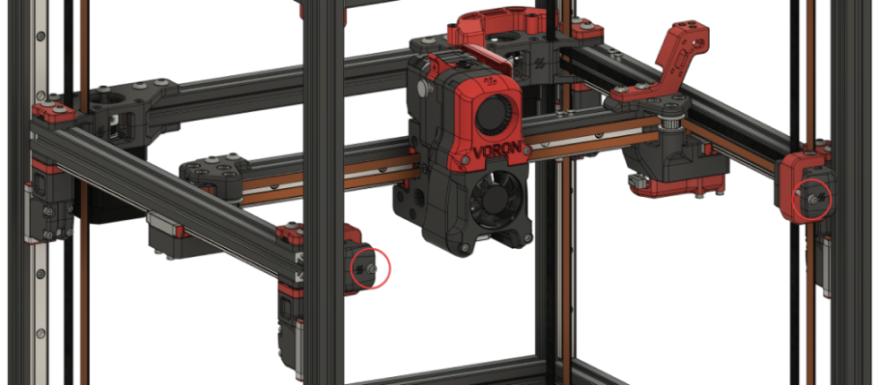
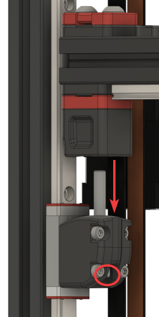
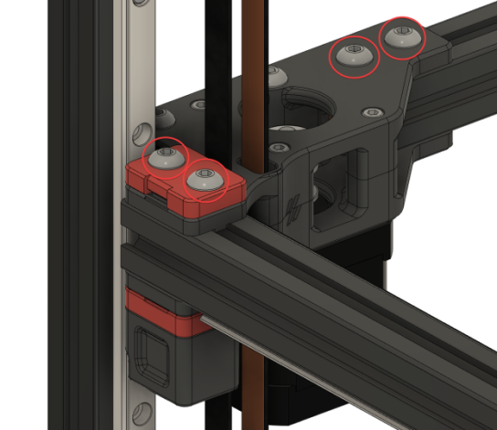

# V2 Gantry Squaring

Poor gantry squaring can cause a number of problems, such as:

- First Layer issues
- Z belts rubbing against the gantry's printed parts
- X axis to be "racked" at the front but not the back (or vice versa)

Steps 14-16 of the instructions below can also help with gantry stability.

## Demonstration

Notice that the idlers get "pinched" when moving the X extrusion back/forth (this is shown with loose Z joints).

<video width="640" height="360" preload="auto" controls>
    <source src="https://user-images.githubusercontent.com/34943186/154356504-b3870f34-32a3-4c2a-a424-7d48def0f834.mp4" type="video/mp4">
    <!-- Fallback -->
    
Your browser doesn't support embedded videos. Click <a href="https://user-images.githubusercontent.com/34943186/154356504-b3870f34-32a3-4c2a-a424-7d48def0f834.mp4" alt="Idlers video">here</a> to view directly.

</video>

## Method

**Note:** Some have found [Z Locks](https://github.com/VoronDesign/VoronUsers/tree/master/printer_mods/tallman5/z-locks/) to be useful for this procedure. They are not required, however.

1. Raise the stepper driver timeout with this g-code: `SET_IDLE_TIMEOUT TIMEOUT=99999`  
    This arbitrarily high timeout just gives us time to work. We need the Z motors to be energized and holding the gantry for the whole process.

2. Home the printer with `G28`,  
    Then level the gantry with `QUAD_GANTRY_LEVEL`.

3. Jog your gantry to the center of the build volume using the LCD or web interface.  
    This will give you space to work. You need easy access to both the bottom and top of your gantry.

4. Turn off ONLY your A/B motors using these g-codes:

    `SET_STEPPER_ENABLE STEPPER=stepper_x ENABLE=0`  
    `SET_STEPPER_ENABLE STEPPER=stepper_y ENABLE=0`

5. Loosen your A/B belt tension fully.  
    This prevents the A/B belt tension from pulling the gantry out of alignment while you work on it.

    Your belts should be fully disengaged. If there is still remaining tension with the idlers fully backed off, you may need to release the belt ends from the X carriage.

    

6. Take off your side panels.

7. Unscrew and drop your lower Z joints.  
    Your gantry will now be floating on just the belts.

    {: .note }
    > Make sure your printer is on a (fairly) level surface. Unlevel surfaces could cause your gantry to swing too much to one side.  
    > It doesn't have to be perfectly level; Just don't do it on a hill!

     -- 

8. **PARTIALLY** loosen all connections to the extrusions.

    You need all of these bolts to be loose enough to freely adjust against the printed part on the extrusions.

    {: .warning }
    > Where there are Z belt clamps, ensure that you do not loosen the bolts to the point of the Z-belts releasing.  
    > **Only loosen enough to allow for adjustments**

    1. X/Y joints (repeat for both sides)

        - Top:  
          
        - Bottom:  
          

    2. A/B joints (repeat for both sides):

        - Top:  
          *Don't overdo the belt clamps!*  
          
        - Bottom:  
          *Don't overdo the belt clamps!*  
          

    3. Front idlers (repeat for both sides):

        - Top:  
          *Don't overdo the belt clamps!*  
          
        - Bottom:  
          *Don't overdo it!*  
          

    **And now, what we have been preparing for...**

9. Level your gantry with the Z joints

    1. Adjust your gantry so that it sits perfectly on top of the lower Z joints.  
        This involves moving gantry components further apart or closer together along the extrusions:

        - Rear:  
          
        - Sides:  
          

        Your gantry should align so that:

        1. The Z joints feel perfectly flush along the side, and
        2. When raising and lowering your lower Z joint by hand, the bolt slides in perfectly without hitting the sides.

         -- 

    2. Ensure that you do not inadvertently rotate your A/B joints during this process.

         

10. Tighten every extrusion bolt again, *except* those in the X/Y joints. (you will tighten those during step 12)  
    Ensure that your Z joints still align properly. Sometimes, tightening can move things around.

11. Re-install your lower Z joints and *lightly* tighten the M5 bolts.  
    Don't fully tighten them down yet - just lightly. The joint should still be able to articulate freely.

12. Eliminate any racking in the gantry.  
    Follow the [Nero3D's de-racking video](https://www.youtube.com/watch?v=cOn6u9kXvy0) for help with this.

    {: .note }
    > Make sure to come back here afterwards! The following steps are still important.

13. Re-tension your A/B belts  
    The recommended amount of trension amounts to 110hz over a **15cm span**

    Steps for tensioning your A/B belts are outlined in the [Belt tension: A/B Belts](/tuning/secondary_printer_tuning.html#ab-belts) guide.

14. Reinstall your panels and fully heatsoak your printer for **1½ - 2 hours minimum.**

15. Run a gantry level using `QUAD_GANTRY_LEVEL`.  
    Do this 3-5 times to "settle in" the gantry (and level it for the next step).

    If you are getting new tolerance or retry errors, you may have left your Z joints a bit *too* loose. Try tightening them up just a bit more.

16. Open the front door and fully tighten the M5 bolts in your Z joints while it's still hot.

    This does two things:

    1. Somewhat "locks in" your QGL at its state in full thermal expansion.  
        *This can help with first layer issues*

    2. Stabilizes your gantry.  
        *This can help with ringing and layer consistency*

    If you have your Z joints too loose, you might notice that your gantry displaces back & forth a bit while printing.

17. Restart your printer with `RESTART`. This will reset the idle timeout we set in step 1.
