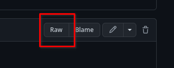

# Software Configuration

## Initial Voron Printer Configuration

Voron Configuration templates are available in the github repository for each printer.  You likely have them in the files you have already downloaded, in the "firmware" directory, or you can use the appropriate link below:

* [V0.2r1](https://github.com/VoronDesign/Voron-0/tree/Voron0.2r1/Firmware)
* [V1.8](https://github.com/VoronDesign/Voron-1/tree/Voron1.8/Firmware/klipper_configurations)
* [Trident](https://github.com/VoronDesign/Voron-Trident/tree/main/Firmware)
* [V2.4](https://github.com/VoronDesign/Voron-2/tree/Voron2.4/firmware/klipper_configurations)
* [Switchwire](https://github.com/VoronDesign/Voron-Switchwire/tree/master/Firmware)
* [Legacy](https://github.com/VoronDesign/Voron-Legacy/tree/main/Firmware)

Note:  When downloading text configuration files from github, click the "raw" button at the top right of the file, and then use your browser's "save-as" function.



Rename the downloaded file to `printer.cfg`

**Mainsail**: Upload the file via Mainsail's interface.  Go to the "Machine" tab, and under "Config Files", press the "Upload File" button

**Fluidd**: Upload the file via Fluidd's interface.  Go to the "Configuration" Tab, and under "Configuration Files", press "+"->"Upload"

**Octoprint**: Use a secure file transfer program (WinSCP, Cyberduck, Notepad++, NppFT, BBEdit, scp), to transfer the file to your Raspberry Pi, placing it in the folder `/home/pi`.

## Editing printer.cfg

**Note:** There are many ways of editing the config file that vary by personal preference.  Mainsail & Fluidd both offer built-in printer.cfg editors. Using Nano editor through SSH is simple but not always user friendly.  Notepad++ with the NppFTP plugin (Windows) or bbEdit (macOS) are user-friendlier alternatives.  

* Mainsail:  Click "Settings", "Machine", then on the "printer.cfg"
* Fluidd: Click "Configuration", then "printer.cfg", and choose "edit" from the menu that appears

* [Notepad++ Information](./notepadplusplus.md)
* [bbEdit Information](./bbedit.md)

* Nano: The nano command is slightly different, depending on whether you are using Mainsail, Fluidd, or Octoprint
  * **Mainsail & Fluidd**: `nano ~/printer_data/config/printer.cfg`
  * **Octoprint**:`nano ~/printer.cfg`

## Review printer.cfg

There are a variety of entries in printer.cfg which will need to be edited to match your particular build.  Open it with your choice of editors, and go through it carefully.  While the key edits are highlighted below, you should read the entire file, and make sure you have found everything which needs your attention.

**Klipper is CASE SENSITIVE. Most keywords are lower case. Make sure your device doesn't auto-capitalize keywords when they shouldn't be!**

## Required Changes

The following items _must_ be updated before the printer can function.

* MCU path(s)
* Thermistor types - hot end, heated bed
  (See 'sensor types' list at end of stock configuration file)
* Stepper settings (X, Y, Z(s), extruder)
  * Endstop position
  * Max position
  * Stepper type
* Bed Screw / Tilt / Quad Gantry positions
* Z endstop location

## Change Details

### Printer Definitions

In this section you set your maximum accelerations and velocity. The stock config is configured fast - so if you are facing issues - you can tweak these values lower and then increase them as you finish tuning your printer. These are the highest values that klipper will allow regardless of what you may have configured in your slicer.

```yml
[printer]
kinematics: corexy
max_velocity: 350
max_accel: 3000
max_z_velocity: 50
max_z_accel: 350
square_corner_velocity: 10.0
```

Square corner velocity is defined as:

The maximum velocity (in mm/s) that the toolhead may travel a 90 degree corner at. A non-zero value can reduce changes in extruder flow rates by enabling instantaneous velocity changes of the toolhead during cornering. This value configures the internal centripetal velocity cornering algorithm; corners with angles larger than 90 degrees will have a higher cornering velocity while corners with angles less than 90 degrees will have a lower cornering velocity. If this is set to zero then the toolhead will decelerate to zero at each corner. The default is 5mm/s.

### Update Controller Path

Locate the section starting with **[mcu]**.  The V2 may have an additional section starting with **[mcu z]**, if it has two controllers.  These sections are where the controllers are defined and identified so that Klipper knows which components are connected (and to which controller if there is more than one).

* Begin with all controllers disconnected from the Raspberry Pi.
* For printers with just one controller, connect that controller to the Raspberry Pi.  For printers with two controllers, connect the X/Y/E controller.
* On the Raspberry Pi, run `ls /dev/serial/by-id/`.
* The listing should look similar to this:


**Note:** If the device identifier has the word 'marlin' in it, the Klipper firmware is not loaded properly.  Go back and [reload the Klipper firmware](./#firmware-flashing) before continuing.

1. Copy the device ID (e.g. `usb-Klipper_lpc1768_1FB0000802094AAF07825E5DC52000F5-if00`) from the terminal window and paste into a temporary text file.
2. [Open](#editing-printercfg) the configuration file and navigate to the `[mcu]` section.
3. Locate `serial:` and replace the value with `/dev/serial/by-id/` followed by your MCU's device ID you copied in step 1. It should look as follows:  
  
    ```yml
    [mcu]
    serial: /dev/serial/by-id/usb-Klipper_lpc1768_1FB0000802094AAF07825E5DC52000F5-if00
    ```

4. Exit the text editor, and save when prompted.

### Update Second Controller Path (V2)

This section only applies to printers with more than one controller.

* Connect the Z controller to the Raspberry Pi.
* On the Raspberry Pi, re-run `ls -l /dev/serial/by-id/`.
* The listing should look similar to this:


**Note:** If the device identifier has the word 'marlin' in it, the Klipper firmware is not loaded properly.  Go back and re-load the Klipper firmware before continuing.

1. Copy the device ID (e.g. `usb-Klipper_lpc1768_0650000AA39C48AFABD4395DC22000F5-if00`) from the terminal window and paste into a temporary text file.
2. [Open](#editing-printercfg) the configuration file and navigate to the `[mcu z]` section.
3. Locate `serial:` and replace the value with `/dev/serial/by-id/` followed by your MCU's device ID you copied in step 1. It should look as follows:  
  
    ```yml
    [mcu z]
    serial: /dev/serial/by-id/usb-Klipper_lpc1768_0650000AA39C48AFABD4395DC22000F5-if00
    ```

4. Exit the text editor, and save when prompted.

### Updating Printer Specific Settings

1. [Open](#editing-printercfg) printer.cfg file again and scan through the file.
2. Locate `[stepper_x]`:
    * Uncomment the `position_endstop` and `position_max` lines with values that corresponds to your printer's size.
    * Delete the other options to prevent confusion.
3. Locate `[tmcXXXX stepper_x]`:
    * Replace XXXX with either 2208 or 2209 to match the type of TMC drivers that are installed.  
    For example, `[tmc2209 stepper_x]` for TMC2209 drivers.
4. Locate `[stepper_y]`:
    * Uncomment the `position_endstop` and `position_max` lines with values that corresponds to your printer's size.
    * Delete the other options to prevent confusion.
5. Locate `[tmcXXXX stepper_y]`:
    * Replace XXXX with either 2208 or 2209 to match the type of TMC drivers that are installed.  
    For example, `[tmc2209 stepper_y]` for TMC2209 drivers.
6. Locate `[stepper_z]`:
    * Uncomment the `position_max` line that corresponds with your printer's size
    * Delete the other options to prevent confusion.  
    * Update the 4 `[tmcXXXX stepper_zX]` sections, selecting the right stepper motor driver model corresponding to each of the Z motors respectively (stepper_z, stepper_z1, stepper_z2, stepper_z3).
7. Under `[extruder]`
    * Verify that the `sensor_type` is set, matching the sensor type you're using.
    * Update `[tmcXXXX extruder]` in the same fashion as step 3 to match the installed stepper driver for the extruder.  
    Do not worry about `step_distance` or PID values for now. They will be updated later in the setup process.  
8. Under `[heater_bed]`, verify the temperature sensor type is correct.
9. Under `[display]`
    * Uncomment the display configuration section that matches the installed display.
    * Delete the others to prevent confusion.
10. For bed leveling:

    **If printer is a V1**:
      * Under `[z_tilt]` and `[screws_tilt_adjust]`, uncomment the lines that correspond with your printer's size
      * Delete the other options to prevent confusion.

    **If printer is a V2**:
      * Under `[quad_gantry_level]`, uncomment the `gantry_corners` and `points` sections that correspond with your printer's size
      * Delete the other options to prevent confusion.

11. Exit the text editor with CTRL-X  and save when prompted.

### Additional Changes: MainsailOS only

Add the following entry to your printer.cfg:

```yml
[include mainsail.cfg]
```

### Additional Changes: FluiddOS only

Add the following entries to your printer.cfg:

```yml
[include fluidd.cfg]
```

> ### Community References
>
> [Calculating Driver Current Settings](../../community/howto/120decibell/calculating_driver_current.md)
>

### Restart to take effect

Under Mainsail or Fluidd's console, or Octoprint's terminal tab type `FIRMWARE_RESTART` and press enter to send the command to restart Klipper.

The console window should show the following:

```text
Recv: // Klipper state: Disconnect
[...]
Recv: // Klipper state: Ready
```

If after 30-60 seconds there is no Ready message, then run `STATUS` in the terminal window.  If Klipper comes back _Not Ready_ it will notify if there is a configuration issue that needs to be corrected.

---

### Next: [Initial Startup](../startup/index.md)
