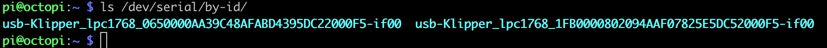

# Software Configuration

## Initial Voron Printer Configuration

Download the respective Voron base configuration file from the following links:

* [V0 SKR mini e3 1.2](https://raw.githubusercontent.com/VoronDesign/Voron-0/master/VORON-0/Firmware/SKR_E3_Mini_1.2/printer.cfg) *note:  Not compatible with V0.1*
* [V0 SKR mini e3 2.0](https://raw.githubusercontent.com/VoronDesign/Voron-0/Voron0.1/Firmware/skr-mini-E3-v2.0.cfg)
* [V0 SKR mini e3 3.0](https://raw.githubusercontent.com/VoronDesign/Voron-0/Voron0.1/Firmware/skr-mini-E3-v3.0.cfg)
* [V1 SKR 1.4](https://raw.githubusercontent.com/VoronDesign/Voron-1/Voron1.8/Firmware/klipper_configurations/SKR_1.4/Voron_1_SKR_14_Config.cfg)
* [V2 SKR 1.3](https://raw.githubusercontent.com/VoronDesign/Voron-2/Voron2.4/firmware/klipper_configurations/SKR_1.3/Voron2_SKR_13_Config.cfg)
* [V2 SKR 1.4](https://raw.githubusercontent.com/VoronDesign/Voron-2/Voron2.4/firmware/klipper_configurations/SKR_1.4/Voron2_SKR_14_Config.cfg)
* [V2 Spider](https://raw.githubusercontent.com/VoronDesign/Voron-2/Voron2.4/firmware/klipper_configurations/Spider/Voron2_Spider_Config.cfg)
* [V2 Octopus](https://raw.githubusercontent.com/VoronDesign/Voron-2/Voron2.4/firmware/klipper_configurations/Octopus/Voron2_Octopus_Config.cfg)
* [SW SKR mini e3 V2.0](https://raw.githubusercontent.com/VoronDesign/Voron-Switchwire/master/Firmware/skr_mini_e3_v2_config.cfg)
* [SW Einsy Rambo](https://raw.githubusercontent.com/VoronDesign/Voron-Switchwire/master/Firmware/einsy_config.cfg)
* [Legacy SKR 1.3](https://raw.githubusercontent.com/VoronDesign/Voron-Legacy/main/Firmware/skr_v1.3_config.cfg)
* [Trident Octopus](https://raw.githubusercontent.com/VoronDesign/Voron-Trident/main/Firmware/Octopus/Trident_Octopus_Config.cfg)

Rename the downloaded file to `printer.cfg`

**Mainsail**: Upload the file via Mainsail's interface.  Go to the "Machine" tab, and under "Config Files", press the "Upload File" button

**Fluidd**: Upload the file via Fluidd's interface.  Go to the "Configuration" Tab, and under "Configuration Files", press "+"->"Upload"

**Octoprint**: Use a secure file transfer program (WinSCP, Cyberduck, Notepad++, NppFT, BBEdit, scp), to transfer the file to your Raspberry Pi, placing it in the folder `/home/pi`.


## Editing printer.cfg
**Note:** There are many ways of editing the config file that vary by personal preference.  Mainsail & Fluidd both offer built-in printer.cfg editors. Using Nano editor through SSH is simple but not always user friendly.  Notepad++ with the NppFTP plugin (Windows) or bbEdit (macOS) are user-friendlier alternatives.  

* Mainsail:  Click "Settings", "Machine", then on the "printer.cfg"
* Fluidd: Click "Configuration", then "printer.cfg", and choose "edit" from the menu that appears

* [Notepad++ Information](./notepadplusplus.md)
* [bbEdit Information](./bbedit.md)

* Nano: The nano command is slightly different, depending on whether you are using Mainsail, Fluidd, or Octoprint
	* **Mainsail & Fluidd**: `nano ~/klipper_config/printer.cfg`
	* **Octoprint**:`nano ~/printer.cfg`

## Review printer.cfg
There are a variety of entries in printer.cfg which will need to be edited to match your particular build.  Open it with your choice of editors, and go through it carefully.  While the key edits are highlighted below, you should read the entire file, and make sure you have found everything which needs your attention.

**Klipper is CASE SENSITIVE.  Be sure everything except comments is LOWER CASE.**

## Required Changes

The following items _must_ be updated before the printer can function.

* MCU path(s)
* Thermistor types - hot end, heated bed
	* See 'sensor types' list at end of stock configuration file
* Stepper settings (X, Y, Z(s), extruder)
	* Endstop position
	* Max position
	* Stepper type
* Bed Screw / Tilt / Quad Gantry positions
* Z endstop location

## Change Details

### Printer Definitions

In this section you set your maximum accelerations and velocity. The stock config is configured fast - so if you are facing issues - you can tweak these values lower and then increase them as you finish tuning your printer. These are the highest values that klipper will allow regardless of what you may have configured in your slicer. 

```ini
[printer]
kinematics: corexy
max_velocity: 350
max_accel: 3000
max_z_velocity: 50
max_z_accel: 350
square_corner_velocity: 10.0
```

Square corner velocity is defined as:

The maximum velocity (in mm/s) that the toolhead may travel a 90 degree corner at. A non-zero value can reduce changes in extruder flow rates by enabling instantaneous velocity changes of the toolhead during cornering. This value configures the internal centripetal velocity cornering algorithm; corners with angles larger than 90 degrees will have a higher cornering velocity while corners with angles less than 90 degrees will have a lower cornering velocity. If this is set to zero then the toolhead will decelerate to zero at each corner. The default is 5mm/s.

### Update Controller Path

Locate the section starting with **[mcu]**.  The V2 may have an additional section starting with **[mcu z]**, if it has two controllers.  These sections are where the controllers are defined and identified so that Klipper knows which components are connected (and to which controller if there is more than one).

* Begin with all controllers disconnected from the Raspberry Pi.
* For printers with just one controller, connect that controller to the Raspberry Pi.  For printers with two controllers, connect the X/Y/E controller.
* On the Raspberry Pi, run `ls /dev/serial/by-id/`.
* The listing should look similar to this:


**Note:** If the device identifier has the word 'marlin' in it, the Klipper firmware is not loaded properly.  Go back and [re-load the Klipper firmware](./#firmware-flashing) before continuing.

* Copy the device ID (e.g. _usb-Klipper\_lpc1768\_1FB0000802094AAF07825E5DC52000F5-if00_) from the terminal window and paste into a temporary text file.
*  [Open](#editing-printercfg) the configuration file and navigate to the **[mcu]** section.  Modify the `serial: /dev/serial` line and paste in the controller path so that it looks like the following: `serial: /dev/serial/by-id/usb-Klipper_lpc1768_1FB0000802094AAF07825E5DC52000F5-if00`
*  Exit the text editor, and save when prompted.

### Update Second Controller Path (V2)

This section only applies to printers with more than one controller.

* Connect the Z controller to the Raspberry Pi.
* On the Raspberry Pi, re-run `ls -l /dev/serial/by-id/`.
* The listing should look similar to this:



**Note:** If the device identifier has the word 'marlin' in it, the Klipper firmware is not loaded properly.  Go back and re-load the Klipper firmware before continuing.

* Identify the new device ID (e.g. _usb-Klipper\_lpc1768\_0650000AA39C48AFABD4395DC22000F5-if00_) and copy from the terminal window and paste into a temporary text file.
*  [Open](#editing-printercfg) the configuration file and navigate to the **[mcu z]** section.  Modify the `serial: /dev/serial` line and paste in the controller path so that it looks like the following: `serial: /dev/serial/by-id/usb-Klipper_lpc1768_0650000AA39C48AFABD4395DC22000F5-if00`
*  Exit the text editor with CTRL-X  and save when prompted.

### Updating Printer Specific Settings

1. [Open](#editing-printercfg) printer.cfg file again and scan through the file.
2. Locate **[stepper_x]**.  Uncomment the _position\_endstop_ and _position\_max_ that corresponds to your printer's size and delete the other options to prevent confusion.
3. Under **[tmcXXXX stepper_x]**, replace XXXX with either 2208 or 2209 to match the type of TMC drivers that are installed.  For example, _[tmc2209_ _stepper\_x]_ for TMC 2209 drivers.
4. Repeat steps 2 & 3 for the **[stepper_y]** section.
5. Under **[stepper_z]**, uncomment _position\_max_ for your printer size and delete the other options to prevent confusion.  Also in the same method as step 3, update the **[tmcXXXX_stepper]** for configuration with the installed stepper type for all four Z motors (Z, Z1, Z2, Z3 as applicable).
6. Under **[extruder]** verify that the _sensor\_type_ is correct.  Do not worry about _step\_distance_ or PID values for now, they will be updated later in the setup process.  Update **[tmcXXXX extruder]** in the same fashion as step 3 to match the installed stepper driver for the extruder.
7. Under **[heater_bed]**, verify the temperature sensor type is correct.
8. Under **[display]**, uncomment the display section that matches the installed display.  Delete the others to prevent confusion.
9. **If printer is a V1**, Under **[z\_tilt]** and **[screws\_tilt\_adjust]**, uncomment the sections appropriate to the printer size.  Delete the other options to prevent confusion.
10. **If printer is a V2**, Under **[quad\_gantry\_level]**, uncomment the _gantry\_corners_ and _points_ sections appropriate to the printer size.  Delete the other options to prevent confusion.
11. Exit the text editor with CTRL-X  and save when prompted.

### Additional Changes: MainsailOS only
1. Add the following entry to your printer.cfg:
```ini
[include mainsail.cfg]
```

### Additional Changes: FluiddOS only

1.  Add the following entries to your printer.cfg:
```ini
[include fluidd.cfg]
```

> ### Community References
>
> [Calculating Driver Current Settings](../../community/howto/120decibell/calculating_driver_current.md)
>

### Restart to take effect

Under Mainsail or Fluidd's console, or Octoprint's terminal tab type `FIRMWARE_RESTART` and press enter to send the command to restart Klipper.

The console window should show the following:

```
Recv: // Klipper state: Disconnect
[...]
Recv: // Klipper state: Ready
```

If after 30-60 seconds there is no Ready message, then run `STATUS` in the terminal window.  If Klipper comes back _Not Ready_ it will notify if there is a configuration issue that needs to be corrected.

---
### Next: [Initial Startup](../startup/index.md)
