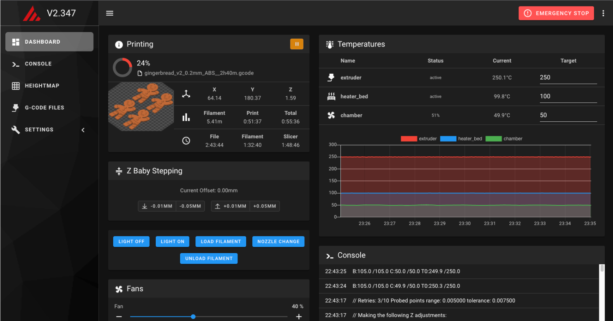
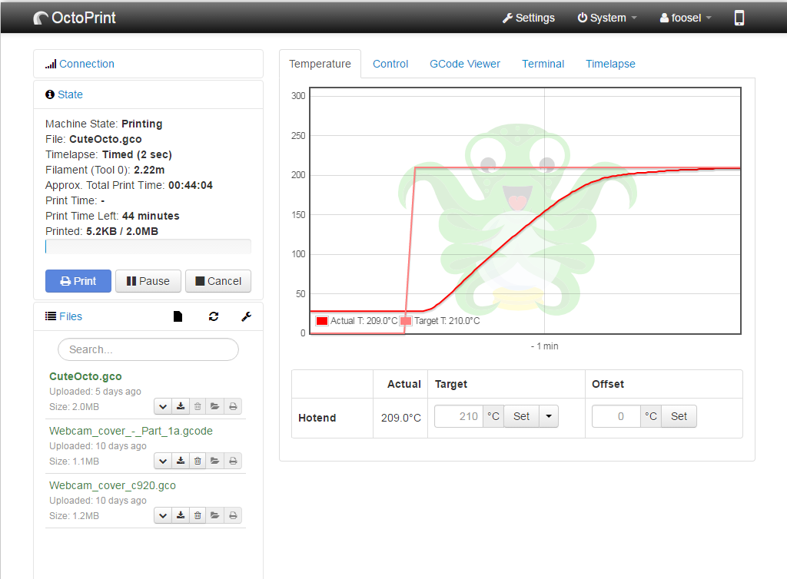

# Software Installation

All stock Voron printers run on the [Klipper](https://klipper3d.com) firmware. However, there are a few different web interfaces available for managing your printer.

The Voron Project recommends using Mainsail or Fluidd, although it is also possible to use Octoprint.   Mainsail and Fluidd are both developed specifically for Klipper-based printers, whereas Octoprint is a more general-use platform. 

_Note: If you are using a Pi Zero, such as in the Voron Legacy, you must use Mainsail or Fluidd_

| Mainsail | Fluidd | Octoprint |
|--|--|--|
||||

## Installation

### Mainsail

Mainsail is a lightweight web interface for Klipper and other subsystems.  It does not support plugins but generally doesn't need to.

#### [Installing Mainsail](./installing_mainsail.md)

### Fluidd

Fluidd is a lightweight web interface for Klipper and other subsystems that is very similar to Mainsail but has a different look and feel.  It also does not support plugins.

#### [Installing Fluidd](./installing_fluidd.md)

### Octoprint

Octoprint has been a popular system for many years.  It supports plugins but also requires substantial CPU and memory.

#### [Installing Octoprint](./installing_octoprint.md)

## Firmware Flashing

At this point Klipper will be installed on the Raspberry Pi.  The next step is to compile and install the Klipper firmware onto the controller(s).

* [SKR 1.3](./skr13_klipper.md)
* [SKR 1.4](./skr13_klipper.md)
* [SKR mini e3 V1.2](./miniE3_v12_klipper.md)
* [SKR mini e3 V2.0](./miniE3_v20_klipper.md)
* [SKR mini e3 V3.0](./miniE3_v30_klipper.md)
* [FLY FLYF407ZG](./flyf407zg_klipper.md)
* [Fysetc Spider](./spider_klipper.md)
* [BTT Octopus](./octopus_klipper.md)
* [SKR Pico](./skrPico_klipper.md)

---

### Next: [Software Configuration](./configuration.md)
