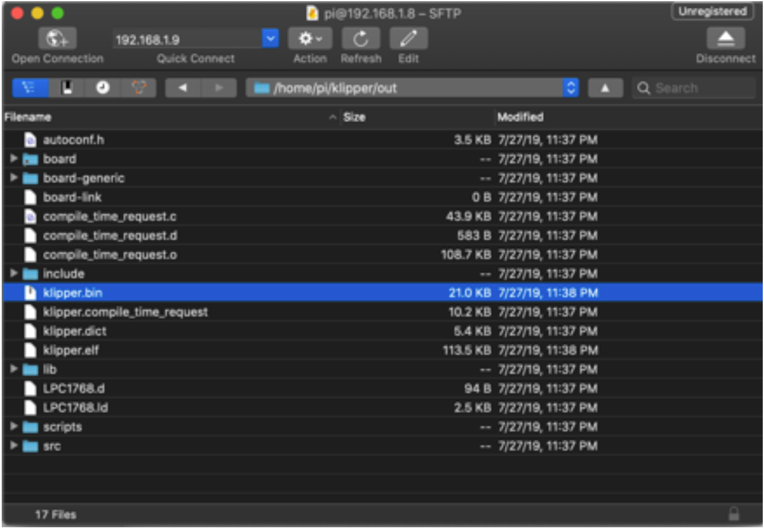

# SKR mini E3 Klipper Firmware

The firmware update process for both SKR mini E3 V1.2 and SKR mini E3 V2.0 is the same.

### Required Items

* Klipper must be installed onto the Raspberry Pi
* At least one microSD card needs to be available depending on number of controllers.

### Build Firmware Image

* Login to the Raspberry Pi
* Run the following:

```
sudo apt install make
cd ~/klipper
make menuconfig
```

In the menu structure there are a number of items to be selected.

* Ensure that the micro-controller architecture is selected to be 'STM32' and the processor model is set to 'STM32F103' with a 28KiB bootloader.
* Select "Enable extra low-level configuration options"
* Enable "Use USB for communication (instead of serial)"
* Configure "GPIO pins to set at micro-controller startup" to '!PC14'.


Once the configuration is selected, select "Exit" and "Yes" if asked to save the configuration.

Run the following:

```
make clean
make
```

The `make` command, when completed, creates a firmware file **klipper.bin** that is store in the folder `/home/pi/klipper/out`.  This file need to be copied to the Mini E3 board.  The easiest way to do this is to use a GUI like [WinSCP](https://winscp.net/eng/download.php) on Windows or either [Cyberduck](https://cyberduck.io) or scp (from terminal) on Mac to copy the file to your computer.



### Load Firmware Image

Copy the **klipper.bin** to the desktop, then rename it to **firmware.bin**

**Important:** If the file is not renamed, the bootloader will not be updated properly.

Ensure that the Mini E3 board is not powered, then remove the microSD card that is installed.

Connect the microSD card to the computer with the **firmware.bin** file.  Open the microSC card in the file browser.  There will be a file named 'firmware.cur', that file can be deleted or left alone, it will be overwritten later.

Copy the **firmware.bin** from the desktop onto the microSD card.  If problems are encountered transferring the file(s) to the microSD card, reformat the microSD card with a FAT32 filesystem and try again.

Replace the microSD card into the Mini E3. 

Turn on the power supply to power on the Mini E3 board.  If named properly, the SKR will automatically update with the Klipper firmware.

**Important:** If the Mini E3 is not powered with 12-24V, Klipper will be unable to communicate with the TMC drivers via UART and the Mini E3 will automatically shut down.

### Back to [Software Installation](./index.md#klipper-octoprint-configuration)
