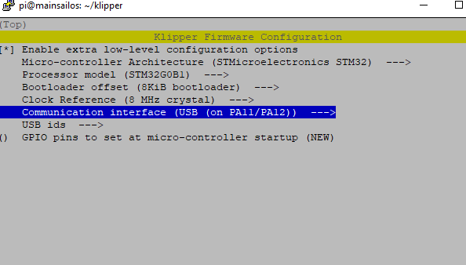
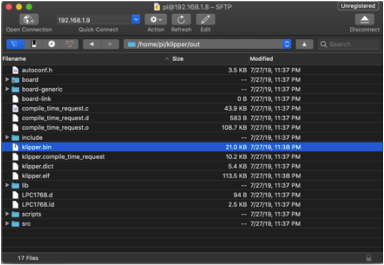

# SKR mini E3 V3.0 Klipper Firmware

## Required Items

* Klipper must be installed onto the Raspberry Pi
* At least one microSD card needs to be available depending on number of controllers.

## Build Firmware Image

* Login to the Raspberry Pi
* Run the following:

```bash
sudo apt install make
cd ~/klipper
make menuconfig
```

In the menu structure there are a number of items to be selected.

* Ensure that the micro-controller architecture is set to 'STM32'
* Ensure that the processor model is set to 'STM32G0B1'
* Ensure that the Bootloader offset is set to '8KiB'
* Ensure that the Clock Reference is set to '8 Mhz'
* Ensure that "Enable extra low-level configuration options" is selected.
* Ensure that Communication interface is set to "USB (on PA11/PA12)".



Once the configuration is selected, select "Exit" and "Yes" if asked to save the configuration.

Run the following:

```bash
make clean
make
```

The `make` command, when completed, creates a firmware file **klipper.bin** which is stored in the folder `/home/pi/klipper/out`.  This file need to be copied to the Mini E3 board.  The easiest way to do this is to use a GUI like [WinSCP](https://winscp.net/eng/download.php) on Windows or either [Cyberduck](https://cyberduck.io) or scp (from terminal) on Mac to copy the file to your computer.



### Load Firmware Image

Copy the **klipper.bin** to the desktop, then rename it to **firmware.bin**

**Important:** If the file is not renamed, the firmware will not be updated properly.

Ensure that the Mini E3 board is not powered, then remove the microSD card that is installed.

Connect the microSD card to the computer with the **firmware.bin** file. Open the microSD card in the file browser.  There may be a file named 'firmware.cur'; that file can be deleted or left alone. It does not matter because it will be overwritten later.

Copy the **firmware.bin** from the desktop onto the microSD card. If problems are encountered transferring the file(s) to the microSD card, reformat the microSD card with a FAT32 filesystem and try again.

Replace the microSD card into the Mini E3.

Turn on the power supply to power on the Mini E3 board. If named properly, the SKR will automatically update with the Klipper firmware.

**Important:** If the Mini E3 is not powered with 12-24V, Klipper will be unable to communicate with the TMC drivers via UART and the Mini E3 will automatically shut down.

# Firmware Updates
It is a normal and expected behavior, that updating klipper (on the pi) will sometimes also require you to update the klipper firmware on the SKR mini. Klipper will not do this for you automatically.  One option is to simply repeating the full flashing process as seen above.  However, this is often inconvenient, since it requires physical access to the MCU.

Instead, you can update the SKR mini over USB, using DFU:

{: .note }
The technique shown below only applies to updating an mcu which is already running klipper firmware.  It cannot be used for new installs

1. build the firmware, as shown above
2. Determine the full ID of your MCU, either from printer.cfg, or from the command `ls /dev/serial/by-id/*`.  It should look something like `/dev/serial/by-id/usb-Klipper_stm32g0b1xx_1D0004001050563046363120-if00`
3. run  the commands:
```bash
sudo service klipper stop
cd ~/klipper
make flash FLASH_DEVICE=<insert serial id here>
sudo service klipper start
```
so, with our example serial ID, the 3rd line would look like: `make flash FLASH_DEVICE=/dev/serial/by-id/usb-Klipper_stm32g0b1xx_1D0004001050563046363120-if00`


---

### Back to [Software Installation](./index.md#klipper-octoprint-configuration)
