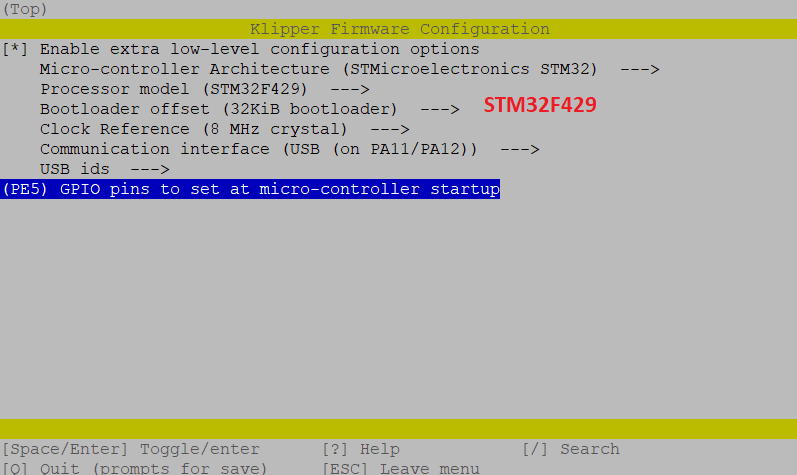

# Octopus(Pro) Klipper Firmware

{: .warning }
>Do not leave HE0 or HE1 connected during initial flashing
>
>There have been reports of Octopus boards turning on all heaters and fans as soon as you power up the board.  As a result, we recommend leaving the heaters disconnected until after loading the klipper firmware

The firmware update process for both Octopus and Octopus Pro is the same so the guides have been combined.

## Prerequisites

* Klipper must be installed onto the Raspberry Pi
* It is desirable, though not strictly necessary to have a small sdcard available
* Even if you intend to power your Pi with the Octopus, during this flashing process, you will find it far more convenient to power your Pi from some other source, such as a regular USB power supply
* Voron Design recommends using USB to control the Octopus, which simply requires connecting a USB-A to USB-C cable between the Octopus and Pi.  If you prefer a UART connection, please consult the [BigTreeTech documentation](https://github.com/bigtreetech/BIGTREETECH-OCTOPUS-V1.0/tree/master/Octopus%20works%20on%20Voron%20v2.4/Firmware/Klipper) for the necessary configuration adjustments

## Build Firmware Image

1. Login to the Raspberry Pi
2. Run the following:

   ```bash
   sudo apt install make
   cd ~/klipper
   make clean
   make menuconfig
   ```

3. In the menu structure there are a number of items to be selected.

    * Select "Enable extra low-level configuration options"
    * Set the micro-controller architecture is set to `STMicroelectronics STM32`
    * Set the Processor model to `STM32F446`,`STM32F429` or `STM32H723` (Depends on the MCU of your motherboard)
    * Set the Bootloader offset to `32KiB bootloader` (for `STM32F446`, `STM32F429`) or `128KiB bootloader` (for `STM32H723`)
    * Set the Clock Reference to `12 MHz crystal`(for `STM32F446`), `8 MHz crystal`(for `STM32F429`), `25MHz crystal` (for `STM32H723`)
    * Set the Communication interface to `USB (on PA11/PA12)`  (note: see [BigTreeTech documentation](https://github.com/bigtreetech/BIGTREETECH-OCTOPUS-V1.0/tree/master/Octopus%20works%20on%20Voron%20v2.4/Firmware/Klipper) if you intend to use UART rather than USB)

    
    
    

4. Once the configuration is selected, press `q` to exit, and "Yes" when asked to save the configuration.
5. Run the command `make`
6. The `make` command, when completed, creates a firmware file **klipper.bin** which is stored in the folder `/home/pi/klipper/out`.

There are multiple options for getting this firmware file installed onto your Octopus.

## Firmware Installation

**Important**: Please write down these steps or bookmark this page - you might need to repeat the following steps if you update Klipper.

### Option 1: DFU Firmware Install

* Requires a USB connection
* Requires the installation of an extra jumper on the Octopus
* Does NOT require an sdcard

1. Power off Octopus
2. Install the BOOT0 jumper (Located near the AUX headers)
3. Connect Octopus & Pi via USB-C
4. Power on Octopus
5. press the reset button next to the USB connector
6. From your ssh session, run `cd ~/klipper` to make sure you are in the correct directory
7. Run `lsusb`. and find the ID of the dfu device. The device is typically named `STM Device in DFU mode`.
8. Run `make flash FLASH_DEVICE=1234:5678`, replacing 1234:5678 with the ID from the previous step. Note that the ID is in hexadecimal form; it only contains the numbers `0-9` and letters `A-F`.
9. Power off the Octopus
10. Remove the jumper from BOOT0 and 3.3V
11. Power on the Octopus
12. You can confirm that the flash was successful by running `ls /dev/serial/by-id`. If the flash was successful, this should now show a klipper device, similar to:

   

   (note: this test is not applicable if the firmware was compiled for UART, rather than USB)


### Option 2: SDcard Firmware Install

* Works regardless of USB vs UART
* Requires a microSD card

1. Execute these commands via SSH to rename the firmware file to `firmware.bin`:

   ```bash
   cd ~/klipper
   mv out/klipper.bin out/firmware.bin
   ```

   **Important:** If the file is not renamed, the firmware will not be updated properly. The bootloader looks for a file named `firmware.bin`.

2. Use a tool such as cyberduck or winscp to copy the firmware.bin file off your Pi, onto your computer.

   

3. Ensure that your sdcard is formatted FAT32  (NOT EXFAT!)
4. Copy **firmware.bin** onto the microSD card
5. Power off the Octopus
6. Insert the microSD card
7. Power on the Octopus
8. After a few seconds, the Octopus should be flashed
9. You can confirm that the flash was successful by running `ls /dev/serial/by-id`.  If the flash was successful, this should now show a klipper device, similar to:

   

(note: this test is not applicable if the firmware was compiled for UART, rather than USB)

**Important:** If the Octopus is not powered with 12-24V, Klipper will be unable to communicate with the TMC drivers via UART and the Octopus will automatically shut down.


# Firmware Updates
It is a normal and expected behavior, that updating klipper (on the pi) will sometimes also require you to update the klipper firmware on the Octopus. Klipper will not do this for you automatically.  One option is to simply repeating the full flashing process as seen above.  However, this is often inconvenient, since it requires physical access to the MCU.

{: .note }
The technique shown below only applies to updating an mcu which is already running klipper firmware.  It cannot be used for new installs

Instead, you can update the Octopus using a slight variation of the  DFU flashing technique shown above

1. build the firmware, as shown above
2. Determine the full ID of your MCU, either from printer.cfg, or from the command `ls /dev/serial/by-id/*`.  It should look something like `/dev/serial/by-id/usb-Klipper_stm32f446xx_1D0004001050563046363120-if00`
3. run  the commands:
```bash
sudo service klipper stop
cd ~/klipper
make flash FLASH_DEVICE=<insert serial id here>
sudo service klipper start
```
so, with our example serial ID, the 3rd line would look like: `make flash FLASH_DEVICE=/dev/serial/by-id/usb-Klipper_stm32f446xx_1D0004001050563046363120-if00`

---

### Back to [Software Installation](./index.md#klipper-octoprint-configuration)
