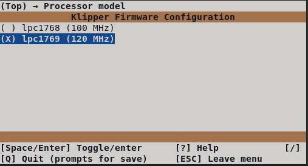
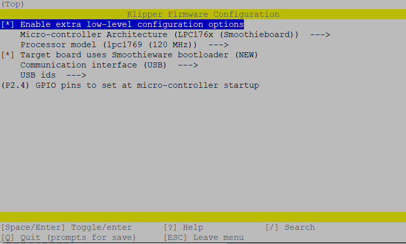

# SKR 1.3/1.4 Klipper Firmware

The firmware update process for both SKR 1.3 and SKR 1.4 is the same so the guides have been combined.

## Required Items

* Klipper must be installed onto the Raspberry Pi
* At least one microSD card needs to be available depending on number of controllers.

### Build Firmware Image

* Login to the Raspberry Pi
* Run the following:

```bash
sudo apt install make
cd ~/klipper
make menuconfig
```

In the menu structure there are a number of items to be selected.

* Ensure that the  micro-controller architecture is set to 'LPC176x'
* If the SKR is a Turbo model, ensure the processor model is set to 'lpc1769 (120 Mhz)'
* If the SKR is a non-Turbo model, ensure the processor model is set to 'lpc1768 (100 Mhz)'



* Ensure that "Target board uses Smoothieware bootloader" is enabled
* Ensure that "Use USB for communication (instead of serial)" is enabled



Once the configuration is selected, select "Exit" and "Yes" if asked to save the configuration.

Run the following:

```bash
make clean
make
```

The `make` command, when completed, creates a firmware file **klipper.bin** which is stored in the folder `/home/pi/klipper/out`.  This file needs to be copied to both of the SKR boards.  The easiest way to do this is to use a GUI like [WinSCP](https://winscp.net/eng/download.php) on Windows or either [Cyberduck](https://cyberduck.io) or scp (from terminal) on Mac to copy the file to your computer.


## Load Firmware Image

Copy the **klipper.bin** to the desktop, then rename it to **firmware.bin**

**Important:** If the file is not renamed, the bootloader will not be updated properly.

Ensure that all SKR boards are not powered, then remove the microSD card(s) that are installed.

Connect one of the microSD cards to the computer with the **firmware.bin** file.  Open the microSD card in the file browser.  There may be a file named 'firmware.cur'; that file can be deleted or left alone. It does not matter because it will be overwritten later.

Copy the **firmware.bin** from the desktop onto the microSD card.  If problems are encountered transferring the file(s) to the microSD card, reformat the microSD card with a FAT32 filesystem and try again.

_V2:_ Repeat the process with the second microSD card.

Replace the microSD card(s) into the SKR(s).  If more than one, it does not matter which card goes into which controller.

Turn on the power supply to power on the SKR board(s).  If named properly, the SKR will automatically update with the Klipper firmware.

**Important:** If the SKR(s) are not powered with 12-24V, Klipper will be unable to communicate with the TMC drivers via UART and the SKR will automatically shut down.


# Firmware Updates
It is a normal and expected behavior, that updating klipper (on the pi) will sometimes also require you to update the klipper firmware on the SKR. Klipper will not do this for you automatically.  One option is to simply repeating the full flashing process as seen above.  However, this is often inconvenient, since it requires physical access to the MCU.

{: .note }
The technique shown below only applies to updating an mcu which is already running klipper firmware.  It cannot be used for new installs

Instead, if you still have an sdcard in your SKR mini, You can quickly update the firmware without needing physical access by:

1. Building the firmware as normal, above
2. Determine the full ID of your MCU, either from printer.cfg, or from the command `ls /dev/serial/by-id/*`.  It should look something like `/dev/serial/by-id/usb-Klipper_lpc1769_1C10011425813AAFCED76B5CC22000F5-if00`
3. run  the commands:

```bash
sudo service klipper stop
~/klipper/scripts/flash-sdcard.sh <insert mcu ID> btt-skr-v1.3
sudo service klipper start

```

so, for our example, the middle command would be `~/klipper/scripts/flash-sdcard.sh /dev/serial/by-id/usb-Klipper_lpc1769_1C10011425813AAFCED76B5CC22000F5-if00 btt-skr-v1.3`


---

### Back to [Software Installation](./index.md#klipper-octoprint-configuration)
