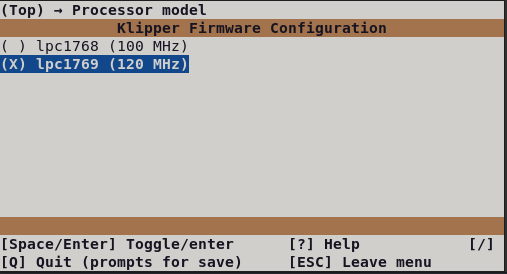
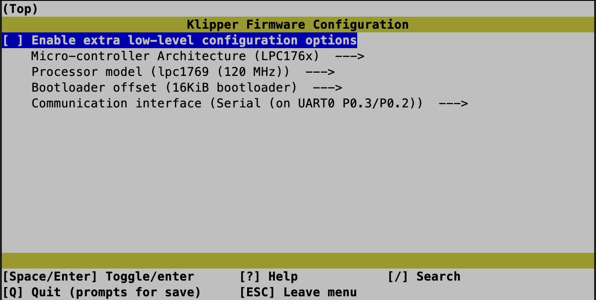
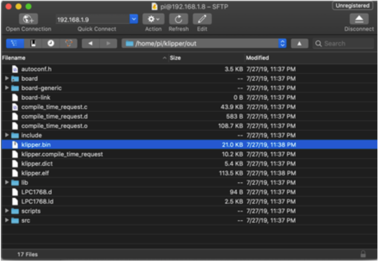

# SKR 1.3/1.4 Klipper Firmware

The firmware update process for both SKR 1.3 and SKR 1.4 is the same so the guides have been combined.

## Required Items

* Klipper must be installed onto the Raspberry Pi
* At least one microSD card needs to be available depending on number of controllers.

### Build Firmware Image

* Login to the Raspberry Pi
* Run the following:

```bash
sudo apt install make
cd ~/klipper
make clean
make menuconfig
```

In the menu structure there are a number of items to be selected.

* Ensure that the  micro-controller architecture is set to 'LPC176x'
* If the SKR is a Turbo model, ensure the processor model is set to 'lpc1769 (120 Mhz)'
* If the SKR is a non-Turbo model, ensure the processor model is set to 'lpc1768 (100 Mhz)'



* Ensure that "Bootloader offset" is set to "16KiB bootloader"
* Set “Communication interface” to the interface you have used to connect the board (USB or Serial)



Once the configuration is selected, select "Quit" and "Yes" if asked to save the configuration.

Run the following:

```bash
make
```

The `make` command, when completed, creates a firmware file **klipper.bin** which is stored in the folder `/home/pi/klipper/out`.  


## Manualy Copy Firmware Image to SD Card

**Important:** The initial flashing procedure must be done this way, updates can be made from the console using the method detailed below.

The file **klipper.bin** needs to be copied to both of the SKR boards.  The easiest way to do this is to use a GUI like [WinSCP](https://winscp.net/eng/download.php) on Windows or either [Cyberduck](https://cyberduck.io) or scp (from terminal) on Mac to copy the file to your computer.



Copy the **klipper.bin** to the desktop, then rename it to **firmware.bin**

**Important:** If the file is not renamed, the bootloader will not be updated properly.

Ensure that all SKR boards are not powered, then remove the microSD card(s) that are installed.

Connect one of the microSD cards to the computer with the **firmware.bin** file.  Open the microSD card in the file browser.  There may be a file named 'firmware.cur'; that file can be deleted or left alone. It does not matter because it will be overwritten later.

Copy the **firmware.bin** from the desktop onto the microSD card.  If problems are encountered transferring the file(s) to the microSD card, reformat the microSD card with a FAT32 filesystem and try again.

_V2:_ Repeat the process with the second microSD card.

Replace the microSD card(s) into the SKR(s).  If more than one, it does not matter which card goes into which controller.

Turn on the power supply to power on the SKR board(s).  If named properly, the SKR will automatically update with the Klipper firmware.

**Important:** If the SKR(s) are not powered with 12-24V, Klipper will be unable to communicate with the TMC drivers via UART and the SKR will automatically shut down.


## Update Firmware from Terminal

After Klipper has been initially flashed to a controller it is possible to transfer new firmware to the SD Card and initiate the flashing procedure via terminal, saving you from having to access hard-to-reach places.

Updating a BigTreeTech SKR 1.4 Turbo might resemble the following:

```bash
sudo service klipper stop
cd ~/klipper
git pull
make clean
make menuconfig
make
./scripts/flash-sdcard.sh /dev/ttyAMA0 btt-skr-turbo-v1.4
sudo service klipper start
```

You will need to identify the correct device location and board name and replace the placeholders accordingly. For the boards mentioned in this article you can use:
```bash
btt-skr-v1.3
btt-skr-v1.4
btt-skr-turbo-v1.4
```

A list of supported boards can be displayed using the following command:

```bash
./scripts/flash-sdcard.sh -l
```

**Important:** If you intend to flash multiple cards, you must do so before restarting the Klipper service.


---

### Back to [Software Installation](./index.md#klipper-octoprint-configuration)
