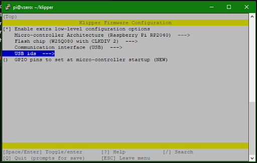
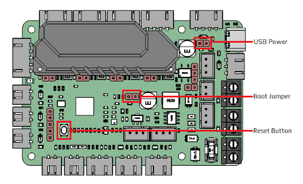
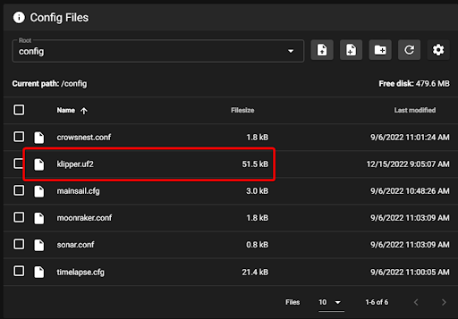
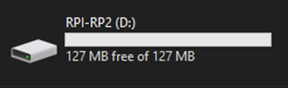
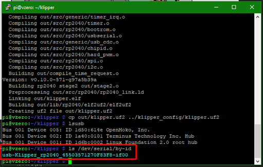

# SKR Pico Klipper Firmware

## Required Items

* Klipper must be installed onto the Raspberry Pi
* At least one microSD card needs to be available depending on number of controllers.

## Build Firmware Image

* Connect the Pico and the Pi via USB
* SSH into the Raspberry Pi using Putty or a similar tool
* Run the following:

```bash
sudo apt install make
cd ~/klipper
make menuconfig
```

In the configurator, Enable extra low-level configuration options

Ensure that the micro-controller architecture is set to 'Raspberry Pi RP2040'



Once the configuration is selected, Pres `Q` to exit and "Yes" if asked to save the configuration.

Run the following:

```bash
make clean
make
```

The `make` command, when completed, creates a firmware file called klipper.uf2 and can be located in the directory ~/klipper/out. On the raspberry pi

## Prepare SKR PICO for flashing

A couple steps need to be taken to setup the SKR Pico for flashing

1. Install the jumper for USB Power (this enables the Pico to be powered over USB and will be removed after flashing. Only use this if you don’t have it connected to 24v at the moment)
2. Install the jumper on the Boot pins



Now, you can flash the SKR Pico a couple different ways - via PC or the Raspberry pi. We will cover both methods in this guide

## Flashing the image

### PC Method

You can now copy the klipper.uf2 file to a directory that you can access via mainsail/fluid by running the following command

```bash
cp out/klipper.uf2 ~/printer_data/config/klipper.uf2
```

After running the above command, you should find the klipper.uf2 file in the config section of your UI (Mainsail/fluidd)



Right click and download this (klipper.uf2) file to your PC in order to flash the Skr Pico.

Next, you will connect the Skr Pico to your PC using the USB-C connector, then push the reset button on the Pico.  It should show up just like a flash drive would on your computer.



The last step is to copy the file you saved above (klipper.uf2) onto the Skr Pico just like you would with any file on a flash drive. As soon as you copy the file over the SKR pico will reboot automatically and it will be flashed with Klipper.

Now, unplug the Pico from the PC, remove the jumpers, plug it into your Raspberry Pi, push the reset button, and check if it’s been flashed properly by running the following command:

```bash
ls /dev/serial/by-id/*
```



If it has been flashed properly the result should be similar to the one in the img above. 

NOTE: your USB-ID will be different, but it should start with usb-Klipper-rp2040

### Raspberry Pi method

With the Pico plugged into the Pi via USB-C and the boot jumper installed, press the reset button.

Next we need to mount the SKR Pico to the Raspi to copy the file (klipper.uf2) over

Run the following commands:

```bash
sudo mount /dev/sda1 /mnt
sudo cp out/klipper.uf2 /mnt
sudo umount /mnt
```

Next remove the jumpers that were installed earlier and reset the SKR Pico

Run this command to receive the USB-ID for the SKR Pico

```bash
ls /dev/serial/by-id/*
```

If it has been flashed properly the result should be similar to the one in the img below. 


* NOTE: your USB-ID will be different, but it should start with usb-Klipper-rp2040

Copy this serial ID, it is unique to your MCU, you will need to add it to your printer.cfg file un the `[mcu]` section on the `serial:` line

**Important:** If the Pico is not powered with 12-24V, Klipper will be unable to communicate with the TMC drivers via UART and the Pico will automatically shut down.

# Firmware Updates
It is a normal and expected behavior, that updating klipper (on the pi) will sometimes also require you to update the klipper firmware on the SKR Pico. Klipper will not do this for you automatically.  One option is to simply repeating the full flashing process as seen above.  However, this is often inconvenient, since it requires physical access to the MCU.

{: .note }
The technique shown below only applies to updating an mcu which is already running klipper firmware.  It cannot be used for new installs

Instead, you can update the SKR Pico directly over USB

1. build the firmware, as shown above
2. Determine the full ID of your MCU, either from printer.cfg, or from the command `ls /dev/serial/by-id/*`.  It should look something like `/dev/serial/by-id/usb-Klipper_rp2040_1D0004001050563046363120-if00`
3. run the commands:
```bash
sudo service klipper stop
cd ~/klipper
make flash FLASH_DEVICE=<insert serial id here>
sudo service klipper start
```
so, with our example serial ID, the 3rd line would look like: `make flash FLASH_DEVICE=/dev/serial/by-id/usb-Klipper_rp2040_1D0004001050563046363120-if00`

---

### Back to [Software Installation](./index.md#klipper-octoprint-configuration)
