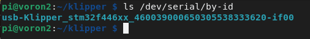

# Spider Klipper Firmware

The firmware installation process for the Fysetc Spider MCU.

## Prerequisites

* Klipper must be installed onto the Raspberry Pi
* It is desirable, though not strictly necessary to have a small sdcard available
* Even if you intend to power your Pi with the Spider, during this flashing process, you will find it far more convenient to power your Pi from some other source, such as a regular USB power supply
* Voron Design recommends using USB to control the Spider, which simply requires connecting a USB-A to USB-C cable between the Spider and Pi.  If you prefer a UART connection, please consult the fysetc documentation for the necessary configuration adjustments.

## Build Firmware Image

1. Login to the Raspberry Pi via ssh
2. Run the following:

   ```bash
   sudo apt install make
   cd ~/klipper
   make clean
   make menuconfig
   ```

3. In the menu structure there are a number of items to be selected.

    * Select "Enable extra low-level configuration options"
    * Set the micro-controller architecture is set to `STMicroelectronics STM32`
    * Set the Processor model to `STM32F446`
    * If your Spider was made after `2021/06/23` (this includes every V2.2), set the Bootloader offset to `32KiB bootloader` 
    * If your Spider was made prior to  `2021/06/23`, set the Bootloader offset to `64KiB bootloader`
    * Set the Clock Reference to `12 MHz crystal`
    * Set the Communication interface to `USB (on PA11/PA12)`  (note: see Fysetc documentation if you intend to use UART rather than USB)

   

4. Once the configuration is selected, press `q` to exit, and "Yes" when  asked to save the configuration.
5. Run the command `make`
6. The `make` command, when completed, creates a firmware file **klipper.bin** which is stored in the folder `/home/pi/klipper/out`.  

There are multiple options for getting this firmware file installed onto your Spider.

## Firmware Installation

### Option 1: DFU Firmware Install

* Requires a USB connection
* Requires the installation of an extra jumper on the Spider
* Does NOT require a microSD card

1. Power off the Spider
2. Install a jumper between BT0 and 3.3V
3. Connect Spider & Pi via USB
4. Power on Spider
5. From your ssh session, run `cd ~/klipper` to make sure you are in the correct directory
6. Run `lsusb`. and find the ID of the DFU device.
7. Run `make flash FLASH_DEVICE=1234:5678`, replacing 1234:5678 with the ID from the previous step
8. Power off the Spider
9. Remove the jumper from BT0/3.3V
10. Power up the Spider
11. You can confirm that the flash was successful by running `ls /dev/serial/by-id`. If the flash was successful, this should now show a klipper device, similar to:

    

    (note: this test is not applicable if the firmware was compiled for UART, rather than USB)

### Option 2: SDcard Firmware Install

* Works regardless of USB vs UART
* Requires a microSD card

1. Use a tool such as cyberduck or winscp to copy the klipper.bin file off your Pi, onto your computer.
  
    

2. Rename **klipper.bin** to **firmware.bin**

    **Important:** If the file is not renamed, the bootloader will not be updated properly.

3. Ensure that your microSD card is formatted FAT32 (NOT exFAT!)
4. Copy **firmware.bin** onto the microSD card  (if this card has previously been used for this process, remove all old firmware.bin and old .bin files)
5. Power down the Spider
6. insert the microSD card
7. Power on the Spider
8. After a few seconds, the Spider should be flashed
9. You can confirm that the flash was successful by running `ls /dev/serial/by-id`. If the flash was successful, this should now show a klipper device, similar to:

    

    (note: this test is not applicable if the firmware was compiled for UART, rather than USB)

**Important:** If the Spider is not powered with 12-24V, Klipper will be unable to communicate with the TMC drivers via UART and the Spider will automatically shut down.

# Firmware Updates
It is a normal and expected behavior, that updating klipper (on the pi) will sometimes also require you to update the klipper firmware on the Spider. Klipper will not do this for you automatically.  One option is to simply repeating the full flashing process as seen above.  However, this is often inconvenient, since it requires physical access to the MCU.

{: .note }
The technique shown below only applies to updating an mcu which is already running klipper firmware.  It cannot be used for new installs

Instead, you can update the Spider using a slight variation of the  DFU flashing technique shown above

1. build the firmware, as shown above
2. Determine the full ID of your MCU, either from printer.cfg, or from the command `ls /dev/serial/by-id/*`.  It should look something like `/dev/serial/by-id/usb-Klipper_stm32f446xx_1D0004001050563046363120-if00`
3. run  the commands:
```bash
sudo service klipper stop
cd ~/klipper
make flash FLASH_DEVICE=<insert serial id here>
sudo service klipper start
```
so, with our example serial ID, the 3rd line would look like: `make flash FLASH_DEVICE=/dev/serial/by-id/usb-Klipper_stm32f446xx_1D0004001050563046363120-if00`

---

### Back to [Software Installation](./index.md#klipper-octoprint-configuration)
