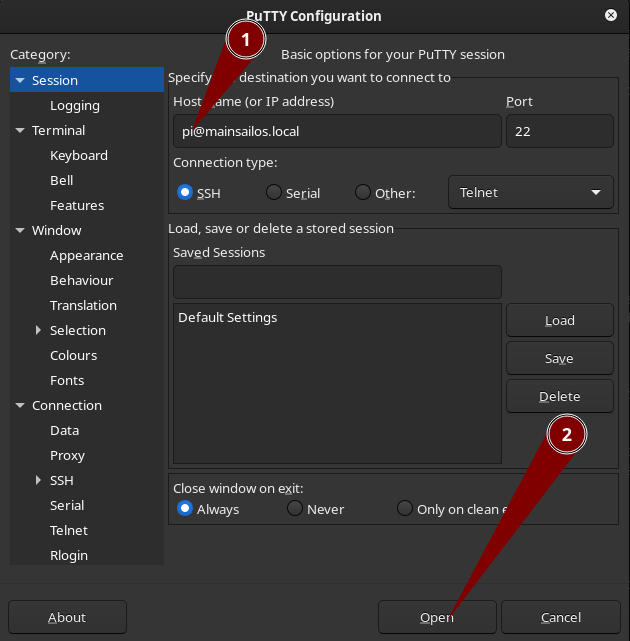
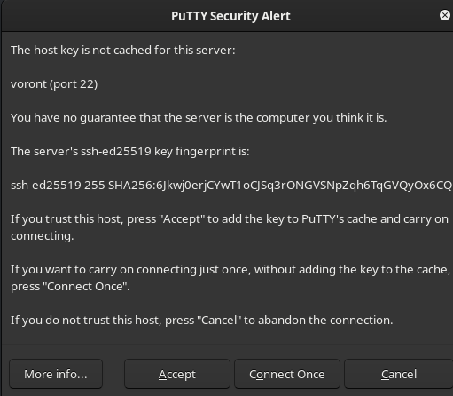
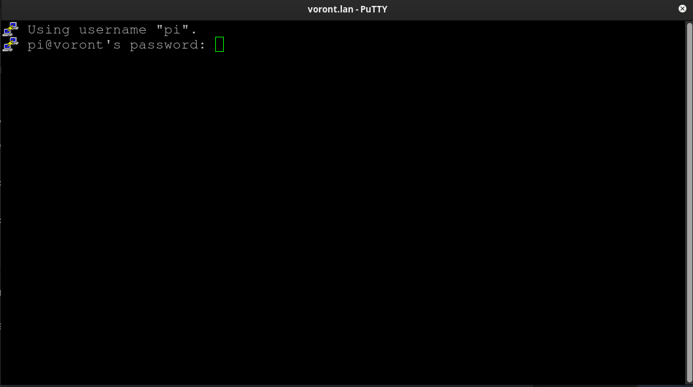
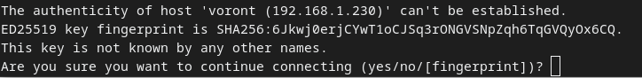

# Using the linux terminal & ssh

Setting up klipper requires a bit of work to be done from the linux terminal.  For some, this is trivial.  For others, this is a completely new experience. If you're in the second group, this guide will give you some of the basics:  by no means is it comprehensive, but it will try to hit the bits you're most likely to need to get klipper up and running

* Linux in general uses the command line (aka, "the terminal" ) for management much more than windows or mac do.  This is all the more true on our printers, where we generally don't want the extra overhead of running a full desktop.  This means that most navigation is text based: keyboard, arrow keys, etc.  The mouse isn't very involved.

* For the most part, this guide assumes you will be connecting via ssh: a network tool which lets you securely control the linux device over the network.  However, a very similar terminal can also be accessed by directly connecting a keyboard and screen. This can be very useful when, for example, dealing with a network problem that prevents you from using ssh.

{: .note}
Pretty much every Single Board Computer has an hdmi port.  However, on some models (Notably the Pi4, and Pi0) it's a micro-hdmi port.  If you have one of these models, it's worth taking note of this, and acquiring a suitable adapter:  if you ever need it, you probably aren't going to want to wait to acquire one.

* ssh is a suite of tools widely used in the linux world to remotely access machines, granting terminal access, transfering files, and providing many other advanced functions.  To do what we need to do here, we are barely scraping the surface of what ssh is capable of.

## ssh

### finding the pi

To connect to a Pi over the network, you need 3 pieces of information:

1. Your username on the pi. You may have set this during the flashing step.  If not, it likely defaulted to `pi`
2. Your password:  You  should already know this: you set this during the flashing step.

    {: .note }
    On old Raspberry pi systems, the default password was  "raspberry".  Modern installs wisely discourage this

3. A hostname or IP Address.

Hopefully, mdns is working on your network, and you can simply use the ".local" address.  If you set a hostname for your device via pi imager, the hostname will be  `the_thing_you_set.local`  if you didn't, your device will likely be `raspberrypi.local` or `mainsailos.local`  If none of these options work, you may need to locate the pi by IP address.  see [Finding a Device's IP Address](#finding-a-devices-ip-address )

### ssh tools

#### putty

Putty is a windows ssh client with a long history.  It is a free download [here](https://www.chiark.greenend.org.uk/~sgtatham/putty/latest.html).

To connect with putty:
1. Open Putty
1. Enter your username and hostname in the "hostname" field, in the format `<user>@<host>`, for example `pi@mainsailos.local`
1. Press the "Open" button

1. Since this is your first time connecting to this remote machine, you will find yourself facing security warning.  It should be safe to just click accept.
 
1. You will then find yourself with a black window and a password prompt.  Type your password, and press enter.  It is normal for nothing to appear on the screen while you are typing the password. (Linux applications traditionally hide passwords *completely* rather than the more familiar dots or stars)
 

#### MacOS command line

1. Open the Mac OS "terminal" app  (Utilities->Terminal)
1. type a command in the format `ssh <user>@<host>`, substituting your username and hostname from your pi:  for example `ssh pi@mainsailos.local`, and press enter.
1. You will then be presented with a security warning regarding an unrecognized security key.  It should be safe to simply accept this by typing  "yes" and press enter.
 
1. You will then be prompted for your password.  Type your password, and press enter.   It is normal for nothing to appear on the screen while you are typing. (Linux applications traditionally hide passwords *completely* rather than the more familiar dots or stars)

#### Windows command line

1. Open the windows command line: Press the windows key, type "cmd" and press enter
1. type a command in the format `ssh <user>@<host>`, substituting your username and hostname from your pi:  for example `ssh pi@mainsailos.local`, and press enter.
1. You will then be presented with a security warning regarding an unrecognized security key.  It should be safe to simply accept this by typing  "yes" and press enter.
 
1. You will then be prompted for your password.  Type your password, and press enter.   It is normal for nothing to appear on the screen while you are typing. (Linux applications traditionally hide passwords *completely* rather than the more familiar dots or stars)

## the terminal

Congratulations!  If you've gotten here, you should have crossed the first major hurdle: you've gotten yourself connected to the pi.

Now let's look around a little. The basic work flow here, is that everything scrolls up the screen, so whatever is at the bottom is the most recent interaction.  Consider the following screenshot:


1. We received our initial prompt `shifting@voront:~ $` . This is a very information-dense prompt, but let's not worry about it too much for now.  For now, it simply tells us that the machine is ready to receive our next instruction.  We then typed the command `ls`, and pressed enter.
2. The pi responded with the listing of files in our current directory
3. When the command finished, we were given a new prompt, ready for the next instruction.

### ls

* `ls`  ("list") is used to list the files and directories in a given location.  By default, it shows just the name of each item in the current directory.
* `ls <some_dir_name>` will list the files in the named directory, instead of the current one
* `ls -l` will include additional information, including file size, and ownership
* `ls -h` will convert numerical information to a more readable form. commonly combined with -l, to get file sizes in a more readable form
* arguments can be chained together.  for example `ls -lh klipper` will list off all the files in the "klipper" directory, and include the extended information, with the numbers in a readable format
* ls has many, many other options, but these couple should be enough to get started


### cd

* `cd` ("change directory") is used to change your "working directory" basically, this is the equivelent of browsing to a different folder in Windows Explorer or Mac Finder
* `cd` will return you to a special location: your home directory. (more on what that means later)
* `cd <some_dir_name>` will change your working directory to the named directory
* `cd ..` will move up one level, into the parent directory


1. We start out in a certain directory ("/"), and run "ls" to see what it contains
2. Noting a directory called "home", we decide to change into it with the cd command
3. we land in "home".  Note how the command prompt changes to tell us where we are.

### cp & mv

* `cp` ("copy") makes a duplicate of a file.   `cp <original_name> <new_name>`
* `mv` ("move") moves a file to a new filename or a new directory  `mv <original_file> <new_name>`
* in both cases, the second command could be either a new file name, OR a new directory name.  for example, `cp 1.txt 2.txt` will make a duplicate file named `2.txt``, in the current working directory.  whereas mv 1.txt klipper/ would  create the new copy, *still called 1.txt*, in the directory "klipper".

### nano

* nano is a simple text editor that is available on virtually every possible system.  It comes in handy if you ever need to solve a problem which is preventing Mainsail/Fluidd from editing configs, or when you need to edit things outside of the limited scope that the Mainsail & Fluidd editors allow access.
* you start the editor with `nano <file>`, so, for example to edit the printer.cfg, one might issue the command `nano ~/printer_data/config/printer.cfg`
* once in nano, remember you still don't have a mouse, so all navigation is by keyboard:  Page up & Page down are your friends!
* Note the list of controls across the bottom:  `^` meaning the ctrl key, so, for example `ctrl-o` is Write Out (aka Save), and `ctrl-x` is Exit.
* when you go to save, nano will always ask what file to write to: It defaults to the file you're editing, so assuming you're just wanting to save, just press enter.


### sudo

* sudo (superuser do) allows you to execute commands as the system administrator (known as "root") when necessary.
* sudo will sometimes ask for your password:  note, this is the password of the normal account, *not* some other administrator password
* This tool is often needed to edit a file in `/etc` or `/boot` that normal users don't have access to.  For example, several common processes require edits in the file `/boot/config.txt`.  This file is only editable by root.  so if you try to just open it normally with nano `nano /boot/config.txt`, you'll just get an error:  file is unwritable.  Instead, you can use sudo:  `sudo nano /boot/config.txt`, and then you'll be able to edit normally.


### more

* more is used to page through a text file, but not edit it.  This is most often useful when reviewing log files, for example `more ~/printer_data/logs/klippy.log`.  Note that more starts at the top of the file, which, in a log is the oldest information, and as you scroll through, the info gets newer.

### tail

* tail just shows the last bit of a file, such as the most recent few lines in a log file:  `tail ~/printer_data/logs/klippy.log`
* tail also has a very useful "follow" function.  in this mode, it will show you the last few lines, and then wait, and show new entries as they appear:  `tail -f ~/printer_data/logs/klippy.log`.  (press ctrl-c when you're done and want back to the command prompt)

### copy/paste

* Windows:  both putty and windows command line support a slightly obscure form of copy/paste.  Anything you highlight in the putty/cmd window automatically gets copied to the clipboard, and any time you right click, it pastes.

* Mac: ⌘ + C / ⌘ + V should work pretty much normally

## The filesystem

The filesystem is laid out a little differently than you may be familiar with on other systems.  Everything is organized in to a single "tree" structure, with the top level directory simply being called root or `/`. A typical root contains a handful of system folders: `etc`, `lib`, `boot`, `home`. Each of those may contain several other folders and many files comprising the entire operating system.


(note: the actual filesystem typically contains many more directories, this is just a simplified example)

When using a command like `cd`, there are different forms the directory name can take on. For our examples, it's either starting with a `/`, or starting blank.  When you start with a `/`, as in `cd /tmp` you are giving an *absolute* path, meaning that the path is expressed all the way from the root or `/` directory.  This means it will function exactly the same no matter where you are coming from.  
By contrast, `cd tmp` is a *relative* path meaning that it's starting from the current working directory. If we start out in `/home/pi`, `cd tmp` will navigate us to `/home/pi/tmp`.

### Tilde (~)

The Tilde or `~` symbol is short hand for "the user's home directory". Usually, this will be `/home/<username>`, e.g. `/home/pi`.

The user's home directory is oftentimes the current working directory when starting a session over SSH, where the user is the username you logged in with.

On most Klipper installs, the user's home directory will be the directory that contains most of the Klipper stuff:  Klipper, Mainsail, Moonraker, etc.

{: .note }
This trait of starting out in the home directory is important to remember when looking for things that are in the system root, such as `/etc` or `/boot`:  you need to go up to `/` before you're going to see them.

## remote file transfers

### FileZilla

FileZilla is a simple, user friendly file transfer tool. It is available for Windows, MacOS and Linux through the [FileZilla website](https://filezilla-project.org/)

To get started with FileZilla, simply fill in the host as `sftp://<hostname>` (e.g. `sftp://mainsailos`), the username and the password; then click "quickconnect"

The files on your computer are displayed on the left, while the files on your Voron are displayed on the right You can drag and drop files between them to transfer from and to either side.

Note that you are just the user here, so you will not be able to directly write files to `/boot` or `/etc` that require root or sudo permissions.


### WinSCP

WinSCP is a simple and user friendly tool for transfering files over SCP, a protocol that uses SSH for transfering files.

We suggest to configure [Putty](#putty) first, as WinSCP can make use of Putty's credentials for connecting to your Voron. To import Putty credentials into WinSCP, select Import Sites under the Tools menu.


To get started with WinSCP, select an existing site entry or create a new one using New Site. Click Login to connect.

The files on your computer are displayed on the left, while the files on your Voron are displayed on the right You can drag and drop files between them to transfer from and to either side.

Note that you are just the user here, so you will not be able to directly write files to `/boot` or `/etc` that require root or sudo permissions.

## other tips & tricks

```text
@@@@@@@@@@@@@@@@@@@@@@@@@@@@@@@@@@@@@@@@@@@@@@@@@@@@@@@@@@@@
@ WARNING: REMOTE HOST IDENTIFICATION HAS CHANGED! @
@@@@@@@@@@@@@@@@@@@@@@@@@@@@@@@@@@@@@@@@@@@@@@@@@@@@@@@@@@@@
IT IS POSSIBLE THAT SOMEONE IS DOING SOMETHING NASTY!
Someone could be eavesdropping on you right now (man-in-the-middle attack)!
It is also possible that a host key has just been changed.
The fingerprint for the RSA key sent by the remote host is x.
Please contact your system administrator.
Add correct host key in /ua/username/.ssh/known_hosts to get rid of this message.
Offending RSA key in /ua/username/.ssh/known_hosts:5
RSA host key for mainsailos.local has changed and you have requested strict checking.
Host key verification failed.
```

In certain circumstances (mostly involving re-imaging your pi), you may encounter this rather intimidating message.
If you don't think anything should have changed, its worth checking that you're actually trying to connect to the device you meant to connect to.
If you know that it makes sense your pi's ID has changed, such as the pi being a new setup, it is safe to resolve this by simply deleting the old, conflicting key off your computer.

`ssh-keygen -R <hostname>` will take care of this.  for example, if your pi is `mainsailos.local`, you would do `ssh-keygen -R mainsailos.local`

### Finding a device's IP Address

* if your pi is accessible via `mainsailos.local` or `raspberrypi.local`, don't worry about it too much.  You can (and should) just use that hostname everywhere. If you ever do need to get the ip, open a command prompt (pc) /terminal (mac) and type `ping <hostname>`, eg: `ping mainsailos.local`.  this will get you the IP.
* If you have access to your network router, you may also be able to look in it's DHCP settings, and see what IP address your pi has been given
* Failing the approaches above, "Angry IP Scanner" should be able to locate the pi on your network:
  
  * download Angry IP scanner from [here](https://angryip.org/)
  * install & run it
  * Go to `Tools->Fetchers`.  Select the "MAC Vendor"(1) fetcher, and press the left arrow(2) to activate it.  press okay(3)

    

  * Go to `Settings`, and change to the `Display`(1) tab.  Set `Display in the results list` to `Alive hosts`(2).  press okay (3)

     

  * Press "Start"
  * Once the scan finishes, look for a result with a MAC Vendor similar to "Raspberry Pi Trading"

     

### Static IP's

On most networks, IP addresses are handed out by DHCP: "Dynamic Host Configuration Protocol"  This means the device's IP may occasionally change.  If you're accessing the device via host name, this doesn't matter:  the hostname should follow it.  But if you're accessing it by IP directly, this is quite inconvenient.  
There are two basic approaches to solving this problem:

1. The better solution, where possible, is to use an "IP Reservation" feature on your DHCP server (your network router). This allows you to tell the router "whenever you see this device, always give it the same IP address." Not all routers have this feature.

2. The second solution is to configure the Pi to use a static IP, removing it from the DHCP system entirely. To do this, determine an unused and free IP address. Configure the other settings to use on your network. Since this can sometimes be quite an involved process, it's beyond the scope of this quick little guide. However, there are a wide variety of guides to be found online.
