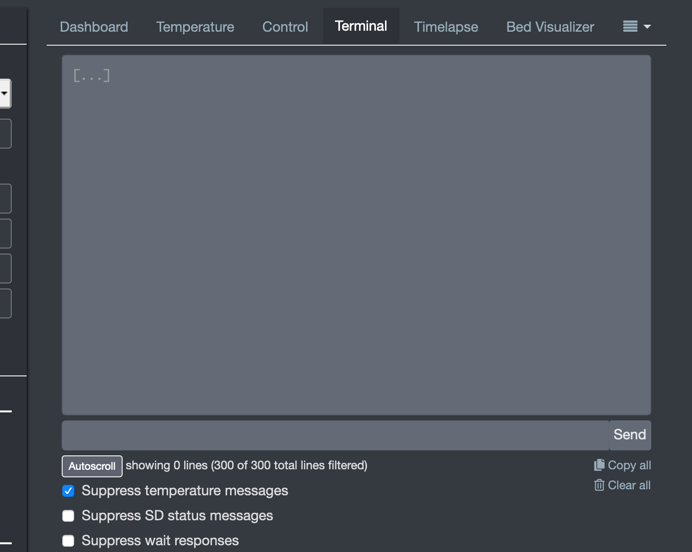
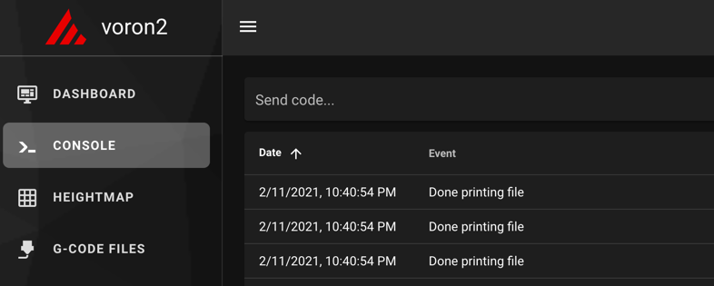
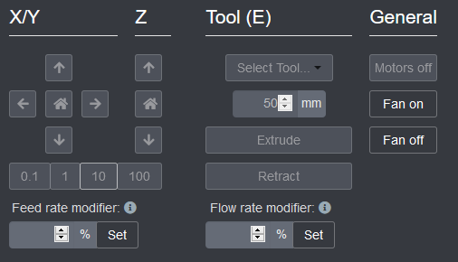
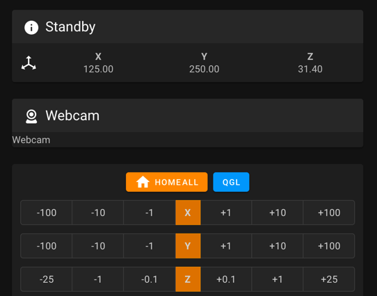
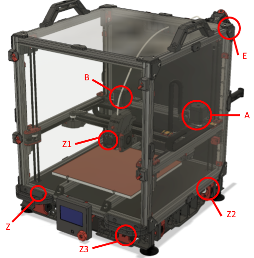
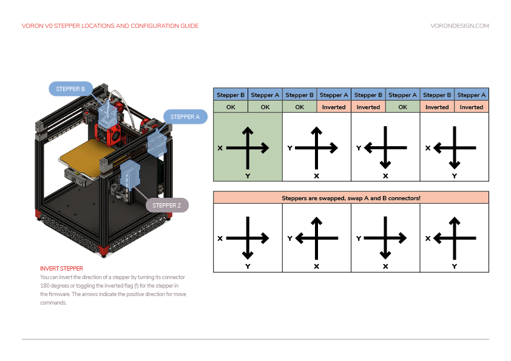
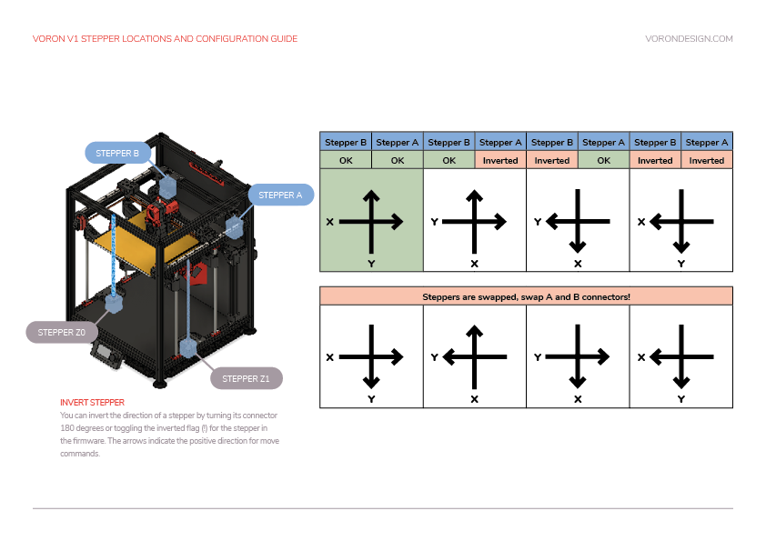
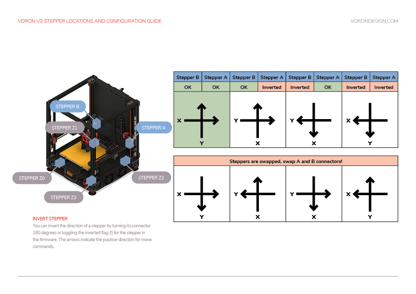
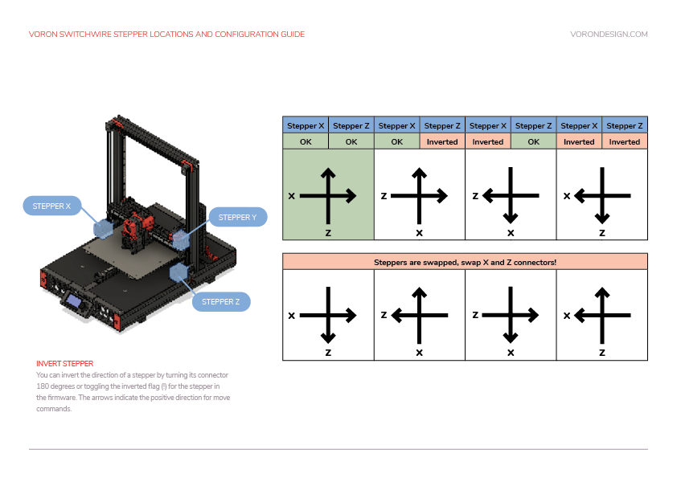

# Initial Startup Checks

_This guide is written as OctoPrint specific and will be updated over time to also acommodate Mainsail._

Any time commands are requested to be issued, those will happen in the 'Terminal' tab of the OctoPrint, Mainsail, or Fluidd web UI, in the box for entering commands directly.





Any time movements need to be made, those will happen in the 'Control' tab / section of the Octoprint, Mainsail, or Fluidd web UI. The numbers underneath X, Y, and Z control the movement distance.





## Stepper Motor Check

To verify that each stepper motor is operating correctly, send the following command in the terminal:

`STEPPER_BUZZ STEPPER=stepper_x`

Run this command for each of the motors:

### V0, SW
* stepper_x
* stepper_y
* stepper_z
* extruder

### V1, Legacy
* stepper_x
* stepper_y
* stepper_z
* stepper_z1 
* extruder

### Trident
* stepper_x
* stepper_y
* stepper_z
* stepper_z1 
* stepper_z2 
* extruder

### V2
* stepper_x
* stepper_y
* stepper_z
* stepper_z1   
* stepper_z2   
* stepper_z3   
* extruder

This command will move each motor UP first and then DOWN 3 times, one second apart.  If the steppers do not move or make strange noises, check the wiring.  Be sure to watch the Z motion to ensure the direction is correct.  If the Z motor(s) do not move in the correct directions, invert the DIR pin on the printer configuration.

#### V2 motor positions (Others may vary)



## Endstop Check

Make sure that none of the X, Y, or Z endstops are being pressed.  Then send a `QUERY_ENDSTOPS` command.  The terminal window should respond with the following:

```
Send: QUERY_ENDSTOPS
Recv: x:open y:open z:open
```

If any of them say "triggered" instead of "open", double-check to make sure none of them are pressed.  Next, manually press the X endstop switch, send the `QUERY_ENDSTOPS` command again, and make sure that the X enstop says "triggered and the Y and Z endstops stay open.  Repeat with the Y and Z endstops.

If it is found that one of the endstops has inverted login (i.e. it reads as "open" when it is pressed and "triggered" when not pressed), go into the printer configuration file (typically printer.cfg) and add or remove the ! in front of the pin identifier. For example, if the X endstop was inverted, add a ! in front of the pin number as follows:

`endstop_pin: P1.28` -> `endstop_pin: !P1.28`

## XY Homing Check

At this point everything is ready to home X and Y.

**Important:** You need to be able to quickly stop the printer in case something goes wrong (e.g. the tool head goes the wrong direction).  There are a few ways of doing this:

1. Use the E-stop button on the display (if installed).  On the Mini12864 it is the small button underneath the main control knob.  Test the button and see what happens -  Klipper should shut down. Raspberry Pi and OctoPrint/Mainsail/Fluidd should still be running but disconnected from Klipper.  Press "Connect" in the upper left corner of OctoPrint, then in the Octoprint terminal window send a `FIRMWARE_RESTART` to get the printer back up and running.
2. Have a computer right next to the printer with the `RESTART` or `M112` command already in the terminal command line in OctoPrint.  When you start homing the printer, if it goes in the wrong direction, quickly send the restart command and it will stop the printer.
3. As a "nuclear" option, power off the printer with the power switch if something goes wrong.  This is not ideal because it may corrupt the files on the SD card and to recover would require reinstalling everything from scratch.

Once there is a _tested_ process for stopping the printer in case of something going wrong, send a G28 X Y command. This will only home X and Y but not Z. The tool head should *move up slightly and then move to the right until it hits the X endstop, then move to the back of the printer until it hits the Y endstop. In a CoreXY configuration, both motors have to move in order to get the toolhead to go in only and X or Y direction (think Etch A Sketch). If the gantry moves downward first before moving to the right, you must reverse your z stepper directions in the config.

If the toolhead does not move in the expected or correct direction, refer to the table below to figure out how to correct it.  If you need to invert the direction of one of the motors, invert the direction pin definition (put a ! before the pin indentifier).  If the motors are going in directions that match the lower row, swap your X and Y (A and B) motor connectors on the MCU.

* [stepper x] = Motor B
* [stepper y] = Motor A

## Motor Configuration Guides

### V0:



### V1, Legacy:



### V2:



### SW:



**Important:** Do not unplug or re-plug motors from MCUs without powering down the printer.  Damage to MCU may result.

## Bed locating (V2)

The print bed location of the V2 is much more adjustable than on any of the other models.  Before the 0,0 point and Z endstop locations are set, the physical locations of the Z endstop and print bed need to be finalized.

The Z endstop should be located at max Y position.  Home X and Y with `G28 X Y`  and then traverse just X to locate a Z endstop position at the maximum Y travel that will still trigger the endstop.  Lock down the Z endstop at that position.

Once the Z endstop is fixed into position the base plate should be adjusted so that the Z endstop pin is approximately 2-3mm from the aluminum base plate.  The base plate should be measured on each side to ensure it is centered and level / even with the front edge of the frame.  If in that process the extrusions the base is mounted on have to be moved, double-check the Z endstop to confirm it can still be reached. When tightening the mounting screws for the bed, a good practice is to have one screw tight, 2 firm, and the last one loose (best done hot).

## Bed locating (V1, Trident, Legacy)

Before the 0,0 point and Z endstop locations are set, the physical locations of the Z endstop and print bed need to be finalized.

The Z endstop should be located at close to max X position.  Home X and Y with `G28 X Y`  and then traverse just Y to locate a Z endstop position at the maximum X travel that will still trigger the endstop.  Lock down the Z endstop at that position.

Once the Z endstop is fixed into position the base plate should be adjusted so that the Z endstop pin is approximately 2-3mm from the aluminum base plate.

## Define 0,0 Point (V0, V1, Trident, V2, Legacy)

The homing position is not at the typical location of 0,0 but at the maximum travel location.  The actual numbers vary by printer build size.

Depending on bed location, the positional parameters may need to be adjusted to re-locate the 0,0 point.

1. Start by re-running `G28 X Y` to home X and Y.  After this, the nozzle will be at the maximum X,Y as defined by *position_max* under *[stepper_x]* and *[stepper_y]*. 
2. Using the OctoPrint or Mainsail controls, move the nozzle to the front left corner of the bed.
3. If the from left corner of the bed cannot be reached within 3-5mm, the bed location needs to be physically adjusted (if possible). Move the bed on the extrusions or move the extrusions to get the bed location within range.
	* For V2, Make sure whatever bed position results still allows the nozzle to reach the Z endstop switch (See 'Bed Locating').
	* If questionable, turn off motors and attempt to move the gantry by hand to see if the front left corner can physically be reached by the nozzle.
4. Once the nozzle is close to the front left corner of the bed but still on the bed, send an `M114` command to retrieve the current location.
	* *Note: Due to other tolerances, it is usually not recommended to have the 0,0 exactly on the corner of the bed or build surface. Spec bed sizes are always slightly larger than the defined print volume so print volume loss will be minimal.*

If X and Y offsets are less than 1mm and 0,0 is over the bed, nothing needs to be changed.

If X and Y offsets are within 5mm or 0,0 is past the bed, the *postition_max* values should be adjusted to change where the 0,0 point is computed.  If the 0,0 is over the bed, the distance from the home point to the front left (*position_max*) must be increased.  If the 0,0 is past the bed, the distance must be decreased. The amount is determined by the output of the `M114` command. Update *position_max* and *endstop_position* for both *[stepper_x]* and *[stepper_y]* as follows:

* For X: New = Current - Get Position X (M114) Result
* For Y: New = Current - Get Position Y (M114) Result

*If the Z endstop pin location has been previously defined, be sure to re-follow the process to set the Z endstop pin location (if applicable).*

If anything is updated in the printer configuration file, save the file and restart Klipper using `FIRMWARE_RESTART`.

## Z Endstop Pin Location (V1, Trident, V2, Legacy)

* Start by re-running `G28 X Y` to home X and Y.
* Using the software controls, move the nozzle until it is directly over the Z endstop switch.
* Send an `M114` command and record the X and Y values.
* Update the homing routing in the printer configuration file under *[homing_override]* or *[safe\_z\_home]* with those values.
* Restart Klipper with `FIRMWARE_RESTART`. 
* Run a full `G28` and make sure that the printer properly homes X, Y, and Z.  

## Inductive Probe Check (V1, Trident, V2, Switchwire, Legacy)

### Probe Testing

With the toolhead in the center of the bed, reconfirm that the probe is working correctly.

When it is far from the bed, `QUERY_PROBE` should return “open”. When a metal object is close to the probe, `QUERY_PROBE` should return “triggered”. If the signal is inverted, add a “!” In front of the pin definition (ie, pin: ! z:P1.24).

Slowly reduce your Z height and run `QUERY_PROBE` each time until `QUERY_PROBE` returns “triggered” - make sure the nozzle is not touching the print surface (and has clearance). 

### Probe Accuracy Check

With the bed and hotend cold (for now), move the probe to the center of the bed and run `PROBE_ACCURACY`. It will probe the bed 10 times in a row and output a standard deviation value at the end. Make sure that the sensed distance is not trending (gradually decreasing or increasing over the 10 probes) and that the standard deviation is less than 0.003mm.

Example of unstable `PROBE_ACCURACY` (trending downward during warm up).

```
Send: PROBE_ACCURACY
Recv: // PROBE_ACCURACY at X:125.000 Y:125.000 Z:7.173 (samples=10 retract=2.000 speed=2.0
Send: M105
Recv: // probe at 125.000,125.000 is z=4.975000
Recv: // probe at 125.000,125.000 is z=4.960000
Recv: // probe at 125.000,125.000 is z=4.955000
Recv: // probe at 125.000,125.000 is z=4.952500
Recv: // probe at 125.000,125.000 is z=4.950000
Recv: // probe at 125.000,125.000 is z=4.947500
Recv: // probe at 125.000,125.000 is z=4.942500
Recv: // probe at 125.000,125.000 is z=4.937500
Recv: // probe at 125.000,125.000 is z=4.937500
Recv: // probe at 125.000,125.000 is z=4.932500
Recv: // probe accuracy results: maximum 4.975000, minimum 4.932500, range 0.042500, average 4.949000, median 4.948750,
standard deviation 0.011948
```

## PID Tune Bed & Hotend

The PID tune is important for tuning the printer for a given hardware configuration to ensure that temperatures can remain as stable as possible during operation.

### PID Tune Heated Bed

Move nozzle to the center of the bed and approximately 5-10mm above the bed surface, then run: 

`PID_CALIBRATE HEATER=heater_bed TARGET=100`

It will perform a PID calibration routine that will last about 10 minutes. Once it is finished, type `SAVE_CONFIG` which will save the parameters into your configuration file.

### PID Tune Hotend

Set the part cooling fans to 25% (`M106 S64`) and then run: 

`PID_CALIBRATE HEATER=extruder TARGET=245`

It will perform a PID calibration routine that will last about 5 minutes. Once it is finished, type `SAVE_CONFIG` which will save the parameters into your configuration file.

## Bed Leveling

Depending on the printer type and capability, the following command(s) are used:

* V0: `BED_SCREWS_ADJUST`
* V1, SW, Legacy: `Z_TILT_ADJUST`, `SCREWS_TILT_CALCULATE`
* V2: `QUAD_GANTRY_LEVEL`

### Bed Screws (V0)

The V0 uses manual bed leveling, the bed is small enough and thick enough that a mesh or other types of per print leveling are not needed. there is a Macro in Klipper to help with the manual bed leveling process

`BED_SCREWS_ADJUST`

This tool will move the printer's nozzle to each screw XY location and then move the nozzle to a Z=0.3 height. At this point one can use the "paper test" to adjust the bed screw directly under the nozzle. See the information described in "the paper test", but adjust the bed screw instead of commanding the nozzle to different heights. Adjust the bed screw until there is a small amount of friction when pushing the paper back and forth. this process will move all three mounting points of your bed closer to the nozzle so it is critical that you re-run the Z offset adjust after completing this section.

Once the screw is adjusted so that a small amount of friction is felt, run either the `ACCEPT` or `ADJUSTED` command. Use the `ADJUSTED` command if the bed screw needed an adjustment (typically anything more than about 1/8th of a turn of the screw). Use the `ACCEPT` command if no significant adjustment is necessary. Both commands will cause the tool to proceed to the next screw. (When an `ADJUSTED` command is used, the tool will schedule an additional cycle of bed screw adjustments; the tool completes successfully when all bed screws are verified to not require any significant adjustments.) One can use the `ABORT` command to exit the tool early.

After the `BED_SCREWS_ADJUST` command has been completed rerun the `Z_ENDSTOP_CALIBRATE` command to to bring your nozzle to the correct Z=0 position.

### Bed Tilt (V1, Legacy)

The V1 and Legacy use a combination of automated and manual bed leveling.  There are two macros built into Klipper to assist with the function.

First run the `BED_TILT` macro.  This will go back and forth between the predefined points to level the two Z motors.  This setting is dynamically changed and nothing will need to be saved.

Second run the `SCREWS_TILT_CALCULATE` macro.  It will check the 3 positions defined in the _[screws\_tilt\_adjust section]_ of printer.cfg for level, then return how much to adjust the front thumbscrew by.  Re-run the process at least one more time to verify the adjustment.

After both processes have been completed rerun the `Z_ENDSTOP_CALIBRATE` command to to bring your nozzle to the correct Z=0 position.

### Z Tilt (Trident)

The Trident uses automated bed leveling using 3 motors.  There is a macro `Z_TILT_ADJUST` built into Klipper for that function. It is very similar to the QUAD_GANTRY_LEVEL used by V2, but supports 3 or more motors. Run the `Z_TILT_ADJUST` and it will probe each of the 3 points 3 times, average the readins, then make adjustments until the grantry is level.

After that process has been completed rerun the `Z_ENDSTOP_CALIBRATE` command to to bring your nozzle to the correct Z=0 position.

### Quad Gantry Level (V2)

Since the V2 uses 4 independent Z motors, the entire gantry system must be specially levelled.  The macro to call this process is `QUAD_GANTRY_LEVEL` (sometimes referred to in conversation as 'QGL').  It will probe each of 4 points 3 times, average the readings, then make adjustments until the gantry is level.

If the process fails due to an “_out of bounds_” error, disable your stepper motors and slowly move your gantry or bed by hand until it is approximately flat. Re-home your printer (`G28`) and then rerun the sequence. You may have to run it more than once.  Make sure that the adjustment value for each stepper motor converges to 0. If it diverges, check to make sure you have your stepper motors wired to the correct stepper driver (check documentation).

### Tilt / QGL With Heated Bed and Chamber (V1, Trident, V2)

Run a `G28` command to home the printer since a `SAVE_CONFIG` restarts the printer.

This will be the first time that a Quad Gantry Level has been run at a high chamber temperature.  To ensure that the probe has stabilized with the heated bed at 100C and the hot end at 240C, run `PROBE_ACCURACY` with the nozzle at the center of the bed.  If the values are trending (increasing or decreasing) throughout the 10 probes or the standard deviation is greater than 0.003mm, wait another 5 minutes and try again.

Once the readings are stable, run `Z_TILT_ADJUST` or `QUAD_GANTRY_LEVEL`.  Make a note of how long the probe readings took to stabilize for when starting prints - typically a cold printer takes 10-20 minutes to stabilize at temperature.

#### Common QGL Problems

* If the QGL is having issues with too high of a standard deviation and the printer is heated and stable, check Z belt tension.  Make sure they are reasonably tight and even.
* If QGL fails with being unable to reach the probe in time, do a `FIRMWARE_RESTART`, manually level the bed as closely as possible, then home (`G28`) and re-attempt.

### Bed Mesh Only (Switchwire)

Crazy things.  More to come.

## Z Offset Adjustment

If you did not run PID tuning, set your extruder to 245C and heated bed to 100C and let the printer heat up for at least 15 minutes.

### Initial / Simple Process

Preparation

* **V1:** Run a `G28`, and then a `Z_TILT_ADJUST`, and then another `G28`.
* **V2:** Run a `G28`, and then a `QUAD_GANTRY_LEVEL`, and then another `G28`.
* **All others:**  Run a `G28`.
* Move the nozzle to the center of the bed if it is not already.
* Clear any stored bed meshes with `BED_MESH_CLEAR`

Run `Z_ENDSTOP_CALIBRATE`

Slowly move the nozzle toward the bed by using `TESTZ Z=-1`
Until the nozzle is relatively close to the bed, and then stepping down with `TESTZ Z=-0.1`
Until the nozzle touches a piece of paper on top of the build plate. If you go far down, you can move the nozzle back up with: `TESTZ Z=0.1`
Once you are satisfied with the nozzle height, run `ACCEPT` and then `SAVE_CONFIG`.

**Important:** Klipper assumes that this process is being done cold.  If being performed hot, do an additional `TESTZ Z=-0.1` before accepting.

If an "out of bounds" error occurs, send `Z_ENDSTOP_CALIBRATE`, `ACCEPT`, and then `SAVE_CONFIG`. This will redefine the 0 bed height so you will be able to get closer.

**V2:** If you get this error it likely means that the shaft for your Z Endstop is too long and may catch on the print head during a print. It is best to cut the shaft or raise the bed (with a washer, for instance) so that it is within 1mm of the build surface.

### Fine Tuning Z Height

#### With LCD Screen
The Z offset can be adjusted during a print using the Tune menu on the display, and the printer configuration can be updated with this new value. Remember that higher values for the position_endstop means that the nozzle will be closer to the bed.

#### Without LCD Screen
If you're running your printer headless, the Z height can still be adjusted on-the-fly using the web interface.  This is built into Mailsail and Fluidd, but requires some additional work for Octoprint.

1) (Optional) Create macros in your printer.cfg file so that the commands are easier to remember/run:

```ini
[gcode_macro ZUP]
gcode:
    SET_GCODE_OFFSET Z_ADJUST=0.01 MOVE=1

[gcode_macro ZDOWN]
gcode:
    SET_GCODE_OFFSET Z_ADJUST=-0.01 MOVE=1
```

2) Run ZUP or ZDOWN (or the associated `SET_GCODE_OFFSET` command) as needed in the terminal window until you have perfected your squish.
3) Run `GET_POSITION` and look for "gcode base". *Note the Z value*.

#### Saving your results
Update your `position_endstop` in your config file:

New Position = Old Position - Tune Adjustment *(e.g. New Position = Old Position - (-0.050) = Old Position + 0.050)*

> ### Community References
>
> [Z Endstop Configuration](../../community/howto/120decibell/z_endstop_configuration.html)
>

## Extruder Calibration (e-steps)

Before the first print,make sure that the extruder extrudes the correct amount of material.

* With the hotend at temperature, make a mark between your roll of filament and your extruder, between 120mm and 150mm away from the entrance to the extruder.  Measure the distance from the extrance of the extruder to that mark.
* In Octoprint / Mailsail, extrude 50mm 2 times (for a total of 100mm since Klipper doesn’t allow you to extrude more than 50mm at a time). 
* Measure from the entrance of your extruder to the mark you made previously. 
	* *In a perfect world, assuming the mark is at 120mm, it would measure 20mm (120mm - 20mm = 100mm), but usually won’t be.*
* Update rotation_distance in the extruder section of the configuration file using this formula:
	* New Config Value = Old Config Value * (Actual Extruded Amount/Target Extruded Amount)

*Note: a higher configuration value means that less filament is being extruded.*

Paste the new value into the configuration file, restart Klipper, and try again. Once the extrusion amount is within 0.5% of the target value (ie, 99.5-100.5mm for a target 100mm of extruded filament), the extruder is calibrated!

Typical rotation_distance values should be around 22.6789511 for Afterburner and Mobius (update gear_ratio to 80:20 for Mobius).

---
### Next: [Slicer Setup](../slicer/index.md)
