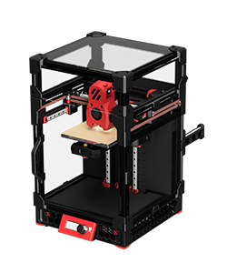
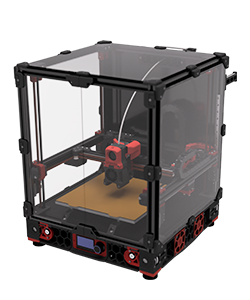
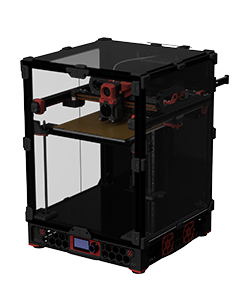
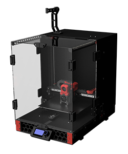

---

layout: default

title: Initial Startup

parent: The Build

nav_order: 5

---

<link  rel="stylesheet"  href="style.css">

# Please select your printer model to start
 

  <button type="button" class="btn btn-danger border margin-right3" onclick="location.href = './startup.html?model=v0&step=0';"> Voron V0</button>
  <button type="button" class="btn btn-danger border" onclick="location.href = './startup.html?model=v2&step=0';"> Voron V2</button>

  <button type="button" class="btn btn-danger margin-right3" onclick="location.href = './startup.html?model=v1&step=0';"> Voron V1/Trident</button>
  <button type="button" class="btn btn-danger" onclick="location.href = './startup.html?model=vsw&step=0';"> Voron Switchwire</button>

