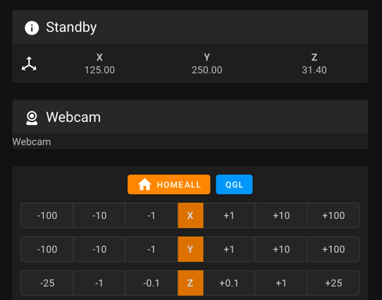

<!-- 

NOTES ON EDITING: 

The intial startup pages are not in order down here. The order does not matter and can be freely changed in buttons.js (see instructions there)
To add a page, simply copy the code below, put it at the bottom of the page and change the "CHANGE_ME" id to an unusued ID (refer to buttons.js PAGE ID section). If the page you are adding is printer specific, please locate the corresponding section and insert it there. The ID name does not matter but should be chosen somewhat on topic. Once done, refer to Buttons.js to add the page to the site. 

<div id="CHANGE_ME" class="defaulthide hide" markdown="1">
FILL IN YOUR CONTENT HERE IN MARKDOWN
</div>

-->


<!-- leave this stuff here alone :) -->
<link  rel="stylesheet"  href="style.css">
<script src="buttons.js"> </script>
<script src="https://ajax.googleapis.com/ajax/libs/jquery/3.6.3/jquery.min.js"></script>
<body onload="checkstatus(), testscript()">

<!-- progress bar -->
<div class="defaulthide" id="progressdiv">
<div class="progress">
  <div id="progressbar" class="progress-bar progress-bar-striped bg-danger progress-bar-animated" role="progressbar" style="width: 8.33333333333%" aria-valuenow="20" aria-valuemin="0" aria-valuemax="120">Step 1</div>
</div>
</div>

<!-- PAGES BEGIN -->

<!-- Options Selection -->
<div id="0" class="defaulthide hide" markdown="1">

# Welcome to the initial startup guide for Voron <span id="printermodel">MODEL</span>
Please follow each step closely and once ready, click the "I am done, let's move on" button.

### Select your webinterface
<div class="form-check">
  <input class="form-check-input" type="radio" name="flexRadioDefault" id="mainsailos" onchange="hideoctowarning()">
  <label class="form-check-label" for="mainsailos">
    Mainsail/Fluidd
  </label>
</div>

<div class="form-check">
  <input class="form-check-input" type="radio" name="flexRadioDefault" id="octoprint" onchange="showoctowarning()" >
  <label class="form-check-label" for="octoprint">
    Octoprint
  </label>
</div>

<div id="octowarning" class="defaulthide">
 <br>
<div class="alert alert-warning" role="alert"><i class="fa fa-warning"></i><b> Important:</b> Most users use Mainsail or Fluidd instead of Octoprint.<p>It might be hard to get support for your interface.</p></div>
</div>

<div id="ProbeSelect" class="defaulthide hide" markdown="1">

### Select your Probe

  <div class="form-check">
    <input class="form-check-input" type="radio" name="probeSelect" id="inductive">
    <label class="form-check-label" for="inductive">
      Stock Inductive probe (TL-Q5MC2 or similar)
    </label>
  </div>

  <div class="form-check">
    <input class="form-check-input" type="radio" name="probeSelect" id="dockable">
    <label class="form-check-label" for="dockable">
      Dockable Probe  (klicky and other similar probes) 
    </label>
  </div>

  <div class="form-check">
    <input class="form-check-input" type="radio" name="probeSelect" id="tap">
    <label class="form-check-label" for="tap">
      Tap
    </label>
  </div>
</div>

<button type="button" class="text-center btn btn-danger margin-right2 btn-spacing-mobile" id="button-start" onclick="start()">I am ready, let´s go</button>


</div> 


<!-- START OF CONTENT-->
<!-- Guide Information -->
<div id="info" class="defaulthide hide" markdown="1">


# Information regarding this guide
This guide provides a list of steps to help confirm the pin settings in the Klipper printer.cfg file.

During this guide, it may be necessary to make changes to the Klipper config file. Be sure to issue a ```RESTART``` command after every change to the config file to ensure that the change takes effect (type "restart" in the Octoprint or Mainsail terminal and then click "Send"). It's also a good idea to issue a ```STATUS```command after every ```RESTART``` to verify that the config file is successfully loaded.

Any time commands are requested to be issued, those will happen in the 'Terminal' or 'Console' tab of the OctoPrint, Mainsail, or Fluidd web UI, in the box for entering commands directly.

<div class="defaulthide octoprintclass" markdown="1">

</div>

  
<div class="defaulthide mainsailclass" markdown="1">

</div>

Any time movements need to be made, those will happen in the 'Control' tab / section of the Octoprint, Mainsail, or Fluidd web UI. The numbers underneath X, Y, and Z control the movement distance.

<div class="defaulthide mainsailclass" markdown="1">

</div>


<div class="defaulthide octoprintclass" markdown="1">

</div>
<br>


</div>
 
<!-- Verify your heaters -->
<div class="defaulthide hide" id="verifytemp" markdown="1">
## Verify Temperature 

{: .note }
If your heaters are still disconnected from the initial flashing process, it is now time to connect them.  Power down, 
connect your heaters, and power back up before continuing below.

Start by verifying that temperatures are being properly reported. Navigate to the Octoprint/Mainsail temperature graph.


Verify that the temperature of the nozzle and bed are present and **not increasing**. If it is increasing, remove power from the printer. If the temperatures are not accurate, review the `sensor_type` and `sensor_pin` settings for the extruder and/or bed.
<br>

<details markdown="1" markdown="1">
  <summary>Troubleshooting</summary>
  * If your Thermistors are not working as they should (Rapidly changing temperatures for example). Double check all your crimps and wires. 
  * A Multimeter in continuity mode is a useful tool for this
  * You can also download your klipper log file and upload it to [Klippylyzer](https://klippylyzer.github.io/)
  * If the temperature is rising rapidly, the heater is probably powered for some reason.  This could indicate a wiring error, or an issue with the control board.
</details>
<br>
</div>

<div class="defaulthide hide" id="verifyheater" markdown="1">
## Verify heaters
 

Navigate to the temperature graph and type in 50 followed by enter in the "Tool" temperature target field. The extruder temperature in the graph should start to increase (within about 10 seconds or so). Then go to the "Tool" temperature drop-down box and select "Off". After several minutes the temperature should start to return to its initial room temperature value. 

Perform the above steps again with the bed.


<details markdown="1">
  <summary>Troubleshooting</summary>
  * If the temperature does not increase, then verify the `heater_pin` setting in the config's `[extruder]` or `[heater_bed]` section
  * If the temperature increases on an unexpected sensor, you likely have either the thermistor connections swapped, or the heater connections swapped.
  * For the heated bed, on models with a mains heated bed.
    * check if the SSR indicator light is blinking/solid.  If it is, you know everything up to the ssr is working, but something may be wrong on the mains side.
    * if the SSR light is not on, you likely have an issue on the control side.  One common mistake is getting the polarity of the control wires swapped:  make sure + on the Control board is connected to + on the SSR
</details>

<br>

</div>

<!-- V0 ONLY from now on-->
<!-- V0 Motors and Stepper buzz -->
<div class="defaulthide" id="v0motor" markdown="1">
## Stepper Motor Check

To verify that each stepper motor is operating correctly, send an appropriate `STEPPER_BUZZ` command, such as:

`STEPPER_BUZZ STEPPER=stepper_x`

The STEPPER_BUZZ command will cause the given stepper to move one millimeter in a positive direction and then it will return to its starting position.  This movement cycle will repeat 10 times.

You will be looking for three things:
  1. Ensure that the motor which responds is the one you expected.
  1. Ensure that the motor moves cleanly:  forward, pause, back, pause, repeat.  Lack of movement, or vibrating or buzzing oddly are all cause for concern
  1. Ensure that the motor moves the correct direction first.  If the movement is backwards, it is important to correct at this stage.

{: .note }
A single test of each motor is being used to confirm multiple aspects of its function:  that the motor moves properly, that it's the correct motor, and what direction it moves.  Please make sure you confirm ALL stated expectations for each motor.  You can repeat the test multiple times if needed.


Run this command for each of the motors:

| **Command**                                   | **Expectation**                                                |
|:-------------------------------------------|:----------------------------------------------------------------|
| STEPPER_BUZZ STEPPER=stepper_x           | The back left gantry motor will rotate clockwise first, then back counterclockwise   |
| STEPPER_BUZZ STEPPER=stepper_y           | The back right gantry motor will rotate clockwise first, then back counterclockwise  |
| STEPPER_BUZZ STEPPER=stepper_z           | the bed will move down, then back up                |
| STEPPER_BUZZ STEPPER=extruder            | The extruder moves.  Direction will be tested later for this motor                   |

<details markdown="1">
  <summary>Troubleshooting</summary>
  
* If the stepper does not move at all verify the following the "enable_pin" and "step_pin" in your printer.cfg.

* If the stepper motor moves but does not return to its original position then verify the "dir_pin" setting.

* If the stepper motor oscillates in an incorrect direction, then it generally indicates that the "dir_pin" for the axis needs to be inverted. To do this, add a '!' in front of the "dir_pin". Example: "dir_pin: !PIN"

* If the motor moves significantly more or significantly less than one millimeter then verify the `rotation_distance` setting.

* If the motor buzzes, check the stepper motor wiring.

</details>
<p></p>

<br>


</div>
<!-- -->
<!-- V0 Homing -->
<div class="defaulthide" id="v0homing" markdown="1">

## XY Homing Check

At this point everything is ready to home X and Y.

{: .warning} 
>You need to be able to quickly stop the printer in case something goes wrong (e.g. the tool head goes the wrong direction).  There are a few ways of doing this:
>
> 1. Use the E-stop button on the display (if installed).  On the Mini12864 it is the small button underneath the main control knob.  Test the button and see what happens -  Klipper should shut down. The Raspberry Pi and OctoPrint/Mainsail/Fluidd should still be running but disconnected from Klipper.  
> 2. Have a computer right next to the printer with the `RESTART` or `M112` command already in the terminal command line.  When you start homing the printer, if it goes in the wrong direction, quickly send the restart command and it will stop the printer.
> 3. As a "nuclear" option, power off the printer with the power switch if something goes wrong.  This is not ideal because it may corrupt the files on the SD card and to recover would require reinstalling everything from scratch.

<div class="defaulthide mainsailclass" markdown="1">
{: .note }
After a shutdown, press the `FIRMWARE_RESTART` button in Mainsail or Fluidd to resume normal operation
</div>
<div class="defaulthide octoprintclass" markdown="1">
{: .note }
After a shutdown, press "Connect" in the upper left corner of OctoPrint. Next, in the Octoprint terminal window send a `FIRMWARE_RESTART` to get the printer back up and running.
</div>

Once there is a _tested_ process for stopping the printer in case of something going wrong,  you can test X and Y movement.   First, send a `G28 X` command. This will only home X: The bed should  *move down slightly and then the toolhead should move to the right until it hits the X endstop*. 

* If the bed moves upwards before moving to the right, you must reverse your z stepper directions in the config.
* If the toolhead moves in an incorrect direction, stop it with emergency stop, take note of what direction it went, and move on to testing Y

Next, test Y: run `G28 Y`.  The toolhead should move up slightly, and then towards the back of the printer until it hits the Y endstop.  

{: .note}
In a CoreXY configuration, both motors motors work together to move the printer in X or Y (think Etch A Sketch). As a result, testing X homing alone tells us very little.  We *must* test X and Y in order to determine what (if any) adjustments are needed


If either axis does not move the toolhead in the expected or correct direction, refer to the table below to figure out how to correct it.  If you need to invert the direction of one of the motors, invert the direction pin definition by adding a `!` to the pin name. For example, `dir_pin: PB2` would become `dir_pin: !PB2`.  (if the entry already has a `!`, remove it instead).   If the motors are going in directions that match the lower row of the chart, physically swap your X and Y (A and B) motor connectors at the MCU.

* [stepper x] = Motor B
* [stepper y] = Motor A

## Motor Configuration Guide for the Voron V0


<br>

</div>
<!-- V0 ENDSTOP -->
<div class="defaulthide" id="v0endstop" markdown="1">

## Z Endstop Location 

### V0.2
For V0.2 the Z endstop is located at the bottom of the machine. After homing Z you can use the `Z_ENDSTOP_CALIBRATE` command to find the correct position_endstop value automatically. 

### V0.0 & V0.1
The V0.0 and V0.1 uses the bed assembly to contact the Z endstop switch via an adjustable screw in the T8 nut block. Ideally the activation of that switch will be at the exact bed height at which your nozzle also reaches the bed surface. However there is a window of travel from the moment that switch is activated to the point at which that switch bottoms out, this window is about 0.6mm.  As a result, calibrating Z on these printers is a 2 step process:
1. Adjust the screw, so that the endstop is triggered just slightly before the nozzle hits the bed (within about 0.6mm)
1. Use the  `Z_ENDSTOP_CALIBRATE`routine (below) to fine tune the calibration of the endstop switch in software.

### Z Endstop Calibrate
We will use a piece of copy paper to set the height of our nozzle relative to the endstop position, do this test with your nozzle cold. When the nozzle is heated, its position (relative to the bed) changes due to thermal expansion. This thermal expansion is typically around a 100 microns, which is about the same thickness as a typical piece of printer paper. The exact amount of thermal expansion isn’t crucial, just as the exact thickness of the paper isn’t crucial. Start with the assumption that the two are equal.
* Home z
* Place the piece of copy paper on the bed
* Run the `Z_ENDSTOP_CALIBRATE` command.
<div class="defaulthide octoprintclass" markdown="1">
* move the nozzle closer to the bed in small increments, using `TESTZ Z=` commands.
</div>

<div class="defaulthide mainsailclass" markdown="1">
* a dialog box will open that allows you to move the nozzle up and down by preset amounts.
* move the nozzle closer to the bed in small increments, using the controls in the dialog
</div>
* after each movement push the paper back and forth to check if the nozzle is in contact with the paper and to feel the amount of friction. 
* Continue issuing commands until you feel a small amount of friction when testing with the paper. If too much friction is found then you can use a positive Z value to move the nozzle up.
* Once you have found the correct height, run the `ACCEPT` command
* run the `SAVE_CONFIG` command


This value that we just calculated is now in your config (note: save_config stores things down at the bottom of your config, not in the main section) and it represents the distance from the point that the nozzle touches the bed surface to when the bed assembly triggers the z endstop switch. It also represents your maximum Z travel distance.

<br>


</div>
<!-- Bed Leveling -->
<div class="defaulthide" id="v0bedscrews" markdown="1">
## Bed Leveling

### Bed Screws

The V0 uses manual bed leveling. The bed is small enough and thick enough that a mesh or other types of per print leveling should not be needed. There is a macro in Klipper to help with the manual bed leveling process: `BED_SCREWS_ADJUST`

This tool will move the printer's nozzle to each screw XY location and then move the nozzle to a Z=0.3 height. At this point one can use the "paper test" to adjust the bed screw directly under the nozzle. See the information described in "the paper test", but adjust the bed screw instead of commanding the nozzle to different heights. Adjust the bed screw until there is a small amount of friction when pushing the paper back and forth. This process will move all three mounting points of your bed closer to the nozzle so it is critical that you re-run the Z offset adjust after completing this section.

Once the screw is adjusted so that a small amount of friction is felt, run either the `ACCEPT` or `ADJUSTED` command. Use the `ADJUSTED` command if the bed screw needed an adjustment (typically anything more than about 1/8th of a turn of the screw). Use the `ACCEPT` command if no significant adjustment is necessary. Both commands will cause the tool to proceed to the next screw. (When an `ADJUSTED` command is used, the tool will schedule an additional cycle of bed screw adjustments; the tool completes successfully when all bed screws are verified to not require any significant adjustments.) One can use the `ABORT` command to exit the tool early.

After the `BED_SCREWS_ADJUST` command has been completed rerun the `Z_ENDSTOP_CALIBRATE` command to to bring your nozzle to the correct Z=0 position.

<br>

</div>

<!-- 00 Point -->
<div class="defaulthide" id="v000" markdown="1">
## Define 0,0 Point

The homing position is not at the typical location of 0,0 but at the maximum travel location.  The actual numbers vary by printer build size.

Depending on bed location, the positional parameters may need to be adjusted to re-locate the 0,0 point.

1. Start by re-running `G28 X Y` to home X and Y.  After this, the nozzle will be at the maximum X,Y as defined by *position_max* under *[stepper_x]* and *[stepper_y]*. 
2. Using the OctoPrint or Mainsail controls, move the nozzle to the front left corner of the bed.
3. If the left corner of the bed cannot be reached within 3-5mm, the bed location needs to be physically adjusted (if possible). Move the bed on the extrusions or move the extrusions to get the bed location within range.
	* If questionable, turn off motors and attempt to move the gantry by hand to see if the front left corner can physically be reached by the nozzle.
4. Once the nozzle is close to the front left corner of the bed but still on the bed, send an `M114` command to retrieve the current location.
	* *Note: Due to other tolerances, it is usually not recommended to have the 0,0 exactly on the corner of the bed or build surface. Spec bed sizes are always slightly larger than the defined print volume so print volume loss will be minimal.*

If X and Y offsets are less than 1mm and 0,0 is over the bed, nothing needs to be changed.

If X and Y offsets are within 5mm or 0,0 is past the bed, the *position_max* values should be adjusted to change where the 0,0 point is computed.  If the 0,0 is over the bed, the distance from the home point to the front left (*position_max*) must be increased.  If the 0,0 is past the bed, the distance must be decreased. The amount is determined by the output of the `M114` command. Update *position_max* and *position_endstop* for both *[stepper_x]* and *[stepper_y]* as follows:

* For X: New = Current - Get Position X (M114) Result
* For Y: New = Current - Get Position Y (M114) Result

*If the Z endstop pin location has been previously defined, be sure to re-follow the process to set the Z endstop pin location (if applicable).*

If anything is updated in the printer configuration file, save the file and restart Klipper using `FIRMWARE_RESTART`.

</div>

<!-- V0 END-->

<!-- V1/Trident START-->
<!-- Trident Motor Check-->
<div class="defaulthide" id="v1motor" markdown="1">
## Stepper Motor Check

To verify that each stepper motor is operating correctly, send an appropriate `STEPPER_BUZZ` command, such as:

`STEPPER_BUZZ STEPPER=stepper_x`

The STEPPER_BUZZ command will cause the given stepper to move one millimeter in a positive direction and then it will return to its starting position.  This movement cycle will repeat 10 times.

You will be looking for three things:
  1. Ensure that the motore which responds is the one you expected.
  1. Ensure that the motor moves cleanly:  forward, pause, back, pause, repeat.  Lack of movement, or vibrating or buzzing oddly are all cause for concern
  1. Ensure that the motor moves the correct direction first.  If the movement is backwards, it is important to correct at this stage.

{: .note }
A single test of each motor is being used to confirm multiple aspects of its function:  that the motor moves properly, that it's the correct motor, and what direction it moves.  Please make sure you confirm ALL stated expectations for each motor.  You can repeat the test multiple times if needed.


Run this command for each of the motors:

| **Command**                                   | **Expectation**                                                |
|:-------------------------------------------|:----------------------------------------------------------------|
| STEPPER_BUZZ STEPPER=stepper_x           | The back left gantry motor will rotate clockwise first, then back counterclockwise   |
| STEPPER_BUZZ STEPPER=stepper_y           | The back right gantry motor will rotate clockwise first, then back counterclockwise  |
| STEPPER_BUZZ STEPPER=stepper_z           | the front left corner of the bed moves down, then back up                |
| STEPPER_BUZZ STEPPER=stepper_z1          | the back of the bed moves down, then back up                                   |
| STEPPER_BUZZ STEPPER=stepper_z2          | The front right corner of the bed moves down, then back up                           |
| STEPPER_BUZZ STEPPER=extruder            | The extruder moves.  Direction will be tested later for this motor                   |


<details markdown="1">
  <summary>Troubleshooting</summary>
  
* If the stepper does not move at all
  * Verify the `enable_pin` and `step_pin` in your printer.cfg.
  * Verify that the motor driver has power
* If the stepper does not move at all
  * Verify the `enable_pin` and `step_pin` in your printer.cfg.
  * Verify that the motor driver has power

* If the stepper motor moves but does not return to its original position then verify the `dir_pin` setting.

* If the wrong motor moves, verify that the correct motors are plugged into the correct ports of the controller

* If the stepper motor movement is backwards, then it generally indicates that the "dir_pin" for the axis needs to be inverted. Add a '!' in front of the "dir_pin", or remove it if already present. Example: `dir_pin: PA1` -> `dir_pin: !PA1`

* If the load moves significantly more or significantly less than one millimeter then verify the `rotation_distance` setting.

* If the motor buzzes without making clean 1mm movements, check the [stepper motor wiring](/build/electrical/#stepper-motor-wiring)

</details>


<br>


</div>
<!-- Trident Homing -->
<div class="defaulthide" id="v1homing" markdown="1">

## XY Homing Check

At this point everything is ready to home X and Y.

{: .warning} 
>You need to be able to quickly stop the printer in case something goes wrong (e.g. the tool head goes the wrong direction).  There are a few ways of doing this:
>
> 1. Use the E-stop button on the display (if installed).  On the Mini12864 it is the small button underneath the main control knob.  Test the button and see what happens -  Klipper should shut down. The Raspberry Pi and OctoPrint/Mainsail/Fluidd should still be running but disconnected from Klipper.  
> 2. Have a computer right next to the printer with the `RESTART` or `M112` command already in the terminal command line.  When you start homing the printer, if it goes in the wrong direction, quickly send the restart command and it will stop the printer.
> 3. As a "nuclear" option, power off the printer with the power switch if something goes wrong.  This is not ideal because it may corrupt the files on the SD card and to recover would require reinstalling everything from scratch.

<div class="defaulthide mainsailclass" markdown="1">
{: .note }
After a shutdown, press the `FIRMWARE_RESTART` button in Mainsail or Fluidd to resume normal operation
</div>
<div class="defaulthide octoprintclass" markdown="1">
{: .note }
After a shutdown, press "Connect" in the upper left corner of OctoPrint. Next, in the Octoprint terminal window send a `FIRMWARE_RESTART` to get the printer back up and running.
</div>

Once there is a _tested_ process for stopping the printer in case of something going wrong,  you can test X and Y movement.   First, send a `G28 X` command. This will only home X: The bed should  *move down slightly and then the toolhead should move to the right until it hits the X endstop*. 

* If the bed moves upwards before moving to the right, you must reverse your z stepper directions in the config.
* If the toolhead moves in an incorrect direction, stop it with emergency stop, take note of what direction it went, and move on to testing Y

Next, test Y: run `G28 Y`.  The toolhead should move up slightly, and then towards the back of the printer until it hits the Y endstop.  

{: .note}
In a CoreXY configuration, both motors motors work together to move the printer in X or Y (think Etch A Sketch). As a result, testing X homing alone tells us very little.  We *must* test X and Y in order to determine what (if any) adjustments are needed


If either axis does not move the toolhead in the expected or correct direction, refer to the table below to figure out how to correct it.  If you need to invert the direction of one of the motors, invert the direction pin definition by adding a `!` to the pin name. For example, `dir_pin: PB2` would become `dir_pin: !PB2`.  (if the entry already has a `!`, remove it instead).   If the motors are going in directions that match the lower row of the chart, physically swap your X and Y (A and B) motor connectors at the MCU.

* [stepper x] = Motor B
* [stepper y] = Motor A

## Motor Configuration Guide for the Voron Trident


<br>

</div>


<!-- Trident Leveling-->


<div class="defaulthide" id="ztilt" markdown="1">
## Bed Leveling

### Z Tilt 

The Trident uses automated bed leveling using 3 motors.  There is a macro `Z_TILT_ADJUST` built into Klipper for that function. It is very similar to the `QUAD_GANTRY_LEVEL` used by V2, but supports 3 or more motors. Run the `Z_TILT_ADJUST` and it will probe each of the 3 points 3 times, average the readings, then make adjustments until the gantry is level.

After that process has been completed, re-home z by running `G28 Z`.

### Tilt with Heated Bed and Chamber

Set your bed temperature to 100C

This will be the first time that a `Z_TILT_ADJUST` has been run at a high chamber temperature.  To ensure that the probe has stabilized with the heated bed at 100C run `PROBE_ACCURACY` with the nozzle at the center of the bed.  If the values are trending (increasing or decreasing) throughout the 10 probes or the standard deviation is greater than 0.003mm, wait another 5 minutes and try again.

Once the readings are stable, run `Z_TILT_ADJUST`.  Make a note of how long the probe readings took to stabilize for when starting prints - typically a cold printer takes 10-20 minutes to stabilize at temperature.

</div>


<!-- V1 END -->
<!-- V2 Start -->
<!-- V2 Motors -->

<div class="defaulthide" id="v2motor" markdown="1">
## Stepper Motor Check

To verify that each stepper motor is operating correctly, send the following command in the terminal:

`STEPPER_BUZZ STEPPER=stepper_x`

Run this command for each of the motors:

* stepper_x
* stepper_y
* stepper_z
* stepper_z1
* stepper_z2
* stepper_z3
* extruder


The STEPPER_BUZZ command will cause the given stepper to move one millimeter in a positive direction and then it will return to its starting position. (If the endstop is defined at position_endstop=0 then at the start of each movement the stepper will move away from the endstop.) It will perform this movement ten times.


If the motor moves back and forth, it's working, and you can move on to the next step.


<details markdown="1">
  <summary>Troubleshooting</summary>
  
* If the stepper does not move at all verify the following the "enable_pin" and "step_pin" in your printer.cfg.

* If the stepper motor moves but does not return to its original position then verify the "dir_pin" setting.

* If the stepper motor oscillates in an incorrect direction, then it generally indicates that the "dir_pin" for the axis needs to be inverted. To do this, add a '!' in front of the "dir_pin". Example: "dir_pin: !PIN"

* If the motor moves significantly more or significantly less than one millimeter then verify the `rotation_distance` setting.

* If the motor buzzes, check the stepper motor wiring.

</details>
<p></p>


<br>


</div>
<!-- V2 Homing -->
<div class="defaulthide" id="v2homing" markdown="1">

## XY Homing Check

At this point everything is ready to home X and Y.

**Important:** You need to be able to quickly stop the printer in case something goes wrong (e.g. the tool head goes the wrong direction).  There are a few ways of doing this:

1. Use the E-stop button on the display (if installed).  On the Mini12864 it is the small button underneath the main control knob.  Test the button and see what happens -  Klipper should shut down. Raspberry Pi and OctoPrint/Mainsail/Fluidd should still be running but disconnected from Klipper.  Press "Connect" in the upper left corner of OctoPrint, then in the Octoprint terminal window send a `FIRMWARE_RESTART` to get the printer back up and running.
2. Have a computer right next to the printer with the `RESTART` or `M112` command already in the terminal command line in OctoPrint.  When you start homing the printer, if it goes in the wrong direction, quickly send the restart command and it will stop the printer.
3. As a "nuclear" option, power off the printer with the power switch if something goes wrong.  This is not ideal because it may corrupt the files on the SD card and to recover would require reinstalling everything from scratch.

Once there is a _tested_ process for stopping the printer in case of something going wrong,  you can test X and Y movement.  *note: you will need to test X AND Y before you can correctly determine what adjustments are needed.*  First, send a `G28 X` command. This will only home X: The tool head should *move up slightly and then move to the right until it hits the X endstop*. If it moves any other direction, abort, take note, but still move on to testing Y. Next, test Y: run `G28 Y`.  The toolhead should move to the back of the printer until it hits the Y endstop. In a CoreXY configuration, both motors have to move in order to get the toolhead to go in only and X or Y direction (think Etch A Sketch). If the gantry moves downward first before moving to the right, you must reverse your z stepper directions in the config.

If either axis does not move the toolhead in the expected or correct direction, refer to the table below to figure out how to correct it.  If you need to invert the direction of one of the motors, invert the direction pin definition by adding a `!` to the pin name. For example, `dir_pin: PB2` would become `dir_pin: !PB2`.  (if the entry already has a `!`, remove it instead).   If the motors are going in directions that match the lower row of the chart, physically swap your X and Y (A and B) motor connectors on the MCU.

* [stepper x] = Motor B
* [stepper y] = Motor A

## Motor Configuration Guide for the Voron V2


<br>

</div>

<!-- V2 Bed Leveling -->
<div class="defaulthide" id="qgl" markdown="1">
## Bed Leveling

### Quad Gantry Level 

Since the V2 uses 4 independent Z motors, the entire gantry system must be specially levelled.  The macro to call this process is `QUAD_GANTRY_LEVEL` (sometimes referred to in conversation as 'QGL').  It will probe each of 4 points 3 times, average the readings, then make adjustments until the gantry is level.

If the process fails due to an “_out of bounds_” error, disable your stepper motors and slowly move your gantry or bed by hand until it is approximately flat. Re-home your printer (`G28`) and then rerun the sequence. You may have to run it more than once.  Make sure that the adjustment value for each stepper motor converges to 0. If it diverges, check to make sure you have your stepper motors wired to the correct stepper driver (check documentation).

### QGL with Heated Bed and Chamber

Run a `G28` command to home the printer since a `SAVE_CONFIG` restarts the printer.

This will be the first time that a Quad Gantry Level has been run at a high chamber temperature.  To ensure that the probe has stabilized with the heated bed at 100C and the hot end at 240C, run `PROBE_ACCURACY` with the nozzle at the center of the bed.  If the values are trending (increasing or decreasing) throughout the 10 probes or the standard deviation is greater than 0.003mm, wait another 5 minutes and try again.

Once the readings are stable, run `QUAD_GANTRY_LEVEL`.  Make a note of how long the probe readings took to stabilize for when starting prints - typically a cold printer takes 10-20 minutes to stabilize at temperature.

#### Common QGL Problems

* If the QGL is having issues with too high of a standard deviation and the printer is heated and stable, check Z belt tension.  Make sure they are reasonably tight and even.
* If QGL fails with being unable to reach the probe in time, do a `FIRMWARE_RESTART`, manually level the bed as closely as possible, then home (`G28`) and re-attempt.


</div>


<!-- V2 END -->
<!--  GENERAL STUFF GOES HERE -->

<!-- Endstop Pin -->
<div class="defaulthide" id="zendstop" markdown="1">
## Z Endstop Pin Location

<div class="defaulthide dockableclass" markdown=1>
{: .note }
Some dockable probe users choose to use their probe as a "z virtual endstop", and thus will not have a z endstop to locate.  If this is you, you probably just want to use the coordinates of the center of your bed for this step.  Also note that these coordinates will likely be in your "klicky macros", rather than the locations mentioned below.
</div>

<div class="defaulthide tapclass" markdown=1>
{: .note }
As a Tap user, you do not actually have a z endstop to locate.  Instead, simply set the  `[homing_override]` or `[safe_z_home]` coordinates to the center of your bed
</div>

* Start by re-running `G28 X Y` to home X and Y.
* Using the software controls, move the nozzle until it is directly over the Z endstop switch.
* Send an `M114` command and record the X and Y values.
* Update the homing routing in the printer configuration file under *[homing_override]* or *[safe\_z\_home]* with those values.
* Restart Klipper with `FIRMWARE_RESTART`. 
* Run a full `G28` and make sure that the printer properly homes X, Y, and Z.  
</div>

<!-- Probe Check -->
<div class="defaulthide" id="probecheck" markdown="1">

## Probe Check

<div class="defaulthide dockableclass" markdown=1>
{: .note }
If you haven't already, this is probably a good time to get your dockable probe up and running, including picking up out of the dock. If you are using klicky macros, there is documentation [here](https://github.com/jlas1/Klicky-Probe/tree/main/Klipper_macros).  You should NOT enable the klicky meshing module at this time:  that will come later.
</div>

### Probe Testing

With the toolhead in the center of the bed, reconfirm that the probe is working correctly.
<div class="defaulthide inductiveclass" markdown=1>
When it is far from the bed, `QUERY_PROBE` should return “open”. When a metal object is close to the probe, `QUERY_PROBE` should return “triggered”. If the signal is inverted, add a “!” In front of the pin definition (ie, `pin: ! z:P1.24` ).

Slowly reduce your Z height and run `QUERY_PROBE` each time until `QUERY_PROBE` returns “triggered” - make sure the nozzle is not touching the print surface (and has clearance). 
</div>
<div class="defaulthide dockableclass" markdown=1>
There are 3 states to test with your dockable probe:
1. Probe not attached:
  a. Remove the probe from the toolhead.
  b. run `QUERY_PROBE`.  It is expected to return "triggered"
2. When the probe is attached, but not triggered.
  a. Attach the probe to the toolhead
  b. run `QUERY_PROBE. It is expected to return "open"
3. When the probe is attached, *and triggered*.
  a. Keep the probe attached to the toolhead
  b. activate  the probe switch with your finger, and *while keeping the switch pressed*,
  c. run `QUERY_PROBE`.  It is expected to return "triggered"
</div>
<div class="defaulthide tapclass" markdown=1>
{: .note }
There are software configuration instructions for Tap, including an important activation macro located [here](https://github.com/VoronDesign/Voron-Tap/blob/main/config/tap_klipper_instructions.md).  Note that without this macro, it is likely you will accidentally hit your bed with a fully heated hotend, and ruin your PEI.
 

Test that when the toolhead is in its normal (down) position, `QUERY_PROBE` indicates "open", and when the toolhead is lifted slightly, `QUERY_PROBE` indicates "triggered"
</div>


### Probe Accuracy Check

With the bed and hotend cold (for now), move the probe to the center of the bed and run `PROBE_ACCURACY`. It will probe the bed 10 times in a row and output a standard deviation value at the end. Make sure that the sensed distance is not trending (gradually decreasing or increasing over the 10 probes) and that the standard deviation is less than 0.003mm.

Example of unstable `PROBE_ACCURACY` (trending downward during warm up).

```
Send: PROBE_ACCURACY
Recv: // PROBE_ACCURACY at X:125.000 Y:125.000 Z:7.173 (samples=10 retract=2.000 speed=2.0
Send: M105
Recv: // probe at 125.000,125.000 is z=4.975000
Recv: // probe at 125.000,125.000 is z=4.960000
Recv: // probe at 125.000,125.000 is z=4.955000
Recv: // probe at 125.000,125.000 is z=4.952500
Recv: // probe at 125.000,125.000 is z=4.950000
Recv: // probe at 125.000,125.000 is z=4.947500
Recv: // probe at 125.000,125.000 is z=4.942500
Recv: // probe at 125.000,125.000 is z=4.937500
Recv: // probe at 125.000,125.000 is z=4.937500
Recv: // probe at 125.000,125.000 is z=4.932500
Recv: // probe accuracy results: maximum 4.975000, minimum 4.932500, range 0.042500, average 4.949000, median 4.948750,
standard deviation 0.011948
```

<details markdown="1">
  <summary>Troubleshooting</summary>
  * If the probe is stuck always showing triggered  (or always open) It is typically indicitive of a wiring issue:
    * Make sure that the physical wiring has (G)round, (S)ignal, and (V)oltage correctly connected
    * If there is a jumper to select the supply voltage for your probe, make sure it is set correctly
    * Make sure the klipper `[probe] pin:` matches where your probe is actually connected
  * If the probe is trending one direction or the other in the accuracy check, it is typically indicitive of a mechanical issue
    * Check grub screws on the z drives
    * check z belt tension (if applicable)
    * if all else fails, try reducing the `[Probe] speed:`
</details>
</div>
<br>


<!-- 00 Point General-->
<div class="defaulthide" id="point00" markdown="1">
## Define 0,0 Point

The homing position is not at the typical location of 0,0 but at the maximum travel location.  The actual numbers vary by printer build size.

Depending on bed location, the positional parameters may need to be adjusted to re-locate the 0,0 point.

1. Test that the toolhead is *physically* capable of reaching the front left corner of the bed.  
  * Run `M84` to turn off the motors
  * gently move the toolhead by hand to the front left.  
  * If you encounter resistance before the nozzle gets close to the front left corner, consider:
       - Is a mechanical problem stopping the toolhead before it should? If so, you may need to go back to earlier build steps, such as "deracking".
       - Is your bed oversized?  If, for example, you have a 320mm bed on a 300mm build, it's perfectly reasonable that there be some extra build plate that you can't actually reach
       - Otherwise, you may need to physically adjust the placement of your bed. 

2. Run `G28 X Y` to home X and Y.  After this, the nozzle will be at the position defined as `position_endstop` under `[stepper_x]` and `[stepper_y]`. In Vorons, this will generally be the same as `position_max`
3. Using the OctoPrint or Mainsail controls, move the toolhead to 0,0
  * Pay attention as the toolhead is moving.  If there is any skipping as it gets near the corner, you will need to stop and deal with that before continuing
    * This may indicate a racked gantry, or other belting issue
    * It may be that, for one reason or another, your printer simply has slightly less travel than stock:
      * Rehome, with `G28 X Y`
      * Move the X and Y axes one at a time to 0 to determine which one is the problem
      * Reduce `position_endstop` AND `position_max` for that axis until the problem goes away
4. Once the toolhead is able to reach 0,0 cleanly, inspect how close it is to the front left corner of the bed
	 * _Note: Due to other tolerances, it is usually not recommended to have the 0,0 exactly on the corner of the bed or build surface. Spec bed sizes are always slightly larger than the defined print volume so print volume loss will be minimal._
   * if the nozzle is above the bed, within 5 mm of the edge, perfect.  Move on.
   * for each axis, if the nozzle is too far in to the bed, INCREASE `position_endstop` and `position_max`.  For example, to move the 0,0 point 2mm to the *left*, you would *add* 2mm to `[stepper_x]` `position_endstop` AND `position_max`.
   * if the nozzle is out beyond the bed, DECREASE `position_endstop` and `position_max`.  For example, to move the 0,0 point 2mm *back*, you would *subtract* 2mm from  `[stepper_y]` `position_endstop` AND `position_max`.

{: .note }
If the Z endstop pin location has already been set in klipper, be sure to re-adjust these coordinates any time you recalibrate the x or y endstop.

If anything is updated in the printer configuration file, save the file and restart Klipper using `FIRMWARE_RESTART`.

</div>

<!-- Bed Locating -->
<div class="defaulthide" id="bedlocating" markdown="1">
## Bed Locating

<div class="defaulthide dockableclass" markdown=1>
{: .note }
If you are using your dockable probe as a "virtual z endstop", you do not require the stock z endstop.  On a Trident, no action is required for this step.  On a Voron 2, the bed placement may be adjusted by moving the toolhead as far forward as possible (by hand) and then sliding the bed until it is just slightly under the nozzle
</div>

<div class="defaulthide tapclass" markdown=1>
{: .note }
As tap is used as a "virtual z endstop", your printer does not require the installation of the stock Z endstop.  On a Trident, no action is required for this step. On a Voron 2, the bed placement may be adjusted by moving the toolhead as far forward as possible (by hand) and then sliding the bed until it is just slightly under the nozzle
</div>

Before the 0,0 point and Z endstop locations are set in software, the physical locations of the Z endstop and print bed need to be finalized.

The Z endstop should be located close to max Y position. 

* Home X and Y with `G28 X Y` 
* Move the toolhead to the left until the nozzle is in line with the z endstop.
* Move the Z endstop along the extrusion until the endstop is centered directly under the nozzle
* Secure the Z endstop in this position

On a V2, the bed should now be adjusted so there is a small (2-3mm) gap between the back edge of the bed, and the shaft of the Z endstop.


</div>


<!-- Endstop Check -->
<div  class="defaulthide"  id="xyendstop"  markdown="1">

## Endstop Check

{: .note }
this document describes testing all 3 endstops.  if you will be using sensorless homing on x and/or y, test any endstops you do have, and then refer to the separate sensorless homing guide.

Slowly move the toolhead to the center, then send the `QUERY_ENDSTOPS` command. The terminal window should respond with the following:


```
Send: QUERY_ENDSTOPS

Recv: x:open y:open z:open
```

If any of them say "triggered" instead of "open", double-check to make sure none of them are pressed. Next, move the toolhead all the way to the right until you hear a clicking sound, then send the `QUERY_ENDSTOPS` command again. <br>

Make sure that the X endstop says "triggered" and the Y and Z endstops stay open.

Move the toolhead back to center and repeat with the Y endstop by moving the gantry all the way to the back.

<div class="defaulthide dockableclass" markdown=1>
{: .note }
Some dockable probe users choose to use their dockable probe as a "virtual endstop".  If you are one of these users, You may ignore the z endstop for now.  It will be attended to in a later step, when you test the probe
</div>
<div class="defaulthide tapclass" markdown=1>
{: .note }
Tap acts as a "virtual endstop".  This functionality will be tested in a later step, so the Z endstop may be safely ignored for now.
</div>

To check the Z endstop, manually press the z endstop until you hear a clicking sound. Check with `QUERY_ENDSTOPS` whether the endstop works.


<details  markdown="1">

<summary>Troubleshooting</summary>

* <p markdown="1">If one of the endstops acts backwards (reading "TRIGGERED" when open and vice-versa), go into the printer configuration file (typically printer.cfg) and add or remove the ! in front of the pin identifier. 
For example, if the X endstop was inverted, add a ! in front of the pin number as follows: 
<br>`endstop_pin: P1.28` -> `endstop_pin: !P1.28` 
<br>Be warned however:  All stock Voron endstops are N.C. switches connected to GND.  If a stock endstop requires `!` it may indicate a wiring issue</p>

* <p>If the endstop cannot be reached with the toolhead, make sure that you don't have any rubber rail stoppers left on the rail. </p>

* <p>If there are no rubber rail stoppers in place and you still can't trigger the endstop, make sure that your gantry is deracked. <a  href="https://www.youtube.com/watch?v=cOn6u9kXvy0">Gantry deracking</a>  </p>

* if a switch seems "slow" to respond, you may need to add a software controlled pullup to its pin, using `^`.  Most controllers in Vorons have hardwired pullups, and do not require this, but there are always exceptions.

</details>

<br>

  
  

</div>

<!-- PID tuning -->
<div class="defaulthide" id="pid" markdown="1">
## PID Tune Bed & Hotend

The PID tune is important for tuning the printer for a given hardware configuration to ensure that temperatures can remain as stable as possible during operation.

### PID Tune Heated Bed

Move nozzle to the center of the bed and approximately 5-10mm above the bed surface, then run: 

`PID_CALIBRATE HEATER=heater_bed TARGET=100`

It will perform a PID calibration routine that will last about 10 minutes. Once it is finished, type `SAVE_CONFIG` which will save the parameters into your configuration file.

### PID Tune Hotend

Set the part cooling fans to 25% (`M106 S64`) and then run: 

`PID_CALIBRATE HEATER=extruder TARGET=245`

It will perform a PID calibration routine that will last about 5 minutes. Once it is finished, type `SAVE_CONFIG` which will save the parameters into your configuration file.

<br>

</div>


<!-- Z Offset -->
<div class="defaulthide" id="initial" markdown="1">
## Z Offset Adjustment

## Initial / Simple Process

### Preparation

Run a `G28`.
* Move the nozzle to the center of the bed if it is not already.

Run `Z_ENDSTOP_CALIBRATE`

Slowly move the nozzle toward the bed by using `TESTZ Z=-1` until the nozzle is relatively close to the bed, and then stepping down with `TESTZ Z=-0.1` until the nozzle touches a piece of paper on top of the build plate. If you go too far down, you can move the nozzle back up with: `TESTZ Z=0.1`. Once you are satisfied with the nozzle height, run `ACCEPT` and then `SAVE_CONFIG`.

**Important:** Klipper assumes that this process is being done cold.  If being performed hot, do an additional `TESTZ Z=-0.1` before accepting.

If an "out of bounds" error occurs, send `Z_ENDSTOP_CALIBRATE`, `ACCEPT`, and then `SAVE_CONFIG`. This will redefine the 0 bed height so you will be able to get closer.

### Fine Tuning Z Height

#### With LCD Screen 
The Z offset can be adjusted during a print using the Tune menu on the display, and the printer configuration can be updated with this new value. Remember that higher values for the position_endstop means that the nozzle will be closer to the bed.

#### Mainsail and Fluidd
The "babystepping" controls may be used to fine tune the z offset.

#### Without LCD Screen
If you're running your printer headless, the Z height can still be adjusted on-the-fly using the web interface.  This is built into Mainsail and Fluidd, but requires some additional work for Octoprint.

<br>
</div>

<!-- FINAL STAGE -->
<div class="defaulthide" id="finish" markdown="1">

# Looks like you are done with the initial startup guide for your brand new printer! 

But wait! There's more:


## Extruder Calibration (e-steps)

Before the first print, make sure that the extruder extrudes the correct amount of material.

* With the hotend at temperature, make a mark on the filament between the roll of filament and your extruder, between 120mm and 150mm away from the entrance to the extruder.  Measure the distance from the entrance of the extruder to that mark.
* In Octoprint / Mainsail, extrude 50mm 2 times (for a total of 100mm since Klipper doesn’t allow you to extrude more than 50mm at a time). 
* Measure from the entrance of your extruder to the mark you made previously. 
	* *In a perfect world, assuming the mark was at 120mm, it would measure 20mm (120mm - 20mm = 100mm), but usually won’t be.*
* Update `rotation_distance` in the extruder section of the configuration file using this formula:
	* New Config Value = Old Config Value * (Actual Extruded Amount/Target Extruded Amount)

You can also use the calculator [here](http://tools.takuya.wtf/esteps.html)

*Note: a higher configuration value means that less filament is being extruded.*

Paste the new value into the configuration file, restart Klipper, and try again. Once the extrusion amount is within 0.5% of the target value (ie, 99.5-100.5mm for a target 100mm of extruded filament), the extruder is calibrated!

Typical `rotation_distance` values should be around 22.6789511 for Afterburner, Stealthburner and Mobius (update gear_ratio to 50:10 for Stealthburner with Clockwork 2 or 80:20 for Mobius).

{: .warning }
> A Raspberry Pi is like a computer. Please shut it down appropriately using your webinterface's shutdown button.
> <br> It is also strongly recommended to make regular backups of your printer.cfg and other config files.

---
### Next: [Slicer Setup](../slicer/index.md)
<br>
</div>


 


<!-- END OF CONTENT INCLUDE BUTTONS NOW -->
<div class="btn-group" role="group" aria-label="Basic example">
<button type="button" class="text-center btn btn-danger margin-right2 btn-spacing-mobile defaulthide" id="button-prev" onclick="prevpage()">Let's go back again</button>
<button type="button" class="text-center btn btn-danger defaulthide" id="button-next" onclick="newpage()">I am done, let's move on</button>
</div>

</body> 


<style>
/* mobile */
@media only screen and (max-width: 768px) { 
  /* For mobile phones: */
  [class*="btn-group"] {
    display: flex;
    align-items: center;
  }
}
</style>
