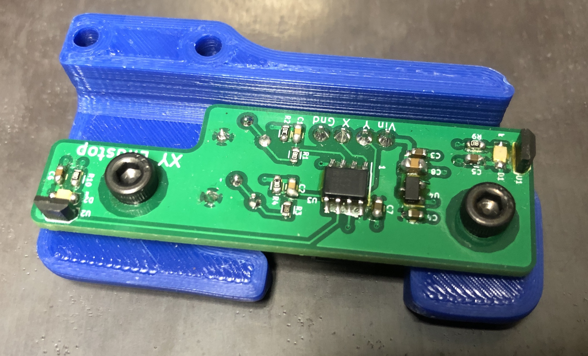
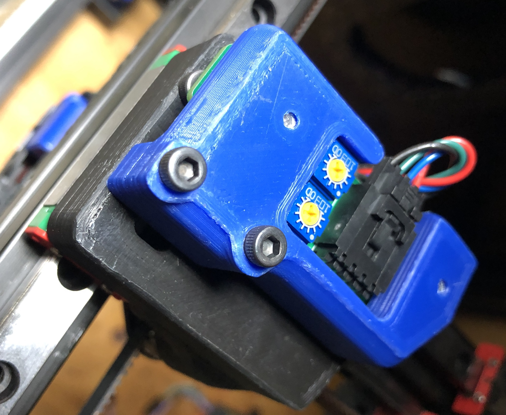
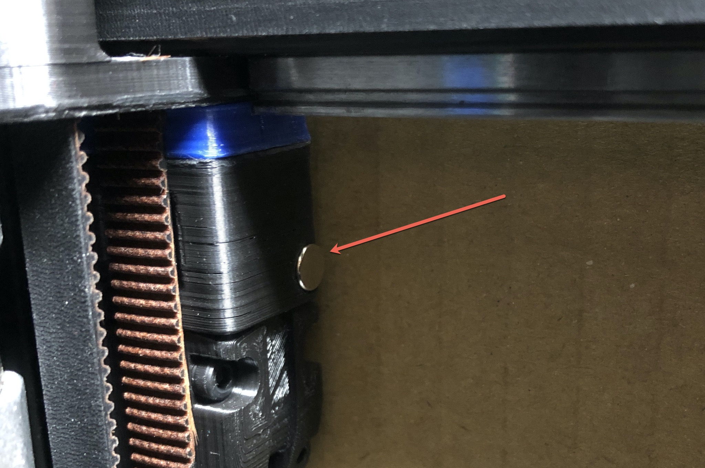
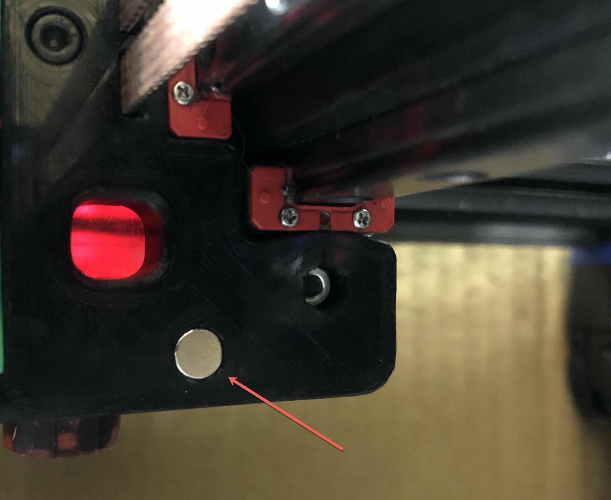

# Hall Effect Endstop Setup

**The hall effect endstop is only designed for a V2.4.  It will not work on any other models!**

The hall effect endstop board is a non-mechanical alternative to the X and Y endstop switches.  It triggers on magnets installed in the X carriage and one Z joint.

## Requirements

* The alternate Z joint "z\_joint\_upper\_hall\_effect" must be printed, quantity 1.
* The alternate endstop pod "[a]\_endstop\_pod\_hall|_effect" must be printed, quantity 1.
* 4 wires must be installed into the cable chain.

## Wiring

* The hall effect endstop requires 5V and GND to operate.
* The standard connector is a Molex SL 4-pin locking connector.
* The connector pinout is silkscreened onto the board. (GND, X, Y, Vin)
* SKR 1.3 and SKR 1.4 have 5V and GND available at all endstop connections.  Common wiring is 5V and X on one connector, then Y and GND on another.  Check the pinout for the board to confirm.

## Assembly

* The alternate Z joint should be installed at the Z2 position, next to the A motor.
* Using (2) M3x8 SHCS, install the hall effect board into the endstop pod. 
* Using (2) M3x30 SHCS, install the hall effect pod into the right XY joint. 
* Connect the wiring to the hall effect module.
* Do not install the magnets at this time.
* Power on the printer.

## Hall Effect Calibration

_The hall effect sensors are sensitive to polarity so the magnets must be installed correctly._

* Using a small screwdriver, center the two potentiometers on the board.
* Verify the magnet poles and install.
	* Take a single magnet and slowly move it close to the hall effect board's Y sensor.
	* If the light does not come on with the magnet 5-10mm away, flip the magnet over and try again.
	* Once the pole has been identified install the magnet (in exactly the same oriantation!) into the Z joint. 
	* Repeat for X axis, magnet is installed into the X carriage over top of a SHCS. 
* For each axis, move the gantry or carriage back and forth watching the LED for the trigger point.  Adjust the potentiometer to set the gap for when the endstop is triggered.  The gap should not be any smaller than 1-2mm.

## Verification

* Mamually move the gantry away from the endstops and run `QUERY_ENDSTOPS`.  Both X and Y endstops should read as `open`.
* If any of them say "triggered" instead of "open", double-check to make sure the gantry is away from the homeing corner and that both LEDs are off.
* Manually move the gantry to close the X endstop and run `QUERY_ENDSTOPS`.  The X endstop should read `triggered` and the Y endstop should read `open`.
* Manually move the gantry into the endstop corner and run `QUERY_ENDSTOPS`. Both X and Y endstops should read `triggered`.
* If it is found that one of the endstops has inverted login (i.e. it reads as "open" when it is pressed and "triggered" when not pressed), go into the printer configuration file (typically printer.cfg) and add or remove the ! in front of the pin identifier. For example, if the X endstop was inverted, add a ! in front of the pin number as follows: `endstop_pin: P1.28 -> endstop_pin: !P1.28`
* Attempt a home with `G28 X Y`.  _The gantry should not physically contact the XY joint or the A motor assembly.  If it does the sensitivity must be adjusted to prevent contact._
