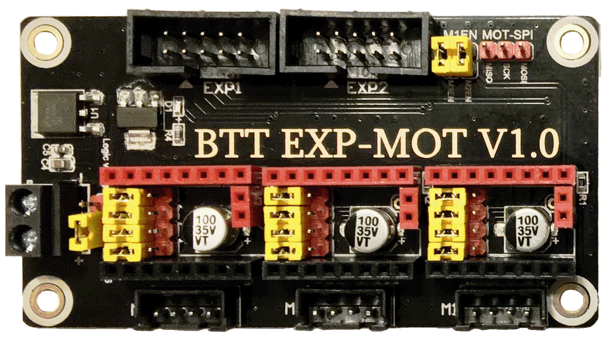
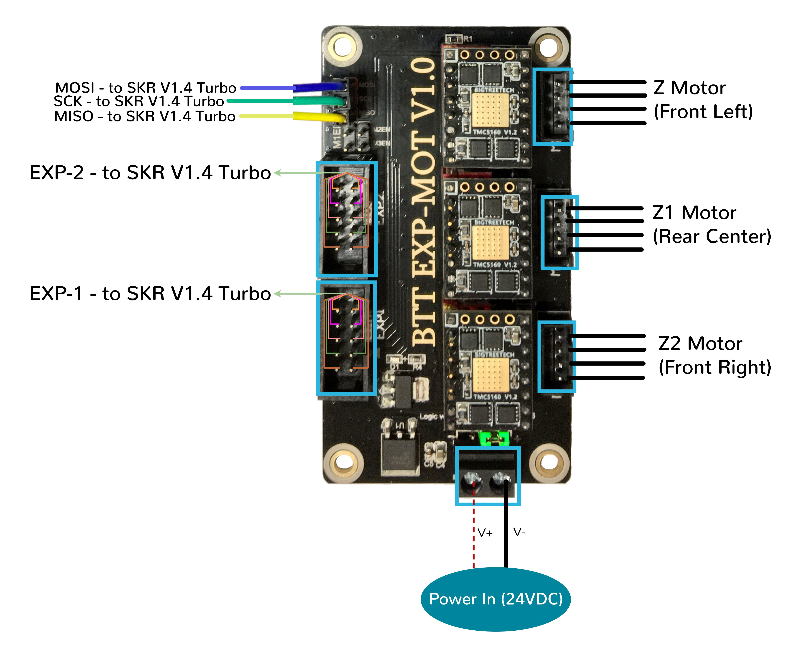
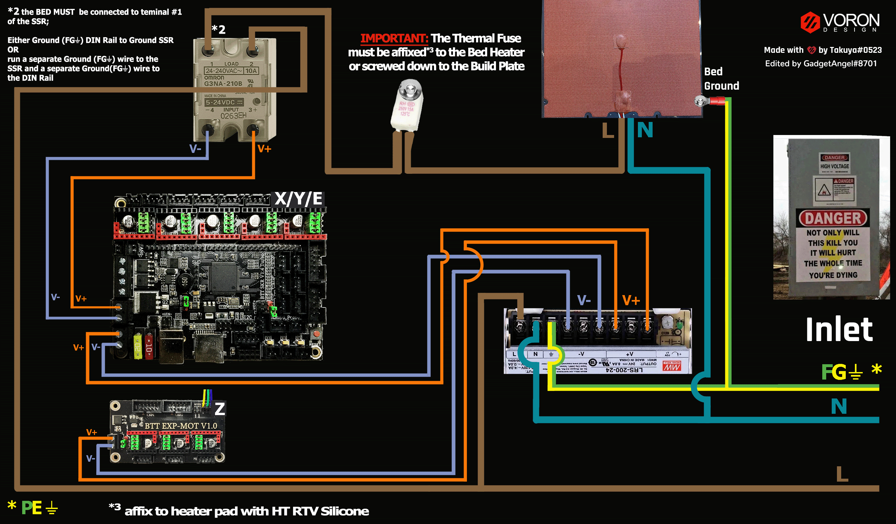

# Trident - SKR V1.4/Turbo and EXP-MOT (TMC2100, TMC2130, TMC5160, TMC5161, TMC5160HV, TMC5160_PRO) Wiring

## Initial Preparation Needed for TMC2130, TMC5160 or TMC5161 (TMCxxxx drivers with StallGuard) Stepper Motor Drivers
   

* See [the Initial Preparation for TMC2130, TMC5160 or TMC5161 Drivers](./skrv14init_prep_tmc_drvs_spi#preparation-of-tmc2130-tmc5160-or-tmc5161-stepper-motor-drivers){:target="_blank" rel="noopener"}

## Initial Removal of Jumpers for The SKR V1.4/Turbo in SPI Mode

We have no idea what state your board is in when you start this process.  Someone could have moved jumpers around already.  But since we are here, on the SPI end of the site, then I assume that you might want to look at the next section **before** removing **all the jumpers** because if all the jumpers are already set for SPI mode then removing them and placing them right back in would be a waste of your valuable time.

**If one does not understand what I mean by "if the jumpers are set for SPI" then I would recommend that removing all the jumpers would be the place to start.**

Remove **all YELLOW** on-board jumpers, located at the positions shown below:

######  {#v2_skrv14_PREP-removal_spi_triskr-expmot_tri}

## Initial Removal of Jumpers for the EXP-MOT in SPI Mode

Remove **all YELLOW** on-board jumpers, located at the positions shown below:

######  {#tri_EXP-MOT-V10_PREP-removal_spi_triskr-expmot_tri}

## Initial Preparation for the SKR V1.4/Turbo in SPI Mode - Set Jumpers

* Set the on-board jumpers, located at the positions as shown by the **GREEN** jumpers in the diagram below:

######  {#v2_skr14T_SPI_PREP_triskr-expmot_tri}

* If you want to open the above picture, in a new tab of your web browser, then [click here](./images/v2_skr14T_SPI_PREP.png){:target="_blank" rel="noopener"}

## Initial Preparation for the EXP-MOT in SPI Mode - Set Jumpers

* Set the on-board jumpers, located at the positions as shown by the **GREEN** jumpers in the diagram below:

######  {#tri_EXP-MOT-V10_SPI_prep_triskr-expmot_1_tri}

* If you want to open the above picture, in a new tab of your web browser, then [click here](./images/tri_EXP-MOT-V10_SPI_prep.png){:target="_blank" rel="noopener"}

### Voltage Selection Headers for the SKR V1.4/Turbo in SPI mode

* **Set the USB-PWR jumper to the VDD position (as shown in the PURPLE box)** to avoid the interaction between the USB 5V of Raspberry Pi and the DC-DC 5V of the motherboard.

* The NPWR jumper setting will decide the source of the board's NeoPixel connector's +V PIN.  The NeoPixel connector can be sourced from the board itself or from an external DCDC bridge module.  One can purchase an external DCDC bridge module (sold separately) to power 5V NeoPixel LEDs.  This bridge module is called the "DCDC Mode V1.0" board. Since the Voron printer does not require the extra DCDC bridge module, **set the NPWR jumper to indicate that the DCDC bridge module is not attached to the board, as shown in the ORANGE box on the diagram below.**

__IMPORTANT:__ **Double check all the** __GREEN__ **jumpers are set appropriately, especially the jumpers called out by the _COLORED BOXES_, BEFORE the power supply is connected.**

######  {#v2_skr14T_SPI_voltageselect_triskr-expmot_tri}

* If you want to open the above picture, in a new tab of your web browser, then [click here](./images/v2_skr14T_SPI_voltageselect.png){:target="_blank" rel="noopener"}

### Voltage Selection Header for the EXP-MOT in SPI mode

* **Set the LOGIC-VOLTAGE jumper to the 3.3V position (as shown in the YELLOW box, in the diagram below)** since the SKR board is a 32-bit processor which uses 3.3V logic level for the stepper motor driver boards.

* Ensure the removal of jumpers on the M1EN header (as shown in the **ORANGE box**, in the diagram below). Again, the M1EN header must be empty.

* The MOT-SPI header requires a three pin female Dupont connection. Even tho the EXP-MOT board is connected to the SKR V1.4/Turbo board via the EXP1 and EXP2 ribbon cables, three additional wires are needed to hook up the SPI lines (MOSI, SCK and MISO) from the SKR V1.4/Turbo board's E1 driver socket to the MOT-SPI header on the EXP-MOT board.

* Use at least 24awg wire for the SPI wires from the empty E1 driver socket on the SKR V1.4/Turbo board over to the MOT-SPI header (as seen in the **PURPLE box**, in the diagram below).  More information about the three additional SPI wires and the MOT-SPI header are described in [this section](#mcu-z-in-spi-mode-exp-mot)

* Please use some hot glue to ensure the E1 socket end of this Dupont connection will stay secure.

__IMPORTANT:__ **Double check all the** __GREEN__ **jumpers are set appropriately, especially the jumpers called out by the _COLORED BOXES_, and ensure the 3 addition SPI wires are correctly and securely hooked up BEFORE the power supply is connected.**

######  {#tri_EXP-MOT-V10_SPI_voltageselect_triskr-expmot_tri}

* If you want to open the above picture, in a new tab of your web browser, then [click here](./images/tri_EXP-MOT-V10_SPI_voltageselect.png){:target="_blank" rel="noopener"}

## Stepper Motor Drivers for both SKR V1.4/Turbo and EXP-MOT
* - [ ] Inspect the stepper motor drivers for left over rosin, and clean with IPA, if needed
* - [ ] Before installing heat sinks on to the stepper motor drivers,&nbsp;[please read this](#please-ensure-the-heat-sinks-are-installed-before-use-on-both-the-skr-v14turbo-and-exp-mot-boards)
* - [ ] Install heat sinks on all stepper motor drivers

## MCU X/Y/E, Hot End, Bed, and Exhaust Fan in SPI Mode (SKR V1.4/Turbo)

* - [ ] Connect 24V and GND (V+ and V-) from the PSU to Power/DCIN
* - [ ] Connect stepper driver for the B Motor (gantry left) into position X (driver socket)
* - [ ] Plug in stepper motor for the B Motor (gantry left) into position X (motor connector)
* - [ ] Connect stepper driver for the A Motor (gantry right) into position Y (driver socket)
* - [ ] Plug in stepper motor for the A Motor (gantry right) into position Y (motor connector)
* - [ ] Connect stepper driver for the extruder motor into position E0 (driver socket)
* - [ ] Plug in stepper motor for the extruder motor into position E0 (motor connector)
* - [ ] Connect the hot end heater to HE0 (P2.7)
* - [ ] Connect the bed SSR (DC Control Side) to HB (P2.5)
* - [ ] Connect the part cooling fan to HE1 (P2.4)
* - [ ] Connect the hot end fan to FAN0 (P2.3)
* - [ ] Connect the controller fans to FAN2
* - [ ] Connect the chamber exhaust fan to FAN3
* - [ ] Connect the hot end thermistor to TH0 (P0.24)
* - [ ] Connect the heated bed thermistor to TB (P0.25)
* - [ ] Connect the X endstop to X-STOP (P1.29)
* - [ ] Connect the Y endstop to Y-STOP (P1.28)
* - [ ] Connect the Z endstop to Z-STOP (P1.27)
* - [ ] Connect the Probe Signal (with&nbsp;**BAT85 diode**) to PROBE connector (P0.10)
* - [ ] Connect the Probe PWR and GND to FAN1
* - [ ] Plug the supplied ribbon cable into EXP1 on the SKR V1.4/Turbo board and then plug the other end into the EXP1 on the EXP-MOT board.
* - [ ] Plug the supplied ribbon cable into EXP2 on the SKR V1.4/Turbo board and then plug the other end into the EXP2 on the EXP-MOT board.
* - [ ] Connect USB Cable to your SKR 1.4/Turbo,&nbsp; **but do not connect it yet to your Raspberry Pi**

BAT85
: a Schottky barrier diode. BAT85 is needed to protect the SKR board (MCU board) from being fried.  An Inductive Probe device (Omron TL-Q5MC2; Omron TL-Q5MC2-Z or Panasonic GX-HL15BI-P) communicates at a much higher voltage level (10V - 30V) then the MCU board.  The BAT85 is used to protect the input signal PIN of the MCU board; without the BAT85 the MCU board will be damaged.  If two BAT85s are used in series, the circuit will protect the MCU board and still allow the inductive probe to function properly. [For more information, click here](../../../build/electrical/index#bat85-diode){:target="_blank" rel="noopener"}

### MCU X/Y/E, Hot End, Bed, and Exhaust Fan in SPI mode Wiring Diagram (SKR V1.4/Turbo)

######  {#Trident_Wiring_Diagram_SKRV14TurboandEXP-MOT_XYE_SPI_triskr-expmot_tri}

* If you want to open the above diagram, in a new tab of your web browser, and have the ability to zoom and download the diagram in JPG format then [click here](./images/Trident_Wiring_Diagram_SKRV1.4TurboandEXP-MOT_XYE_SPI.jpg){:target="_blank" rel="noopener"}

## MCU Z in SPI Mode (EXP-MOT)

* - [ ] Connect 24V and GND (V+ and V-) from the PSU to Power_In/DCIN
* - [ ] Connect stepper driver for the Z into positions M1 (driver socket)
* - [ ] Plug in stepper motor for the Z into positions M1 (motor connector)
* - [ ] Connect stepper driver for the Z1 into positions M2 (driver socket)
* - [ ] Plug in stepper motor for the Z1 into positions M2 (motor connector)
* - [ ] Connect stepper driver for the Z2 into positions M3 (driver socket)
* - [ ] Plug in stepper motor for the Z2 into positions M3 (motor connector)

### Two Options For 3-Pin Dupont Cable from SKR V1.4/Turbo to EXP-MOT board (choose ONLY ONE option)

* #1 Option: Attach the MOSI, SCK and MISO wires directly to the inner pin block of the E1 driver socket. Below is a diagram of a driver socket.  The inner pin block rows are labeled MOSI, SCK and MISO. The connection needs to be made in the column labeled "To/From MCU", see the diagram below:

######  {#skrv14_E1emptyDrvSocketPrep_triskr-expmot_tri}

* Remove three jumper caps on the rows labeled MOSI, SCK and MISO, as shown in the above diagram.  Attach one end of the Dupont wire to the PIN in the appropriate row and in the column labeled "To/From MCU" on the SKR V1.4/Turbo board (use the pins that are now available since you removed three jumper caps), and the other end of the wire goes to the MOT-SPI header on the EXP-MOT board (as shown in the **PURPLE box** of [the diagram above](#imagestriexp-mot-v10spivoltageselectpng-triexp-mot-v10spivoltageselecttriskr-expmottri)). Ensure you attach MOSI PIN on the SKR V1.4/Turbo to MOSI PIN on the EXP-MOT, SCK PIN to SCK PIN and MISO PIN to MISO PIN.

* If you attach the wires to the PINS in the column labeled "To/From Driver" then the EXP-MOT board will not work because the information is not getting back to the microprocessor. If this is too hard to follow then hook the SPI wires up using the next option.

* #2 Option: **DO NOT remove the SPI jumper caps in the E1 driver socket**. In fact, the SPI jumper caps **MUST be in place on the E1 socket for this option to work!** Attach MOSI, SCK and MISO wires from the EXP-MOT board to the E1 socket's red PIN-riser as shown in [this diagram above](#imagestridentwiringdiagramskrv14turboandexp-motxyespijpg-tridentwiringdiagramskrv14turboandexp-motxyespitriskr-expmottri).

### MCU Z in SPI Mode Wiring Diagram (EXP-MOT)

######  {#Trident_Wiring_Diagram_SKRV14TurboandEXP-MOT_Z_SPI_triskr-expmot_tri}

* If you want to open the above diagram, in a new tab of your web browser, and have the ability to zoom and download the diagram in JPG format then [click here](./images/Trident_Wiring_Diagram_SKRV1.4TurboandEXP-MOT_Z_SPI.jpg){:target="_blank" rel="noopener"}

## Please Ensure the Heat Sinks are Installed Before Use on Both the SKR V1.4/Turbo and EXP-MOT boards

Note on the Orientation of the Stepper Motor Driver's Heat Sinks
: Place the heat sinks for the stepper motor drivers so that the orientation of the fins on the heat sinks are parallel to the air flow from the controller fans once the MCU board is installed on the DIN rail. Ensure the heat sinks are **not touching** the solder joints located on the top of the step stick. Please note, that your placement of heat sinks may be different from the orientation shown below.

### MCU X/Y/E, Hot End, Bed, and Exhaust Fan with Heat Sinks Installed (SKR V1.4/Turbo)

######  {#v2_skr14T_SPI_heatsinks1_triskr-expmot_tri}

### MCU Z with Heat Sinks Installed (EXP-MOT)

######  {#tri_EXP-MOT-V10_SPI_heatsinks2_triskr-expmot_tri}

## Raspberry Pi

### Power
* The BTT SKR V1.4/Turbo board is **NOT capable of providing 5V power** to run your Raspberry Pi.

## Setting up UART Serial Communications with the Raspberry Pi

* see [the SKR V1.4/Turbo Raspberry Pi Section](../../../build/electrical/skrv14_RaspberryPi#raspberry-pi){:target="_blank" rel="noopener"}

## SSR Wiring (SKR V1.4/Turbo Board Shown is in SPI mode)

* Wire colors will vary depending on your locale.

######  {#Trident_SKRV1.4andEXP-MOTinSPI-ssr-wiring_triskr-expmot_tri}

* If you want to open the above diagram, in a new tab of your web browser, and have the ability to zoom and download the diagram in PNG format then [click here](./images/Trident_SKRV1.4andEXP-MOTinSPI-ssr-wiring.png){:target="_blank" rel="noopener"}

### The Klipper Configuration file for SKR V1.4/Turbo board with the EXP-MOT board (UART mode - SPI mode needs to be added to this)

The Klipper Configuration file from VoronDesign/Voron-Trident GitHub Repo for SKR V1.4/Turbo board using the EXP-MOT board is [located here](https://raw.githubusercontent.com/VoronDesign/Voron-Trident/main/Firmware/Voron_Trident_SKR14_EXPMOT.cfg){:target="_blank" rel="noopener"};

## URL Resources Links for the SKR V1.4/Turbo (PIN Diagrams and Repo)

* see [The SKR V1.4/Turbo Resource Section](../../../build/electrical/skrv14_Resources#color-pin-diagram-for-skr-v14v14turbo){:target="_blank" rel="noopener"}

## URL Resources Links for the BTT EXP-MOT V1.0 (PIN Diagrams and Repo)

* see [The EXP-MOT V1.0 Resource Section](../../../build/electrical/exp-motv10_Resources#original-exp-mot-v10-pinout){:target="_blank" rel="noopener"}

## After I have Wired up the MCU Board and EXP-MOT Board, What Comes Next?

1. Once the MCU board and EXP-MOT board are wired up and wire management has been performed, the next step is to install Mainsail/Fluidd or Octoprint, please see [The Build ═► Software Installation](../../../build/software/index#software-installation){:target="_blank" rel="noopener"}

2. Once Mainsail/Fluidd or Octoprint has been installed, the next step is to **compile and install** the Klipper Firmware onto the SKR V1.4/Turbo board only (the EXP-MOT board does not have a microprocessor), please see [The Build ═► Software Installation -> Firmware Flashing(Header) -> SKR 1.4](../../../build/software/skr13_klipper#skr-1314-klipper-firmware){:target="_blank" rel="noopener"}

3. Once the MCU board has the Klipper Firmware Installed, the next step is to **create/edit** the Klipper Config file (Voron_Trident_SKR14_EXPMOT.cfg rename it to printer.cfg and replace UART with SPI). Please see [the file located here](https://raw.githubusercontent.com/VoronDesign/Voron-Trident/main/Firmware/Voron_Trident_SKR14_EXPMOT.cfg){:target="_blank" rel="noopener"} as a good starting point;

    * Please use the SKR V1.4/Turbo Color PIN Diagram, [displayed here](../../../build/electrical/skrv14_Resources#color-pin-diagram-for-skr-v14v14turbo){:target="_blank" rel="noopener"}, as a source of information;

    * Please use the Original EXP-MOT PIN Diagram, [displayed here](../../../build/electrical/exp-motv10_Resources#Original-PIN-diagram-exp-mot){:target="_blank" rel="noopener"}, as a source of additional information;

    * Please consult [The Build ═► Software Configuration](../../../build/software/configuration#software-configuration){:target="_blank" rel="noopener"} on how to edit the Klipper Config file.

4. After **creating/editing** the Klipper Config file (Voron_Trident_SKR14_EXPMOT.cfg renamed to printer.cfg), the next step is to check all the Motors and the mechanics of the Voron printer, please see [The Build ═► Initial Startup Checks](../../../build/startup/index#initial-startup-checks){:target="_blank" rel="noopener"}

