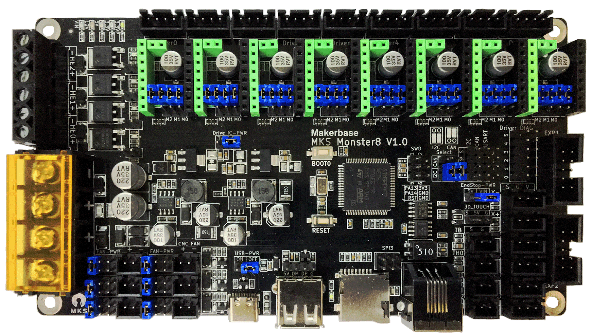
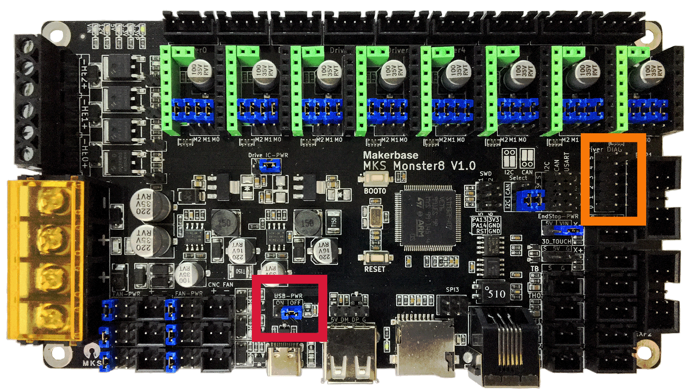
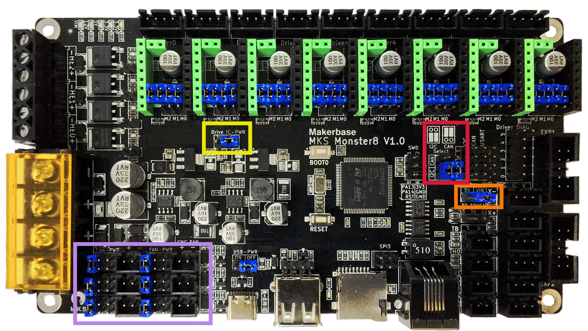
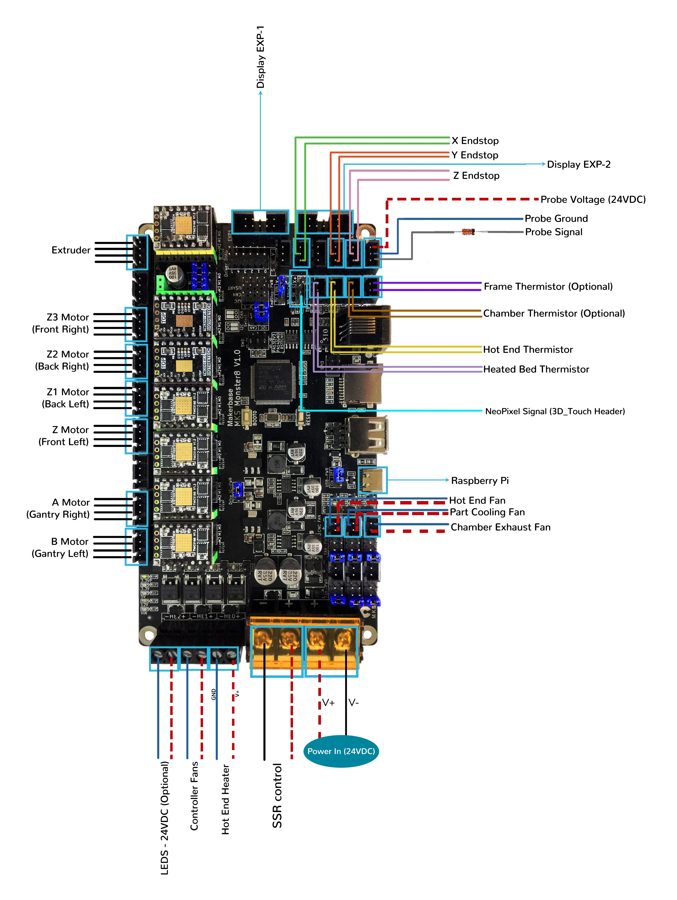
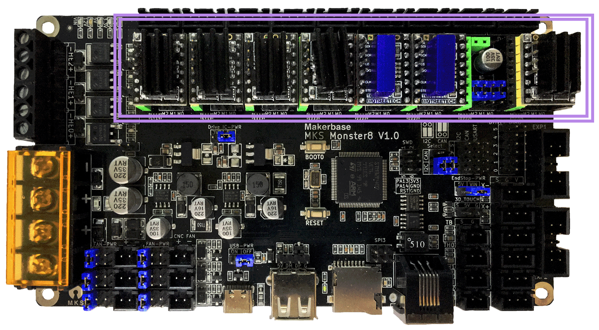
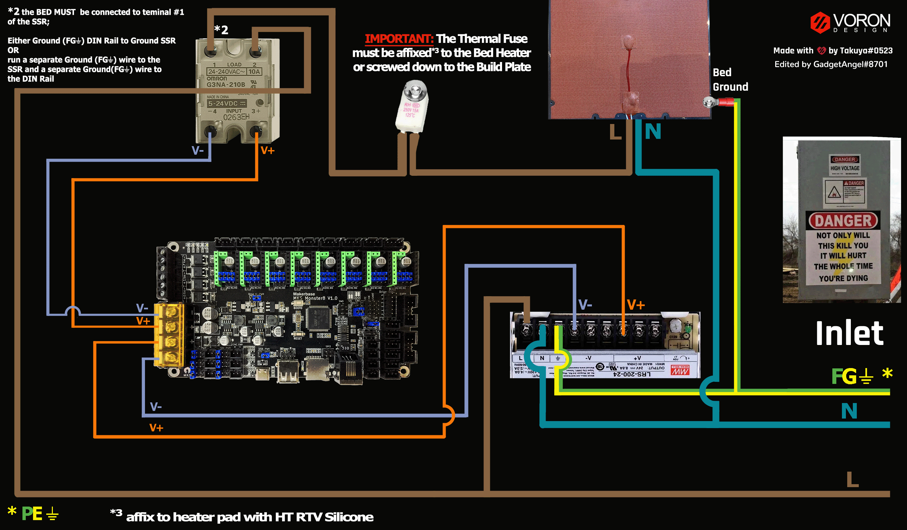

# Voron V2 - MKS Monster 8 V1.0 (TMC2100, TMC2130, TMC5160, TMC5161, TMC5160HV, TMC5160_PRO) Wiring

## Initial Removal of Jumpers for SPI Mode

* Remove **all YELLOW** on-board jumpers, located at the positions shown below.

######  {#Monster8v10_PREP-Removal_SPI_v2}

## Initial Preparation for SPI Mode - Set Jumpers

* Set the on-board jumpers, located at the positions as shown by the **BLUE** jumpers in the diagram below:

######  {#Monster8v10_SPI_PREP1_v2}

* If you want to open the above picture, in a new tab of your web browser, then [click here](./images/Monster8v10_SPI_PREP1.png){:target="_blank" rel="noopener"}

## USB-PWR Selection Header and DIAG Headers

* **Set the USB-PWR jumper to off (as shown in the RED box)** to avoid the interaction between the USB 5V of Raspberry Pi and the DC-DC 5V of the motherboard.

* Ensure **all of "DIAG Jumpers" (shown in the ORANGE box) are removed** to avoid the influence of TMC2209 DIAG on the endstop.

__IMPORTANT:__ **Double check all the** __GREEN__ **jumpers are set appropriately, especially the jumpers called out by the _COLORED BOXES_, BEFORE the power supply is connected.**

######  {#Monster8v10_SPI_PREP_v2}

* If you want to open the above picture, in a new tab of your web browser, then [click here](./images/Monster8v10_SPI_PREP.png){:target="_blank" rel="noopener"}

### (FAN & Endstop/PROBE & DRIVER IC) Voltage Selection Headers

* In the diagram below, the **COLORED BOXES** indicate the headers with **BLUE** jumpers that will be discussed next.

* In the diagram below, the **PURPLE box** indicates the "fan voltage selection headers" with **BLUE** jumpers which are set for 24VDC.

    * __IMPORTANT:__ **If fans that use 5VDC or 12VDC are used, please take NOTE of these "fan voltage selection headers" and set the jumpers to the appropriate jumper position so that the correct fan voltage will be produced to run the 5VDC or 12VC fan.  If the fan voltage selection jumper is set for 24VDC and a 5VDC/12VDC fan is connected to it, the Monster 8 board will be damaged.**

* In the diagram below, the **ORANGE box** indicates the "end stop voltage selection header" with a **BLUE** jumper which is set for Vin or 24VDC. Since the PROBE voltage will be connected to the Z+ end stop connector, the end stop voltage selection header can also be referred to as the PROBE voltage selection header.  If a PROBE voltage of 5VDC is desired, "end stop voltage selection" jumper needs to be changed.

    * __IMPORTANT:__ **If the voltage required by the PROBE device does not match the voltage selected by the "end stop voltage selection Jumper" then the Monster 8 board could be damaged.**

* In the diagram below, the **YELLOW box** indicates the DRIVER IC power selection header with **BLUE** jumper which is set for 5VDC.  Each stepper motor driver uses a digital logic level to communicate with the Monster 8's STM32 processor. **This jumper MUST BE SET or the stepper motor drivers will not work!**  Since the Voron printers do not use sensorless homing, set this jumper to 5VDC.  You can find more information about this jumper setting by reading page 12 of [this document](<../../../../../build/electrical/images/MKS MONSTER8 V1.0 datasheet (based on Klipper firmware to configure Voron 2.4 machine).pdf#page=12>){:target="_blank" rel="noopener"}

    * __IMPORTANT:__ **If the DRIVER IC power selection jumper is NOT SET, all the stepper motor drivers will not work!**

* **As shown in the RED box, set the I2C Bus selection jumper to EEPROM/I2C** to allow the EEPROM to use the I2C bus lines instead of the CAN connector. Refer to the Monster 8 schematic, for [more information about this setting](<../../../../../build/electrical/images/MKS Monster8 V1.0_003 SCH.pdf#page=2>){:target="_blank" rel="noopener"}

* __IMPORTANT:__ **Double check all the** __BLUE__ **jumpers are set appropriately, especially the jumpers called out by the _COLORED BOXES_, BEFORE the power supply is connected.**

### (FAN & Endstop/PROBE & DRIVER IC) Voltage Selection Diagram

######  {#Monster8v10_SPI_voltageselect_v2}

* If you want to open the above picture, in a new tab of your web browser, then [click here](./images/Monster8v10_SPI_voltageselect.png){:target="_blank" rel="noopener"}

## Stepper Motor Drivers
* - [ ] Inspect the stepper motor drivers for left over rosin, and clean with IPA, if needed
* - [ ] Before installing heat sinks on to the stepper motor drivers,&nbsp;[please read this](#please-ensure-the-heat-sinks-are-installed-before-use)
* - [ ] Install heat sinks on all stepper motor drivers

## MCU Wiring for SPI Mode

* - [ ] Connect 24V and GND (V+ and V-) from the PSU to POWER (silk screen markings are located on the underside of board)
* - [ ] Connect stepper driver for the B Motor (gantry left) into position DRIVER0 (driver socket)
* - [ ] Plug in stepper motor for the B Motor (gantry left) into position DIRVER0:X (motor connector)
* - [ ] Connect stepper driver for the A Motor (gantry right) into position DRIVER1 (driver socket)
* - [ ] Plug in stepper motor for the A Motor (gantry right) into position DRIVER1:Y (motor connector)
* - [ ] Connect stepper driver for the Z into positions DRIVER2 (driver socket)
* - [ ] Plug in stepper motor for the Z (Front Left) into positions DRIVER2:Z2 (leaving an empty motor connector between A and Z)
* - [ ] Connect stepper driver for the Z1 into positions DRIVER3 (driver socket)
* - [ ] Plug in stepper motor for the Z1 into positions DRIVER3:E0 (motor connector)
* - [ ] Connect stepper driver for the Z2 into positions DRIVER4 (driver socket)
* - [ ] Plug in stepper motor for the Z2 into positions DRIVER4:E1 (motor connector)
* - [ ] Connect stepper driver for the Z3 into positions DRIVER5 (driver socket)
* - [ ] Plug in stepper motor for the Z3 into positions DRIVER5:E2 (motor connector)
* - [ ] Connect stepper driver for the extruder motor into position DRIVER7 (leaving an empty driver socket between Z3 and E)
* - [ ] Plug in stepper motor for the extruder motor into position DRIVER7:E4 (leaving an empty motor connector between Z3 and E)
* - [ ] Connect the hot end heater to HE0 (PB1)
* - [ ] Connect the bed SSR (DC Control Side) to H-BED {silk screen markings are located on the underside of board} (PB10)
* - [ ] Connect the hot end fan to FAN0 (PA2)
* - [ ] Connect the part cooling fan to FAN1 (PA1)
* - [ ] Connect the chamber exhaust fan to FAN2 (PA0)
* - [ ] Connect the controller fans to HE1 (PB0)
* - [ ] Connect the hot end thermistor to TH0 (PC1)
* - [ ] Connect the bed thermistor to TB (PC0)
* - [ ] Connect the X endstop to X+ (PA13)
* - [ ] Connect the Y endstop to Y+ (PC5)
* - [ ] Connect the Z endstop to Z- (PB13)
* - [ ] Plug Probe Signal (with&nbsp;**BAT85 diode**) in to Z+ (PB12)
* - [ ] Connect the V+ an 0V wires on the probe to Z+
* if using a mini12864 display:
    1. - [ ] [complete the steps in the mini 12864 Display section](#mini-12864-display)
    2. - [ ] connect to EXP1 & EXP2
* if using USB to communicate with Pi:
    1. - [ ] Connect USB Cable to your Monster 8 board, but do not connect it yet to your Raspberry Pi
* if using UART (3-wire communication) with Pi:
    1. - [ ] [complete the steps for setting up UART Serial communications with the Raspberry Pi](../../../build/electrical/monster8_RaspberryPi#raspberry-pi){:target="_blank" rel="noopener"}
    2. - [ ] Connect UART cable to your Monster 8 board, but do not connect it yet to your Raspberry Pi

*  

BAT85
: a Schottky barrier diode. BAT85 is needed to protect the Monster 8 board (MCU board) from being fried.  An Inductive Probe device (Omron TL-Q5MC2; Omron TL-Q5MC2-Z or Panasonic GX-HL15BI-P) communicates at a much higher voltage level (10V - 30V) then the MCU board.  The BAT85 is used to protect the input signal PIN of the MCU board; without the BAT85 the MCU board will be damaged.  If two BAT85s are used in series, the circuit will protect the MCU board and still allow the inductive probe to function properly. [For more information, click here](../../../build/electrical/index#bat85-diode){:target="_blank" rel="noopener"}

## MCU Wiring Diagram for SPI Mode

######  {#v2_Wiring_Diag_Monster8v10_SPI_v2}

* If you want to open the above diagram, in a new tab of your web browser, and have the ability to zoom and download the diagram in JPG format then [click here](./images/v2_Wiring_Diag_Monster8v10_SPI.jpg){:target="_blank" rel="noopener"}

## Please Ensure the Heat Sinks are Installed Before Use

Note on the Orientation of the Stepper Motor Driver's Heat Sinks
: Place the heat sinks for the stepper motor drivers so that the orientation of the fins on the heat sinks are parallel to the air flow from the controller fans once the MCU board is installed on the DIN rail. Ensure the heat sinks are **not touching** the solder joints located on the top of the step stick. Please note, that your placement of heat sinks may be different from the orientation shown below.

### MCU in SPI Mode with Heat Sinks Installed

######  {#v2_Monster8v10_SPI_heatsinks_v2}

## Raspberry Pi

### Power
* The MKS Monster 8 is **NOT capable of providing 5V power** to run your Raspberry Pi.

## Setting up UART Serial Communications with the Raspberry Pi

* see [the MKS Monster 8 V1.0 Raspberry Pi Section](../../../build/electrical/monster8_RaspberryPi#raspberry-pi){:target="_blank" rel="noopener"}

## SSR Wiring (Board Shown is in SPI mode)

* Wire colors will vary depending on your locale.

######  {#moster8v10-ssr-SPI-wiring_v2}

* If you want to open the above diagram, in a new tab of your web browser, and have the ability to zoom and download the diagram in PNG format then [click here](./images/moster8v10-ssr-SPI-wiring.png){:target="_blank" rel="noopener"}

## mini 12864 Display

* See [the mini12864 guide](../../../build/electrical/mini12864_klipper_guide.md){:target="_blank" rel="noopener"}

## The Klipper Configuration file by RealDeuce for MKS Monster 8 V1.0 Board (UART mode - SPI mode needs to be added to this)

* The Klipper Configuration file from VoronDesign/VoronUsers RealDeuce's GitHub Repo for MKS Monster 8 board is [located here](https://raw.githubusercontent.com/VoronDesign/VoronUsers/master/firmware_configurations/klipper/RealDeuce/MKS-Makerbase/Monster8_v1.0_003/Voron2_Monster8_Config.cfg){:target="_blank" rel="noopener"};

## URL Resources Links for the Monster 8 (PIN Diagrams and Repo)

* see [The MKS Monster Resource Section](../../../build/electrical/monster8_Resources#color-pin-diagram-for-mks-monster-8-v10){:target="_blank" rel="noopener"}

## After I have Wired up the MCU Board, What Comes Next?

1. Once the MCU board is wired up and wire management has been performed, the next step is to install Mainsail/Fluidd or Octoprint, please see [The Build ═► Software Installation](../../../build/software/index#software-installation){:target="_blank" rel="noopener"}

2. Once Mainsail/Fluidd or Octoprint has been installed, the next step is to **compile and install** the Klipper Firmware, please use the above Color Pin Diagram, look for "How To Compile the [Klipper Firmware for MKS Monster 8 V1.0"](../../../build/electrical/images/MKS_Monster8-V1.0-color-PIN.pdf){:target="_blank" rel="noopener"} or an alternative source for instructions on how to compile the klipper firmware for the MKS Monster 8 V1.0 board - [See the README file](https://github.com/makerbase-mks/MKS-Monster8/tree/main/klipper%20firmware#to-compile-for-klipper-firmware){:target="_blank" rel="noopener"}

3. Once the MCU board has the Klipper Firmware Installed, the next step is to **create/edit** the Klipper Config file (Voron2_Monster8_Config.cfg rename it to printer.cfg and replace UART with SPI). Please see [the file located here by RealDeuce](https://raw.githubusercontent.com/VoronDesign/VoronUsers/master/firmware_configurations/klipper/RealDeuce/MKS-Makerbase/Monster8_v1.0_003/Voron2_Monster8_Config.cfg){:target="_blank" rel="noopener"} as a good starting point;

    * Please use the Color PIN Diagrams, [displayed here](../../../build/electrical/monster8_Resources#color-pin-diagram-for-mks-monster-8-v10){:target="_blank" rel="noopener"}, as a source of information;

    * Please consult [The Build ═► Software Configuration](../../../build/software/configuration#software-configuration){:target="_blank" rel="noopener"} on how to edit the Klipper Config file.

4. After **creating/editing** the Klipper Config file (Voron2_Monster8_Config.cfg renamed to printer.cfg), the next step is to check all the Motors and the mechanics of the Voron printer, please see [The Build ═► Initial Startup Checks](../../../build/startup/index#initial-startup-checks){:target="_blank" rel="noopener"}

