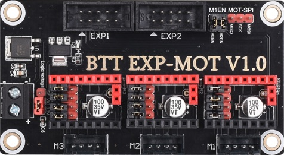
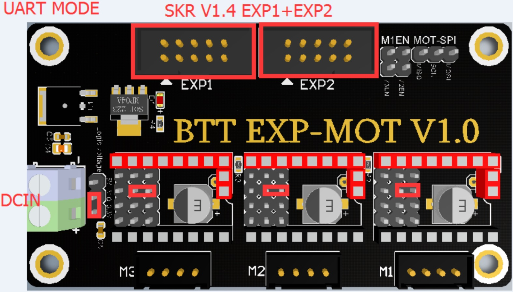

# BigTreeTech Expansion Module



BigTreeTech has an expansion module that adds three Stepper motor interfaces, to the SKRv1.3 and SKR v1.4 boards.

This expansion board requires the use the Expansion Headers from the SKR boards. If those slots are occupied by a display, you must use an [alternate system](https://github.com/jordanruthe/KlipperScreen) and display type if you wish to use the Expansion headers for this module.

These boards might be handy of you would like to expand the capabilities of your V1 to use additional Z motors or add PT100 sensors through the stepper SPI interfaces.

Since the Expansion board utilizes the Expansion slots of the SKR, the PIN numbers you would use in your Klipper config correspond to those same pins as they interface with the motor controllers.

# UART Mode / Motor Controllers
In order to utilize the expansion module to control stepper motors utilizing the TMC2209 type Step Sticks, we follow a similar configuration as if we were connecting them on the SKR.



Both EXP1 & EXP2 slots must be connected the SKR to utilize any of the 3 controller slots.  The voltage jumper must have 3.3v selected, and the Jumper pins for each step stick should be configured as in the image above.

The Expansion board must also be supplied with +24v in via the DCIN header.

Below is an example truncated configuration to use Expansion M1 as a stepper would use the following Pins an SKR 1.4:

```
[stepper_x]
##	Connected to X
step_pin: P3.25
dir_pin: P0.18
enable_pin: !P1.31
...

[tmc2209 stepper_x]
uart_pin: P1.21
...
```

The following table shows the mappings for SKR 1.3 and 1.4 boards (The pin designations are the same for both boards)

### Expansion M1
 
 Designation | Pin
 ----------- | ---
 step_pin    | P0.18
 dir_pin     | P3.25
 enable_pin  | P1.31
 uart_pin    | P1.21

### Expansion M2
 
 Designation | Pin
 ----------- | ---
 step_pin    | P3.26
 dir_pin     | P0.16
 enable_pin  | P1.23
 uart_pin    | P1.19

### Expansion M3
 
 Designation | Pin
 ----------- | ---
 step_pin    | P0.17
 dir_pin     | P0.15
 enable_pin  | P1.22
 uart_pin    | P0.28

Note that the stallguard pin still has to be removed for proper functionality, as you would for the SKR 1.4, but also for the 1.3 as there is no jumper to disable it.
