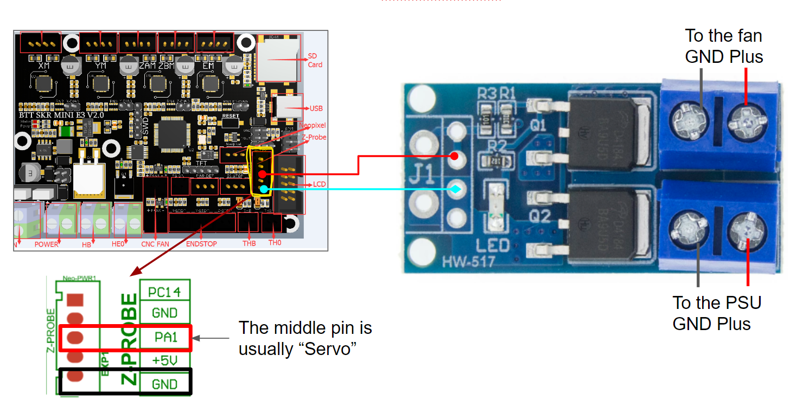

# Extra Fan Guide

## Parts

1. MOSFET PCB
(https://www.aliexpress.com/item/4000609702577.html)
or (https://www.amazon.de/Duales-MOSFET-Schaltmodul-400W-High-Power/dp/B092D3YZK3/
)
2. (optional) JST XH 2-pin terminal
3. Depending on your config, cables and JST XH connectors

## Adding an extra fan output to your mainboard

Some popular boards like the SKR Mini E3 are a bit short with controllable fan connectors. A popular but costly solution is the “Klipper expansion board”. It’s good, but can be overkill if you just need an extra fan port.

Most boards nowadays come with a connector for BLTouch. It’s not used on Vorons, so you can use the “servo” pin and the “GND” pin from that terminal to control your fan. Since the pin does not allow enough current, we need an extra module called “Mosfet”, which is available as a ready-to-use PCB from Aliexpress or Amazon, a pack of 5 was 10 EUR/USD. All it needed was a solder-on terminal for a JST-XH connector. Of course, you can also just solder the wires on the PCB if you are in a pinch. JST-XH is more robust and looks more tidy :)

## Hardware and wiring

The sample is based on a BTT SKR Mini E3 V2.0. On this board, the BLTouch-terminal is prepared for a JST-XH 5 pin. Other boards may use Dupont instead. Usually, the Servo Pin is in the middle, and the GND is on one end. Check the docs for your board!



## Klipper configuration and Gcode control

This is how I added mine in the printer.cfg:

```
[fan_generic Nevermore]
pin: PA1
```

It will show up in Mainsail, and you can control ist with Gcode like
SET_FAN_SPEED FAN=Nevermore SPEED=0.7 ; chose any value from 0.0 - 1.0

