# MAX31865 PT100 Guide

## Parts

1. PT100 Sensor
2. MAX31865 Board
3. Depending on your config, Dupont Jumper Cables

### PT100 Sensor Options

Many 3D printer part manufacturers (like [E3D](https://e3d-online.com/products/pt100-temperature-sensor) or [Trianglelab](https://www.aliexpress.com/item/32828593452.html)) sell 2-wire PT100 sensors in the v6 thermistor form factor. You can use these options on most of the hotends we recommend including the v6, Dragon, Dragonfly, Mosquito/Spider, and more.

3-wire PT100 sensors are also an option. The advantage with this option is theoretically more accurate readings and reduced fluctuation caused by electrical noise on the readings. These are harder to source, but they can still be found in v6 form factor on [Aliexpress](https://www.aliexpress.com/item/32811983096.html). These will require a different configuration of the jumpers on your MAX31865 boards.

### MAX31865 Board Options

The easiest to use option is Ray's PT100 stick. It slots into a stepstick slot on your SKR board, and the PT100 is connected via the stepper motor connector. This also eliminates the need for jumper cables, so the setup is cleaner, and more reliable (SPI bus doesn't like traveling on wires) This option is slightly more expensive then Adafruit/Clone/CJMCU option and it is harder to source, but it can be found on [Aliexpress](https://www.aliexpress.com/item/1005001698429473.html), or can be ordered from a PCB manufacturer by providing them the [gerbers](https://github.com/raymondh2/PT100Stick/tree/master/Production/Gerbers).


Another option is using an Adafruit/Clone/CJMCU MAX31865 module. These can be found on [Adafruit's website](https://www.adafruit.com/product/3328), [Aliexpress](https://www.aliexpress.com/item/33009505368.html) and many other online stores. The primary difference between the Adafruit/Clone and CJMCU modules is the size (CJMCU is smaller) and the order of the pins. 

## Step 1: Jumping Pads

This step requires soldering. You need to bridge some pads to configure your MAX31865 board to work with your PT100 sensor. The pads to jump are marked with red rectangles and traces to cut are marked with a red "x".

### 2-Wire PT100 Sensors

| PT100 Stick                                                  | Adafruit/Clone            | CJMCU                     |
| :----------------------------------------------------------- | ------------------------- | ------------------------- |
| The PT100 stick now comes pre-configured to work with 2-wire PT100 sensors. You can skip this step. | 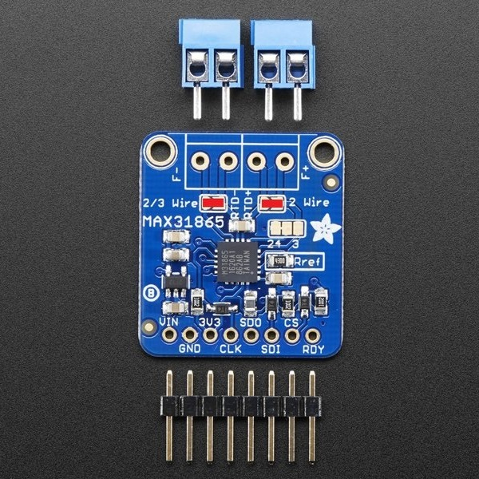 |  |

### 3-Wire PT100 Sensors

| PT100 Stick               | Adafruit/Clone            | CJMCU                     |
| :------------------------ | ------------------------- | ------------------------- |
| 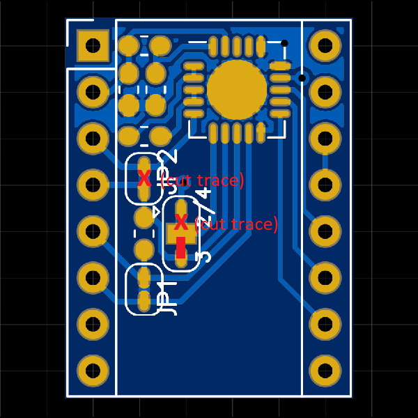 | 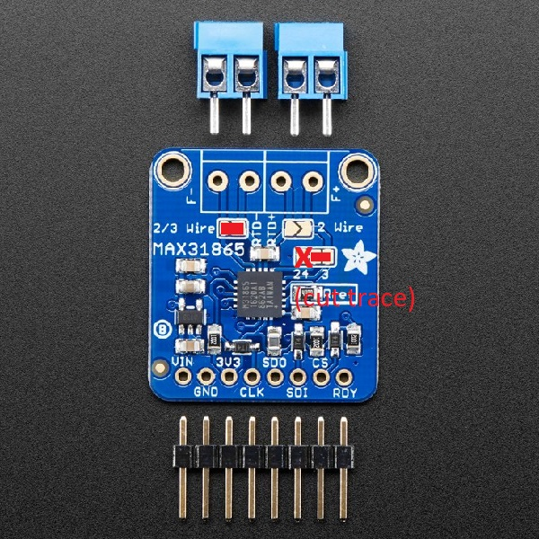 | 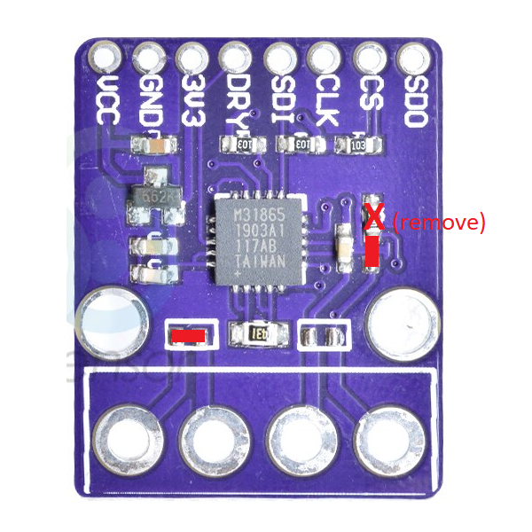 |

### 4-Wire PT100 Sensors

| PT100 Stick               | Adafruit/Clone                                               | CJMCU                                                        |
| :------------------------ | ------------------------------------------------------------ | ------------------------------------------------------------ |
| 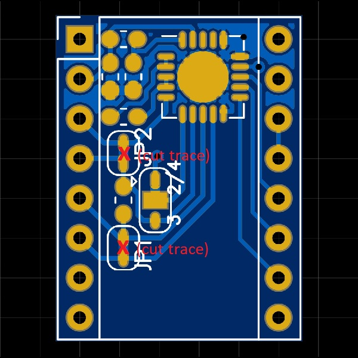 | This module comes pre-configured to work with 4-wire PT100 sensors. You can skip this step. | This module comes pre-configured to work with 4-wire PT100 sensors. You can skip this step. |

## Step 2: Soldering Headers/Terminals

This step is self explanatory. Solder the headers and the screw terminals (only on Adafruit/Clone/CJMCU) on your board.


## Step 3: Jumpers on SKR

Remove the jumpers marked with green and add jumpers marked with blue.

### SKR v1.3

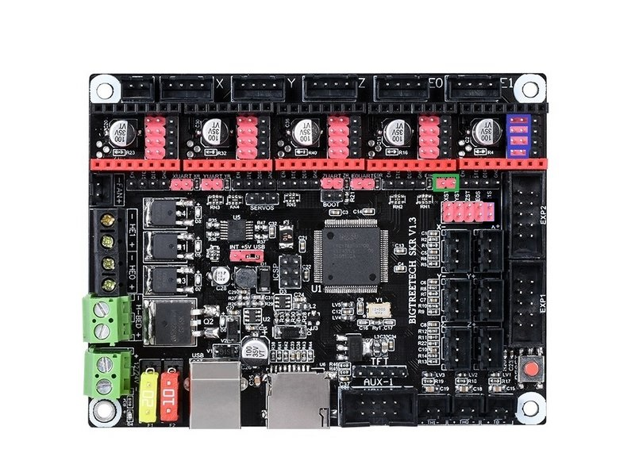


### SKR v1.4

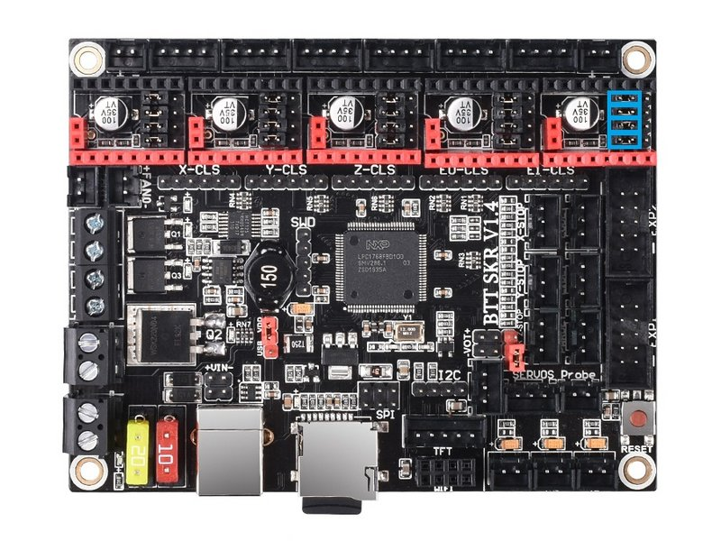


## Step 4: Wiring

### PT100 Stick

Insert your PT100 stick to the E1 stepper driver slot. Pay attention to the orientation. The "EN" pin is marked on the PT100 stick, and it should match the "EN" pin on your board.

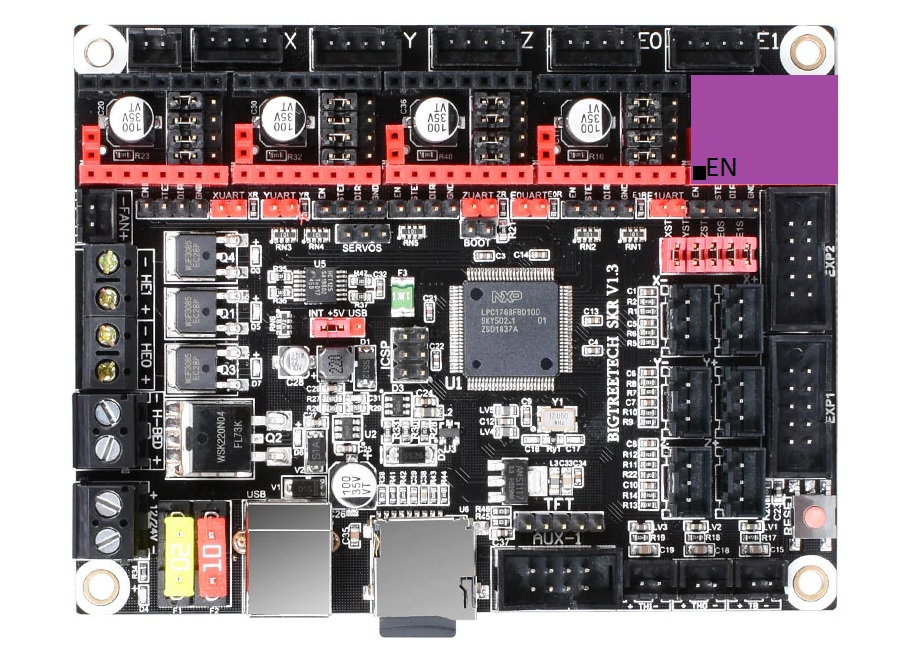


### Adafruit/Clone

Connect the SPI pins to the E1 Stepstick Slot:

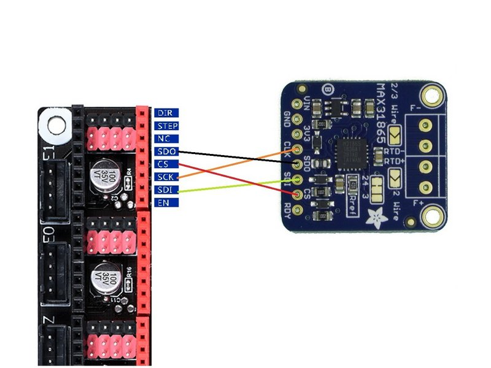

Connect VIN (not 3V3) and GND to free 3V3 and GND pins available on your SKR board. Here is a recommendation:

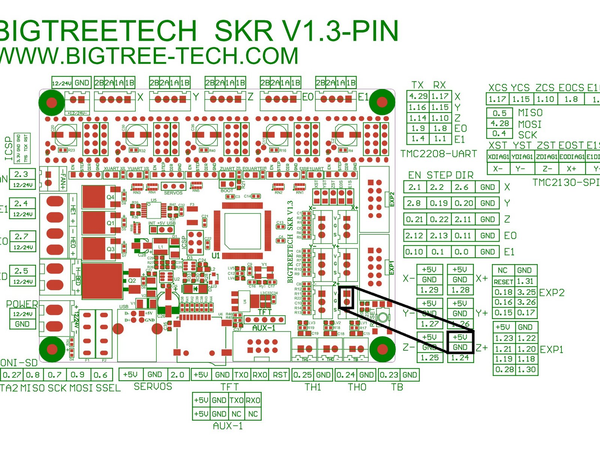

### CJMCU

Connect the SPI pins to the E1 Stepstick Slot:

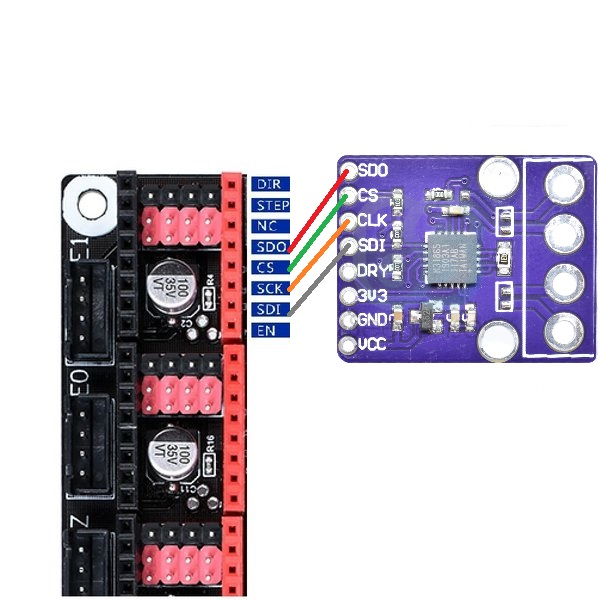


Connect VIN (not 3V3) and GND to free 3V3 and GND pins available on your SKR board. Here is a recommendation:


## Step 5: Wiring PT100

- For PT100 Stick: Connect to the E1 stepper connector.
- For Adafruit/Clone/CJMCU: Connect to the screw terminals.

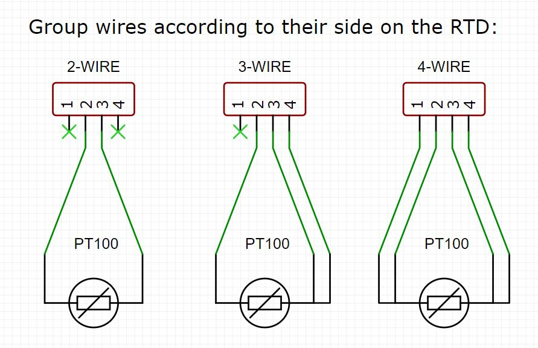

*For 3-Wire sensors, the side you wire 2 wires is the side with the jumped pads marked with 3-wire*

## Step 6: Klipper Configuration

1. SSH into your rPi and edit your printer.cfg file using nano.
2. Remove any old thermistor configuration under [extruder]. (sensor_type, sensor_pin, etc.)
3. Under [extruder] add these lines:

| SKR v1.3                                                     | SKR v1.4                                                     |
| ------------------------------------------------------------ | ------------------------------------------------------------ |
| sensor_type: MAX31865<br/>sensor_pin: P1.1<br/>spi_speed: 4000000<br/>spi_software_sclk_pin: P0.4<br/>spi_software_mosi_pin: P4.28<br/>spi_software_miso_pin: P0.5<br/>rtd_nominal_r: 100<br/>rtd_reference_r: 430 | sensor_type: MAX31865<br/>sensor_pin: P1.1<br/>spi_speed: 4000000<br/>spi_software_sclk_pin: P0.4<br/>spi_software_mosi_pin: P1.17<br/>spi_software_miso_pin: P0.5<br/>rtd_nominal_r: 100<br/>rtd_reference_r: 430 |

4. Add this line & edit it for the pt100 sensor you used: `rtd_num_of_wires: 2`

5. If you are in EU or any 50 Hz country add this line: `rtd_use_50Hz_filter: True`

6. Save your changes by typing CTRL+X, Y, [ENTER]. Send FIRMWARE_RESTART from the console in Octoprint and test! It should work.

7. Run PID tuning. PT100 readings will be different from your previous thermistor. For the best thermal accuracy, follow this to PID tune:

   ```
   1. Heat your bed to 100C.
   2. Move your hothend to the center and 5-10 mm above bed
   3. Set fans to 25%: "M106 S64"
   4. Run: "PID_CALIBRATE HEATER=extruder TARGET=245"
   5. This will run for a few minutes. When finished, save with: "SAVE_CONFIG"
   ```


## Troubleshooting

- ADC_OUT_OF_RANGE
  - If you never get a reading; check your wiring.
  - If you get this error after some time; first try adding a capacitor (explained below), if it doesn't help, try shielded wires or a 3-wire sensor.
- Under & Over Voltage
  - Possibly a wiring issue, check wiring, replace with thicker wires if possible.
  - Possibly a software SPI issue, try using a Pi MCU (explained below) for troubleshooting.
  - Possibly electrical noise issue, try adding a capacitor (explained below).
  - If nothing helps, try shielded wires or a 3-wire sensor.
- RTD_INPUT_DISCONNECTED
  - Wiring issue, check your wires.


### Adding a capacitor

All modules in this guide have a 100 nF capacitor on the RTD input, per MAX31865 spec sheet. This is usually enough, but if there is too much electrical noise, adding another capacitor can help filter the noise and prevent reading errors.

Add a 100-500 nF capacitor between the - and + RTD wires. Here is an example on the Adafruit board:

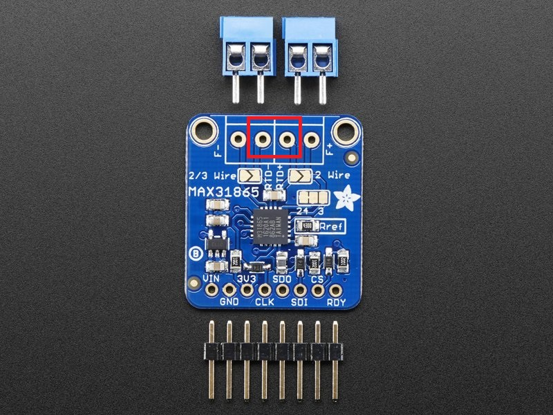


### Pi MCU

This is not recommended as a permanent solution, but it can be used for troubleshooting.

1. [Enable Pi MCU](https://github.com/KevinOConnor/klipper/blob/master/docs/RPi_microcontroller.md)

2. Wire according to this diagram:

   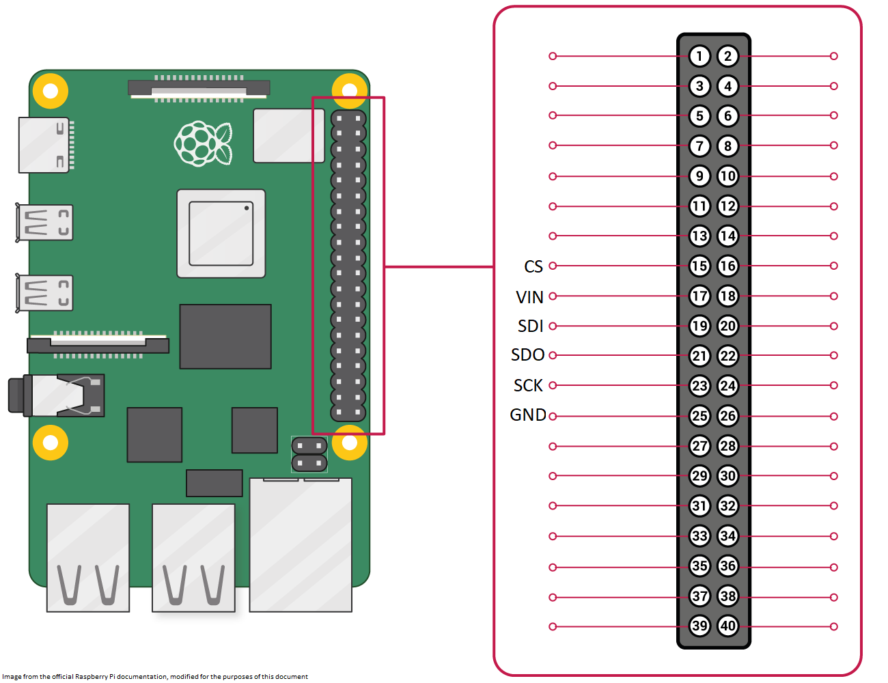

3. Add at the top of printer.cfg:

   ```
   [mcu pi]
   serial: /tmp/klipper_host_mcu 
   ```

4. Replace the MAX31865 lines with these: (change the 50hz filter and wire count according to your setup)

   ```
   sensor_type: MAX31865
   sensor_pin: pi:gpio22
   rtd_nominal_r: 100
   rtd_reference_r: 430
   rtd_num_of_wires: 2
   rtd_use_50Hz_filter: True
   ```

5. Do a FIRMWARE_RESTART and test.
