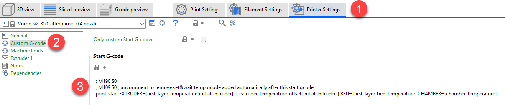
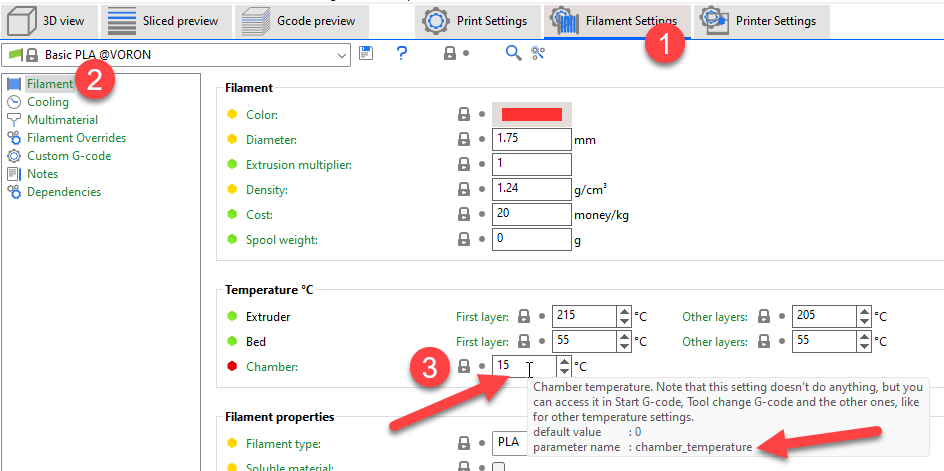
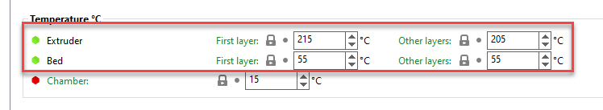

<!-- -->
# Understanding the relationship between the slicer and PRINT_START macro

The overall printing process has several phases:

1. Start a Slicer, such as SuperSlicer, and configure it
2. Import one or more STLs
3. Slice the STL files
4. Upload the GCode to the printer from step 2
5. Begin the printing process on your printer

Of course, we also need to deal with our PRINT_START macro, usually found in `printer.cfg`.

This tutorial is primarily concerned with step 1 as well as our PRINT_START macro. We will be using SuperSlicer for the slicer and a Voron 2.4 for 
the printer side of things (though any Voron will do).

On the slicer side, lets take a look at the default configuration for the printer's custom G-code. 



Specifically, this is the **Start G-code**:

```
; M190 S0
; M109 S0 ; uncomment to remove  & wait temp gcode added automatically after this start gcode
PRINT_START EXTRUDER={first_layer_temperature[initial_extruder] + extruder_temperature_offset[initial_extruder]} BED=[first_layer_bed_temperature] CHAMBER=[chamber_temperature]
```

The first thing to notice is that the first two lines are commented out. This means they are essentially ignored and will not be processed. 
We will come back these later, but for now, those macros allow for setting the temperature for the bed and extruder (if they were uncommented):

```
M190: Wait for bed temperature
M109: Wait for hot end temperature
```

You can read more about these macros at https://www.klipper3d.org/G-Codes.html and searching for `M109`

Also note that the third line contains a call to PRINT_START, along with several values after PRINT_START. 
The options after PRINT_START are parameters and these allow for passing information from the slicer into the PRINT_START macro on the printer itself.

Before we see how the two are interrelated, where do these values come from? Lets take the last one for example, **CHAMBER**. 
CHAMBER is the name of the parameter, and the value will be taken from the slicer option, located between the square brackets. 
For CHAMBER, that would be `[chamber_temperature]`, and the value itself comes from the chamber_temperature parameter in the slicer. 
To find where this parameter is set in the slicer, search for this value using the magnifying glass option below the **Print Settings** tab. 
Searching shows us that it is on in the **Filament Settings** tab, under **Filament**, and then **Chamber**. 
Hovering over the text box where we can type in a value shows the parameter name, `chamber_temperature`, in a tool tip, along with more information as to what the parameter does, its default value, and so on. 



The other parameters, such as **EXTRUDER** or **BED**, would work in a similar fashion. In fact, since we are here, look at the parameter right above **Chamber**. Here, you will see Bed, and two configuration options, one for first layer temperature, and one for other layer temperatures. Hovering over these boxes shows the parameter name, and at this point, it should not be a surprise that we see these same parameter names inside square brackets in our call to PRINT_START in the Start G-code section.



On the printer side, let's start with a simplistic PRINT_START macro, commonly defined in `printer.cfg`

```
[gcode_macro PRINT_START]
gcode:
    G32                            ; home all axes
    G1 Z20 F3000                   ; move nozzle away from bed
```

This PRINT_START is about as simple as you can make it. in fact, it does not do much of anything for us, and relies on us to do things manually, such as soaking the chamber for some amount of time if we were printing ABS, etc.

Most of us, when first starting out, used these types of macros and hoped for the best. In many cases, things worked out fine and we actually had the printer bed heat up, the hot end heat up, and the print started. But how did the printer know what temperatures to set for the bed and hot end? To understand that, we need to look a bit closer at the gcode being generated from the slicer.

To see the gcode, we simply need to export the gcode after slicing an STL and then open it in a text editor. Once we open the gcode, we can scroll down below the thumbnails, to where we see the call to PRINT_START:

```
;TYPE:Custom
; M190 S0
; M109 S0 ; uncomment to remove set & wait temp gcode added automatically after this start gcode
PRINT_START EXTRUDER=215 BED=55 CHAMBER=15
M107
G21 ; set units to millimeters
G90 ; use absolute coordinates
M83 ; use relative distances for extrusion
;_TOOLCHANGE 0
M104 S215 ; set temperature
M109 S215 ; set temperature and wait for it to be reached
M190 S55 ; set bed temperature and wait for it to be reached
M107
;LAYER_CHANGE
;Z:0.25
```

Here, notice you can see the same two code macros for **M190** and and **M109**, right above PRINT_START, with commas before them. As we said earlier, these are comments and are ignored by the printer. But what else do we see? If we keep looking at the gcode above, notice there are OTHER entries for M109 and M190, but these are not commented out! After the macro, we see the parameters sent to the macro (S215 and S55). These are the exact values we saw earlier when we found the bed temperature parameter above. 

So lets take a step back and see what we have going on here now. First, notice there is a call to PRINT_START here, and we also see the **EXTRUDER** parameter with a value of *215*, and a **BED** parameter with a value of *55*. These line up with what we said in the previous paragraph in that they are the same values as the parameters for bed temperature and hot end temperature.

As the printer begins evaluating the gcode its printing, it gets to the PRINT_START line, and then calls OUR PRINT_START macro from `printer.cfg`. In our case, right now, it would do a G32 (Home, quad gantry level, rehome) and then move the nozzle away from the bed. After PRINT_START finishes, it then keeps sequentially processing gcode commands in order. Note that several lines down we see our two heating macros being called, one for the bed, **M190 55**, and one for the hot end, **M109 S215**). 

THIS is how we were able to be successful in printing things without having to manually set bed temps, hot end temps, and so on, because the slicer inserted the appropriate calls for us to ensure the heating happened.

However, what happens if we slightly change our custom start gcode, uncommenting the first two lines, so it looks like this in our slicer:

```
M190 S0
M109 S0 ; uncomment to remove set & wait temp gcode added automatically after this start gcode
PRINT_START EXTRUDER={first_layer_temperature[initial_extruder] + extruder_temperature_offset[initial_extruder]} BED=[first_layer_bed_temperature] CHAMBER=[chamber_temperature]
```

If we then reslice our STL and export out the gcode, open the exported file in a text editor, and then find the PRINT_START call, we see something like this:

```
;TYPE:Custom
M190 S0
M109 S0 ; uncomment to remove set & wait temp gcode added automatically after this start gcode
PRINT_START EXTRUDER=215 BED=55 CHAMBER=15
M107
G21 ; set units to millimeters
G90 ; use absolute coordinates
M83 ; use relative distances for extrusion
;_TOOLCHANGE 0
M107
;LAYER_CHANGE
;Z:0.25
;HEIGHT:0.25
;BEFORE_LAYER_CHANGE
;0.25
```

Do you see it? Or better yet, do you *NOT* see it? What is missing? Notice that there are now NO calls to M190 and M109 with the bed and extruder temperature targets anymore, just the ones we uncommented (passing in a 0 for both). This means that both the bed and the extruder will NOT heat up at all (since the temperatures were set to zero for both)!

All is not lost though, and in fact, this is better for us on the long term, because we now have more options available to us. In order to use those options though, we need to make some changes to our PRINT_START macro again.

Let's consider a slightly revised PRINT_START macro that looks like this:

```
[gcode_macro PRINT_START]
gcode: 
    # Parameters
    
    

    G32                            ; home all axes
    G1 Z100 F3000                   ; move nozzle away from bed

    M190 S{BED_TEMP}            ; set and wait for bed to reach temp
    M109 S{EXTRUDER_TEMP}       ; set and wait for hot end to reach temp
```

So what is going on here? Much of the macro is unchanged, but at the bottom, notice how we have added our own calls to **M190** and **M109** in our PRINT_START macro! We now control setting these temperatures, and more importantly, can directly control the order these things happen!

Another thing to notice is that the format of the calls to M109 and M190 look different than we saw earlier. Prior to this, calls to those macros had a number after the `S`, but here we see a different syntax, using curly braces.

Inside the curly brace is a variable, but where did this variable come from? I am glad you asked! It came from the slicer, and the custom start G-code we set up earlier (we saw in our exported gcode in both examples the parameter names after PRINT_START).

Before we can actually use those variables however, we have to extract them from the parameters passed into the PRINT_START macro. These parameters are held in a collection that klipper maintains, called `params`. Notice at the beginning of our new macro we see another new notation, also in curly braces. One example is shown below:

```

```

So what is this doing? First, note the value after `params.`, which in this case, is **BED**. This is the name of the parameter passed into the PRINT_START macro, from the slicer. Recall that in our slicer's custom gcode, we also used **BED** for this parameter name. In other words, the values in the slicer MUST match the name being extracted from the `params` collection (and yes, it is case sensitive). The pipe (`|`) is used to separate the type of value being held, which in this case is a float (a type of number).

If we look at the entire statement now, what is happening? The `params.BED` value, set to *55* in our above examples on the PRINT_START line, is being saved to a new variable named `BED_TEMP`, inside our PRINT_START macro. We could have just as easily named it `PIZZA_COLOR`, but that wouldn't make much sense, so we named it in a similar fashion as the incoming parameter, to make it easier to keep track of.

The  %****  around the **set** command is just how macros work for evaluating variables. So in the end, once this line runs, we will now have a new variable available to us inside our macro, named `BED_TEMP`, that contains a value of *55*. 

So now if we revisit the `M190 S{BED_TEMP}` call, we can see that when the PRINT_START macro evaluates this, it in fact will end up being:

```
M190 S55
```

which is what we saw in our very first exported gcode example. Cool! If you go back and look at the other parameter, **EXTRUDER**, you can see this works in the exact same fashion as we just discussed, except we end up with the hot end temperature of *215*.

We now see how we can pass as many parameters as we want from the slicer to our PRINT_START macro, giving us tons of options to control things such as:

- bed temp
- hot end temp
- chamber temp
- material type
- chamber soak time

and more.

So now lets go through a more complicated starting gcode call in our slicer, and see how we can extract, and use, some of these parameters. 

Consider the following starting gcode in the slicer:

```
M104 S0 ; Stops PS/SS from sending temp waits separately
M140 S0
PRINT_START BED=[first_layer_bed_temperature] EXTRUDER={first_layer_temperature[initial_extruder]+extruder_temperature_offset[initial_extruder]} CHAMBER=[chamber_temperature] SIZE={first_layer_print_min[0]}_{first_layer_print_min[1]}_{first_layer_print_max[0]}_{first_layer_print_max[1]} MATERIAL={filament_type}
```

We again see the two macros for setting zero temperature are uncommented, and these behave in the same way we saw earlier. For PRINT_START however, we see a lot more variables:

- BED
- EXTRUDER
- CHAMBER
- SIZE
- MATERIAL

These will work the same as we saw before, so if we use this starting gcode and export to a file, we end up with something like this:

```
;TYPE:Custom
M104 S0 ; Stops PS/SS from sending temp waits separately
M140 S0
PRINT_START BED=55 EXTRUDER=215 CHAMBER=15 SIZE=120.678_167.153_229.322_182.847 MATERIAL=PLA
M107
G21 ; set units to millimeters
G90 ; use absolute coordinates
M83 ; use relative distances for extrusion
;_TOOLCHANGE 0
M107
;LAYER_CHANGE
;Z:0.25
;HEIGHT:0.25
;BEFORE_LAYER_CHANGE
;0.25
```

And if we then tweak our PRINT_START to pull those values from the parameters, we might end up with this:

```
[gcode_macro PRINT_START]
gcode: 
    # Parameters
    
    
    
    
    

    

    G32                            ; home all axes
    G1 Z100 F3000                   ; move nozzle away from bed

    M190 S{BED_TEMP}            ; set and wait for bed to reach temp
    M109 S{EXTRUDER_TEMP}       ; set and wait for hot end to reach temp
```

Notice how many more variables we now have to define, one for each parameter we want to use internally in our PRINT_START macro. 

But wait, danger lurks! In fact, this macro, as written, will not work, and you will end up with an error when the PRINT_START macro runs! Can you see it?

Notice the discrepancy between what the slicer sent in, and what the PRINT_START macro is looking for. Specifically, the slicer sent in **EXTRUDER**, but we are looking for params.**EXTRUDER_TEMP**, which does not exist! This will cause an error to be thrown, since we are wanting to set a variable in our PRINT_START to the value of that parameter. The fix of course would be to make sure what is getting passed from the slicer matches what we are looking for in our PRINT_START macro. 

There are ways to prevent the above error from happening, and the **FL_SIZE** variable shows how to do it. Notice that you can, after the 'params.VARIABLE' call, use a pipe and then specify a default value. In the case of **SIZE**, it is a string, so it is specified in double quotes. If we wanted to this with a numerical variable, it might look like this:

```

```

This syntax would attempt to look for a parameter named **SHOE_SIZE** and, if it exists, use that value for **MY_SHOE_SIZE**, but if that parameter was NOT specified in our slicer, **MY_SHOE_SIZE** would be set to a value of *11*, the default! In both cases it would be set to an integer.

Use this with caution though. It is not a good idea to set a default BED or EXTRUDER temp using a default like this. In those cases it is better for the PRINT_START call error out when we did not pass that in from the slicer.

If we continue to extend our PRINT_START with our new options, we could add messages to be shown, such as:

```
RESPOND MSG="Printing {MATERIAL} at {EXTRUDER_TEMP}"
```

and so on. From here, the sky is the limit, and you can get as detailed as you choose.

Note that you need to add a `[respond]` configuration option in `printer.cfg` for the RESPOND command to work. For more options, such as formatting options, see https://www.klipper3d.org/G-Codes.html#respond

Finally, note that you are not limited to only passing things that exist as parameters from the slicer. If you wanted to pass in custom variables, just add them to the custom start gcode section, and then pull them out in PRINT_START, like this:

```
PRINT_START BED=[first_layer_bed_temperature] VERBOSE=1 PLAY_SONG=0
```

Here we are essentially hard coding the last two variables and can adjust the custom start gcode before we slice our models.

You would of course have to extract those parameters into variables, and then do something with the newly acquired variables in PRINT_START.

For a much more robust example of passing values between the slicer and PRINT_START, see the following:

- slicer config: https://github.com/EricZimmerman/VoronConfigs/blob/master/Slicer.md
- PRINT_START macro: https://github.com/EricZimmerman/Voron24/blob/PreKlippain/macros/print_base/print_start.cfg

Another great option is from jontek2, and can be found at https://github.com/jontek2/A-better-print_start-macro

If you have any questions, feel free to ask on the Voron Discord!

<!-- -->
