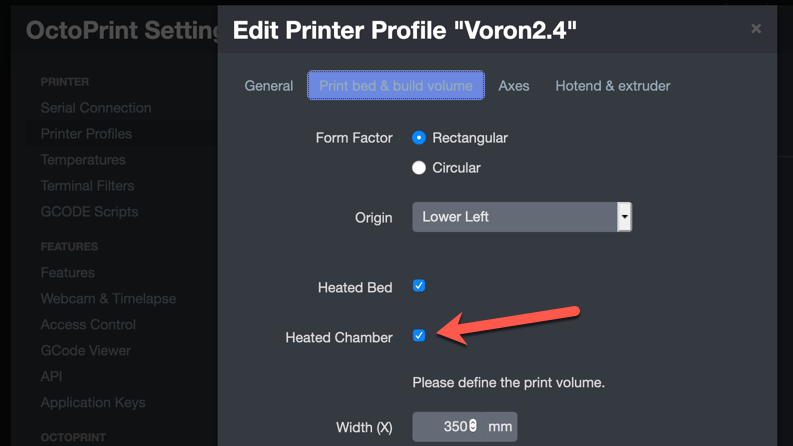

# Chamber Temperature & Exhaust Fan

While the two functions can be combined, if doing just chamber temperature the process is slightly different so they are documented separately.  The exhaust fan is already configured as part of the default build, so no information on installation is provided.

### References

https://github.com/alchemyEngine/VoronUsers/tree/master/firmware_configurations/klipper/alch3my

## Thermistor Wiring

* Place the chamber temperature thermistor in the selected location and run the cables down to MCU Z.
* Plug the thermistor connector into MCU Z, TH0 (z:P0.24)

## Klipper Configuration

### Chamber Temperature Only

If _just_ doing chamber temperature monitoring, add the following code to the printer configuration.

**Note:** Confirm that the thermistor type matches the type used.

```
[temperature_sensor chamber]
sensor_type: NTC 100K beta 3950
sensor_pin: z:P0.24
min_temp: 0
max_temp: 100
gcode_id: C
```

Restart Klipper with a `FIRMWARE_RESTART`.

### Temperature Controlled Exhaust Fan

To have the exhaust fan controlled by the chamber temperature, do the following.

* Comment out the entire section with the header `[heater_fan exhaust_fan]`
* Add the following section

**Note:** Confirm that the thermistor type matches the type used.

```
[temperature_fan chamber]
pin: z:P2.7
max_power: 1.0
shutdown_speed: 0.0
kick_start_time: 5.0
cycle_time:0.01
off_below:0.1
sensor_type: NTC 100K beta 3950
sensor_pin: z:P0.24
min_temp: 0
max_temp: 70
target_temp: 35.0
control: watermark
gcode_id: C
```

Add another section with a new macro.
<!--  -->
```
[gcode_macro M141]
gcode:
    
    SET_TEMPERATURE_FAN_TARGET temperature_fan="chamber" target={s}
```
<!--  -->
Restart Klipper with a `FIRMWARE_RESTART`.

With this configuration, the fan will run at 100% anytime the chamber temperature is above 35C.  The temperature is configurable later.

_Note: As of Klipper 0.8.0, the fan speed is not dynamically changeable using the temperature\_fan object._

## OctoPrint Configuration

In Octoprint, enable the chamber temperature sensor by going into  Settings -> Printer Profiles -> Printer.  Edit the profile and go under "Print bed and Build volume".  Locate the checkbox for "Heated Chamber" and enable it.



The chamber temperature will now be displayed and graphed in the temperature chart.  None of the Voron printers include a chamber heater so setting the chamber temperature will not function.

## Display Configuration

To display the chamber temperature on the front panel display, additional configuration is required.

* Download the [lcd_tweaks.cfg](./lcd_tweaks.cfg) configuration file and load onto the Pi.
* Edit _printer.cfg_ and add the line `[include lcd_tweaks.cfg]` to include the file.
* If only doing chamber temperature, edit the line
<!--  -->
```

```
<!--  -->
and replace with
<!--  -->
```

```
<!--  -->
* Restart Klipper with a `FIRMWARE_RESTART`
* If the display does not come on or only partially displays, check the `/tmp/klippy.log` for more information.

## Exhaust Fan Temperature Control (if chosen)

In the slicer or with other commands, run the `M141` command anytime to change the set point of the exhaust fan.

For example:

* Place a `M141 S70` in the start g-code to hold the chamber at a high temperature for the duration of the print
* Place a `M141 S35` in the ending g-code to cooldown the chamber after a print is completed.
