# Z Height Adjustment: Fine Tuning
by: Ayerlock v2.507

Congratulations, you have (mostly) completed your Voron printer. You have done your initial configuration and it is now spitting out plastic
items that, for the most part, look like you expect them to. However, you might be seeing what look to be compression artifacts.
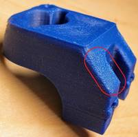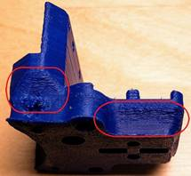

Sometimes these issues can be caused by a poor STL design, belts that are too loose/tight, Agatha Harkness + Ralph Bohner, etc. Most often
I have found that these issues are related to poor bed adhesion. If your print has risen off the bed, even if it is just a little on a corner
or edge, it will be reflected all the way up the print. 3D printers do not self-correct for that (yet?).

Having a proper Z height set for your buildplate, interchangeable plate (spring steel), etc. can greatly reduce adhesion issues. For instance,
I have four different spring steel plates with various finishes on them to make my parts look better. One shiny PEI from CSHyde with a textured
finish on the other side. One matte PEI spray on one side with a matte PEI sheet on the other. One Ultistik lightly textured on both sides. And
yet another for messing around/testing other finishes with. Because each of these finishes are of differing thickness, each plate requires a
slightly different Z height adjustment from that of the configuration file. Forgetting to set that for any of the build plates causes the issues
circled in the pictures above. Those were cause by printing parts on the Ultistik buildplate with the settings of the matte-finish buildplate.

Even without multiple buildplates just getting the Z height set on your printer initially can be problematic. People have differing methods, it
is not documented well, using Klippers Z_ENDSTOP_CALIBRATE method can be extremely time consuming and might make you give up with a good-enough
effort that will leave your prints wanting. My goal here is to help you utilize your printers web interface to quickly and reliably set the Z
height EXACTLY where it needs to be for your printer, to help your printing efforts.

In this guide I will be using FluidD for my web interface, but there the same exact tools are available in Mainsail and Octoprint. They may look
slightly different but the results are the same.

In my printer.cfg file I have the following set for my Z endstop:

```
#*#
#*# [stepper_z]
#*# position_endstop: 1.685
#*#
```

Imagine this is the default setting after you finish your initial Z_ENDSTOP_CALIBRATE from Klipper. The most reliable method I have found for
fine tuning this is to print a single layer box, numerous times, which is used to calibrate the height. The box prints in less than five minutes per
print and can help you rapidly hone your Z setting.

## SuperSlicer Setup:
*You might want to save a Print Settings profile for this in the event you need to repeat this in the future (you **WILL** repeat this in the future (new
PEI sheet, new spring steel, new buildplate, etc.)).*

- Under `Perimeters & Shell -> Quality` make sure that `Only one perimeter on Top surfaces` is checked. Since this is a one layer print this will
make the Vertical/Horizontal shells settings (and pretty much all the other settings on this tab) obsolete.
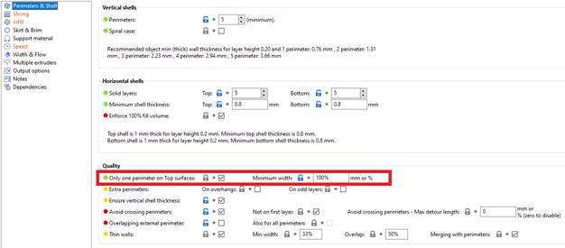


- Under `Slicing` set your layer height to 0.2mm.  
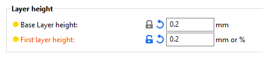

- Under `Infill` set:
```
  - Solid: Monotonic -> Connected
  - Top: Monotonic (filled) -> Connected
  - Bottom: Monotonic (filled) -> Connected
```

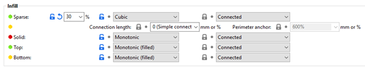

- Under `Skirt & Brim` make sure you have no brim set. If you have a good purge line set up you may not need a skirt but it might be advisable to
use one just to make sure that the hotend is primed with plastic the second it starts the box.

- Under `Speed` make sure that it is printing relatively slow for the first layer. I use the following settings:
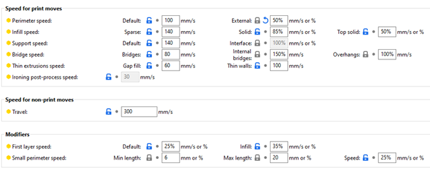

- Under `Width & Flow` use something like the following settings keeping in mind that we want the top solid infill settings to take
precedence. More thinner lines will help here.
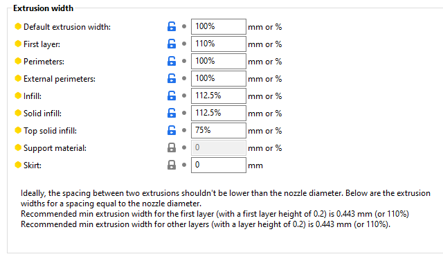

Once that is finished head to the **`Plater`** tab.

Right click in the `Parts/Modifiers` box on the right and `Add Shape -> Box`.
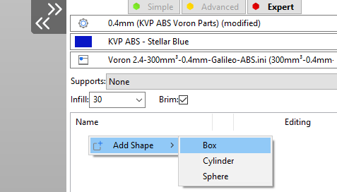

Make sure the Scale factors: & Size padlock (lower right) is UNLOCKED (just click the padlock if it is set to locked). Set the X, Y, Z settings under
size to 75/75/0.2. It should look like this:
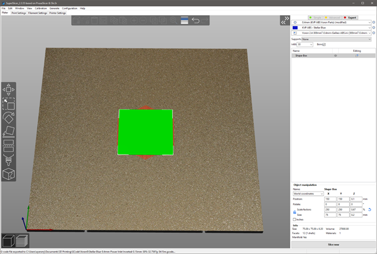

Slice now and upload the resulting `GCODE` file to your printer.

## Using the Z Offset in your Web Interface: ##

In FluidD I configured my Z Offset settings to allow me to raise/lower the offset in 0.005/0.01/0.05/0.1mm increments. This allows for fairly
rapid adjustment of the offset. It should look similar to this:
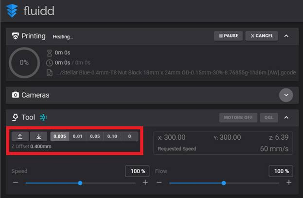

## Printing and Tuning: ##

Print the `GCODE` file you made in SuperSlicer using your default settings.

If your Z height is tuned close to correct you will get a print similar to this:
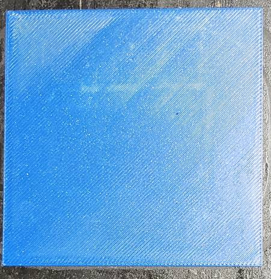

It should look relatively flat with no noticeable artifacts in it.

If your Z `position_endstop` is set too close to the bed it will look something like this:
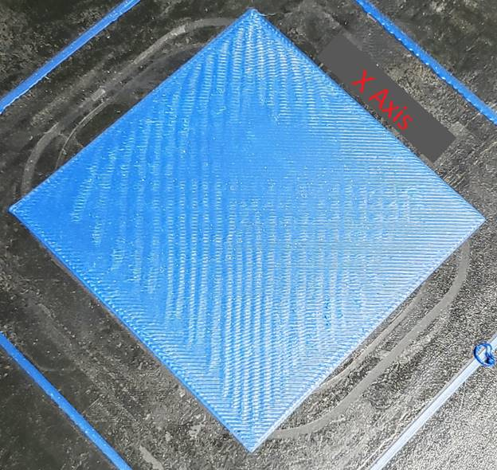
Notice all the lines moving from the lower right to the upper left of the buildplate. You may have more or fewer. These are caused by pushing
too much plastic into a hard defined geographic area. This can cause your print to push off the bed due to thermal expansion later in the print.
Its bad, you DO NOT want this. You will need to raise your Z Offset in FluidD, Mainsail, or Octoprint in small increments and reprint the box until
the lines are all gone. The first setting where you have no lines appearing in the print is where you want to permanently set your Z axis.

If your Z `position_endstop` is set too far off the buildplate your print will look like this when you lift it off.
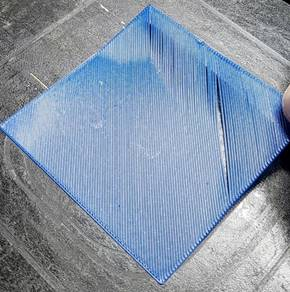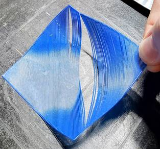

You will need to lower your Z Offset in FluidD, Mainsail, or Octoprint in small increments until you get a print with lines in it like above. Then
you will raise your Z axis back up to the first setting where you do not have any lines in the print.

It is a good idea to mark the Z Offset on each print so you have a relative reference of where you started as to where you are in your
calibration. It usually takes ~3 prints to get honed in. The first few times you do this will likely take more as you figure it out.
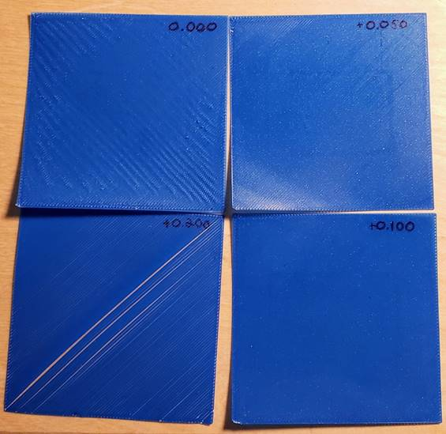

Once you have really dialed in the Z height you should notice that the square looks almost glued to the plate. This is a good example.
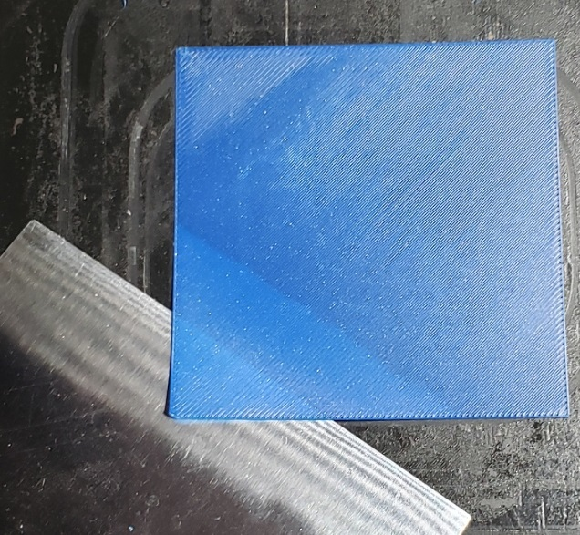

Using the final value of your Z Offset, you might want to permanently update your printer.cfg file with and adjust the position_endstop value by whatever final Z Offset value you settled on.

Hopefully you found this guide helpful. If you have any questions, feel free to let me know.

Thanks,

Ayerlock v2.507

