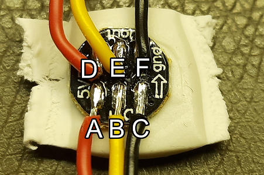
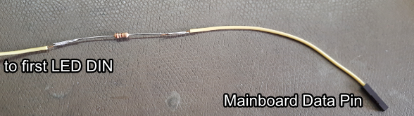

# Stealthburner Neopixel Guide

## Neopixel Theory: Basics

Neopixel is Adafruit's name for a variety of digitally controlled LEDs. They are also often named
by their driver ICs, with `WS2812B` and `SK6812` being the most common.

Each neopixel has 3 or 4 individually controllable LEDs inside: `Red (R)`, `Green (G)`, `Blue (B)` and optionally
`White (W)`. The intensity of these colors can also be individually controlled. Most often `SK6812`-based
Neopixels are `RGBW`, but SK6812 variants with only `RGB` exist. A dedicated white LED gives a more pure white color - 
mixing white out of the individual `RGB` components often result in a white with a noticeable blue tint.

For `RGBW` Neopixels you often have the choice of `Warm White`, `Neutral White` and `Cold White`, which are often 
advertised as `RGBWW`, `RGBNW` or `RGBCW`. Neopixels with a dedicated white LED can be identified by their yellow
phosphor part embedded in the LED.

Neopixels require a permanent +5V supply and a data signal. Other non-5V-variants exist, but are not covered within this
guide.

It's always good if you have a datasheet available for the particular Neopixel you've bought.

## Neopixel Theory: Data

Neopixels use a single data wire to transmit data to all LEDs. To achieve this, the data output (often named `DOUT`) of
a neopixel must be connected to the data input (often named `DIN`) of the next. Neopixels are not aware of their
position in the chain - the first Neopixel simply removes the data it receives first and passes on the rest of the data
to the following pixels.

Since `RGBW` Neopixels use 32 bits of data and `RGB`Neopixels use 24 bits of data, it is not recommended mixing the
two types on a single chain of Neopixels unless your Firmware has explicit support for that. 

Different types of Neopixels have different color orders - it is the order in which the color components are
transmitted over the wire. The color order is denoted by their beginning letters - for example, `GRB` means that
`green` is transmitted first, followed by `red` and finally by `blue`. 

Once the Neopixels have received their data, they will keep their color until they receive other data. This means that
unless you change your LED color, Klipper (and other firmware as well) will not transmit anything to the Neopixels.

## Troubleshooting

Here are some quick troubleshooting tips to get you started. If you can't figure it out, please ask in the Voron Discord
and mention which troubleshooting steps you've already completed. 

### No LED is working

1. [Check your wiring](#wiring-check) 
2. Double-check that you have configured the [correct pin](#choosing-a-mainboard-pin)
3. Double-check that you actually send data to the LEDs (the default stealthburner macros set a color on startup automatically)

### LEDs are showing the wrong colors

1. Double-check that you're using the correct color format
2. Add a [100 Ohm resistor](#adding-a-100-ohm-resistor-to-combat-signal-integrity-issues) in the data line to avoid signal integrity issues
3. Check that your crimps are done properly and that there's no intermittent contact

## Guides

### Wiring Check

* `A` is the 5V line going to your mainboard or to the previous pixel (`D`)
* `B` is the data line going from DIN to your mainboard's data pin or to DOUT of the previous pixel (`E`)
* `C` is the GND line going to your mainboard or to the previous pixel (`F`)

#### Checking Continuity
Put your multimeter into continuity mode and ensure it beeps when you hold the two probes together. Then perform the
following measurement tasks for each pixel:

* Ensure you have no connectivity between `A` and `B` (no beep) of the same pixel
* Ensure you have no connectivity between `B` and `C` (no beep) of the same pixel
* Ensure you have no connectivity between `B` and `E` (no beep) of the same pixel
* Ensure you have connectivity between `A` and `D` (beep) of the same pixel
* Ensure you have connectivity between `C` and `F` (beep) of the same pixel
* Ensure you have continuity between `D` and `A` of the previous pixel (or your mainboard)
* Ensure you have continuity between `F` and `C` of the previous pixel (or your mainboard)
* Ensure you have continuity between `E` and `B` of the previous pixel (or your mainboard)

If any of the measurements have an unexpected result, triple-check your solder joints. A jig like
[NeoPixelSolderingTool](https://github.com/camerony/VoronCustom/tree/main/NeoPixelSolderingTool) can help you in case
you need to re-solder the joints.

### Adding a 100 Ohm resistor to combat signal integrity issues

The data is sent with a signal rate of 800kHz, which is pretty high and can cause signal reflections, which in turn
degrades the signal integrity. The signal may be that much scrambled that the Neopixels cannot reliably interpret the
data, causing wrong or no colors.

The solution in most cases is to add a 100 Ohm resistor in the data line as close to the mainboard as possible. The
wattage and tolerance is not relevant, if you don't know what to get, get a 1/4W 5% resistor. 

**Do not crimp the resistor**. Instead, solder it to a wire as shown below. Use heat shrink tube to avoid the resistor
shorting out other components.

### Choosing a mainboard pin

Most modern mainboards have a dedicated neopixel output, sometimes called "RGB". If your mainboard has such an output,
you should use it if it's not already used otherwise. 

**Always check with the pin diagrams provided by your mainboard manufacturer before powering your printer on!**

Table of commonly used mainboards with their respective dedicated Neopixel outputs with 5V data levels:

| Mainboard                           | Connector Name | Pin   |
|-------------------------------------|----------------|-------|
| Bigtreetech SKR 1.4 (Turbo)         | Neopixel       | P1.24 |
 | Fysetc Spider 1.0, 1.1, 2.2         | 5V-RGB         | PD3   |
 | Bigtreetech Octopus (Pro)           | RGB_LED (J37)  | PB0   |
| Bigtreetech SKR Mini E3 v1.2        | Neopixel       | PC7   |
 | Bigtreetech SKR Mini E3 v2.0 / v3.0 | Neopixel       | PA8   |
 | Bigtreetech SKR Pico v1.0           | RGB            | IO24  |

Alternatively, you can use any pin which is directly connected to your MCU and which doesn't have circuitry in place on
your mainboard. Note that these pins output 3.3V data levels, and that can lead to the requirement to add a 100 Ohm
resistor and/or level shifter - see the respective chapters in this guide.

Here are some alternative pins for some common mainboards. Note that you may need to get your +5V supply and GND from
somewhere else on these boards.

| Mainboard                                   | Connector Name       | Pin               |
|---------------------------------------------|----------------------|-------------------|
| Bigtreetech SKR 1.3, SKR 1.4, SKR 1.4 Turbo | Servos               | P2.0              |
| Fysetc Spider 1.0, 1.1, 2.2                 | any free endstop pin | check pin diagram |
| Bigtreetech Octopus (Pro)                   | BL_TOUCH J43         | PB6               |
| Bigtreetech SKR Mini E3 v1.2                | Servos               | PA1               |
| Bigtreetech SKR Mini E3 v2.0 / v3.0         | Z-Probe              | PC14 / PA1        |
| Bigtreetech SKR Pico v1.0                   | Servos               | IO29              |
