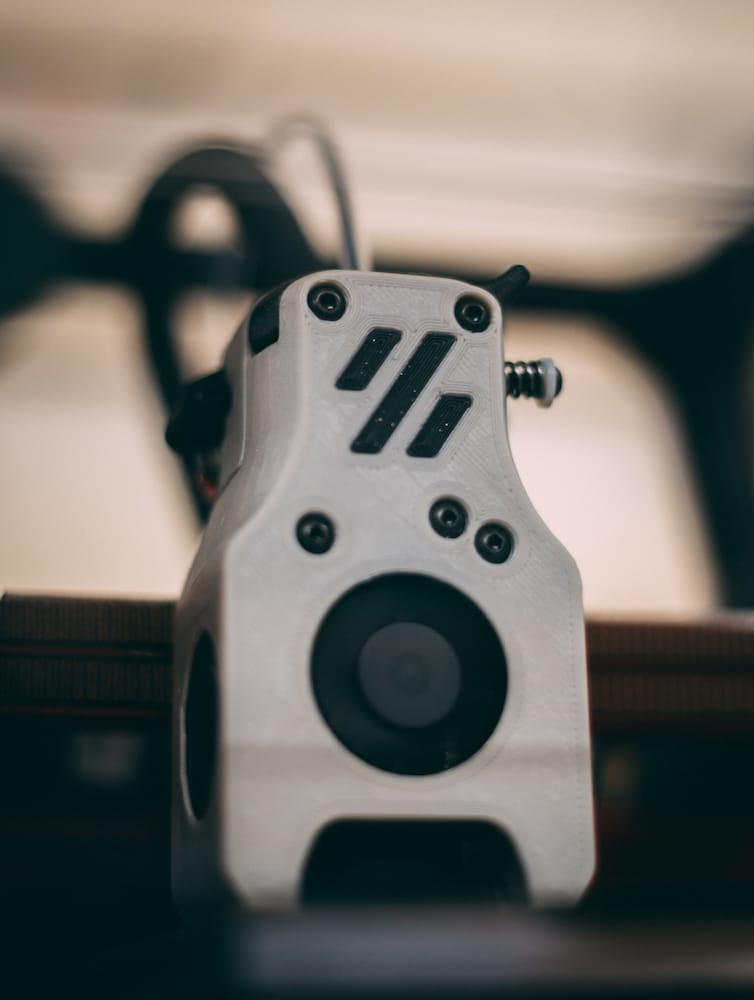
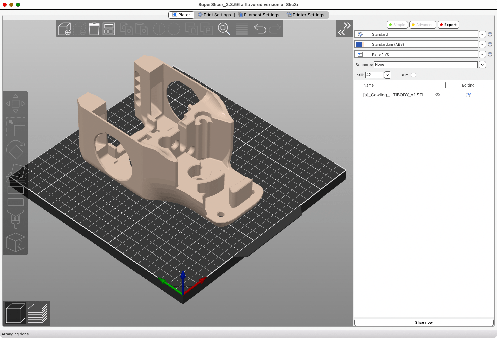
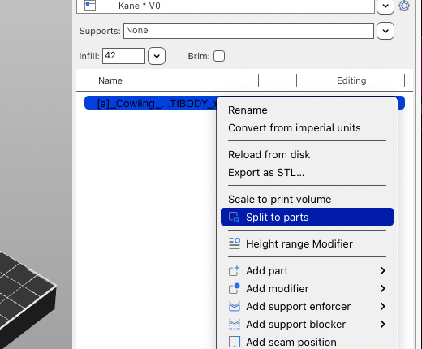
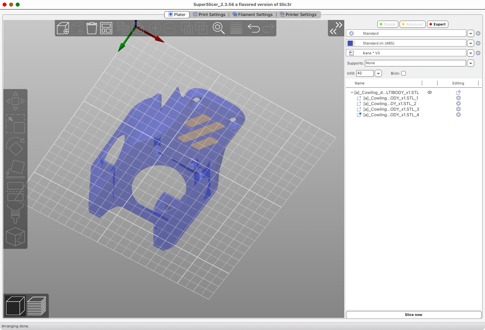
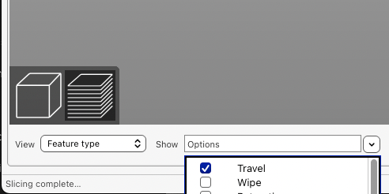
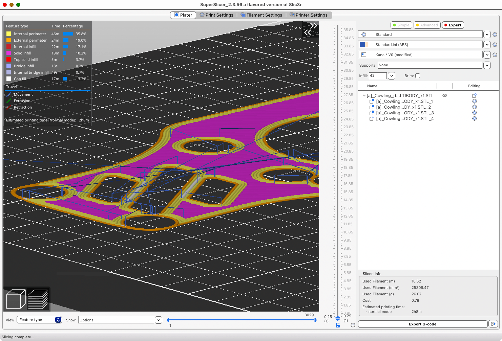
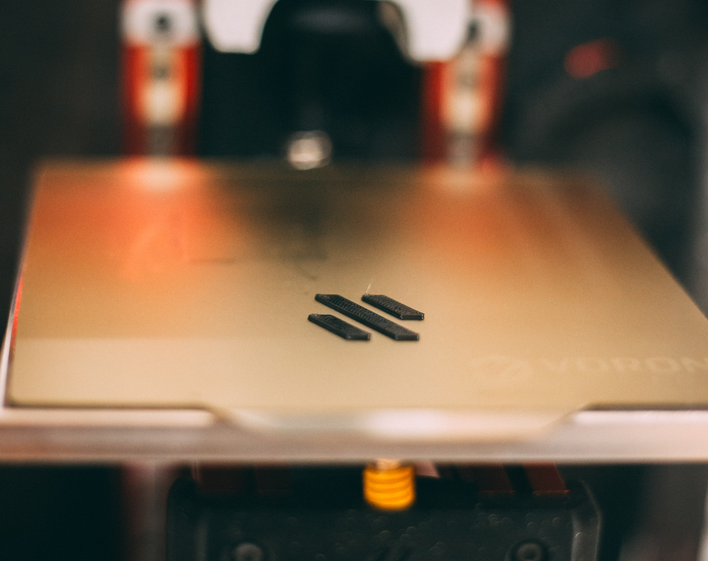
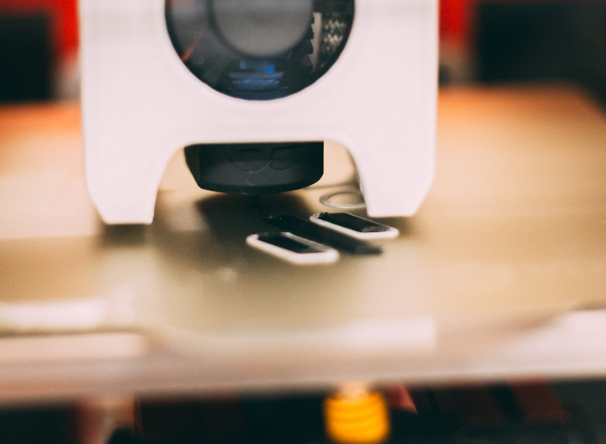

This is a quick guide on doing a simple multi-colour print using a printer with a single nozzle and extruder setup in [Super Slicer](https://github.com/supermerill/SuperSlicer)--no [MMU2S](https://www.prusa3d.com/original-prusa-i3-multi-material-2-0/) or [ERCF](https://github.com/EtteGit/EnragedRabbitProject) required.

This is mainly useful for prints that need an accent colour on the side facing the build plate such as the cowling from the [Voron V0.1](https://vorondesign.com/voron0.1) Mini Afterburner. It will not work well with accent pieces that need to be very deep and while more than one colour can be done, it will add more chances for failure.

I'm by no means the first to do this, write about it, or in anyway take credit--this is merely a reminder for myself how to do when the need arises.

## Multi-Body STL's
For this we'll be using the multi-body cowling for the Voron V0.1, however any similar file will work. The primary requirement is that you have a file that includes two or more bodies that can be printed separately. Ideally the accent colour piece is no taller than around 0.6mm in the z-axis, just enough to clearly differentiate it from the colours around it.

The specific piece we've be using the is the [[a]_Cowling_dragon_MULTIBODY_x1.STL](https://github.com/VoronDesign/Voron-0/blob/Voron0.1/STLs/Toolheads/Mini_Afterburner/Dragon_Toolhead_DD/%5Ba%5D_Cowling_dragon_MULTIBODY_x1.STL) from the Mini Afterburner.

## Slicing Your Accent Pieces
This is where most of the work will be done. We'll be using Super Slicer, but this should also work in Prusa Slicer and others.

Import your STL or other printable model as per usual. Depending on the format you will only see a single model at first. You will need to right-click the file in your part list and select **split to parts**. This will then split the file into the multiple bodies we need.

Identify the bodies that will be your primary colour and your accent colour, in our case the main body will be primary, and the Voron logo (3 separate bodies) will be our accent.

We're first going to slice the accent pieces, so you will need to right click the primary colour piece and select **change type** and then pick **modifier** from the list. This tells the slicer this body is no longer a printable body and is instead used to modify the other bodies (for example as support enforcer or blocker). For us we merely just need it to not be printed.

You will now slice the remaining accent pieces as normal. If possible omit a skirt as it will make your life easier but it's not required. Export the resulting gcode and save it to an appropriate place.

## Slicing Your Primary Pieces
Next we're going to do the primary coloured pieces, and this is where the real magic happens. You will now want to change your accent coloured pieces to be **modifiers** and change your primary piece back into a **part**, reversing the bodies we want to print.

Then we need to head to printer settings and enable z-hop for this part. It will need to be set to a height taller than the height of the accent pieces, to be safe double the height can be used. For our example piece that would be 1.2mm. You will need to ensure this is active starting from the bottom layer and most likely turn it off once we've exceeded the accent part. It can be left on, however you may experience stringing or blobs from the excessive z-hop height.

Before we export this gcode we do want to verify that z-hop is enabled as intended. This can be seen in the gcode preview view and turning on travel moves under the show dropdown.

It should look similar to the below image, with clear vertical movements on the bottom layers. If you're not seeing that you will need to go back to your z-hop settings and verify the height you've set and that it's on for layers starting from 0mm (it's not uncommon to have it off for the first layer).

With that verified slice and export your model and save your gcode file accordingly.

## Printing Your Files
Now we're at the easy part! The order of operations are listed below along with a few gotcha's to watch out for:

1. Start your accent part print as per normal
2. Once the part has completed, immediately set your bed heater to printing temperatures
3. Careful remove the skirt if you printed one as well as any purge line, **do not move your print surface**
4. Swap filament to your primary colour, being sure to purge enough so there's no colour bleed
5. Start your primary part print

The first part should go down easily and hopefully end up with something like below if you're  using the example model.

Once that's done and your second one is going you should see the toolhead print around our existing part which is quite fun to watch.

You should also see the exaggerated z-hops on the lower layers of the print to avoid colliding with the first printed part.

## Gotcha's To Avoid
I can't account for all the various setups people have but here are a few couple things to watch out for when doing this.

**My printer homes in the middle of the print surface!**
While annoying this one is relatively easy to fix, don't print your accent pieces in the center of your bed! You will have to determine based on your homing setup and print volume where you can safely print, but simply move the file to that location *before* you split it into multiple bodies. That will allow the printer to safely home without interfering with the existing print.

**What about my bed mesh at the start of the print?!**
This is probably the biggest one to work around. You could try and have it that the accent part perfectly sits between probe points but that's probably asking for trouble. The best solution I've found is to remove both the running of the bed mesh and the clearing of old ones from your start gcode. Instead preheat your bed and nozzle to the temperatures you normally do a bed mesh at and run it before your first print, ensuring it gets saved, and then running you prints immediately after.

This should ensure you have a relatively good mesh for both prints, as long as you don't let the bed cool down between meshing and printing. For Klipper users that leverage the `print_start` macro you can simply edit the macro before hand and restart the firmware. Be mindful if you use `G32` in your macro as it by defaults does a clear of any existing bed meshes which you do not want in this case.

What I personally have done is created secondary macros called `print_start_multi_colour` and `print_end_multi_colour`. These are slightly modified to not clear my bed mesh, not turn off my bed heater at the end of the print, and park my toolhead at the front of the bed so I can easily do a filament swap. I simply adjust my slicers start and end gcode when doing these prints to use the new macro names.

## Next Steps
Hopefully that helps you get some nice multi-colour prints done without too much hassle. It's a little bit of work, but also can produce some really nice results. If you want some inspiration checkout this [video](https://www.youtube.com/watch?v=KV2AjyowXX4) by Devin over at [Make Anything](https://www.youtube.com/channel/UCVc6AHfGw9b2zOE_ZGfmsnw)--he uses a similar technique to create some amazing full colour phone cases!
