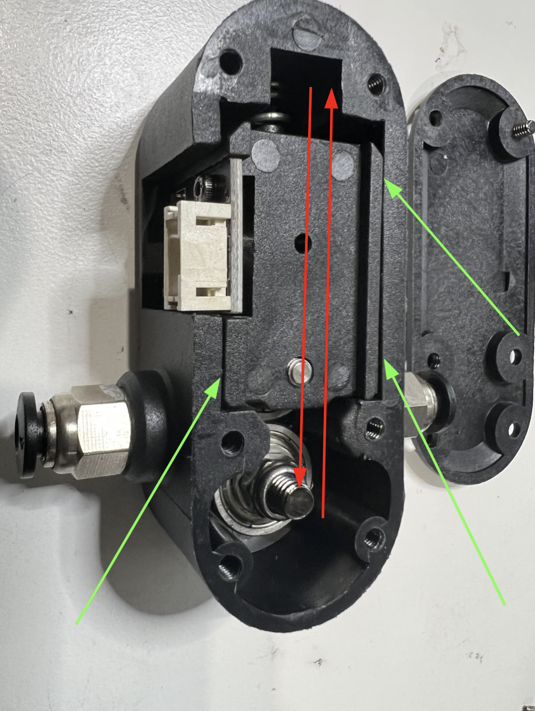

# Setup a BTT Smart Filament Sensor

This is a guide to setup a [BIGTREETECH Smart Filament Sensor](https://github.com/bigtreetech/smart-filament-detection-module) with klipper.

The BTT Smart Filament Sensor has other advantages beyond letting you seamlessly change filaments. Such as detect:

* Hotend jams
* Nozzle clogs
* Partial nozzle clogs
* Filament tangles
* Overcontraints of the filament path (Under-extrusion)
* Under-extrusion

## Setup Notes:
1. Ensure the sensor is plugged into an endstop port. Please refer to your MCU pinout to identify the pin you are using.
1. Set your endstop pin as a pull-up (put a `^` before the pin).
1. Ensure that the reverse bowden is contiguous all the way from the toolhead to the sensor. Any open/unconstrained filament will cause it to false detect
1. Sensorless homing/StallGuard is known to interfere with the sensor if the diag pin is set on the MCU where the filament sensor is connected.
1. When starting klipper you should disable the filament sensor. This prevents it from tripping while you're just loading filament, doing testing or maintenance, etc. It should then be enabled in `PRINT_START` and then disabled again in `PRINT_END` and `PRINT_CANCEL` Example config below.
1. **(Optional but recommended)** Take it entirely apart and lubricate everything especially the little wheel that sits in front of the sensor. The grease that comes with the sensor is not the best and can cause the filament to slide on the bearings instead of rotating them which is needed to drive the sensing wheel. **DO NOT allow any of the lubricant to get in/on the filament path as that will cause the filament to slip on the bearings and not drive them.**
1. **(Optional but recommended)** Shim the interior so it can only move back and forth. Using small strips of paper is enough to shim. You may need to fold them several times to fill the gap. See picture bellow.
    * <span style="color:green">**Green arrows** </span>indicate where the sensor should be shimmed.
    * <span style="color:Red">**Red arrows** </span> indicate what the internal body motion should be constrained to.

<p align="center">
  
</p>

## WARNING:
**You will want to ensure that you have robust pause and resume macros. Your resume macro will need to prime the nozzle slightly so there are no gaps where the printer resumes. Ellis has examples on [his GitHub](https://github.com/AndrewEllis93/Print-Tuning-Guide/blob/040d31c6daaed23c2a1a353545e7ee442a232f32/articles/useful_macros.md)**

## Example configs:
```
[filament_motion_sensor SFS_T0]
detection_length: 10.00 ; This can be adjusted to your desired level of sensitivity. 10 is a recommended value to prevent flow dropoff false triggers.
extruder: extruder
switch_pin: ^PG11
pause_on_runout: True ; This can be set to false to debug false positives putting the sensor in "monitor mode". The printer will not pause but it will run the runout_gcode below.
event_delay: 3.0
pause_delay: 0.5
runout_gcode:
    M117 Runout Detected!

[delayed_gcode DISABLEFILAMENTSENSOR] ; This will disable the SFS 1 second after klipper starts
initial_duration: 1
gcode:
    SET_FILAMENT_SENSOR SENSOR=SFS_T0 ENABLE=0 ; Put your filament sensor's name after SENSOR=

[gcode_macro SFS_ENABLE] ; Add this to PRINT_START
description: Enable smart filament sensor
gcode:
    M117 ENABLING the Smart Filament Sensor
    G92 E0
    SET_FILAMENT_SENSOR SENSOR=SFS_T0 ENABLE=1 ; Put your filament sensor's name after SENSOR=

[gcode_macro SFS_DISABLE] ; Add this to PRINT_END and PRINT_CANCEL
description: Disable smart filament sensor
gcode:
    M117 DISABLING the Smart Filament Sensor
    G92 E0
    SET_FILAMENT_SENSOR SENSOR=SFS_T0 ENABLE=0 ; Put your filament sensor's name after SENSOR=
```
