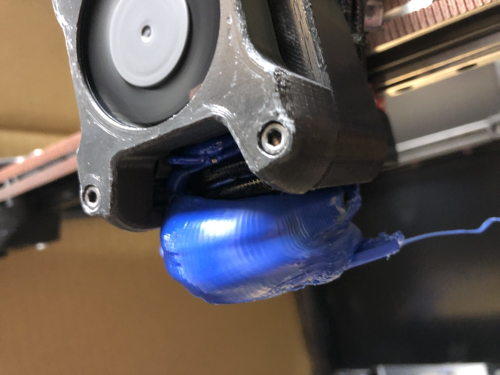
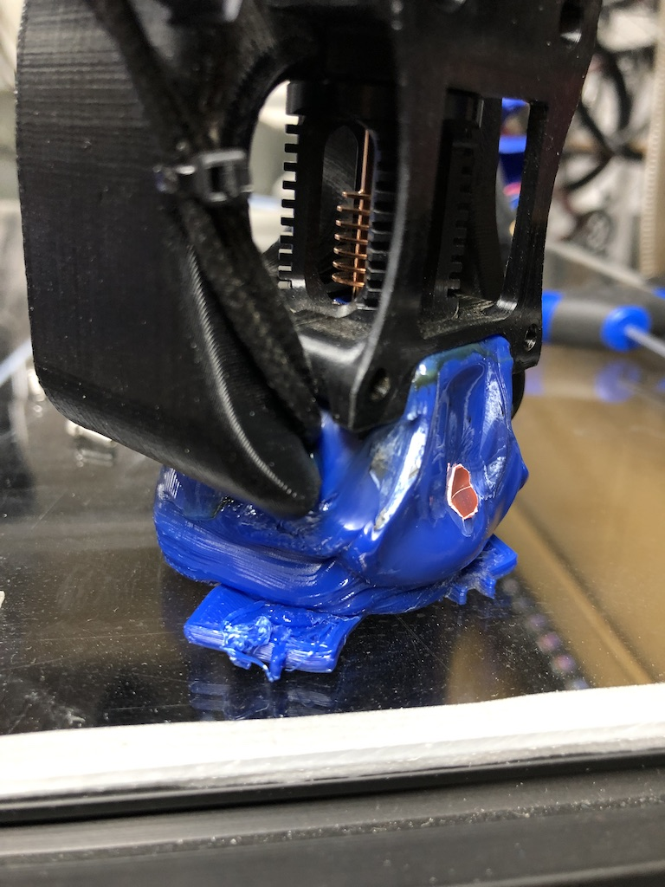
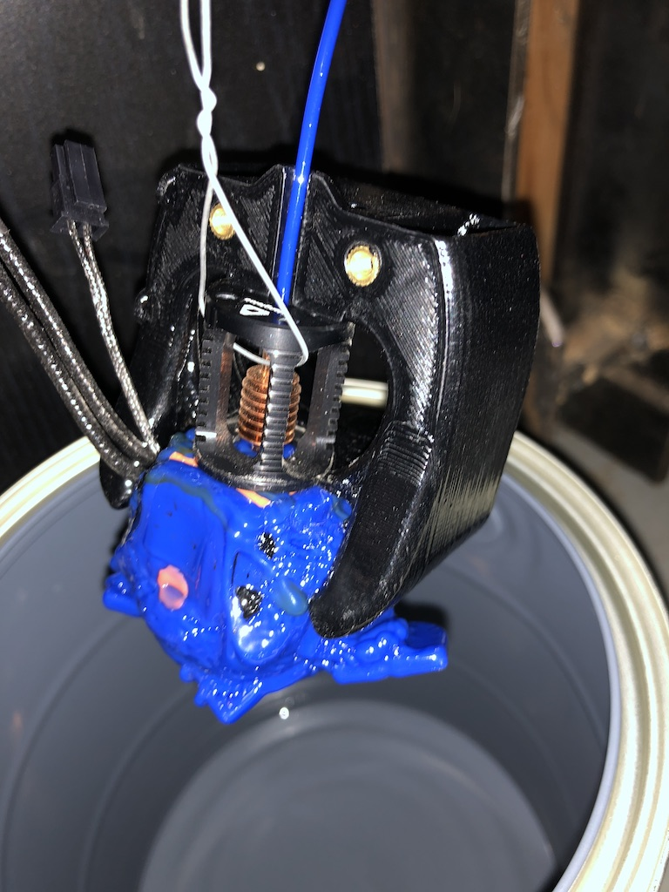
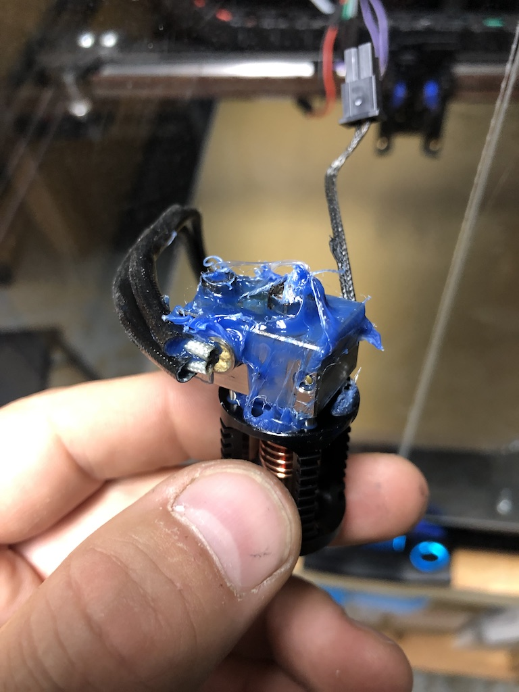

# Blob of Death

Wake up from running an overnight print of ABS and find this?

Do not panic!  It is recoverable.

1. Remove all parts that can be easily removed - back half of mount, zip ties, screws, etc.  (A pair of heavy diagonal pliers may help)
2. Find / purchase an acetone-proof container.  Local hardware stores frequently carry metal paint cans which work well for this purpose.
3. While at the hardware store, purchase some acetone.  Typically found in most paint / stain sections.
4.  With some solid steel or copper wire, suspend what is left of the toolhead by the hot end itself from the lid of the container.
5. Pour some actone into the bottom of the container.
6. Lower everyting into the container so that the toolhead is suspended at least an inch or two above the acetone, and close the lid.
7. The acetone vapors will begin to melt the ABS.  
8. Check on it every few days, the softened ABS may need to be scraped away to allow the acetone vapors to reach the still-hard ABS.
9. Eventually all of the ABS can be removed, some final cleanup will be required. 

