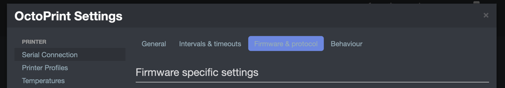
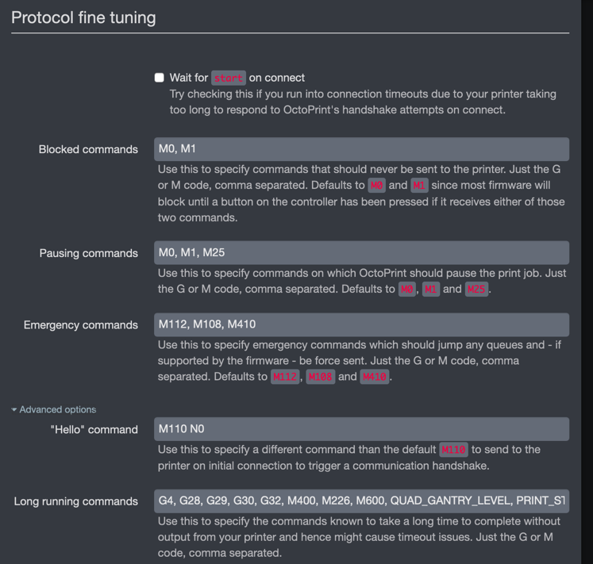

# OctoPrint Serial Timeout

OctoPrint has built-in timeout for the internal serial connection to Klipper.  Some of the macros such as `PRINT_START` can take a long time to execute and cause Octoprint to disconnect.  Instead of increasing the timeouts, add one or more of the macro names to the list of long-running commands.

The long-running commands can be found under 'Settings' -> 'Serial Connection' -> 'Firmware & Protocol'. Then under 'Protocol Fine Tuning', expand the 'Advanced' section to locate the 'Long Running Commands' list.

