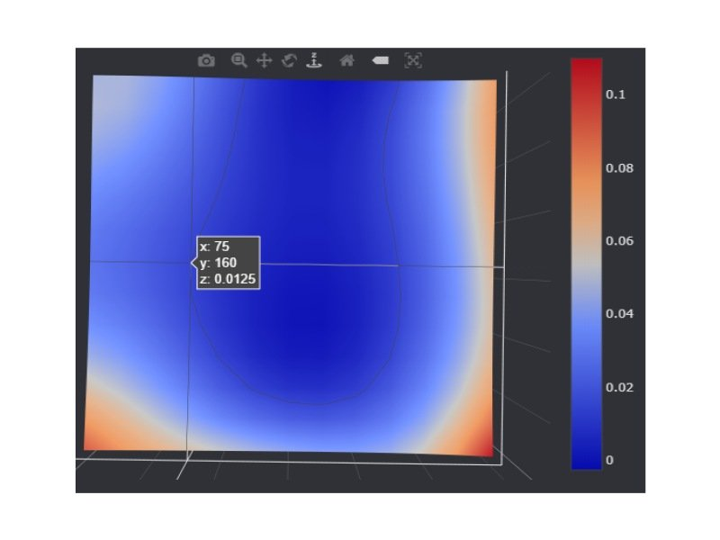
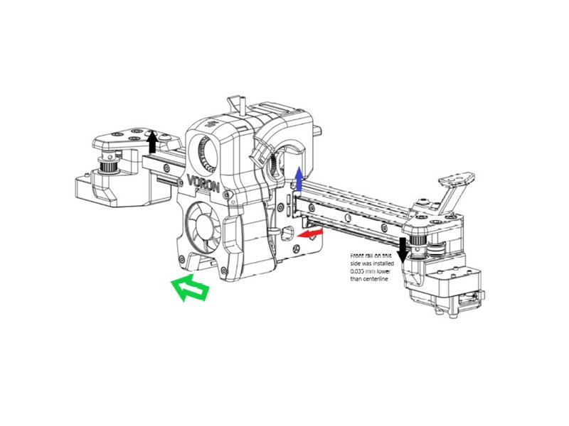
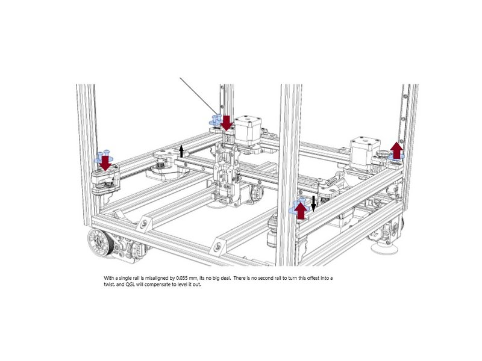
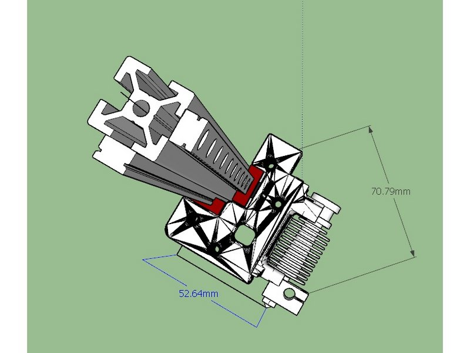
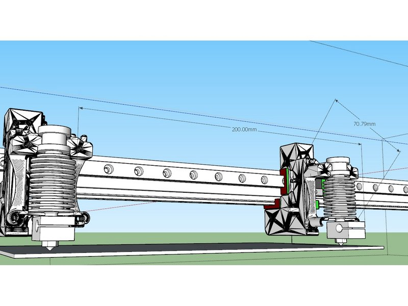
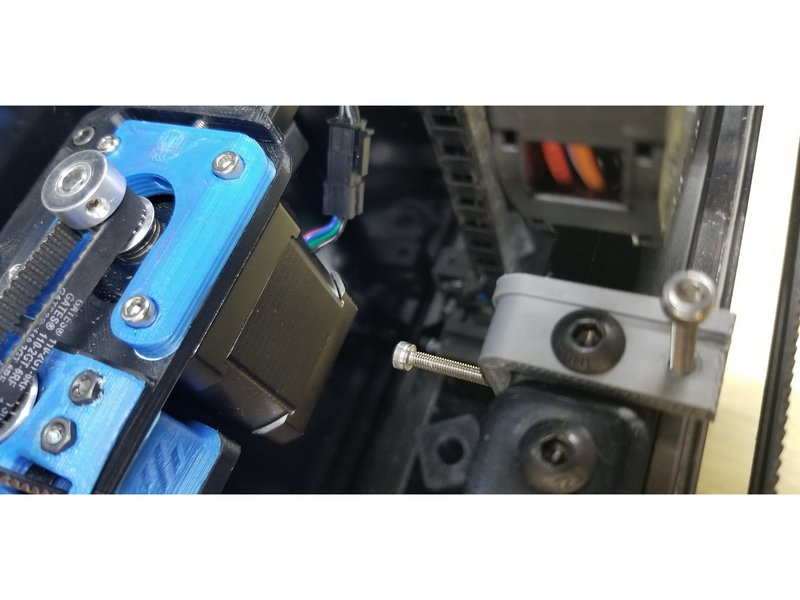
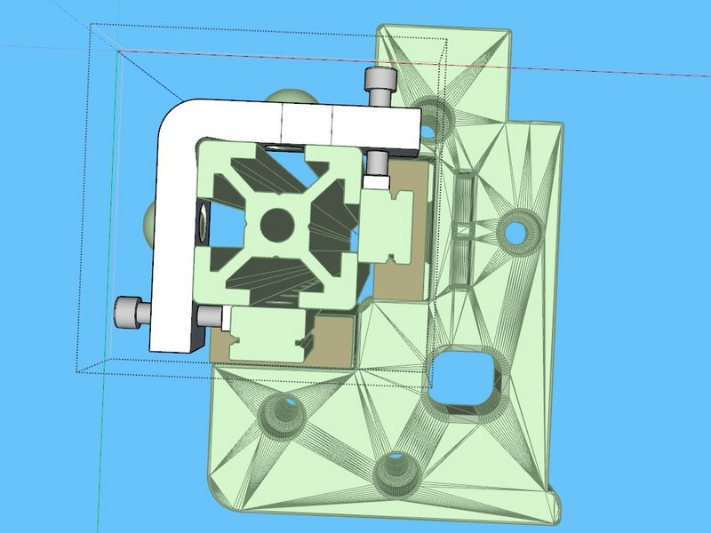
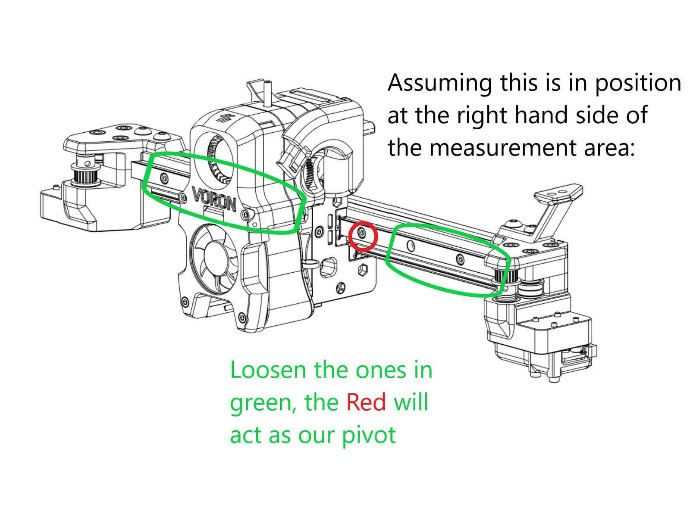
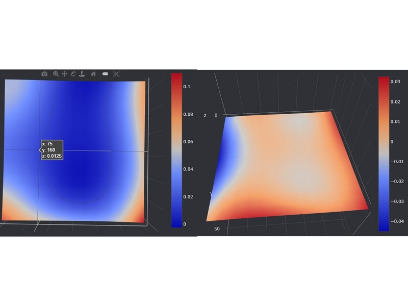

# Rail Misalignment Causing Twist

## Issue with twist?

* I had an issue with my first layer height. my bed mesh showed 75,160 and 220,160 should be close to the same z but they were off by 0.08mm.
* Discord gurus diagnosed this as evidence of twist. And they are correct, but it is not the extrusion which is twisted.
* I found that the rails were slightly misaligned relative to the extrusion, this lets the carriage spiral around a straight extrusion (within the flex of the carriage and tolerance of the rails)

## Measure twice..

[Before Measurement Video](./images/rail_misalignment_measure_before.mp4?raw=true)

* I mounted a dial indicator to the front of Afterburner and started taking measurements
* I found that the measured delta would vary with different z height. If this were simple tilt, the measurements would be the same no matter the z height.
* The delta would vary from 19/1000 to 25/1000, the higher I went the larger it was. this allowed me to calculate the amount of "twist" and the rail misalignment

## Identify the issue

* This diagram shows what I think is going on. In the AB, you align and install the front rail, then align the bottom rail to it.
* If the front rail is slightly misaligned higher on the left/lower on the right (black arrows), it will pull up on the carriage (gray arrow) when moved to the left (green arrow). The bottom rail is constrained in that direction, so it moves forward(red arrow), and the carriage is tilted.
* From the measurements I took, I was approx. 0.035mm high to the left and 0.035 mm low on the right. I calculated the twist at approx 0.4 degrees.
* But why haven't we seen this before? can't QGL take care of it?

## Why 2.2 has no issue here and why QGL can't fix it for Afterburner

* With 2.2 there is no bottom rail to turn tilt into twist. QGL can compensate for any misalignment by adjusting the y rails up and down
* With afterburner though, the bottom rail can turn this tilt into twist.
* QGL cannot fully adjust for twist, because it's only function is to adjust the 4 z stepper offsets so that 4 measurements are equal.
* QGL cannot compensate for twist and remain untilted. because of the size of the relative errors, it is biased to tilt correction

## Effect at nozzle

* If the front rail is misaligned by 0.035 mm, then the twist over the x axis would be 2* atan(0.035/10)= 0.4 degrees. over the entire rail
* The nozzle is 70.79 mm away from centerline. So what is the effect relative to the build surface?
* Over 200 mm, the carriage would rotate only 0.2 degrees. but at a distance of 70.79mm from center, that works out to a lift of 0.18mm. (mine was less than this, 0.08 over 150mm)
* So yes, that could be the problem. but how to fix?

## Remediation

[Remediation Video](./images/rail_misalignment_remediation.mp4?raw=true)

* ***BE CAREFUL HERE*** you are operating on a running printer
* Get the printer zeroed out and QGL'd.
* The process twill be to loosen up all the bolts in the lower rail, loosen all but one in the frontrail, and use a paper test or dial indicator to check for rail alignment

## Making the adjustment

* Install this adjuster on the far left (x=0) side of the x rail. Move the carriage to the right side of a known flat area on your bed and zero out the indicator.
* SAFETY WARNING: Do not home with this adjuster in place! Be very careful when operating at high Y values!! If you do, it will contact well before the y switch does, and you will have bigger problems on your hands
loosen all the screws securing the front rail *except* the one immediately to the carriage's right, this will be our pivot for the rail adjustment.
* Move the carriage left. after the carriage uncovers a screw, adjust the adjuster on the left until the dial indicator reads 0, then tighten down the screw.
* Repeat until the front rail is all secured.
* Tighten all the screws on the front rail, turn the motors off, and verify that there is smooth movement.
* You may need to repeat this a few times.

## Results

[Remediation Results Video](./images/rail_misalignment_results.mp4?raw=true)

* This took several iterations.

## Effect of twist on mesh

* Mesh on the left is with the twist (0.4 degree) mesh on right is after fix.
* With my twist, as the probe moved left the twist would turn it away from the bed, exaggerating the distance
