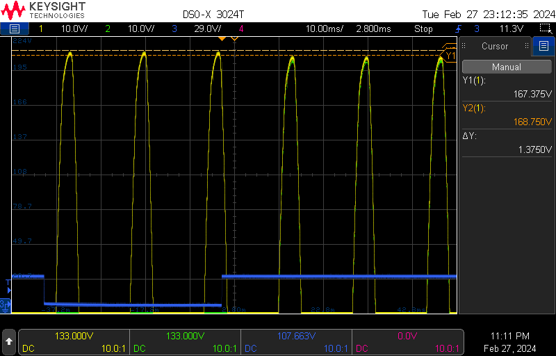
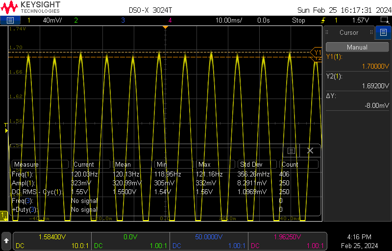
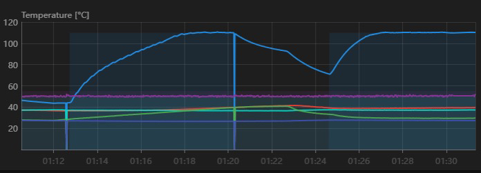
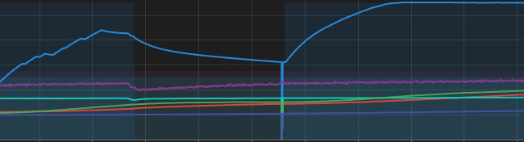
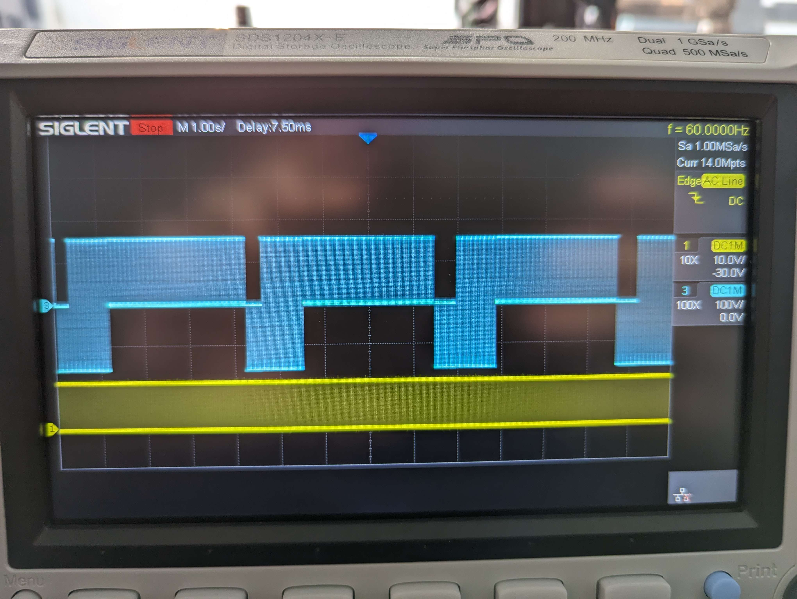

# Reducing light flicker from your bed

## tl;dr

The primary way to reduce flicker is to adjust the PWM frequency to 44.9 or 47.9 Hz on a 60Hz mains grid, or 37.4Hz or 39.9Hz for a 50Hz grid. Alternatively or additionally, change your lamps to the ones recommended below.

## Why flicker happens

* A mains powered bed heater in a 3d printer bed causes a significant disruption to the power supply when it is switched. Usually you will see a voltage drop in a dumb system like mains electrical[^1] when the SSR is on during PWM.
* If lights are shared on the same circuit as the printer, the voltage drop pulses can cause the light to lower in brightness when the bed is on, and raise in brightness when the bed is off[^2].

Here's some actual data:

(image credit royicus)

You can see how the mains voltage near the printer drops when the bed is on, noted by the blue trace being high.

A lamp was connected and a phototransistor was used to gauge the light output, and as you can see in these captures the output majorly fluctuates at the default 10Hz frequency:

(image credit royicus)

## Options for reducing flicker
### Change the bed-heater frequency to 44.9 or 47.9 Hz
**Note**: All frequencies discussed in this section are relative to a 60Hz mains system. If your mains frequency is 50Hz you will probably experience similar results adjusting the numbers proportionally, however, this has not been tested.

Math to arrive at the frequencies recommended
44.9Hz = 60Hz*(3/4)-0.1
47.9Hz = 60Hz*(4/5)-0.1
37.4Hz = 50Hz*(3/4)-0.1
39.9Hz = 50Hz*(4/5)-0.1

It seems that 44.9 or 47.9Hz results in a sweet spot between reducing flicker and causing instability during heating (see below). To set this, simply add a line in the `[heater_bed]` section of your Klipper config. If you already have a `pwm_cycle_time` line simply change the number.

`pwm_cycle_time: 0.02227 # 44.9Hz`

or

`pwm_cycle_time: 0.02088 # 47.9Hz`

for 60Hz, and

`pwm_cycle_time: 0.02674 # 37.4Hz`

or

`pwm_cycle_time: 0.02506 # 39.9Hz`

for 50Hz.

With this frequency applied you can see that the lamp brightness fluctuates far less and at a higher frequency:

(image credit royicus)

With both reduced and higher frequency fluctuation, human vision is less likely to detect flicker. Which of those two PWM frequencies works better seems to be variable.

### Why you should not set the PWM frequency to or near your mains frequency
There is a decent chance you will get heating instability, such as:

(images taken at 60Hz, credit Thor)

In those images you can see a heating with the bed frequency at the mains frequency on the left, and the default 10Hz on the right.

The reason for this is the SSR only switches at zero-crossings. If the switching frequency is close enough to the mains frequency the SSR can wind up getting sort of locked, where it can't control whether the power is fully on or half on, so the heating becomes erratic. You can see the problematic power waveform below;

(image credit ark)

### Change to different light bulbs
* Lower power lightbulbs have been observed to flicker less, with the exception of 40W equivalent GE bulbs
* GE relax 60W and GE Classic 60W tested well.  Other models tested include: Lowe's store brand, and IKEA, neither of which worked well.
* Limited bulb models were tested so this list is by no means exhaustive.

### Install an inlet filter?
* Inlet filters are generally not recommended to address flicker. They are aimed at much higher frequencies that would not be observable to the human eye, and therefore unlikely to be effective at reducing flicker

## Attributions
This was a major team effort on the Voron discord, but special recognition should go to:

* Voron discord user royicus, for many scope captures and much testing
* Voron discord user ark, for coming up with the numbers and some scope captures showing the reasons for instability at mains frequency

## Footnotes

[^1]: In smart systems with a voltage regulator you will usually see an undershoot when the load is switched on and an overshoot when the load is switched off

[^2]: LED and CFL lightbulbs won't behave *quite* that simply, but the end result is still flicker, based on the variation in RMS line voltage
