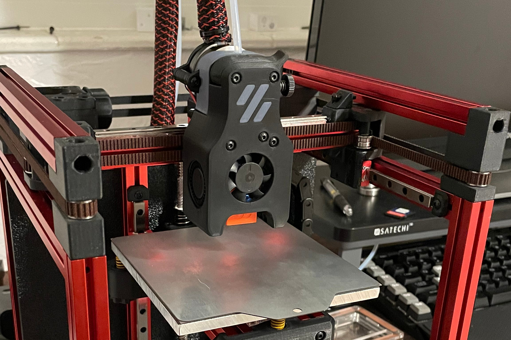

# Choosing a Printer / Extruder 

This is a guide to help people in selecting and building their first Voron printer and/or extruder.

# Printer Models

There are currently 5 printers in the Voron lineup.  One is not necessarily better than the other, just different.  All printers (except Legacy) are capable of being fully enclosed to print ABS but can just as easily print PLA, PETG, or even Nylon.  All printers in the Voron lineup are designed to use a Raspberry Pi linked to one or more motor controller board(s) to manage all of the printer functions and interface controls.

_Note: Pricing estimates are in US Dollars and do not include any necessary tools or other common building supplies. Costs vary widely depending on sourcing, part selection, and shipping costs._

## Voron 0

The [Voron V0](http://vorondesign.com/voron0) is a traditional CoreXY design with the bed moving along the Z axis. It is a tiny 120mm^3 print area built with 1515 extrusions. It encloses naturally so printing ABS is possible. Currently, all single mechanical parts for V1 and V2 can be printed on a V0 bed. The design accounts for stock Makerbeam XL extrusion lengths (which come tapped) and standard MGN7 linear rail lengths, so scaling the design will start to increase cost or labor involved with tapping. The bed is also cantilevered which will also restrict scaling. This printer can be built for between \$400 - \$600.

[V0 Preview](https://www.youtube.com/watch?v=KR9YlTzWzQQ)

## Voron 1

The [Voron V1](http://vorondesign.com/voron1.8) is a traditional CoreXY design where the bed moves along the Z axis. It is simpler to build compared to V2 and can be built for between \$1,000 - \$1,300. It encloses naturally so ABS or other temperature sensitive filaments can be printed easily. It uses rails for the X and Y axis so you can scale to a 300x300 plate. Z height is somewhat restrictive due to the limited options with integrated lead screw steppers. 

[V1.8 Homing Routine](https://www.youtube.com/watch?v=R2wU3If3KUA)

## Voron 2

The [Voron V2](http://vorondesign.com/voron2.4) is a modified CoreXY design with a static bed and a gantry that moves along the Z axis. It is a much more complex build because it includes things such as 4-point gantry tramming to align to the print surface, dual MCUs, and other unique features. It is also designed to be fully enclosed so it prints ABS or similar filaments very well. Due to the linear rails the design is scalable all the way up to 350^3. More linear rails, larger print surface, and other V2-specific items make this printer more expensive, at between \$1,500 - \$1,900.

[V2.4 Quad Level](https://www.youtube.com/watch?v=xfsnEO2VtwM)

## Switchwire

The [Switchwire](http://vorondesign.com/voron_switchwire) is a Voron take on a classic Mendel (aka "bedflinger") design. It is a CoreXZ design so the print head is belt driven in both the X and Z axis eliminating the typical leadscrew Z drive allowing for very fast Z movement speeds and less weight on the grantry by moving the X motor to the frame. The stiff 3030/3060 contructed frame is just large enough to cover the entire swing of the bed and allows for a natural enclosure.  Without having an existing Prusa printer to pull parts from, cost is between \$700 - \$900

[Switchwire Introduction Video](https://www.youtube.com/watch?v=jwPLl1v5ae4)

## Legacy

The [Legacy](https://vorondesign.com/voron_legacy) is a tribute to the roots of the Voron project and the RepRap project. It returns to the classic design using LM8UU rods and bearings but retains the new Afterburner toolhead.  It is not designed to be enclosed. The electronics enclosure is very small, adding to the open-air vibe. Costs are variable depending on the builder's old stock of LM8UU components but are expected to be between \$600 - \$800.

[Legacy Introduction Video](https://www.youtube.com/watch?v=NZqvRLa8ShE)

# Extruders and Variants

## Mobius (M4)

Mobius is the original Bowden extruder for Voron printers, designed to be mounted on the frame.  Highly optimized, dual gear, and very effective for Bowden setups.  Driven by a full-size or a compact "pancake" NEMA17 motor.

[M4 Introduction Video](https://www.youtube.com/watch?v=H2RBZYDZgTQ)

## Jetpack

Jetpack is a modified Mobius designed to be mounted on the X axis for a shorter Bowden.  Was designed as an intermediary solution to reduce the bowden tube lengths before the introduction of Afterburner.  It is driven by a compact "pancake" NEMA17 motor.

## Afterburner

Afterburner is not specifically an extruder, but the collective name for the Voron direct-drive interchangeable toolhead system.

[Afterburner Announcement Video](https://www.youtube.com/watch?v=lmJkIXW5tXc)

## Clockwork

Clockwork is the name given to the original extruder system for Afterburner.  It is a repackaged BMG dual-gear extruder driven by a compact "pancake" NEMA17 motor.  The Afterburner term is commonly used to refer to this extruder.

## Pocketwatch

Pocketwatch is the Afterburner Clockwork repackaged for the smaller size needed by the V0 printer.

## Galileo

Galileo is the newest extruder designed to fit on an Afterburner toolhead.  It is based on the [Orbiter](https://www.thingiverse.com/thing:4223085) extruder and incorporates a planetary gear reduction to allow a smaller housing size and even smaller motor to be used in order to reduce weight.

---

### Next: [Sourcing Information](./sourcing.md)
