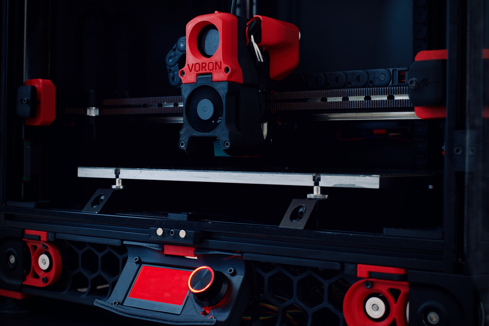

# Voron Documentation

Welcome to the world of Voron 3D printers!

This is the Voron Documentation site. All of the information needed to go from zero to a working Voron printer can be found here.

If this is the first time building a Voron printer (especially if this is the first 3D printer), it is strongly suggested to build 100% to spec using the documentation provided here.  The spec configurations have been tested extensively and are well supported.

---
# Voron Design 

* [Discord](https://discord.gg/voron) - The Discord server is the heart of the Voron community, you can find information and advice about almost anything here.

* [Forum](https://forum.vorondesign.com/) - The chaos of Discord isn't for you?  The forum is another excellent source of Voron help and advice.

* [VoronDesign.com](https://vorondesign.com) - If you are not purchasing a kit, the BOM and sourcing tools found here will be an important part of your build

* [Github](https://github.com/VoronDesign) - All Voron designs are Open Source. The files, including CAD, STLs and Manuals are found on Github.

* [Instagram](https://www.instagram.com/vorondesign.official/)

* [X](https://x.com/Voron_Design)

---
[Credits](./credits.md)
