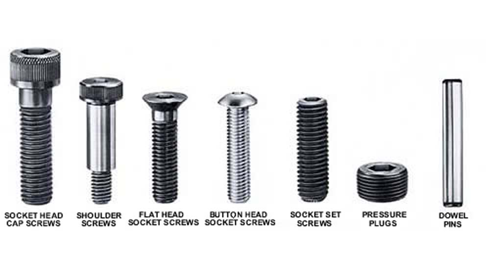

# Sourcing / Buying FAQ

These are common questions for builders looking to gather all of the components for their upcoming build.

## Filament / Printing

### How much filament do I need for all printed parts?

Assuming no failed or reprinted parts and following the recommendations for accent parts, the following guidelines apply:

| Model | Primary Color | Accent Color |
|---|---|---|
| V0 | 0.5 kg | 0.2 kg |
| V1 | 1.2 kg | 0.3 kg |
| Trident | 1.4 kg | 0.3 kg |
| V2 | 1.6 kg | 0.3 kg |
| Switchwire | 0.7 kg | 0.2 kg |
| Legacy | 0.8 kg | 0.2 kg |

### Can I print with a 0.6mm nozzle?

While possible, it is not recommended. Some parts have thinner walls not suitable for the larger nozzles.

### Why does the BOM not match the Sourcing Guide?

The bill of materials (BOM) is a list specifically generated for the defined specifications of the printer being built.  The Sourcing Guide is very general for quantities and is not customized.  The BOM is considered the absolute reference for items and quantities needed.

## Hardware

### What are the "TPW" and "LCP-RCP" options for the frame?

These are the options specified to have Misumi tap and drill the hex key access holes in your extrusions. You can remove these options and do this yourself to save ~$40 USD. You will need appropriate tapping tools, oil, and patience to do it correctly which may add back up to $40 when it's all complete.

### The HNTAJ5-5 nuts are expensive. Do I really need this many?

No, you can substitute ball spring post-assembly nuts from Ali just as easily in 99% of the manual.

### Why do you recommend Chinese linear rails vs a Hiwin or THK genuine rail?

- We are not imparting cutting forces onto the carriages on the rails (ie: side loads), so the low preload and ok tolerances are good for this application
- A set of 7 V2 rails is the cost of one genuine mid-grade THK rail.
- Clean all of your rails, then grease them (there are numerous videos on YouTube on how to do this). Pick your best rail for the X axis, then the Y, use the worst on the Z (if applicable).

### Can I substitute MGN(insert rail size here) for MGN9H rails?

No, the Voron V1/V2 are not designed for anything but a MGN9H.  The MGN12 rail carriages are wider than the 2020 extrusions and will cause interference issues.

### Why does VORON-Design not use IGUS products?

IGUS bushings exhibit a phenomenon called stiction, therefore in small movements the bushings will actually stick instead of gliding, at small detail, this causes detrimental issues. The amount of slop required is unfavorable, tolerances are quite poor. Bushing life is low for the price when compared to Misumi and even standard chinese offerings.

### I cannot find MIC6 Aluminum anywhere, is there something else I can use?

Yes, try to find the following, they are all the same thing, with a different trade name:

- Mic 6
- Alpase K100-S
- Alca 5
- Vista Metals ATP 5
- Alimex 5083 (vendor is very important on this one)

Materials not supported, these are all not designed to take repeated heating and cooling cycles and will warp quickly:

- 6061
- 5052
- 5053
- 2024
- 7### series not listed above
- 5### series not listed above

### What lube should I use?

The currently recommended lube for the linear rails is Mobilux EP1 or EP2, or the NLGI equivalents. Either Super Lube or EP1/2 is recommended for the extruder gears.

### What kind of bolts are what?

### What are the hammer nuts used for?

The hammer nuts are intended to be used with the panel clips to allow easier removal and reinstallation. It is possible to apply some locktite and create quarter-turn fasteners for easy removal and installation.

## Wiring

### What is a good crimping tool to use for terminating wires?

Engineer PA-09, PA-20, or PA-21. Yes, it's worth the cost.

### What gauge wire should I use where?

The gantry wiring should be all sized as recommended.  This will permit all of the wires to fit within the drag chains.  The power wiring needs to be larger due to the load from the AC heater (if applicable).

- Power Wiring/Mains Wiring: at least 18 awg (0.75 mm²), better 16 awg (1.25 mm²)
- Hotend Heater: 20 awg (0.5 mm²)
- Stepper Motors, all other wiring: 24 awg (0.25 mm²)

### PTFE or Silicone wire?

The BOM currently specifies silicone wire for bend and heat tolerance.  For an increased cost, PTFE (or Heluflon) wire is a option.  PTFE (Heluflon) insulation is thinner and slicker, making it more effective in the drag chains and granting the cables a longer lifetime.

## Electronics

### Why an SKR 1.4? What about turbo / faster speeds? What about FYSETC?

The BTT SKR controller is inexpensive and extremely capable for the purpose. Either an SKR 1.3 or 1.4 is historically recommended and can be used. While both controllers have different pin configurations, they use the same controller chip. BTT is no longer producing both the 1.3 and 1.4 and they will eventually be unavailable. Current alteranives include:

- FYSETC Spider
- FYSETC S6

The turbo (or higher speed) versions are certainly usable, but the additional speed is not required since most of the computing is handled by the Raspberry Pi.

### Why not a Duet?

The Duet board(s) will certainly work.  However when using Klipper, all of the extra features are not used so the cost is hard to justify.

### Can I use 0.9 degree stepper motors rather than the spec'ed 1.8 degree motors?

- They would not be recommended for the Z and E motors (Just E for the Switchwire). Those axis are already geared or screw driven which give them better resolution. Going to 0.9 degree motors means they would then need twice as many steps to go the same distance as a 1.8 degree motor. This combined with microstepping results in more cpu load on your boards and would then start to limit how fast you can drive these.
- They may have some beneficial affect on the XY axis (AB motors) (XZ for Switchwire) which don't have the gearing that the Z and E assemblies have. Don't expect miracles though, filament variance is another factor that starts to be an issue as well when attempting small detail.
- While 0.9 motor can be a bit quieter, from all accounts in an enclosed Voron the fans are likely to make most of the noise. So any noise benefit would be negligible.
- Using the BOM spec MCU and Klipper with 0.9deg steppers will limit your theoretical travel speeds greatly.  Just running 1/16 microstepping with 0.9deg XY motors and pressure advance with a 1.8deg stepper on the extruder is enough to easily overwhelm the board.

## Hot Parts

### Dragon standard flow or high flow?

The Dragon standard flow is capable of supporting nozzles up to 0.6mm. If planning on using 0.8mm nozzles or larger, the high flow is recommended.

### Does the Voron support the Super Volcano

No, its a case of [shit design and metal fatigue waiting to happen](https://www.reddit.com/r/3Dprinting/comments/blqw6s/i_believe_there_was_some_initial_concern_about/).

---

### Back to [Sourcing Information](./sourcing.md)
