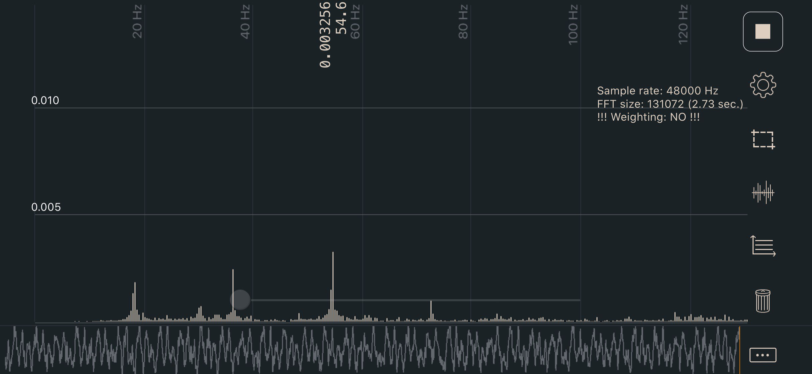

# Secondary Printer Tuning

Tuning steps and processes after everything is working.

## Gantry Racking

Check out [Nero's video on gantry racking](https://www.youtube.com/watch?v=cOn6u9kXvy0)

## Belt Tension

1. Move your gantry so the side belts from the front idlers to the XY joints are separated center to center 150mm
2. Adjust tension evenly on both A and B belts until the lowest frequency in your plot registers approximately 110Hz

This value equals ~2lb of tension on XY, which is on the lower end of the range but should be a good initial setting (without stretching your belts too tight). The phone app I am using is called Sound Spectrum Analysis on iOS, the image below shows the output (not of my belts).

[Watch this video](./images/belt-tension.mov?raw=true)



## Bed Mesh

Generally when your Voron is first built, Bed Mesh is not necessary. However, it can still be used as an analysis tool to check assembly and see if there's anything obviously incorrect--just don't run SAVE_CONFIG at the end of your BED_MESH_CALIBRATE, and run BED_MESH_CLEAR after running bed mesh.

The [bed_mesh] configuration options can be found [on the Klipper website](https://github.com/KevinOConnor/klipper/blob/b6a25393d354d5f5085b496ea040c751cfafa030/config/example-extras.cfg#L11) described in detail. A sample configuration for your Voron printer can be found [here](https://github.com/VoronDesign/Voron-1/blob/328113babcdb4934c461beb82b7f3b4dbeeb7eb5/Firmware/klipper_configurations/SKR_1.4/Voron_1_SKR_14_Config.cfg#L464).

```python
[bed_mesh]
speed: 300
horizontal_move_z: 2
##--------------------------------------------------------------------
##	Uncomment below for 250mm build
#mesh_min: 40, 40
#mesh_max: 210,210

##	Uncomment for 300mm build
#mesh_min: 40, 40
#mesh_max: 260,260

##	Uncomment for 350mm build
#mesh_min: 40, 40
#mesh_max: 310,310
##--------------------------------------------------------------------
fade_start: 0.6
fade_end: 10.0
probe_count: 5,5
algorithm: bicubic
relative_reference_index: 12
```

Generally a 5x5 grid is acceptable for even the largest Voron printer, but you can adjust the points to be greater or less than that. It is recommended to use an odd value for numbers of points in X and Y, such as 3x3, 5x5, or 7x7, so that there is always a probe point in the center of your bed. 

As we use the probe as a relative and not absolute measurement device, it is critical that you have the relative_reference_index parameter. This value will change as you adjust your mesh size:

relative_reference_index = ()(x points * y points) - 1) / 2

3x3 mesh = 4

5x5 mesh = 12

7x7 mesh = 24, etc

## Input Shaper

Imput Shaper is a Klipper-specific software technique for reducing ringing (also known as echoing, ghosting or rippling) in prints.  See the Klipper guide on [configuring Input Shaper](https://github.com/KevinOConnor/klipper/blob/master/docs/Resonance_Compensation.md) for more details and the complete process.
