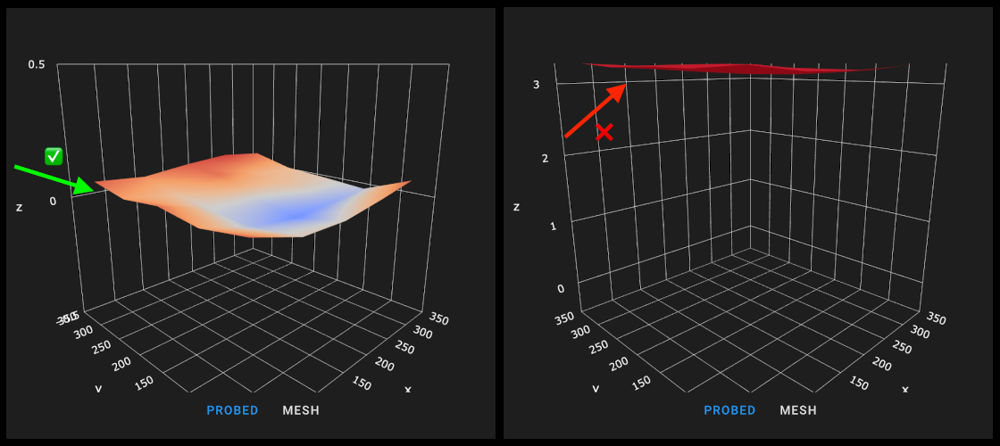
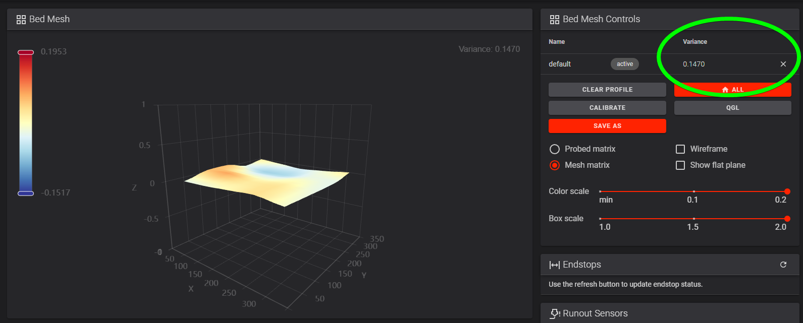

# Secondary Printer Tuning

Tuning steps and processes after everything is working.

## Gantry Racking & Squaring

**V2:** See the [V2 gantry squaring instructions](/build/mechanical/v2_gantry_squaring.html).

**All Printers:** See [Nero's gantry racking video](https://www.youtube.com/watch?v=cOn6u9kXvy0).

## Belt Tension

Belts that are too tight (or too loose) can cause mechanical issues, premature wear and print quality issues.


### A/B Belts
**Watch [this video](https://user-images.githubusercontent.com/54855101/163674612-930d737d-0ab3-4056-a2b9-def2939db61f.mp4) for a demonstration.**
1. Move your X extrusion forwards until the X/Y idler centers are 150mm from the front idler centers.
2. Pluck the 150mm section of belt and measure the frequency with one of the apps listed below.
3. Adjust the tensions until the lowest frequency in your plot registers approximately 110Hz.
    - The A/B belt tensions can affect each other. Tightening one will also tighten the other. Go back and forth adjusting each until they are equal.
4. Move your X extrusion back at least a few centimeters and then back again. Re-check your tensions.

110hz equals roughly 2lb of belt tension here, which is on the lower end of the range. This should be a good starting point without stretching your belts too tight.

### Z Belts (Voron V2)
A good starting point is 140hz. You will follow a similar process. 
1. Move the gantry upwards until the fixed side of the belt is 150mm from the Z idler centers.
2. Pluck, measure, and adjust, same as above.
3. Move your gantry down at least a few centimeters and then back up again. Re-check your tensions.

### Apps
- iOS: Sound Spectrum Analysis
- Android: Spectroid
- Both: Gates Carbon Drive *(use the "motorcycle" option)*
    - This app shows a single frequency rather than a graph. It's more difficult to get a good reading, but easier to interpret the result.

**Sound Spectrum Analysis (iOS)**
- 

## Bed Mesh

### Switchwire
Due to the the use of a thinner bed on the switchwire, a bed mesh is usually needed.

The mesh settings in the stock configs are usually fine. However, if you do wish to fine tune it, detailed information can be found [in the Klipper docs](https://github.com/KevinOConnor/klipper/blob/master/docs/Bed_Mesh.md). 

Note that unlike other Voron models, the Switchwire uses the probe as a virtual endstop, and thus should **NOT** use `relative_reference_index`.

It is important to check that your probe is correctly calibrated using `PROBE_CALIBRATE`.

To run a mesh, you should place `BED_MESH_CALIBRATE` in your `PRINT_START` macro after G28 (and after bed heating).

### Legacy, Trident, V2

Larger printers are also likely to need a bed mesh, but for different reasons.

While the thick beds themselves are usually quite flat, your gantry and frame will expand and warp a bit with chamber heat.\
The extrusions with linear rails will actually [bend slightly when heated](./images/bimetallic_flex.png) due to differing rates of thermal expansion.

This often requires a bed mesh to compensate.

### Setup

{: .note }
These instructions assume that you are using a reasonably up to date Klipper, which supports ZERO_REFERENCE_POSITION.  If you have an older install, and need to use RELATIVE_REFERENCE_INDEX, you may find instructions for that [here](./relative_reference_index.html)

Because your mesh can change at different bed, chamber, and frame temperatures, it is generally recommended to generate a mesh before every print rather than using saved meshes.

All of the `[bed_mesh]` configuration options and explanations can be found [in the Klipper docs](https://github.com/KevinOConnor/klipper/blob/master/docs/Bed_Mesh.md).


Here is a sample configuration. You can copy & paste this into your `printer.cfg`, making sure to uncomment the appropriate `mesh_min` and `mesh_max` for your bed size.
- **The Switchwire stock configs already include this.**

```python
[bed_mesh]
speed: 300
horizontal_move_z: 10
##--------------------------------------------------------------------
##	Uncomment below for 250mm build
#mesh_min: 40, 40
#mesh_max: 210,210
#zero_reference_position: 125,125 #for use with stock z endstop

##	Uncomment for 300mm build
#mesh_min: 40, 40
#mesh_max: 260,260
#zero_reference_position: 150,150 #for use with stock z endstop

##	Uncomment for 350mm build
#mesh_min: 40, 40
#mesh_max: 310,310
#zero_reference_position: 175,175 #for use with stock z endstop

##--------------------------------------------------------------------
fade_start: 0.6
fade_end: 10.0
probe_count: 5,5 # Values should be odd, so one point is directly at bed center
algorithm: bicubic
```

Then, place `BED_MESH_CALIBRATE` in your `PRINT_START` macro, **AFTER** any homing and leveling routines like `G28`, `G32`, `QUAD_GANTRY_LEVEL`, and `Z_TILT_ADJUST`.\
This will generate a mesh before every print.

### Mesh Points

Generally a 5x5 grid is acceptable for even the largest Voron printer, but you can adjust the points as you see fit.

It is recommended to use **odd** values for numbers of points in X and Y, *(such as 3x3, 5x5, or 7x7)*, so that there is always a probe point directly in the center of your bed. 

### Zero Reference Position (!)

- The Switchwire should **NOT** use `zero_reference_position`.

- The Legacy, Trident, and V2 **SHOULD** use `zero_reference_position`, if they are using the stock z endstop.

- Printers using Tap, or other probes as their z endstop should not use `zero_reference_position`

As the Legacy, Trident, and V2 use the probe as a relative and not absolute measurement device, **it is critical that you have the `zero_reference_position` parameter.**

Your `zero_reference_position` should be set to the center of the bed.

#### Verification
**Again, this does NOT apply to Switchwire**.

You should check your mesh preview in Mainsail / Fluidd before printing.\
In the printer's web interface, click the "Tuning" tab (Fluidd) or "Heightmap" tab (Mainsail) on the left.

- The left image shows a **correctly** configured mesh. It is located around Z0.

- The right image shows an **incorrect** mesh config. 
  - This is what it looks like when your `zero_reference_position` is not set. 
  - If you are using tap, or another probe as the z endstop (and therefore not the stock z endstop), check that you have calibrated the probe with `probe_calibrate`

- 

### Checking Your Variance

Note that the mesh preview **greatly exaggerates deviations**. Don't focus too much on the color-coding.\
Look at the "Variance" value instead.

1. If your printer is enclosed, fully heat soak it. If unenclosed, heat the bed and let it sit for a few minutes.

2. Run all homing/leveling routines (such as `G28`, `G32`, `QUAD_GANTRY_LEVEL`, and `Z_TILT_ADJUST`. This depends on your printer.)

3. Run a `BED_MESH_CALIBRATE`.

4. In the printer's web interface, click the "Tuning" tab (Fluidd) or "Heightmap" tab (Mainsail) on the left.

For total variance under ~0.05mm, a bed mesh may not be necessary. This is up to your personal preference.

A bed mesh is cheap insurance, however, especially since your variance can change a bit over time and at different bed/chamber temperatures.

- 

## Input Shaper

Input Shaper is a Klipper-specific software technique for reducing ringing (also known as echoing, ghosting or rippling) in prints.  See the Klipper guide on [configuring Input Shaper](https://github.com/KevinOConnor/klipper/blob/master/docs/Resonance_Compensation.md) for more details and the complete process.

## Print Tuning

Andrew Ellis' [Print Tuning Guide](https://ellis3dp.com/Print-Tuning-Guide/) goes into more detail about print tuning.

It covers topics like build surface adhesion, first layer, pressure advance calibration, extrusion multiplier calibration, cooling, and retraction — along with some more advanced topics and troubleshooting pages.


