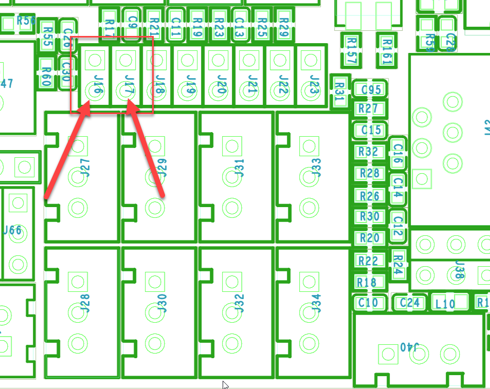

This writeup covers how to set up sensorless homing on an Octopus 1.1 with 2209 drivers. Different drivers and/or MCUs may differ. Adjust accordingly.

Also note that there are example working configurations at the bottom of this guide. Use them as examples based on your MCU and drivers, etc.

{: .note }
IF YOU DO NOT READ THIS CAREFULLY AND ADJUST THINGS WHEN NEEDED YOU WILL BE SAD. IF YOU USE A PHYSICAL ENDSTOP YOU MUST CHANGE MACROS TO HOME Z TO THE ENDSTOP PIN, NOT THE MIDDLE OF THE BED. YOU HAVE BEEN WARNED!

At the end of this document is a section with working examples you can use as a reference for some common hardware

# Getting started

Since this example revolves around an Octopus 1.1, you need to verify which diag jumpers to install based on your hardware and motor positions. The examples below serve to illustrate the process.


1. Power off the printer gracefully
2. Physically disconnect the X and Y endstop connections from the MCU.
3. Plug in jumpers on the `DIAG` ports as shown below (**J16** and **J17**). We use these ports since these are the corresponding diag jumpers for where our XY steppers are connected.
   
    
   
5. Start up the printer and wait for it to boot
6. MAKE A BACKUP OF YOUR CONFIG (or better yet go do [this](https://docs.vorondesign.com/community/howto/EricZimmerman/BackupConfigToGithub.html))

## Choose your own adventure

Here we come to a choice. Do you want to use stock Klipper and macros to control homing, or do you want to switch to an alternate version of Klipper, named Danger Klipper (do not worry. its not really dangerous)?

The Danger Klipper route will make things simpler from the configuration side, but in the end, your printer will home either way without too much fuss. Pick ONE of the two options below, either Stock Klipper or Danger Klipper.

### Stock Klipper

In this path, you will need to download some macros dependong on your printer. If you do not have a v0 or a 2.4, you can tweak whichever makes the most sense for you. When in doubt, ask in the Voron Discord channel for your printer

1. Create a new file in the location of your choosing named `homing.cfg`
2. Open another browser tab and open [this](https://github.com/EricZimmerman/Voron24/blob/PreKlippain/macros/helpers/homing.cfg) page if you have a 2.4, or [this](https://github.com/EricZimmerman/Voron02/blob/PreKlippain/macros/helpers/homing.cfg) page if you have a v0.
3. Edit `homing.cfg` 
4. **Add** the macro from step 7 to `homing.cfg`. **_Be sure to edit the coordinates as needed for your bed in the Z section (the line that reads **G1 X175 Y175 F15000**). IE to the center of the bed, your endstop pin for z, etc._**
5. Save `homing.cfg` 
6. Edit your `printer.cfg` file
7. If you have a `[safe_z_home]` section, find it and comment it out as we will be using homing override as found in `homing.cfg`.

The `[homing_override]` block we have in the above macros is now going to be responsible for all homing, whether via the buttons in Mainsail or Fluidd, or via commands like G28 X, etc. This override allows us, the end user, to customize how the homing operation happens. When using sensorless, this is important, as it lets us adjust things like the current used for homing, etc. More on this later.

### Danger Klipper

While it sounds dangerous, there is nothing to be afraid of! Choosing this route means you do not need to do any of the macro stuff as listed above, as we can just simply add a new property in our X and Y driver section to handle homing current. Thats it!

If you want to switch to Danger Klipper, now is the time to do so. You can [follow this other guide](https://github.com/EricZimmerman/VoronTools/blob/main/DangerKlipper.md) to make the switch! Switching will not make you change anything else about your configuration.


# Updating your configuration

Regardless of the choice you made above, with the initial steps behind you, we now have to adjust some existing settings in the configuration file.

Note that the examples below are using the 2209 drivers. Adjust the `drivers_` line depending on which drivers you actually have! 

For 2160, 2240, and 5160, use this value instead: `driver_sgt:-64`

The other change will be in the `virtual_endstop` value for `endstop_pin`: 

- For 2240, use this value instead: `tmc2240_stepper_?:virtual_endstop` where ? is the axis being updated
- For 2160, and 5160, use this value instead: `tmc5160_stepper_?:virtual_endstop` where ? is the axis being updated

{: .note }
You may also need to tweak the `diag_pin` property to be either `diag0_pin` or `diag1_pin`. The examples at the bottom should help you pick which one you need for your particular setup.

## Updating stepper_x

1. Locate the `[stepper_x]` section
2. Record the current value for `endstop_pin` (**PG6** for example)
3. **Change** the `endstop_pin` to `tmc2209_stepper_x:virtual_endstop`
4. **Change** `homing_speed` to `80`
5. **Change** `homing_retract_dist` to `0`
6. Locate the `[tmc2209 stepper_x]` section (usually right below where you just edited)
7. **Add** `diag_pin` to match what you recorded from step 2, but add a ^ before it.
    Example: `diag_pin: ^PG6`
8. **Add** this below the `diag_pin` entry: `driver_SGTHRS: 255`

For those of you that took the Danger Klipper route above, add these lines below your `run_current` property:

```
home_current: 0.49
current_change_dwell_time: 0.2
```

The first property sets the current to use when doing sensorless homing. The second property sets how long to wait between adjusing from run current to homing current and vice versa.

## Updating stepper_y

1. Locate the `[stepper_y]` section
2. Record the current value for `endstop_pin` (**PG9** for example)
3. **Change** the `endstop_pin` to `tmc2209_stepper_y:virtual_endstop`
4. **Change** `homing_speed` to `80`
5. **Change** `homing_retract_dist` to `0`
6. Locate the `[tmc2209 stepper_y]` section (usually right below where you just edited)
7. **Add** `diag_pin` to match what you recorded from step 2, but add a ^ before it.
    Example: `diag_pin: ^PG9`
8. **Add** this below the `diag_pin` entry: `driver_SGTHRS: 255`

For those of you that took the Danger Klipper route above, add this line below your `run_current` property:

```
home_current: 0.49
current_change_dwell_time: 0.2
```

With those changes complete, save your configuration.

## Other changes

1. Move to the top of your `printer.cfg`. If not already present, add the following configuration section:
    ```
    [force_move]
    enable_force_move: True
    ```
2. If you went with stock Klipper, add an include for wherever you created your `homing.cfg` file. Example: `[include homing.cfg]`
3. Save your `printer.cfg` file and allow Klipper to restart.

## Finding the appropriate driver value

Recall earlier we set the driver threshold to 255. This is the most sensitive value and will almost certainly NOT work for your use case. We now need to find the appropriate value, or rather, range of values that will work for you.

Note that if at any time things seem off, PRESS EMERGENCY STOP. 

Before you begin, GENTLY and SLOWLY move the print head to approximately 4 inches off of the right rail, and 4 inches from the back rail.

1. In the console, run the following command to set the active value for the StallGuard driver when using 2209s:
  ```
  SET_TMC_FIELD FIELD=SGTHRS STEPPER=stepper_x VALUE=255
  ```

  Use this for every other type of driver:

  ```
  SET_TMC_FIELD FIELD=SGT STEPPER=stepper_x VALUE=-63
  ```

2. Home X by entering the following command in the console
  ```
  G28 X
  ```

### Stock Klipper details

Remember that **force_move** thing you added and the macros in `homing.cfg` from earlier? Those are going to now control homing for you. When you `G28 X`, it will use the `_HOME_X` macro to do so.

Let's take a closer look at what the macro responsible for homing X is doing (Y will work the same way, just with different moves, etc.).

**NOTE**: The macro is shown below in code blocks. These are _not_ meant to be copy pasted anywhere (we did all the macros above into `homing.cfg`) but they are shown here so we can understand what the macros are doing.

```
    
    
    
```

Here we are recording our motor's run current into variables so we can restore them later, then we set a homing current of 0.49. This helps with stability and finding a sane value for homing.

```
    SET_TMC_CURRENT STEPPER=stepper_x CURRENT={HOME_CURRENT}
    SET_TMC_CURRENT STEPPER=stepper_y CURRENT={HOME_CURRENT}
```
Next we set the motors to use our homing current

```
    SET_KINEMATIC_POSITION X=15
    G91
    G1 X-15 F1200
```
Here we force a move away from the toolhead's current position. We are telling the printer it is currently at X=15 (which may or may not be true), then moving the toolhead 15mm from that position. This ensures that if we are right on the rightmost rail we will move away from it BEFORE we try to home.

```
    M400
    G28 X
```
Next we use M400 to clear any commands (including stallguard) in the buffer before we try to home.

```
    # Move away
    G91
    G1 X-15 F1200
```
Once homed, move away from the rail again.

```
    SET_TMC_CURRENT STEPPER=stepper_x CURRENT={RUN_CURRENT_X}
    SET_TMC_CURRENT STEPPER=stepper_y CURRENT={RUN_CURRENT_Y}
```
Finally, restore our motor's run current we captured before. 

### Danger Klipper details

Nothing to see here. Danger Klipper manages the process


## Finding the right driver value

When you first start trying to find your value, because of the macro above, it will look like the toolhead is moving away from the right rail, then stopping (for the stock Klipper folks). 

This is normal and just means the value is still too sensitive to home properly.

Early on, I tend to jump down in jumps of 50. At some point you will get X to home all the way to the rail. 

However, if you went TOO low, it might bump harder into the rail than it should. In this case, ADD half the value you last went down by and repeat steps 1 and 2. For non 2209 people, you would of course be increasing from -64, so adjust accordingly.

Eventually you will find the BIGGEST number that homes X successfully. Nice!

With the maximum found, continue to DECREASE the value by 5 or so until X homes, but bumps too hard into the rail. You may need to walk this in by changing the value by 1 when getting close.

This is your MINIMUM value.

Ideally we want a value between the minimum and maximum that will always work, so I tend to shoot for something slightly LESS than halfway between minimum and maximum.

Example: If maximum is 113 and minimum is 99, the difference is 14. Half of 14 is 7, so use a value of 99+6, or 105, and repeat steps 1 and 2.

If that looks and feels good, you now have the driver value you need to update in your `printer.cfg` file's `[tmc2209 stepper_x]` section.

With X complete, you how have to do that entire process all over again, but for Y. Here are the two commands:

1. In the console, run the following command (or `FIELD=SGT`, like before)
  ```
  SET_TMC_FIELD FIELD=SGTHRS STEPPER=stepper_y VALUE=255
  ```
2. Home Y by entering the following command in the console
  ```
  G28 Y
  ```

Now do exactly the same process as you did for X, but this time, focusing on the Y axis. When homing Y, the toolhead will move toward you for the reasons described above, just like we saw when setting up X.

Once you find the correct values for X and Y, update those in the appropriate driver section of your config, save and restart, then test! You may have to experiment with your homing current and/or the homing speed to find your sweet spot. Also note that 2209s generally have a wider range of values that work. Most of the other ones are between -1 and 1.

## Some working examples

Note that these examples are just that, examples! Do not just YOLO copy paste stuff. This is more about showing things like the diag pin (1 vs 0), etc.

For any aliases shown, either create them, or simply update them with the actual pins, per your preference

### BTT Octopus Pro 1.0 with BTT2240s

```
[stepper_x]
step_pin: PF13
dir_pin: !PF12
enable_pin: !PF14
rotation_distance: 40
microsteps: 32
full_steps_per_rotation:400  #set to 400 for 0.9 degree stepper
endstop_pin: tmc2240_stepper_x:virtual_endstop       # Old pin before sensorless homing PG6
position_min: 0

[stepper_y]
step_pin: PG0
dir_pin: !PG1
enable_pin: !PF15
rotation_distance: 40
microsteps: 32
full_steps_per_rotation:400  #set to 400 for 0.9 degree stepper
endstop_pin: tmc2240_stepper_y:virtual_endstop     # Old pin before sensorless homing PG9
position_min: 0

[tmc2240 stepper_x]
cs_pin: PC4
spi_software_sclk_pin: PA5
spi_software_mosi_pin: PA7
spi_software_miso_pin: PA6
interpolate: false
run_current: 0.8
stealthchop_threshold: 0
diag0_pin: ^!PG6
driver_SGT: 0            #Max sensitivity -63

[tmc2240 stepper_y]
cs_pin: PD11
spi_software_sclk_pin: PA5
spi_software_mosi_pin: PA7
spi_software_miso_pin: PA6
interpolate: false
run_current: 0.8
stealthchop_threshold: 0
diag0_pin: ^!PG9
driver_SGT: 1   #Max sensitivity -63
```

### BTT Kraken with 2160s

```
[stepper_x]
rotation_distance = 40
microsteps = 32
full_steps_per_rotation = 400
step_pin = X_STEP
dir_pin = !X_DIR
enable_pin = !X_ENABLE
endstop_pin = tmc5160_stepper_x:virtual_endstop
homing_speed = 80
homing_retract_dist = 0
position_min = 0
position_max = 350
position_endstop = 350


[stepper_y]
rotation_distance = 40
microsteps = 32
full_steps_per_rotation = 400
step_pin = Y_STEP
dir_pin = !Y_DIR
enable_pin = !Y_ENABLE
endstop_pin = tmc5160_stepper_y:virtual_endstop
homing_speed = 80
homing_retract_dist = 0
position_min = 0
position_max = 350
position_endstop = 350

[tmc5160 stepper_x]
cs_pin = X_TMCUART
spi_software_sclk_pin = DRIVER_SPI_SCK
spi_software_mosi_pin = DRIVER_SPI_MOSI
spi_software_miso_pin = DRIVER_SPI_MISO
interpolate = True
run_current = 1
sense_resistor = 0.022
stealthchop_threshold = 0
driver_sgt = -1
diag1_pin = ^!X_STOP

[tmc5160 stepper_y]
cs_pin = Y_TMCUART
spi_software_sclk_pin = DRIVER_SPI_SCK
spi_software_mosi_pin = DRIVER_SPI_MOSI
spi_software_miso_pin = DRIVER_SPI_MISO
interpolate = True
run_current = 1
sense_resistor = 0.022
stealthchop_threshold = 0
driver_sgt = -1
diag1_pin = ^!Y_STOP
```

### BTT Octopus 1.1 with 2209s

```
[stepper_x]
step_pin: X_STEP
dir_pin: X_DIR
enable_pin: !X_ENABLE
rotation_distance: 40
microsteps: 32
full_steps_per_rotation:400
endstop_pin: tmc2209_stepper_x:virtual_endstop #X_STOP
position_min: 0
position_endstop: 350
position_max: 350
homing_speed: 40 #50
homing_retract_dist: 0
homing_positive_dir: true

[tmc2209 stepper_x]
uart_pin: X_TMCUART
interpolate: False
run_current: 1
sense_resistor: 0.110
stealthchop_threshold: 0 #always on, 0 is off
diag_pin: ^X_STOP # use the same pin that was previously the endstop_pin!
driver_SGTHRS: 125

[stepper_y]
step_pin: Y_STEP
dir_pin: Y_DIR
enable_pin: !Y_ENABLE
rotation_distance: 40
microsteps: 32
full_steps_per_rotation:400
endstop_pin: tmc2209_stepper_y:virtual_endstop #Y_STOP
position_min: 0
position_endstop: 350
position_max: 350
homing_speed: 40 #50
homing_retract_dist: 0
homing_positive_dir: true

[tmc2209 stepper_y]
uart_pin: Y_TMCUART
interpolate: False
run_current: 1
sense_resistor: 0.110
stealthchop_threshold: 0
diag_pin: ^Y_STOP     # use the same pin that was previously the endstop_pin!
driver_SGTHRS: 125 # 255 is most sensitive value, 0 is least sensitive
```

### Manta M8P v1.1 with BTT 5160 PROs

Note that this example uses Danger Klipper, (use_sensorless_homing: True, home_current: 0.4, etc), so some of those parameters will not exist/be valid if not using DK

```
[stepper_x]
step_pin: PE2
dir_pin: !PB4
enable_pin: !PC11
microsteps: 32
rotation_distance: 40
#endstop_pin: ^PF3
endstop_pin: tmc5160_stepper_x:virtual_endstop
position_endstop: 250
position_min: 0
position_max: 250
homing_speed: 100
homing_retract_dist: 5
homing_retract_speed: 20
min_home_dist: 20
use_sensorless_homing: True
full_steps_per_rotation: 400

[tmc5160 stepper_x]
cs_pin: PC10
run_current: 1.0
spi_software_sclk_pin: PA5
spi_software_mosi_pin: PA7
spi_software_miso_pin: PA6
home_current: 0.4
diag1_pin: ^!PF3
driver_SGT: 1

[stepper_y]
step_pin: PF12
dir_pin: !PF11
enable_pin: !PB3
microsteps: 32
rotation_distance: 40
#endstop_pin: ^PF4
endstop_pin: tmc5160_stepper_y:virtual_endstop
position_endstop: 260
position_min: 0
position_max: 260
homing_speed: 100
homing_retract_dist: 5
homing_retract_speed: 20
min_home_dist: 20
use_sensorless_homing: True
full_steps_per_rotation: 400

[tmc5160 stepper_y]
cs_pin: PF13
run_current: 1.0
spi_software_sclk_pin: PA5
spi_software_mosi_pin: PA7
spi_software_miso_pin: PA6
home_current: 0.4
diag1_pin: ^!PF4
driver_SGT: 1

```

## Now what?

Thats it! Once you find your StallGuard values for X and Y and update them in your `printer.cfg`, save and restart, then try homing each axis again. In some cases you will find that your values are not quite right.

In those cases, simply adjust the values up or down by 1 (depending on if its hitting to hard, or not homing all the way) then save, restart, and test again. Do not forget you can also experiment with homing speed (between 80 and 120 is usually where people end up) and homing current.

Eventually you will find that sweet spot.

Enjoy!


